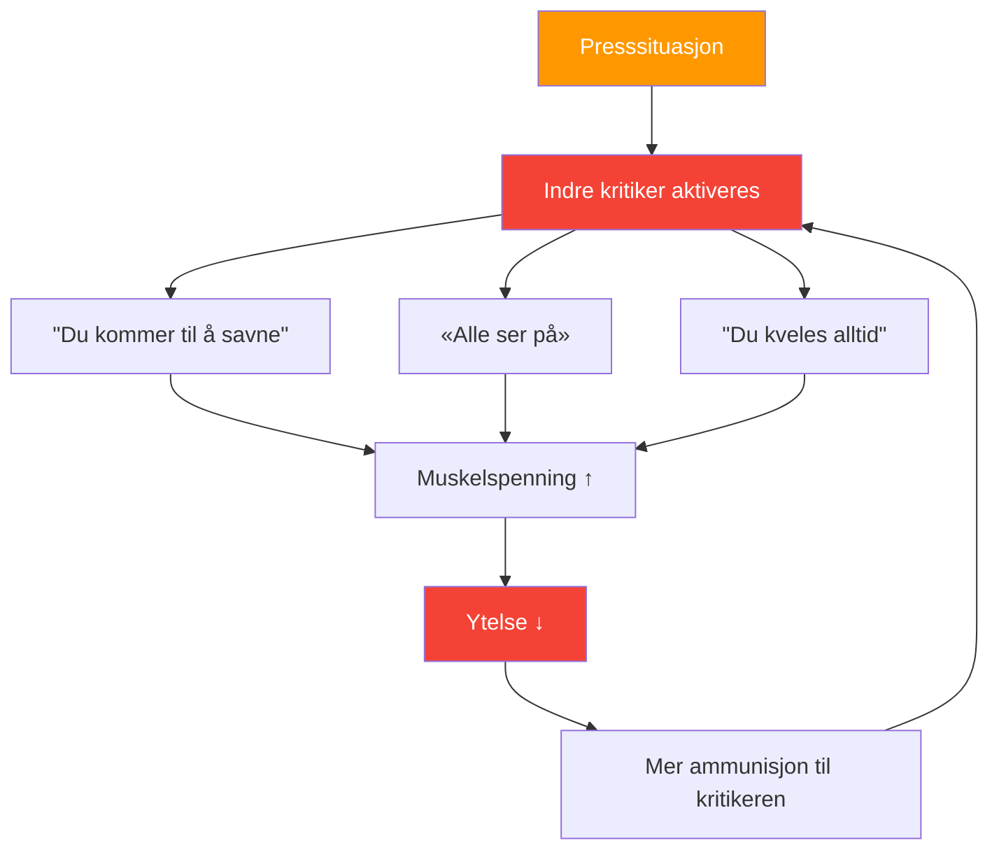

# Å forstå den indre kritikeren

> «Alle petanquespillere kjenner den stemmen – den som hvisker «du kommer til å bomme» akkurat idet du skal til å kaste.»

Dette er din indre kritiker – og det å lære å håndtere den er viktig for å prestere på toppnivå.

::: warning Paradokset
**Din indre kritiker prøver ikke å skade deg** – det er et misforstått forsøk på beskyttelse. Men denne «beskyttelsen» blir til selvsabotasje.
:::

---

## Hva er den indre kritikeren?

Den indre kritikeren er den indre stemmen som dømmer, kritiserer og undergraver selvtilliten din:

### Når det vises

| Øyeblikk | Indre kritiker sier |
|--------|-------------------|
| **Før avgjørende skudd** | «Alle ser på. Ikke ødela dette.» |
| **Etter en bom** | &quot;Du kveles alltid under press.&quot; |
| **Under tapsrekken** | «Du er ikke god nok for dette nivået.» |

## Å gjenkjenne mønstrene dine

Det første steget er bevissthet. Begynn å legge merke til når din indre kritiker dukker opp:

### Vanlige utløsere
- Høypresssituasjoner (kampball, viktige turneringer)
- Etter å ha gjort en feil
- Når motstanderne presterer bra
- Når lagkamerater virker frustrerte
- Fysisk tretthet eller ubehag

### Vanlige meldinger
- «Du takler ikke press»
- «Du er ikke like god som dem»
- «Alle dømmer deg»
- &quot;Du mislykkes alltid når det gjelder&quot;

## Virkningen på ytelsen

Når den indre kritikeren tar over, reagerer kroppen din:

1. **Muskelspenningen øker** — Kastet ditt blir stivt
2. **Pusten blir overfladisk** — Mindre oksygen, mindre fokus
3. **Synet blir smalere** — Du mister bevisstheten om terrenget
4. **Beslutningstaking lider** — Du tviler på deg selv

Dette skaper en ond sirkel: den indre kritikeren forårsaker dårlig prestasjon, noe som gir kritikeren mer ammunisjon.

## Strategier for å håndtere den indre kritikeren

### 1. Navngi det for å temme det

Gi din indre kritiker et navn – noe litt latterlig. «Å, der går Negative Nils igjen.» Dette skaper avstand mellom deg og stemmen, noe som gjør den lettere å avfeie.

### 2. Utfordre bevisene

Når kritikeren sier «du bommer alltid under press», spør deg selv: Er det faktisk sant? Kan du tenke på ganger du presterte bra under press? Kritikeren bruker absolutter som sjelden gjenspeiler virkeligheten.

### 3. Omformuler meldingen

Gjør kritikk om til veiledning:
- &quot;Du kommer til å savne&quot; → &quot;Fokuser på rutinen din&quot;
- «Alle ser på» → «Dette er ditt øyeblikk til å skinne»
- &quot;Du kveles alltid&quot; → &quot;Du har håndtert press før&quot;

### 4. Bruk rutinen din før inntak

En solid [rutine før trening](/no/utdanning/mentalt spill/mental styrke/rutine før trening) gir tankene dine noe konstruktivt å fokusere på, og gir mindre rom for kritikeren.

### 5. Øv deg på selvmedfølelse

Behandle deg selv som du ville behandlet en lagkamerat. Ville du sagt til en lagkamerat som sliter «du er forferdelig»? Selvfølgelig ikke. Vis den samme vennlighet til deg selv.

## Å bygge en støttende indre stemme

Målet er ikke å stilne den indre kritikeren fullstendig – det er nesten umulig. I stedet bør du utvikle en sterkere støttende stemme:

### Den støttende stemmen sier:
- &quot;Ett kast om gangen&quot;
- &quot;Stol på treningen din&quot;
- &quot;Du har gjort dette før&quot;
- &quot;Vær i nuet&quot;
- &quot;Pust og nullstill&quot;

### Daglig praksis

Bruk 5 minutter hver dag:
1. Husk et øyeblikk da du presterte bra
2. Husk hvordan det føltes i kroppen din
3. Hør hva din støttende stemme sa
4. Forankre denne følelsen med en fysisk gest (berøre kulen din, justere holdningen din)

## I konkurranse

Når den indre kritikeren dukker opp under en kamp:

1. **Innrøm det**: «Jeg merker at jeg er selvkritisk»
2. **Ta et pust**: Sakte, dypt pust for å tilbakestille
3. **Bruk ankeret ditt**: Den fysiske gesten fra øvelsen din
4. **Tilbake til rutinen**: Fokuser på prosessen før inntak

## Den langsiktige reisen

Å håndtere den indre kritikeren er ikke en engangsløsning. Det er en kontinuerlig øvelse som blir lettere med tiden. Elitespillere eliminerer ikke selvtvil – de lærer å prestere til tross for den.

Den indre kritikeren vil alltid være en del av deg. Men med øvelse blir stemmen dens lavere, og din støttende stemme blir sterkere. Det er den mentale fordelen som skiller gode spillere fra store spillere.

---

| *Relatert: [Håndtering av press](/no/utdanning/mentalt-spill/mental-styrke/håndtering-av-press) | [Rutine før skudd](/no/utdanning/mentalt-spill/mental-styrke/rutine-før-skudd) | [Mindfulness-teknikker](/no/utdanning/mentalt-spill/mindfulness/teknikker)* |

