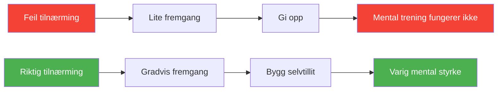

# 5 feil i mental trening

> «Mange spillere investerer tid i mentale ferdigheter, men ser liten forbedring. Her er hvorfor.»

Mental trening kan forvandle petanque-prestasjonen din – men bare hvis den gjøres riktig.

::: danger Vanlig mønster
**Mesteparten av mental trening mislykkes ikke fordi teknikkene ikke fungerer**, men på grunn av hvordan de brukes.
:::

---

## Feil nr. 1: Behandle mentale ferdigheter som valgfrie

::: warning Problemet
Mange spillere ser på mental trening som noe som er kjekt å ha, noe å jobbe med «når det er tid».
:::

### Hvorfor det mislykkes

Mentale ferdigheter er ferdigheter – de krever samme konsekvente øvelse som kasteteknikk. Av og til oppmerksomhet gir sporadiske resultater.

### Løsningen

| Handling | Implementering |
|--------|---------------|
| Planlegg det | Som fysisk trening |
| Start i det små | Bare 10 minutter daglig |
| Gjør det ikke-forhandlingsbart | Ingen unnskyldninger |
| Spor det | Ved siden av fysisk trening |

**Husk:** På elitenivåer avgjør mentale ferdigheter ofte hvem som vinner.

## Feil nr. 2: Tren bare når ting går galt

### Problemet

Spillere tyr ofte til mental trening først etter en dårlig prestasjon eller under en nedgangsperiode. De ser på det som bedrende snarere enn utviklende.

### Hvorfor det mislykkes

Mentale ferdigheter som bygges opp i kriser er skjøre. Du kan ikke utvikle dype evner når du allerede sliter. Det er som å prøve å lære å svømme mens du drukner.

### Løsningen

- Bygg mentale ferdigheter i gode tider
- Øv når du presterer bra
- Lag et fundament før du trenger det
- Oppretthold øvelsen konsekvent, uavhengig av resultater

**Husk:** Den beste tiden å bygge mental styrke er når du ikke sårt trenger den.

## Feil nr. 3: Forventer umiddelbare resultater

### Problemet

Spillere prøver visualisering i en uke, ser ikke umiddelbar forbedring og konkluderer med at «det fungerer ikke for meg».

### Hvorfor det mislykkes

Mentale ferdigheter utvikles sakte, ofte usynlig i starten. Nervebanene som støtter mental styrke tar tid å bygge opp. Å forvente raske resultater fører til at man gir opp før fordelene viser seg.

### Løsningen

- Forplikt deg til minst 8–12 uker med regelmessig trening
- Se etter subtile forbedringer, ikke dramatiske endringer
- Stol på prosessen selv når fremgangen ikke er synlig
- Før en dagbok for å spore gradvise endringer

**Husk:** Du forventer ikke å mestre et nytt kast på en uke. Mentale ferdigheter fortjener den samme tålmodigheten.

## Feil nr. 4: Generisk praksis uten personalisering

### Problemet

Spillere følger generiske mentale treningsprogrammer uten å tilpasse dem til sine spesifikke behov, personlighet og spillestil.

### Hvorfor det mislykkes

Mental trening er ikke en løsning som passer for alle. Det som fungerer for én spiller, fungerer kanskje ikke for en annen. En visualiseringsteknikk som hjelper en visuell tenker kan frustrere noen som tenker med følelser.

### Løsningen

- Identifiser DINE spesifikke mentale utfordringer
- Eksperimenter med forskjellige teknikker
- Tilpass metodene til din læringsstil
- Fokuser på hva som faktisk hjelper deg

**Spørsmål å stille:**
- Hvilke mentale utfordringer møter jeg oftest?
- Hvordan bearbeider jeg informasjon naturlig?
- Hva har fungert for meg tidligere?
- Hva føles autentisk for meg?

## Feil nr. 5: Å skille mental og fysisk trening

### Problemet

Spillere gjør mental trening i isolasjon – meditasjon hjemme, visualisering før leggetid – men integrerer det ikke med fysisk trening.

### Hvorfor det mislykkes

Mentale ferdigheter må knyttes til fysisk prestasjon. Å praktisere mindfulness på en pute er annerledes enn å praktisere det mens man kaster. Overføringen er ikke automatisk.

### Løsningen

- Bruk mentale ferdigheter under hver treningsøkt
- Øv på rutinen din før bruk med fullt mentalt engasjement
- Bruk presshåndteringsteknikker i trening
- Lag øvingssituasjoner som krever mentale ferdigheter

**Eksempler på integrasjon:**
- Visualiser hvert kast før du utfører det
- Bruk pusteteknikker mellom kastene
- Øv på fokusrutinen din på trening
- Simuler presssituasjoner regelmessig

## Bonusfeil

### Feil nr. 6: Bare teori, ingen praksis

Å lese om mentale ferdigheter er ikke det samme som å øve på dem. Kunnskap uten anvendelse endrer ingenting.

### Feil nr. 7: Ignorerer det grunnleggende

Avanserte teknikker bygget på svake fundamenter smuldrer opp. Mestre grunnleggende pust, fokus og rutine før du bruker komplekse metoder.

### Feil nr. 8: Å gå alene

Mental trening drar nytte av veiledning. Vurder å samarbeide med en idrettspsykolog eller erfaren mentor.

## Den riktige tilnærmingen

Effektiv mental trening:

1. **Er konsekvent** — Regelmessig øvelse, ikke sporadisk oppmerksomhet
2. **Er proaktiv** — Bygget før behov, ikke i krise
3. **Er tålmodig** — Gir tid til utvikling
4. **Er personlig tilpasset** — Tilpasset dine behov
5. **Er integrert** — Koblet til fysisk praksis

## Komme i gang riktig

Hvis du begynner med mental trening:

1. **Vurder** ditt nåværende mentale spill ærlig
2. **Identifiser** 1–2 spesifikke områder for forbedring
3. **Velg** teknikker som passer din stil
4. **Planlegg** vanlig treningstid
5. **Integrer** med fysisk trening
6. **Spor** fremgang over tid
7. **Juster** basert på hva som fungerer

## Utbetalingen

Spillere som unngår disse feilene og trener hjernen sin konsekvent, rapporterer:
- Større konsistens under press
- Raskere gjenoppretting fra feil
- Mer glede i konkurransen
- Bedre fokus og konsentrasjon
- Økt selvtillit

Det mentale spillet kan trenes. Tren det riktig.

---

| *Relatert: [Mental styrke](/no/utdanning/mentalt-spill/mental-styrke/) | [Opplæringsmetoder](/no/utdanning/teknikk/opplæring/) | [Mindfulness](/no/utdanning/mentalt-spill/mindfulness/)* |

