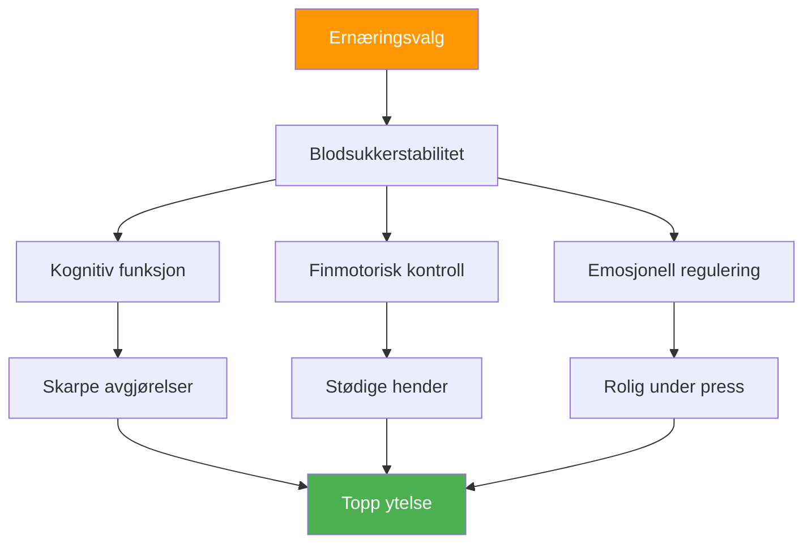

# Ernæring for konkurranse: Drivstoff for presisjonsytelse

> «Hjernen din er ditt viktigste verktøy i petanque. Gi den stabil drivstoff, ikke berg-og-dal-bane-energi.»

Pétanque-konkurranser kan vare i 6–10 timer. Det du spiser påvirker direkte din kognitive funksjon, finmotorikk og evne til å holde fokus gjennom flere kamper.

::: tip Den gylne regelen
**Stabilt blodsukker = stødige hender.** Alle ernæringsvalg bør støtte jevn energi, ikke topper og krasj.
:::

---

## Hvorfor ernæring er viktig for petanque

I motsetning til høyintensitetsidretter krever petanque:

Feil ernæringsvalg skaper prestasjonsproblemer som spillerne tilskriver «mental svakhet» eller «uflaks».

---

## Blodsukkerforbindelsen

Hjernen din drives av glukose. Blodsukkersvingninger påvirker direkte:

| Blodsukkertilstand | Mental effekt | Fysisk effekt |
|-------------------|---------------|-----------------|
| **Stabil** | Klar tenkning, gode avgjørelser | Stødige hender, konsekvent |
| **Spike (for høy)** | Første energi, deretter krasj | Jervøs, overaktiv |
| **Krasj (for lav)** | Dårlig konsentrasjon, irritabilitet | Skjelving, svakt grep |
| **Berg-og-dal-bane** | Uforutsigbart humør/fokus | Inkonsekvent ytelse |

**Mål:** Opprettholde stabilt blodsukker gjennom hele konkurransen.

## Ernæring på konkurransedagen

### Før konkurransen (3–4 timer før)

**Spis et solid måltid:**
- Komplekse karbohydrater (havregrøt, fullkornsbrød, ris)
- Protein (egg, yoghurt, magert kjøtt)
- Sunt fett (avokado, nøtter, olivenolje)
- Unngå: Enkle sukkerarter, tung/fet mat

**Eksempelmåltider:**
- Havregrøt med nøtter og banan
- Egg på fullkornsbrød med avokado
- Ris med kylling og grønnsaker

### Før kamp (1–2 timer før)

**Lett, kjent snacks:**
- Banan
- Liten håndfull nøtter
- En halv sandwich
- Unngå: Alt nytt eller eksperimentelt

### Under konkurransen

**Mellom kampene:**
- Små, hyppige mellommåltider hvert 60.–90. minutt
- Nøtter, frø, tørket frukt
- Fullkornsknekkebrød
- Fersk frukt (banan, eple)

**Under kampene:**
- Vann slurker mellom endene
- Raske karbohydrater om nødvendig (tørket frukt)
- Unngå å spise under aktiv lek

### Restitusjon (etter konkurranse)

**Innen 30–60 minutter:**
- Protein for muskelgjenoppretting
- Karbohydrater for å fylle på
- Væsker for å rehydrere

## Hydreringsprotokoll

### Det grunnleggende
- Begynn å drikke væske (sjekk fargen på morgenurinen)
- Drikk jevnt og trutt, ikke vent til du er tørst
- Mål 150–250 ml per time under konkurranse
- Juster for varme og fuktighet

### Varseltegn på dehydrering
- Tørst (du er allerede dehydrert)
- Mørk urin
- Hodepine
- Redusert konsentrasjon
- Utmattelse

### Overhydreringsfellen
For mye vann, spesielt uten elektrolytter:
- Hyppige toalettpauser (forstyrrer rytmen)
- Fortynnede elektrolytter (kan forårsake skjelving)
- Ubehag og distraksjon

**Balanse:** Jevnt inntak, inkluder elektrolytter under varme forhold.

## Matvarer som bør unngås

### På konkurransedagen
- **Tunge måltider** — Omdirigerer blod til fordøyelsen
- **Høyt sukker** — Forårsaker energikrakk
- **Alkohol (kvelden før)** — Forstyrrer søvnen, dehydrerer
- **Overdrevent koffeininntak** – Kan forårsake nervøsitet
- **Nye matvarer** – Risiko for fordøyelsesproblemer
- **Fet/stekt mat** — Langsom fordøyelse, sløvhet

### Matvarer som forårsaker problemer
- **Kullsyreholdige drikker** — Oppblåsthet, ubehag
- **Fiberrik mat** – Kan forårsake ubehag
- **Meieriprodukter (for noen)** — Fordøyelsesfølsomhet
- **Kunstige søtningsmidler** – Kan forårsake mageproblemer

## Koffeinstrategi

Koffein kan forbedre fokus og reaksjonstid, men krever nøye håndtering:

### Effektiv bruk
- Kjenn din toleranse
- Konsekvent timing (ikke endre for konkurranse)
- Moderat dose (100–200 mg)
- Tidlig nok til å unngå forstyrrelser i kveldskampene
- Kombiner med mat for å redusere nerver

### Ineffektiv bruk
- Mer enn vanlig (forårsaker angst, skjelving)
- Sent på dagen (forstyrrer søvnen)
- På tom mage (nervøsitet, krasj)
- Avhengig av koffein for å kompensere for dårlig søvn

## Bygge din konkurranseernæringsplan

### Trinn 1: Test i praksis
Prøv konkurranseernæringsplanen din på trening:
- Samme tidspunkt
- Samme matvarer
- Samme hydrering
- Legg merke til hvordan du føler deg og presterer

### Trinn 2: Forbered logistikken
- Vit hvilken mat som er tilgjengelig på stedet
- Ta med dine egne velprøvde snacks
- Har alternativer for sikkerhetskopiering
- Pakk mer enn du tror du trenger

### Trinn 3: Lag en tidsplan
Skriv ned kostholdstiden din:
- Måltid før konkurransen (tid, mat)
- Matpakke før kampen (tid, mat)
- Under konkurransen (program, mat)
- Intervaller for påminnelser om hydrering

### Trinn 4: Spor og juster
Etter konkurranser, merk:
- Hva du spiste og når
- Hvordan du følte deg fysisk
- Ytelseskvalitet
- Eventuelle problemer (sult, oppkast, mageproblemer)

## Hensyn til varme og fuktighet

Krav til endringer i varmt vær:

- **Øk væskeinntaket** — Kan trenge 50–100 % mer
- **Tilsett elektrolytter** — Svetting mister mineraler
- **Lette måltider** — Tung mat som er vanskeligere å bearbeide
- **Skyggebryter** — Ikke undervurder varmestress
- **Forkjøling** — Ankom lokalet avkjølt og hydrert

## Vanlige feil

::: warning Unngå disse
- **Hopper over frokost** — Tømmer morgenglykogen
- **Energidrikker** – For mye koffein og sukker
- **Venter til jeg er sulten** – Påvirker allerede ytelsen
- **Alkohol kvelden før** — Dehydrering og dårlig søvn
- **Prøve nye matvarer** – Risiko for fordøyelsesproblemer
:::

## Handlingstrinn

1. **Planlegg konkurranseernæringen din** på forhånd
2. **Test planen din** i praksis
3. **Forbered snacksene dine** kvelden før
4. **Følg timeplanen din** uavhengig av kamppress
5. **Gjennomgå og finjuster** etter hver konkurranse

---

## Relatert innhold

- [Ernæringsmodul](/no/utdanning/ernæring/) — Fullstendig ernæringsopplæring
- [Konkurranseernæring](/no/utdanning/ernæring/konkurranse) — Detaljerte protokoller
- [Søvn for ytelse](/no/artikler/søvn-ytelse) — Optimalisering av restitusjon

