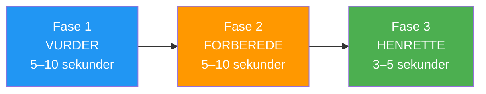

# Bygge rutiner før opptak

> «Forskjellen mellom et godt kast og et flott kast skjer ofte før kulen forlater hånden din.»

En godt utformet rutine før treningsøkten er ankeret ditt i konkurransestormen – en pålitelig sekvens som forbereder sinn og kropp for optimal ytelse.

::: tip Din konkurransefordel
**En konsekvent rutine skaper konsistente resultater.** Det er det ene du kan kontrollere fullstendig, uavhengig av press eller omstendigheter.
:::

---

## Hvorfor rutiner før inntak er viktige

Eliteutøvere i alle idretter bruker rutiner før kast. I petanque, hvor hvert kast er diskret og det kan bygges opp press mellom slagene, tjener rutinene flere formål:

| Hensikt | Hvordan det hjelper |
|---------|--------------|
| **Konsistens** | Samme forberedelse → mer konsistent utførelse |
| **Fokus** | Konstruktiv oppgave i stedet for bekymring |
| **Overgang** | Skift fra å tenke til å gjøre |
| **Trykkhåndtering** | Kjente handlinger roer nervesystemet |
| **Tilbakestill** | Fjerner forrige skudd fra tankene |

---

## Anatomien til en effektiv rutine

### Fase 1: Vurdering (5–10 sekunder)
- Les terrenget
- Visualiser det tiltenkte resultatet
- Velg kastetype
- Forplikt deg til avgjørelsen

### Fase 2: Forberedelse (5–10 sekunder)
- Ta din posisjon
- Finn grepet ditt
- Få ro i pusten din
- Føl vekten av kulen

### Fase 3: Utførelse (3–5 sekunder)
- Endelig fokus på målet
- Stol på kroppen din
- Slipp slipp uten tanke
- Følg opp naturlig

## Bygge din personlige rutine

### Trinn 1: Observer dine nåværende mønstre

Før du lager en ny rutine, legg merke til hva du allerede gjør:
- Hva gjør du før vellykkede kast?
- Hva endrer seg når du er under press?
- Hva føles naturlig for deg?

### Trinn 2: Design sekvensen din

Lag en rutine som inkluderer:

**Fysiske elementer:**
- Hvordan du nærmer deg sirkelen
- Hvordan du plukker opp og holder kulen
- Din holdning og posisjonering
- Et spesifikt pustemønster

**Mentale elementer:**
- En visualisering av resultatet
- Et fokusord eller en frase
- Et forpliktelsespunkt (i det øyeblikket du bestemmer deg for at «dette er kastet»)

### Trinn 3: Hold det enkelt

Rutinen din bør være:
- **Kort nok** til å opprettholde press (15–25 sekunder totalt)
- **Enkelt nok** til å huske når man er stresset
- **Fleksibel nok** til å tilpasse seg ulike situasjoner

## Eksempelrutiner

### Pekerens rutine
1. Stå bak sirkelen og vurder terrenget
2. Visualiser kulens bane og landingssted
3. Gå inn i sirkelen, finn din holdning
4. Tre langsomme åndedrag mens du kjenner på boule
5. Øynene på målet, slipp

### Skytterens rutine
1. Identifiser målkulen, velg vinkelen
2. Visualiser effekten og resultatet
3. Gå inn i sirkelen med et formål
4. Ett dypt åndedrag, kjenn vekten
5. Fest blikket på målet, utfør

## Vanlige feil å unngå

### For lang
Hvis rutinen din tar mer enn 30 sekunder, tenker du for mye. Lange rutiner gir angsten mer tid til å bygge seg opp.

### For stiv
Hvis en avbrudd ødelegger rutinen din, er den for skjør. Bygg inn fleksibilitet – hvis noe forstyrrer konsentrasjonen din, ha en utløser som kan resete den.

### Hopping under press
Rutinen er viktigst når presset er høyest. Hvis du dropper den når du er stresset, mister du dens beskyttende fordeler.

### Fokus på mekanikk
Rutinen din bør avsluttes med fokus på resultatet, ikke på teknikk. «Treffe målet», ikke «holde albuen rett».

## Øve på rutinen din

### I trening
- Bruk hele rutinen din for hvert kast, selv de som er mer tilfeldige
- Ta tiden på deg selv for å sikre konsistens
- Øv med distraksjoner for å bygge motstandskraft

### Bygningsautomatikk
Målet er at rutinen din skal bli automatisk – noe du gjør uten å tenke deg om. Dette krever repetisjon:
- 100+ kast med samme rutine
- Konsekvent bruk i ulike situasjoner
- Gradvis eksponering for press samtidig som rutinen opprettholdes

## Tilpasning til konkurranse

I kamper kan det hende at rutinen din trenger små justeringer:

- **Tidspress**: Ha en forkortet versjon klar
- **Værforhold**: Juster fysiske elementer etter behov
- **Øyeblikk med høyt trykk**: Senk farten litt, ikke øk farten

## Tilbakestillingsrutinen

Like viktig er hva du gjør etter et kast:

1. **Godta resultatet** — bra eller dårlig, det er gjort
2. **Fysisk tilbakestilling** — ta et skritt tilbake, rist ut spenninger
3. **Mental tilbakestilling** — fjern kastet fra tankene dine
4. **Forbered deg på det neste** – flytt fokuset til det som kommer

---

| *Relatert: [Veiledning for rutine før skudd](/no/utdanning/mentalt spill/mental-styrke/rutine-før-skudd) | [Håndtering av press](/no/utdanning/mentalt-spill/mental-styrke/håndtering-av-press) | [Mindfulness-teknikker](/no/utdanning/mentalt-spill/mindfulness/teknikker)* |

