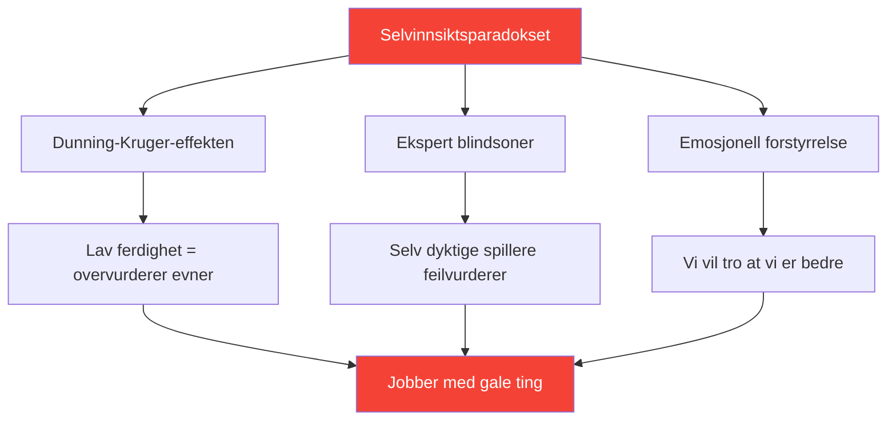

# Utvikling av selvinnsikt: Grunnlaget for forbedring

> &quot;Du kan ikke forbedre det du ikke oppfatter nøyaktig.&quot;

Selvinnsikt – å kjenne dine faktiske styrker og svakheter – er grunnlaget for effektiv utvikling.

::: danger Den ubehagelige sannheten
**De fleste spillere jobber med feil ting** fordi de ikke ser seg selv klart.
:::

---

## Selvinnsiktsparadokset

---

## Hvorfor petanquespillere sliter

Pétanque gjør selvvurdering spesielt vanskelig:

| Utfordring | Hvorfor det er vanskelig |
|-----------|--------------|
| **Resultatavvik** | Gode avgjørelser kan føre til dårlige utfall (og omvendt) |
| **Sammenligningsskjevhet** | Vi husker de beste prestasjonene, bortforklarer de verste |
| **Identitetsbeskyttelse** | Å innrømme svakhet føles truende |

::: warning Minne er ikke data
**Vi konstruerer fortellinger som beskytter selvbildet vårt.** Objektiv sporing er viktig.
:::

---

## Komponentene i selvinnsikt

Sann selvinnsikt krever innsikt i flere domener:

| Domene | Viktige spørsmål |
|--------|---------------|
| **Teknisk** | Hvilke kast er faktisk pålitelige? Hvilke er inkonsistente? |
| **Mental** | Hvordan reagerer jeg på press? Hva trigger min indre kritiker? |
| **Fysisk** | Når er energien min høyest? Hvordan påvirker tretthet meg? |
| **Taktisk** | Overangriper jeg? Underangriper jeg? Hvordan leser jeg situasjoner? |
| **Emosjonell** | Hva frustrerer meg? Når spiller jeg tight? |
| **Interpersonell** | Hvordan oppfatter lagkameratene kommunikasjonen min? |

## Ekstern tilbakemelding: Speilet du trenger

Du kan ikke se dine egne blindsoner. Du trenger eksterne perspektiver.

### Strukturerte tilbakemeldingsmetoder

**Videoanalyse**
- Spill inn kamper og trening
- Se med spesifikke fokusområder
- Legg merke til mønstre du overser i øyeblikket

**Fagfellevurdering**
- Be pålitelige lagkamerater om ærlig tilbakemelding
- Bruk [Vurderingsverktøyet](/no/assessment/) for validering av fagfeller
- Sammenlign din egenvurdering med deres vurdering

**Trenerobservasjon**
- Friske øyne ser det kjente øyne går glipp av
- Be om spesifikk tilbakemelding, ikke generelle inntrykk
- Spor tilbakemeldingstemaer over tid

### Tilbakemeldingsgapet

Når din egenvurdering avviker vesentlig fra ekstern tilbakemelding, vær oppmerksom på:

| Gaptype | Betydning | Handling |
|----------|---------|--------|
| Du vurderer høyere | Mulig blindsone | Undersøk med video/data |
| Du vurderer lavere | Mulig tillitsproblem | Fokus på bevis på kompetanse |
| Konsekvent gap | Systematisk persepsjonsfeil | Kalibrer den mentale modellen din på nytt |

## Å bygge vaner med selvinnsikt

### Daglig refleksjon (5 minutter)

Etter hver økt, spør deg selv:

1. **Hva gikk bra?** (Vær spesifikk)
2. **Hva gikk ikke bra?** (Vær ærlig)
3. **Hva ville jeg gjort annerledes?** (Vær konstruktiv)
4. **Hva overrasket meg?** (Vær nysgjerrig)

### Ukentlig gjennomgang (15 minutter)

Se etter mønstre:

- Hvilke situasjoner utfordrer meg konsekvent?
- Hvor forbedrer jeg meg?
- Hvilke tilbakemeldinger har jeg fått?
- Hva unngår jeg å se på?

### Månedlig vurdering

Bruk verktøyet [Spillervurdering](/no/vurdering/):

- Vurder deg selv på alle 8 faktorene
- Be om validering fra fagfeller
- Sammenlign med forrige måned
- Identifiser de største hullene

## Datafordelen

Subjektiv oppfatning er upålitelig. Data gir objektivitet:

### Hva du skal spore

**Ytelsesdata**
- Suksessrater etter kasttype
- Ytelse under press kontra ikke noe press
- Første sett vs. senere sett
- Med forskjellige partnere

**Prosessdata**
- Søvnkvalitet før kamper
- Overholdelse av rutiner før kamp
- Mental tilstand i viktige øyeblikk
- Restitusjonstid etter feil

### Slik bruker du data

1. **Identifiser mønstre** – Hva korrelerer med god/dårlig ytelse?
2. **Utfordre antagelser** – Samsvarer dataene med dine oppfatninger?
3. **Guideopplæring** — Fokuser på faktiske svakheter, ikke oppfattede
4. **Spor fremgang** — Forbedring er ofte usynlig uten måling

## Vanlige selvinnsiktsblokkeringer

::: warning Se opp for disse
- **Defensivitet** når man mottar tilbakemeldinger
- **Bortforklarer** dårlige prestasjoner
- **Søker bekreftelse** heller enn sannhet
- **Unngå måling** av svake områder
- **Å skylde på eksterne faktorer** konsekvent
:::

## Sammenhengen mellom veksttankegang

Selvinnsikt krever aksept av at:

- Nåværende evne er ikke fast
- Svakhet er informasjon, ikke identitet
- Tilbakemeldinger er en gave, ikke et angrep
- Forbedring krever ærlig vurdering

## Handlingstrinn

1. **I dag:** Fullfør [Egenvurderingen](/no/vurdering/)
2. **Denne uken:** Be om tilbakemeldinger fra to betrodde lagkamerater
3. **Pågående:** Etabler daglig refleksjonsvane
4. **Månedlig:** Spor fremgang med gjentatte vurderinger

---

## Relatert innhold

- [Selvinnsiktsmodul](/no/utdanning/selvinnsikt/) — Fullstendig utdanning
- [Spillervurdering](/no/vurdering/) — Evaluer dine 8 faktorer
- [Den indre kritikeren](/no/artikler/indre-kritiker) — Håndtering av selvdømmelse

