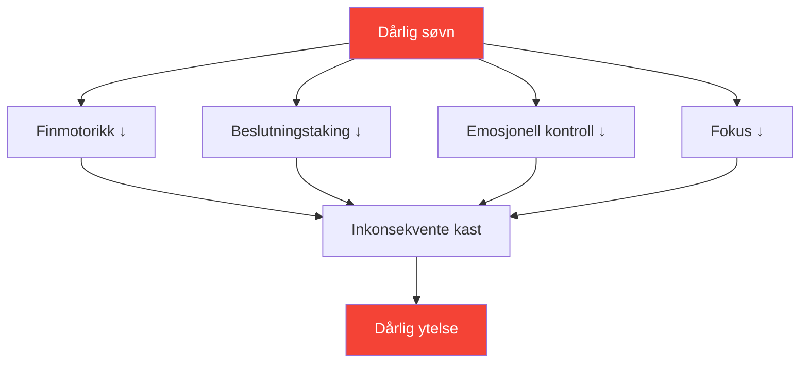

# Søvn: Den mest undervurderte ytelsesfaktoren

> «Spilleren som sov bedre vinner ofte.»

De fleste spillere fokuserer på teknikk og mental trening. Få optimaliserer søvnen sin. Dette er en feil – søvn kan være den forbedringen med høyest avkastning som er tilgjengelig for de fleste konkurransespillere.

::: tip Forbedring av høy avkastning
**Søvnoptimalisering krever null talent og gir massiv avkastning.** Det er det nærmeste man kommer en lovlig ytelsesforbedring.
:::

---

## Forskningen

Søvnforskning avslører slående effekter på presisjonssportprestasjoner:

### Reaksjonstid
- **24 timer uten søvn** = reaksjonstid tilsvarende 0,1 % alkohol i blodet
- **6 timer/natt i 2 uker** = tilsvarende å være våken i 48 timer
- Eliteutøvere har et gjennomsnitt på **8,5+ timer** mot 7 timer for den generelle befolkningen

### Beslutningstaking
- Søvnmangel svekker først den prefrontale cortex
- Taktiske beslutninger forringes før åpenbar tretthet viser seg
- Du legger ikke merke til svekkelsen din (metakognisjon svikter også)

### Motorkontroll
- Finmotorikk (grep, slipp) krever konsolidert hukommelse
- Minnekonsolidering skjer under dyp søvn
- Ferdighetslæring uten tilstrekkelig søvn = bortkastet øvelse

## Presisjonsforbindelsen

Pétanque krever akkurat det som søvnmangel ødelegger:

| Nødvendig ferdighet | Søvnmangeleffekt |
|----------------|--------------------------|
| Finmotorisk kontroll | Gripetrykket blir inkonsekvent |
| Visuell prosessering | svekket avstandsvurdering |
| Beslutningstaking | Taktiske feil øker |
| Emosjonell regulering | Frustrasjonen etter feil øker |
| Vedvarende oppmerksomhet | Fokuset forskyves i lengre kamper |

## Tegn på at du sover for lite

Du har tilpasset deg kronisk søvnmangel hvis:

- Du trenger en alarm for å våkne
- Du er døsig tidlig på ettermiddagen
- Du sovner innen 5 minutter etter at du har lagt deg ned
- Du «tar igjen» i helgene
- Kaffe er viktig, ikke valgfritt

**Realitetssjekk:** Hvis du trenger koffein for å fungere normalt, har du søvnmangel.

## Protokollen for konkurranseuken

### 7 dager før
- Begynn å sove 30 minutter mer per natt
- Stabiliser oppvåkningstiden (samme tid hver dag)

### 3 dager før
- Ingen alkohol (forstyrrer søvnstrukturen)
- Ingen tunge måltider etter kl. 19.00
- Reduser skjermtiden etter solnedgang

### Kvelden før
- Vanlig leggetid (ikke legg deg tidlig – du blir bare våken)
- Kjent miljø hvis mulig
- Avslapningsrutine

### Konkurransemorgen
- Våkn til vanlig tid
- Lyseksponering umiddelbart
- Vanlig frokostrutine

## Optimalisering av søvnkvalitet

Det er ikke bare varighet – kvaliteten er viktigst.

### Søvnmiljø
- **Temperatur:** 18–20 °C (65–68 °F) er optimalt
- **Mørke:** Fullstendig mørke eller sovemaske
- **Lyd:** Konsekvent (hvit støy) eller stille
- **Sengetøy:** Komfortabelt, ikke for varmt

### Rutine før søvn
- Skjermfri 60+ minutter før leggetid
- Dempede lys om kvelden
- Konsekvente avslapningsaktiviteter
- Kald dusj kan utløse søvndepresjon

### Tidspunkt
- Konsekvent oppvåkningstid (viktigere enn leggetid)
- Unngå å sove mer enn 30 minutter i helgene
- Lur: før kl. 15.00, under 20 minutter

## Nap-strategien

Strategisk lur for konkurransedager:

### Power Nap (10–20 min)
- Reduserer tretthet uten å bli døsig
- Best for mellom morgen- og ettermiddagsøkter
- Sett alarm – ikke forsov deg

### Hele syklusen (90 min)
- Fullstendig søvnsyklus
- Kun hvis du har 2+ timer før konkurransen
- Risiko for omtåkethet ved avbrudd

### Aldri sove hvis:
- Du har søvnløshet
- Konkurransen er innen 90 minutter
- Klokken er over 15, og du må sove den natten.

## Reisehensyn

For bortekamper:

### Før reisen
- Ta med kjente soveartikler (pute, sovemaske)
- Undersøk hotellrom (be om stille rom)
- Juster timeplanen hvis du krysser tidssoner

### Ved destinasjonen
- Hold deg til soveplanen hjemme hvis mulig
- Lyseksponering kontrollerer døgnrytmen
- Unngå tunge måltider nær leggetid

### Tidssonekryssing
- 1 dag per time for å tilpasse seg fullt ut
- Eksponering for morgenlys fremskynder justeringen østover
- Eksponering for kveldslys fremskynder justeringen vestover

## Sporing av søvnen din

Det som måles blir styrt:

### Enkel sporing
- Oppvåknings- og leggetid
- Subjektiv kvalitet (1–10)
- Notater om ytelseskorrelasjon

### Avansert sporing
- Søvnsporing eller bærbar enhet
- HRV-trender (pulsvariabilitet)
- Data om søvnstadier

### Hva du skal se etter
- Korrelasjon mellom søvn og ytelse
- Mønstre (helgeoppfølging, søvnløshet før konkurranse)
- Trender over tid

## Vanlige feil

::: warning Unngå disse
- **Alkohol som søvnhjelp** — Hjelper med å starte, ødelegger kvaliteten
- **Ta igjen det tapte i helgene** — Klarer ikke å «betale tilbake» søvngjeld
- **Skjermer i sengen** — Trener hjernen at seng ≠ søvn
- **Inkonsekvent timeplan** — Døgnrytmen trenger konsistens
- **Ignorerer søvn for trening** — Bytter kvalitet for kvantitet
:::

## Handlingstrinn

1. **Denne uken:** Spor din faktiske søvn (varighet + kvalitet)
2. **Neste uke:** Etabler en fast oppvåkningstid
3. **Følgende uker:** Optimaliser miljø og rutine
4. **Før konkurranse:** Implementer konkurranseukeprotokollen

---

## Relatert innhold

- [Søvn- og restitusjonsmodul](/no/utdanning/søvn/) — Fullstendig søvnopplæring
- [Søvnvaner](/no/utdanning/søvn/vaner) — Bygge bærekraftige rutiner
- [Søvn i konkurranse](/no/utdanning/søvn/konkurranse) — Protokoller spesifikke for ulike arrangementer

