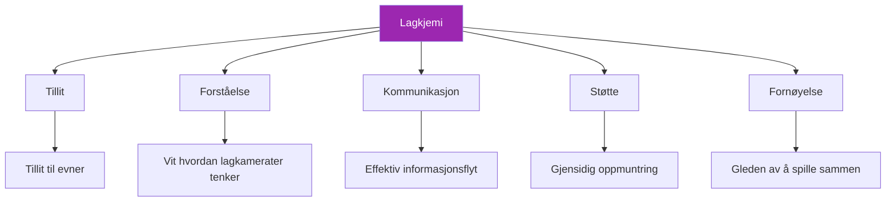

# Bygge lagkjemi

> «Du har sett det: lag der helheten overstiger summen av delene.»

Spillere som forventer hverandre, støtter hverandre og presterer bedre sammen enn alene. Dette er lagkjemi – og det er ikke tilfeldig.

::: tip Kjemi bygges, ikke finnes
**Gode team settes ikke sammen – de utvikles.** Kjemi krever bevisst innsats over tid.
:::

---

## Hva er lagkjemi?

---

## Hvorfor kjemi er viktig

| Med kjemi ✅ | Uten kjemi ❌ |
|-------------------|----------------------|
| Ta bedre kollektive beslutninger | Skyld på hverandre for feil |
| Komme seg raskere etter tilbakeslag | Kommuniserer dårlig under stress |
| Prestere konsekvent under press | Underpresterer i forhold til talent |
| Kos deg mer med konkurranse | Opplev konflikt og frustrasjon |
| Holde sammen lenger | Teamet oppløses |

## Byggeklossene

### 1. Delte mål

Kjemi starter med justering:
- Hva prøver vi å oppnå?
- Hvordan ser suksess ut?
- Hva er vi villige til å ofre?

Lag med motstridende mål (ett vil ha moro, et annet vil vinne for enhver pris) sliter med å bygge kjemi.

### 2. Rolleklarhet

Hver spiller trenger å vite:
- Hva som forventes av dem
- Hvordan de bidrar til lagets suksess
- Når man skal lede og når man skal følge

Uklare roller skaper friksjon og bitterhet.

### 3. Gjensidig respekt

Respekt betyr:
- Verdsetter hver lagkamerats bidrag
- Å akseptere ulike stiler og tilnærminger
- Behandle hverandre med verdighet, spesielt under press

### 4. Psykologisk sikkerhet

Spillere må føle seg trygge for å:
- Gjør feil uten hard dom
- Uttrykke meninger og bekymringer
- Være seg selv uten pretensjoner

## Byggekjemi: Praktiske trinn

### Tid sammen

Kjemi krever investering:
- Øv sammen regelmessig
- Tilbring tid sammen utenfor terrenget
- Del erfaringer utover petanque

### Strukturert teambygging

Bevisste aktiviteter hjelper:
- Målsettingsøkter for teamet
- Oppsummeringer etter kampen (konstruktive)
- Diskusjoner om spillestiler og preferanser

### Konfliktløsning

Ta tak i problemene før de blir verre:
- Skap rom for ærlige samtaler
- Fokuser på atferd, ikke personlighet
- Søk løsninger, ikke skyld

### Feir sammen

Delt glede bygger bånd:
- Anerkjenn gode prestasjoner
- Feir lagets prestasjoner
- Marker milepæler sammen

## Kjemimordere

### Skyldkultur

Når feil fører til kritikk i stedet for støtte, svekkes tilliten raskt.

### Ulik forpliktelse

Hvis noen spillere investerer mer enn andre, bygger det seg opp bitterhet.

### Dårlig kommunikasjon

Misforståelser og antagelser skaper avstand.

### Ego-konflikter

Når individuell anerkjennelse er viktigere enn lagets suksess, lider kjemien.

### Uløst konflikt

Problemer som ikke blir tatt tak i forsvinner ikke – de vokser.

## Kjemi i konkurranse

### Før kampene

- Kom sammen, varm opp sammen
- Kort gruppediskusjon om tilnærming
- Positiv energi og gjensidig oppmuntring

### Under kampene

- Synlig støtte for hverandre
- Kun konstruktiv kommunikasjon
- Felles feiring av gode skuespill
- Kollektiv respons på tilbakeslag

### Etter kampene

- Vinn eller tap, hold sammen
- Kort oppsummering (hva fungerte, hva bør forbedres)
- Oppretthold positive relasjoner uavhengig av resultat

## Ulike personligheter

Sterke team inkluderer ofte forskjellige personlighetstyper:

- **Den stødige**: Rolig under press, konsekvent
- **Energigiveren**: Gir entusiasme og motivasjon
- **Strategen**: Tenker fremover, ser mønstre
- **Konkurrenten**: Driver viljen til å vinne

Kjemi handler ikke om at alle er like – det handler om forskjeller som fungerer sammen.

## Når kjemien mangler

### Tegn på dårlig kjemi

- Synlig frustrasjon hos lagkameratene
- Skyld etter feil
- Mangel på kommunikasjon
- Spiller som individer, ikke et lag
- Gruer seg heller enn å nyte kamper

### Gjenoppbygging av kjemi

1. **Erkjenn problemet**: Navngi det åpent
2. **Identifiser årsaker**: Hva skaper friksjonen?
3. **Forplikt deg til endring**: Alle parter må investere
4. **Gjør tiltak**: Konkrete tiltak for å forbedre
5. **Vær tålmodig**: Kjemi tar tid å gjenoppbygge

### Når man skal gå videre

Noen ganger kan ikke kjemien fikses:
- Grunnleggende verdiforskjeller
- Gjentatte brutte tillitsforhold
- Uvilje til å forandre seg

Det er greit å anerkjenne når et team ikke fungerer.

## Kapteinens rolle

Hvis du er teamleder:
- Modellér atferden du ønsker å se
- Ta tak i problemer tidlig og direkte
- Skap muligheter for tilknytning
- Beskytt teamkulturen
- Balanse mellom individuelle behov og teamets behov

## Langsiktig kjemi

Kjemi er ikke statisk – den krever vedlikehold:

### Regelmessige innsjekkinger

- Hvordan fungerer vi som et team?
- Hva fungerer? Hva fungerer ikke?
- Noen problemer som må tas opp?

### Kontinuerlig investering

- Fortsett å tilbringe tid sammen
- Fortsett å kommunisere åpent
- Fortsett å støtte hverandre

### Tilpasning

- Etter hvert som spillerne vokser og forandrer seg, må også laget gjøre det.
- Vær villig til å utvikle roller og dynamikk
- Vær nysgjerrige på hverandre

---

| *Relatert: [Teamdynamikk](/no/utdanning/teamdynamikk/) | [Kommunikasjon](/no/utdanning/teamdynamikk/kommunikasjon) | [Ledelse i petanque](/no/artikler/lagledelse)* |

