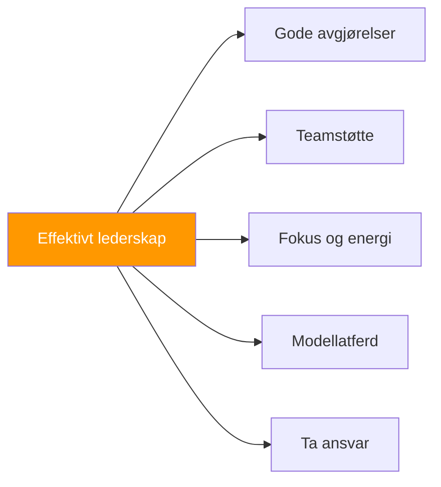

# Lederskap i petanque

> «Lederskap handler ikke bare om å være kaptein – det handler om å få frem det beste i laget ditt.»

Alle spillere kan lede på forskjellige måter. Det handler om innflytelse, støtte og å være en god modell.

::: tip Alle kan lede
**Du trenger ikke en tittel for å være leder.** Lederskap er atferd, ikke posisjon.
:::

---

## Hva er petanque-ledelse?

---

## Typer av lederskap

| Type | Fokus | Hvordan det ser ut |
|------|-------|--------------|
| **Posisjonell** | Autoritet | Kaptein tar endelige avgjørelser, setter kulturen |
| **Ytelse** | Fortreffelighet | Konsekvent ferdighet, god håndtering av press |
| **Emosjonell** | Energi | Å være positiv, å støtte andre |
| **Taktisk** | Strategi | Å lese spillet, gi innsikt |

### Posisjonsbasert lederskap

Den utpekte kapteinen eller laglederen:
- Tar endelige strategiske beslutninger
- Representerer laget offisielt
- Styrer teamdynamikken
- Setter tonen og kulturen

### Ytelseslederskap

Ledende gjennom fortreffelighet:
- Demonstrerer ferdigheter og konsistens
- Viser hvordan man håndterer press
- Setter standarder gjennom handling
- Inspirerende gjennom opptreden

### Emosjonelt lederskap

::: info Ofte undervurdert
**Emosjonelt lederskap er avgjørende** – spilleren som holder seg positiv når han ligger under 2–10 kan snu hele kampen.
:::

Håndtering av teamets energi og moral:
- Å holde seg positiv under press
- Støtte lagkamerater som sliter
- Feirer suksesser
- Å opprettholde perspektivet

### Taktisk lederskap

Bidrag til strategisk tenkning:
- Leser spillet godt
- Tilbyr verdifull innsikt
- Å se mønstre som andre overser
- Tenker fremover

## Den effektive lederen

### I praksis

- Ankommer forberedt og fokusert
- Jobber hardt og oppmuntrer andre
- Gir konstruktiv tilbakemelding
- Skaper et positivt treningsmiljø

### Før konkurransen

- Sørger for at teamet er forberedt
- Setter tydelige forventninger
- Håndterer nervene før kampen
- Skaper fokus og selvtillit

### Under konkurransen

- Tar klare og rettidige beslutninger
- Støtter lagkameratene synlig
- Holder seg rolig under press
- Tilpasser strategien etter behov

### Etter konkurransen

- Håndterer seire med ynde
- Håndterer tap med perspektiv
- Leder konstruktive debriefinger
- Opprettholder teamrelasjoner

## Lederskapsutfordringer

### Å ta vanskelige avgjørelser

Noen ganger må du:
- Velg mellom alternativer uten et klart svar
- Uenig med lagkameratene
- Ta ansvar for resultatene
- Handle besluttsomt til tross for usikkerhet

**Nærme:**
- Samle innspill raskt
- Ta avgjørelsen
- Forplikt deg fullt ut
- Lær av resultatene

### Håndtering av konflikt

Lagfriksjon er uunngåelig:
- Ulike meninger om strategi
- Frustrasjon etter feil
- Personlighetskrocker
- Ulik forpliktelse

**Nærme:**
- Ta tak i problemer tidlig
- Lytt til alle perspektiver
- Fokuser på løsninger
- Behold respekten

### Støtte til spillere som sliter

Når en lagkamerat presterer dårlig:
- Ikke legg til press
- Tilby spesifikk, positiv støtte
- Juster strategien om nødvendig
- Behold tilliten til dem

### Håndtering av dine egne problemer

Ledere sliter også:
- Innrøm det (for deg selv)
- Ikke la det påvirke lederskapet ditt
- Stol på lagkameratene
- Modellér robusthet

## Lederstiler

### Kommandøren

- Direkte og avgjørende
- Tydelige forventninger
- Tar ansvar i krisen
- Risiko: Kan være overbærende

### Treneren

- Utvikler andre
- Stiller spørsmål
- Bygger kapasitet
- Risiko: Kan være treg i krise

### Samarbeidspartneren

- Søker innspill
- Bygger konsensus
- Verdsetter alle stemmer
- Risiko: Kan være ubesluttsom

### Supporteren

- Fokuserer på relasjoner
- Skaper trygghet
- Oppmuntrer og bekrefter
- Risiko: Kan unngå harde sannheter

**De beste lederne tilpasser stilen sin til situasjonen.**

## Utvikle lederegenskaper

### Selvinnsikt

Kjenn din:
- Naturlig lederstil
- Styrker og svakheter
- Innvirkning på andre
- Utløsere og reaksjoner

### Emosjonell intelligens

Utvikle evnen til å:
- Gjenkjenne følelser (dine og andres)
- Administrer svarene dine
- Vis empati med lagkamerater
- Naviger sosiale dynamikker

### Kommunikasjonsferdigheter

Øvelse:
- Tydelig og konsis melding
- Aktiv lytting
- Gir konstruktiv tilbakemelding
- Vanskelige samtaler

### Beslutningstaking

Forbedre deg gjennom:
- Analysere tidligere avgjørelser
- Søker tilbakemelding
- Lære av feil
- Å øve under press

## Ledende uten tittel

Du trenger ikke å være kaptein for å lede:

### Gå foran med et godt eksempel
- Møt opp forberedt
- Gi full innsats
- Håndtere motgang godt
- Støtt lagkameratene

### Lede gjennom støtte
- Oppmuntre andre
- Tilby hjelp
- Feir lagkameratenes suksess
- Vær pålitelig

### Lede gjennom bidrag
- Del observasjoner
- Kommenter ideer med respekt
- Ta initiativ
- Fyll hull

## Lederskapstankegangen

### Ansvar fremfor skyld

Ledere tar ansvar:
- «Vi presterte ikke bra», ikke «De bommet»
- «Jeg burde ha kommunisert bedre», ikke «De lyttet ikke».

### Lag over seg selv

Ledere prioriterer teamets suksess:
- Feir lagets prestasjoner
- Del æren sjenerøst
- Ta skylden personlig
- Sett teamets behov først

### Vekst fremfor komfort

Ledere tar utfordringen på alvor:
- Søk etter vanskelige situasjoner
- Lær av feil
- Press for forbedring
- Modell kontinuerlig vekst

## Når lederskapet svikter

Selv gode ledere mislykkes noen ganger:
- Feil avgjørelser skjer
- Lag taper til tross for god ledelse
- Relasjoner belastes

**Bedring:**
1. Erkjenn hva som skjedde
2. Ta passende ansvar
3. Lær leksjonene
4. Gå fremover med ydmykhet

---

| *Relatert: [Teamdynamikk](/no/utdanning/teamdynamikk/) | [Kommunikasjon](/no/utdanning/teamdynamikk/kommunikasjon) | [Bygge lagkjemi](/no/artikler/lagkjemi)* |

