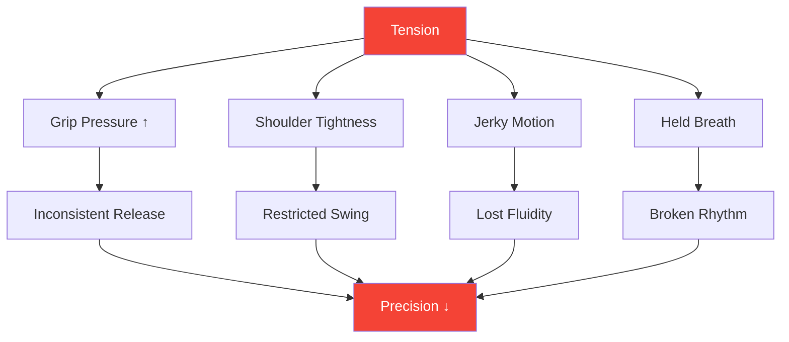
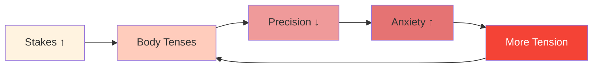

# Tension and Precision: The Hidden Connection

> "You cannot be both tense and precise. It's physically impossible."

You've felt it: the crucial throw where your body tightens, your grip increases, and the ball goes exactly where you didn't want it. Tension is the silent killer of precision.

::: danger The Hidden Enemy
**Most tension is invisible to the player experiencing it.** You don't know you're tense until it's too late.
:::

---

## The Biomechanics of Tension

---

## Where Tension Hides

Most players are aware of gross tension (tight shoulders before a big throw). Few notice subtle tension that consistently degrades performance:

| Location | Effect on Throw | How to Notice |
|----------|-----------------|---------------|
| **Grip** | Inconsistent release timing | Ball marks on palm |
| **Forearm** | Reduced wrist fluidity | Burning sensation |
| **Shoulder** | Restricted swing arc | Throw feels "short" |
| **Neck** | Altered head position | Stiffness after matches |
| **Jaw** | Full-body tension cascade | Clenched teeth |
| **Breath** | Disrupted rhythm | Holding breath |

---

## The Pressure-Tension Spiral

Under pressure, a destructive cycle begins:

::: tip Break the Cycle
**Interrupt at Step 2** — before tension affects performance. This is why pre-shot routines with tension checks are essential.
:::

## Detecting Your Tension Patterns

### The Body Scan Method

Before practicing, close your eyes and scan:

1. Start at your feet — Any gripping of toes?
2. Move up through legs — Any locked knees?
3. Notice hips and core — Any bracing?
4. Check shoulders — Any elevation?
5. Scan arms and hands — Any premature grip?
6. Notice neck and face — Any clenching?

Rate tension 0-10 at each location. **Your baseline should be 2 or less.**

### The Video Method

Record yourself throwing in:
- Low-stakes practice
- Moderate-stakes practice
- High-stakes competition

Compare your body language. Where do you tense up as stakes increase?

### The Partner Method

Ask a teammate to observe:
- Your face before important throws
- Your stance changes under pressure
- Your breathing patterns
- Your grip behavior

External observers see what we cannot feel.

## Release Techniques

### Quick Releases (Use During Competition)

**The Shake-Out**
- Brief, vigorous shake of hands and arms
- Releases holding patterns
- Takes 2-3 seconds

**The Exhale Drop**
- Deep breath in
- On exhale, consciously drop shoulders
- Release jaw tension simultaneously

**The Grip Reset**
- Open hand completely
- Spread fingers wide
- Re-grip with minimum necessary force

### Deep Releases (Use in Practice/Pre-Competition)

**Progressive Muscle Relaxation**
- Tense each muscle group deliberately (5 seconds)
- Release completely (15 seconds)
- Notice the difference
- Work through entire body

**Breath-Body Connection**
- Slow breathing (4 counts in, 6 counts out)
- On each exhale, release one body area
- Continue until full-body relaxation achieved

## The Pre-Shot Integration

Build tension awareness into your pre-shot routine:

### Before Stepping to the Circle
- Quick body scan (2 seconds)
- One releasing exhale
- Confirm relaxed grip

### In the Circle
- Final breath to settle
- Soft focus on target
- Initiate throw from relaxed state

### After the Throw
- Notice where tension accumulated
- Shake out if needed
- Reset for next throw

## Training Tension Awareness

### Exercise 1: The Minimum Grip

Find the minimum grip pressure that maintains control:
- Start with firm grip — throw 5 balls
- Reduce grip 20% — throw 5 balls
- Continue reducing until control is lost
- Back up one level — this is your optimal grip

Most players grip 40-60% harder than necessary.

### Exercise 2: Pressure Simulation

Practice under artificial pressure while monitoring tension:
- Create consequences for practice throws
- Notice where tension appears
- Practice releasing while maintaining focus
- Gradually increase pressure tolerance

### Exercise 3: The Relaxed Pointer

Score yourself on two dimensions:
- Technical result (where did the ball land?)
- Tension level (how relaxed were you?)

**Goal:** Maximize both simultaneously. Many players must accept slightly worse results initially as they learn to throw relaxed.

## Competition Day Protocol

### Pre-Match
- 10-minute progressive relaxation
- Body scan to identify holding patterns
- Shake-out routine

### Between Ends
- Brief shake-out
- One releasing breath
- Tension check before critical throws

### During Throw
- Trust your pre-shot routine
- Release technique is pre-programmed
- Don't consciously control during execution

## Common Mistakes

::: warning Avoid These
- **Over-relaxation** — Some activation is necessary
- **Conscious control during throw** — Disrupts flow
- **Only relaxing for big throws** — Should be consistent
- **Ignoring breath** — Breath and tension are linked
- **Rushing the routine** — Tension release takes time
:::

## The Long-Term Benefit

Players who master tension management:
- Perform more consistently under pressure
- Experience less physical fatigue
- Recover faster from mistakes
- Enjoy competition more

---

## Related Content

- [Tension Management Module](/no/education/tension/) — Complete education
- [Physical Preparation](/no/education/tension/physical) — Body readiness
- [Pressure Management](/no/articles/pressure-management) — Mental aspects

