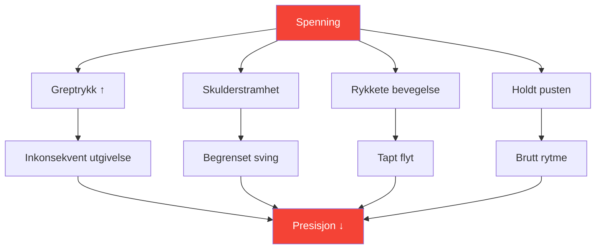
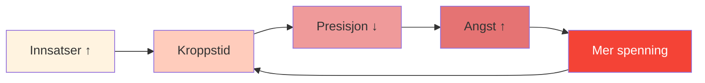

# Spenning og presisjon: Den skjulte forbindelsen

> «Du kan ikke være både anspent og presis. Det er fysisk umulig.»

Du har følt det: det avgjørende kastet der kroppen strammer seg, grepet øker, og ballen går akkurat dit du ikke ville ha den. Spenning er den stille morderen av presisjon.

::: danger Den skjulte fienden
**Det meste av spenning er usynlig for spilleren som opplever den.** Du vet ikke at du er anspent før det er for sent.
:::

---

## Biomekanikken til spenning

---

## Der spenningen skjuler seg

De fleste spillere er klar over grov spenning (stramme skuldre før et stort kast). Få legger merke til subtil spenning som konsekvent forringer prestasjonen:

| Sted | Effekt på kast | Hvordan legge merke til |
|----------|-----------------|---------------|
| **Grep** | Inkonsekvent utgivelsestidspunkt | Ballmerker på håndflaten |
| **Underarm** | Redusert håndleddsflyt | Brennende følelse |
| **Skulder** | Begrenset svingbue | Kastet føles «kort» |
| **Nakke** | Endret hodeposisjon | Stivhet etter kamper |
| **Kjeve** | Helkroppsspenningskaskade | Sammenbitte tenner |
| **Pust** | Forstyrret rytme | Holder pusten |

---

## Trykk-spenningsspiralen

Under press starter en destruktiv syklus:

::: tip Bryt syklusen
**Avbryt ved trinn 2** – før spenningen påvirker ytelsen. Derfor er rutiner med spenningskontroller før skuddet viktige.
:::

## Oppdage spenningsmønstrene dine

### Kroppsskanningsmetoden

Før du øver, lukk øynene og skann:

1. Start ved føttene – Har du grep i tærne?
2. Beveg deg oppover gjennom beina – Har du låste knær?
3. Legg merke til hofter og kjernemuskulatur – noen avstivning?
4. Sjekk skuldrene – Er det noen høydeforskjell?
5. Skann armer og hender – Har du for tidlig grep?
6. Legg merke til nakke og ansikt – Noen spenninger?

Spenningsgraden bør være 0–10 på hvert sted. **Grunnlinjen bør være 2 eller mindre.**

### Videometoden

Spill inn deg selv som kaster:
- Lavinnsatsøvelse
- Trening med moderat innsats
- Konkurranse med høy innsats

Sammenlign kroppsspråket ditt. Hvor spenner du deg når innsatsen øker?

### Partnermetoden

Be en lagkamerat om å observere:
- Ansiktet ditt før viktige kast
- Holdningen din endrer seg under press
- Dine pustemønstre
- Din grepatferd

Eksterne observatører ser det vi ikke kan føle.

## Utgivelsesteknikker

### Hurtigutløsere (bruk under konkurranse)

**Utfordringen**
- Kort, kraftig hånd- og armristing
- Utgivelser av holdingmønstre
- Tar 2–3 sekunder

**Utpustdråpen**
- Pust dypt inn
- På utpust, senk skuldrene bevisst
- Slipp kjevespenningen samtidig

**Grep-tilbakestillingen**
- Åpne hånden helt
- Spre fingrene vidt
- Grip igjen med minimal nødvendig kraft

### Dype utløsninger (bruk i trening/før konkurranse)

**Progressiv muskelavslapning**
- Spenn hver muskelgruppe bevisst (5 sekunder)
- Slipp helt (15 sekunder)
- Legg merke til forskjellen
- Arbeid gjennom hele kroppen

**Forbindelse mellom pust og kropp**
- Langsom pusting (4 tellinger inn, 6 tellinger ut)
- Slipp ett kroppsområde på hver utpust
- Fortsett til full kroppsavslapning oppnås

## Integrasjonen før opptak

Bygg inn spenningsbevissthet i rutinen din før du skyter:

### Før du går til sirkelen
- Rask kroppsskanning (2 sekunder)
- Ett utløsende pust
- Bekreft et avslappet grep

### I sirkelen
- Siste åndedrag for å roe seg ned
- Mykt fokus på målet
- Start kast fra avslappet tilstand

### Etter kastet
- Legg merke til hvor spenningen samlet seg
- Rist ut om nødvendig
- Tilbakestill for neste kast

## Trening av spenningsbevissthet

### Øvelse 1: Minimumsgrep

Finn minimumsgreptrykket som opprettholder kontroll:
- Start med fast grep – kast 5 baller
- Reduser grepet med 20 % – kast 5 baller
- Fortsett å redusere til du mister kontrollen
- Gå ett nivå tilbake – dette er ditt optimale grep

De fleste spillere griper 40–60 % hardere enn nødvendig.

### Øvelse 2: Trykksimulering

Øv under kunstig press mens du overvåker spenningen:
- Lag konsekvenser for øvelseskast
- Legg merke til hvor spenningen oppstår
- Øv på å slippe løs samtidig som du opprettholder fokus
- Øk trykktoleransen gradvis

### Øvelse 3: Den avslappede pekeren

Score deg selv på to dimensjoner:
- Teknisk resultat (hvor landet ballen?)
- Spenningsnivå (hvor avslappet var du?)

**Mål:** Maksimere begge samtidig. Mange spillere må akseptere litt dårligere resultater i starten etter hvert som de lærer å kaste avslappet.

## Protokoll for konkurransedagen

### Før kampen
- 10-minutters progressiv avslapning
- Kroppsskanning for å identifisere holdemønstre
- Shake-out-rutine

### Mellom endene
- Kort oppsummering
- Ett utløsende åndedrag
- Spenningskontroll før kritiske kast

### Under kast
- Stol på rutinen din før injeksjonen
- Utløsningsteknikken er forhåndsprogrammert
- Ikke bevisst kontroll under utførelse

## Vanlige feil

::: warning Unngå disse
- **Overavslapning** — Noe aktivering er nødvendig
- **Bevisst kontroll under kast** — Forstyrrer flyten
- **Bare avslappende ved store kast** — Bør være konsekvent
- **Ignorerer pusten** — Pust og spenning er knyttet sammen
- **Å forhaste rutinen** – Spenningsfrigjøring tar tid
:::

## Den langsiktige fordelen

Spillere som mestrer spenningshåndtering:
- Prestere mer konsekvent under press
- Opplev mindre fysisk tretthet
- Komme seg raskere etter feil
- Kos deg mer med konkurranse

---

## Relatert innhold

- [Modul for spenningshåndtering](/no/utdanning/spenning/) — Fullstendig utdanning
- [Fysisk forberedelse](/no/utdanning/spenning/fysisk) — Kroppsberedskap
- [Presshåndtering](/no/artikler/presshåndtering) — Mentale aspekter

