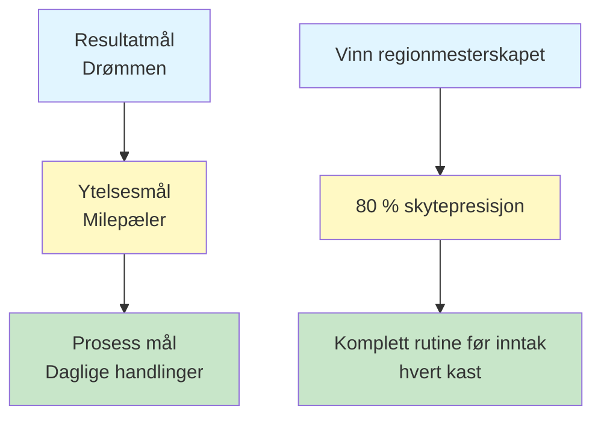

# Målsetting for petanquespillere
<AdBanner />

Tydelige mål er kompasset ditt. De gir retning til treningen din, motivasjon når ting blir vanskelige, og en måte å måle fremgang på. Uten mål kaster du bare boccia. Med mål bygger du mot noe.

::: tip Kjerneprinsippet
**Et mål uten en plan er bare et ønske.** Sett deg klare mål, del dem opp, fokuser på det du kontrollerer og følg fremgangen din.
:::

## Hvorfor mål er viktige

Mål tjener flere formål:
- **Retning:** Vit hva du skal jobbe med
- **Motivasjon:** Ha noe å strebe etter
- **Måling:** Spor fremgangen din
- **Fokus:** Prioriter din begrensede tid

For den selvstyrte spilleren er mål spesielt viktige. Uten en trener som presser deg, blir målene dine din veileder.

## De tre typene mål

Ikke alle mål er like. Å forstå de ulike typene hjelper deg med å sette deg bedre mål.

### 1. Resultatmål
**Hva:** Sluttresultatet du ønsker
**Eksempel:** «Vinn regionmesterskapet»
**Kontrollnivå:** Lav – avhenger av motstandere, forhold og flaks

### 2. Prestasjonsmål
**Hva:** Spesifikke ytelsesstandarder
**Eksempel:** «Oppnå 80 % nøyaktighet på skyteøvelser»
**Kontrollnivå:** Middels – avhenger stort sett av deg

### 3. Prosessmål
**Hva:** Handlinger og atferd du kontrollerer
**Eksempel:** «Fullfør rutinen min før skuddet på hvert kast»
**Kontrollnivå:** Høyt – helt opp til deg

### Målhierarkiet

::: warning Viktig innsikt
**Fokuser mesteparten av oppmerksomheten din på prosessmål.** Det er de du kontrollerer, og de fører til resultatene du ønsker.

- **Resultatmål:** Lav kontroll, høy motivasjon
- **Ytelsesmål:** Middels kontroll, målbar fremgang
- **Prosessmål:** Høy kontroll, daglig fokus ← **Fokus her**
:::

## SMART-rammeverket

::: info Sjekkliste for SMART-mål
Hvert mål bør være:
- ✅ **Spesifik - Tydelig og veldefinert
- ✅ **Målbar** - Du kan spore fremgangen
- ✅ **Oppnåelig** - Utfordrende, men mulig
- ✅ **Relevant – i tråd med ditt større bilde
- ✅ **Tidsbundet - Har en frist
:::

<AdInArticle />

### S - Spesifikk
❌ &quot;Bli bedre til å skyte&quot;
✅ «Forbedre presisjonen min på au fer (direktetreff) fra 8 meter»

### M - Målbar
❌ &quot;Skyt mer presist&quot;
✅ &quot;Score minst 24/30 på skytestigeøvelsen&quot;

### A - Oppnåelig
❌ &quot;Gå aldri glipp av et skudd&quot; (umulig)
✅ «Forbedre nøyaktigheten med 10 % over 8 uker» (utfordrende, men realistisk)

### R - Relevant
❌ «Løp maraton» (ikke direkte relatert)
✅ &quot;Forbedre balanse og stabilitet for bedre kasting&quot; (støtter spillet ditt)

### T - Tidsbundet
❌ «En dag blir jeg bedre»
✅ &quot;Innen 15. mars skal jeg oppnå...&quot;

## Eksempler på mål for petanque

| Type | Dårlig mål | SMART-mål |
|------|-----------|------------|
| Utfall | &quot;Vinn mer&quot; | &quot;Nå semifinalen i vårturneringen&quot; |
| Ytelse | &quot;Peke bedre&quot; | &quot;Oppnå 70 % av poengene innenfor 50 cm på 8 m avstand&quot; |
| Behandle | &quot;Øv mer&quot; | &quot;Fullfør 3 fokuserte treningsøkter per uke&quot; |

## Å bryte ned store mål

Store mål kan føles overveldende. Del dem opp i mindre biter:

### Eksempel: «Vinn klubbmesterskapet (12 måneder unna)»

**Årsmål:** Vinn klubbmesterskapet

**Kvartalsvise mål:**
- Q1: Forbedre skytepresisjonen til 75 %
- Q2: Utvikle en konsekvent rutine før sprøyting
- Q3: Mesterpresssituasjoner
- Q4: Topp ytelse og konkurranseforberedelser

**Månedlige mål (Q1):**
- Måned 1: Etablere grunnlinje, identifisere svakheter
- Måned 2: Fokus på skyteteknikk
- Måned 3: Legg til press på skytetreningen

**Ukentlige mål (måned 2):**
- Uke 1: 3 skyteøkter, videoanalyse
- Uke 2: Arbeid med identifisert teknikkproblem
- Uke 3: Øk avstanden gradvis
- Uke 4: Test fremgang, juster planen

## Koble mål til ditt «hvorfor»

Mål fungerer bedre når de er koblet til dypere motivasjon.

Spør deg selv:
- Hvorfor ønsker jeg å oppnå dette?
- Hva vil det bety for meg?
- Hvordan vil jeg føle meg når jeg lykkes?
- Hva driver meg til å forbedre meg?

Skriv ned svarene dine. Gå tilbake til dem når motivasjonen avtar.

## I denne delen

- **[SMARTE mål i detalj](/no/utdanning/mål/smarte-mål)** - Dypdykk i å lage effektive mål
- **[Lag treningsplanen din](/no/utdanning/mål/planlegging)** - Gjør mål om til handling

## Sammendrag: Regler for målsetting

::: tip Regel nr. 1: Kontrollregelen
**Fokuser på prosessmål (hva du kontrollerer) fremfor resultatmål.**
Prosessmålinger fører til ytelsesmål, som igjen fører til resultatmål.
:::

::: tip Regel nr. 2: SMART-regelen
**Mål må være spesifikke, målbare, oppnåelige, relevante og tidsbestemte.**
Vage mål gir vage resultater. SMARTE mål gir fremgang.
:::

::: tip Regel nr. 3: Fordelingsregelen
**Store mål trenger kvartalsvise, månedlige og ukentlige milepæler.**
Del opp store mål i små, handlingsrettede steg du kan fullføre denne uken.
:::

::: tip Regel nr. 4: Forbindelsesregelen
**Knytt mål til ditt dypere «hvorfor».**
Når motivasjonen forsvinner, er det «hvorfor»-en din som holder deg i gang.
:::

## Viktig konklusjon

> Et mål uten en plan er bare et ønske.

Sett deg klare mål. Bryt dem ned. Fokuser på det du kontrollerer. Spor fremgangen din.

<AdBanner />
