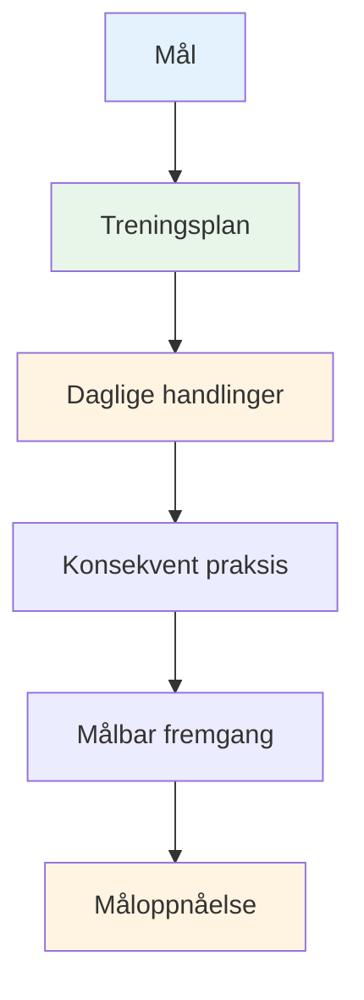

# Lage treningsplanen din

Mål uten en plan er bare ønsker. Denne veiledningen hjelper deg med å gjøre målene dine om til en strukturert treningsplan som faktisk fungerer.

::: tip Den store ideen
**Mål uten en plan er bare ønsker.** En strukturert treningsplan forvandler målene dine til daglige handlinger som resulterer i reell fremgang.
:::

## De 8 fasene av selvstyrt utvikling

### Fase 1: Sett kompasset ditt (mål)
Du har allerede lært om SMART-mål. Nå kan du sette dem i et hierarki:

1. **Langsiktig mål** (1–2 år): Din drøm
2. **Årlig mål**: Årets mål
3. **Kvartalsvise mål**: 3-måneders milepæler
4. **Månedlige mål**: Spesifikke fokusområder
5. **Ukentlige mål**: Treningsmål

### Fase 2: Vurder ressursene dine

Før du planlegger, bør du ærlig vurdere hva du har:

| Ressurs | Spørsmål å stille |
|----------|-----------------|
| **Tid** | Hvor mange timer i uken kan du realistisk sett trene? |
| **Sted** | Har du tilgang til en skikkelig løype? Hvordan er kvaliteten på underlaget? |
| **Utstyr** | Har du passende boule? Måleverktøy? Videofunksjon? |
| **Kunnskap** | Hva er dine tekniske styrker og svakheter? |
| **Fysisk tilstand** | Noen begrensninger? Områder som trenger arbeid? |

Vær ærlig. En realistisk plan slår en ambisiøs fantasi.

### Fase 3: Velg øvelsene dine

Velg øvelser som direkte støtter målene dine:

**For forbedring av poengsetting:**
- Presisjonspekking til markerte soner
- Avstandsvariasjonsøvelser
- Ulike overflateøvelser

**For forbedring av skyting:**
- Skytestige (progressive distanser)
- Hindringsskyting (tvungen høy bue)
- Øving av bevegelige mål

**For mental utvikling:**
- Rutinemessig trening før skudd
- Visualiseringsøkter
- Trykksimulering

**Balanser programmet ditt:**
- Teknisk arbeid (peking, skyting)
- Mental trening (mindfulness, visualisering)
- Fysisk kondisjon (balanse, fleksibilitet)
- Matchspill (bruke ferdigheter)

### Fase 4: Lag timeplanen din

Lag en realistisk ukeplan:

| Dag | Morgen | Ettermiddag | Kveld | Fokus |
|-----|---------|-----------|---------|-------|
| man | - | Teknisk: Peking | Lett mobilitet | Presisjon |
| tirsdag | - | Teknisk: Skyting | - | Kraft/nøyaktighet |
| Ons | - | Mental trening | - | Mindfulness |
| Torsdag | - | Blandet: Spillscenarier | Lett mobilitet | Søknad |
| Fre | - | Teknisk: Svakhet | - | Forbedring |
| Lør | Matchspill eller konkurranse | - | - | Ytelse |
| Sol | Hvile | Ukentlig gjennomgang | Planlegging | Bedring |

**Nøkkelprinsipper:**
- Prioriter mental trening (det blir ofte neglisjert)
- Inkluder hviledager
- Balansere ulike ferdigheter
- La fleksibilitet være der for livet

### Fase 5: Forbered deg på hindringer

Ting vil gå galt. Planlegg for det.

| Fare | Sannsynlighet | Påvirkning | Sikkerhetskopieringsplan |
|------|------------|--------|-------------|
| Tidsmangel | Høy | Medium | Ha en &quot;minimumsøkt&quot; klar (20 min) |
| Dårlig vær | Medium | Medium | Innendørs visualisering, videostudie |
| Lav motivasjon | Høy | Medium | Gå tilbake til «hvorfor», mindre mål, ta en pause |
| Mindre skade | Medium | Høy | Fokus på mental trening, ikke-påvirkede ferdigheter |
| Ingen øvingspartner | Medium | Lav | Soloøvelser, video selvanalyse |

### Fase 6: Spor fremgangen din

Det som blir målt, blir styrt.

**Før treningsdagbok:**
- Dato og varighet
- Øvelser fullført
- Poeng/resultater
- Hvordan du følte deg (energi, fokus, flyt)
- Tekniske notater
- Vær/forhold

**Ukentlige oppsummeringsspørsmål:**
- Fullførte jeg de planlagte øktene mine?
- Hvilke poengsummer oppnådde jeg?
- Hva føltes bra? Hva var vanskelig?
- Noen erfaringer med flyt?
- Hva bør jeg justere?

### Fase 7: Hold deg motivert

Motivasjonen svinger. Bygg systemer for å opprettholde den:

**Indre motivasjon:**
- Koble deg til ditt «hvorfor»
- Feir små seire
- Legg merke til forbedring over tid
- Finn glede i prosessen

**Ekstern støtte:**
- Treningspartnere (selv av og til)
- Del mål med noen
- Bli med i nettsamfunn
- Sporstriper og konsistens

**Når motivasjonen synker:**
- Gjør en minimumsøkt (noe slår ingenting)
- Endre miljøet ditt
- Gjennomgå fremgangen din
- Husk tidligere suksesser
- Ta en planlagt pause om nødvendig

### Fase 8: Gjennomgang og tilpasning

Planen din bør utvikle seg:

**Ukentlig:** Rask gjennomgang, mindre justeringer
**Månedlig:** Vurder fremdriften mot månedlige mål, juster fokus
**Kvartalsvis:** Stor gjennomgang, sett mål for neste kvartal
**Årlig:** Full vurdering, ny årsplan

**Spørsmål til gjennomgang:**
- Gjør jeg fremskritt mot målene mine?
- Er treningen min effektiv?
- Trenger jeg forskjellige øvelser?
- Er målene mine fortsatt relevante?
- Hva har jeg lært?

## Eksempel på 8-ukers plan

**Mål:** Forbedre skytepresisjonen med 15 %

| Uke | Fokus | Viktige økter |
|------|-------|--------------|
| 1 | Grunnlinje | Test strømnivå, videoanalyse |
| 2 | Teknikk | Identifisere og jobbe med hovedproblemet |
| 3 | Gjentakelse | Skyteøvelse med høyt volum |
| 4 | Test | Midtveisvurdering, juster |
| 5 | Variasjon | Ulike avstander og vinkler |
| 6 | Trykk | Legg til konsekvenser for øvelser |
| 7 | Integrering | Spilllignende scenarier |
| 8 | Sluttprøve | Mål forbedring |

## Viktig konklusjon

> Planlegg arbeidet ditt, og utarbeid deretter planen din. Men vær forberedt på å tilpasse deg.

Den beste planen er en du faktisk følger. Start enkelt, vær konsekvent og juster etter hvert som du lærer.

