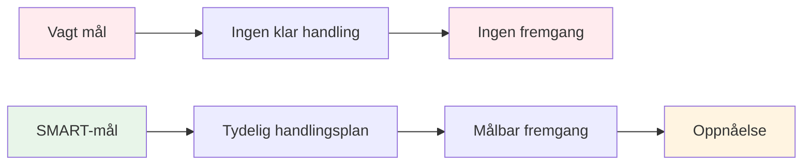

# SMARTE mål for petanque
<AdBanner />

SMART-rammeverket forvandler vage ønsker til handlingsrettede mål. La oss se nærmere på hvert element, med spesifikke eksempler for petanque.

::: tip Den store ideen
**Vage mål fører til vage resultater.** SMARTE mål skaper klarhet, handling og målbar fremgang. Forvandle «Jeg vil bli bedre» til konkrete mål du faktisk kan oppnå.
:::

## S - Spesifikk

Et spesifikt mål svarer på disse spørsmålene:
- **Hva** er det egentlig jeg vil oppnå?
- **Hvor** vil dette skje?
- **Hvilke** aspekter er involvert?

### Å gjøre mål spesifikke

| Vag | Spesiell |
|-------|----------|
| &quot;Forbedre pekeferdighetene mine&quot; | &quot;Forbedre pekepresisjonen min på grusflater på 7–9 meters avstander&quot; |
| &quot;Bli mentalt sterkere&quot; | «Utvikle en konsekvent rutine før kast som jeg bruker for hvert kast» |
| &quot;Vinn flere kamper&quot; | «Vinne minst 60 % av konkurransekampene mine denne sesongen» |

### Spesifisitetssjekkliste
- [ ] Kan noen andre forstå nøyaktig hva jeg prøver å gjøre?
- [ ] Har jeg definert betingelsene (avstand, overflate, situasjon)?
- [ ] Finnes det bare én tolkning av dette målet?

## M - Målbar

Hvis du ikke kan måle det, kan du ikke styre det. Målbare mål lar deg spore fremgang og vite når du har lykkes.

### Måter å måle pétanque-mål på

**Kvantitative målinger:**
- Poeng scoret i øvelser (f.eks. 24/30)
- Prosentvis nøyaktighet (f.eks. 75 % treffrate)
- Avstand fra målet (f.eks. gjennomsnittlig 30 cm fra jekken)
- Konsistens (f.eks. 3 vellykkede økter på rad)

**Bruk av treningsøvelser som målinger:**

| Bore | Hva den måler | Måleksempel |
|-------|-----------------|----------------|
| Skytestige | Skytepresisjon under press | Nå 10 meter innen 30 kuler |
| Pekepresisjon | Pekepresisjon til sone | 24/30 poeng |
| Avstandsvariasjon | Dybdekontroll | 80 % innenfor 50 cm |

### Sporing av målingene dine
Før en enkel logg:
- Dato
- Drill/trening
- Poengsum/resultat
- Forhold (overflate, vær)
- Notater

## A - Oppnåelig (men utfordrende)

Mål bør utfordre deg uten å være umulige.

### Finne riktig nivå

**For lett:** «Øv én gang denne måneden»
- Ingen vekst, ingen motivasjon

<AdInArticle />

**For vanskelig:** «Bott aldri på et skudd»
- Umulig, fører til frustrasjon

**Akkurat passe:** «Forbedre skytepresisjonen med 15 % på 8 uker»
- Utfordrende, men realistisk med innsats

### Spørsmål for å teste oppnåelighet
- Har andre på mitt nivå oppnådd dette?
- Har jeg tiden og ressursene som trengs?
- Er dette innenfor min kontroll (for det meste)?
- Er jeg villig til å gjøre det som kreves?

### Strekkmål
Det er greit å ha ambisiøse langsiktige mål. Bare sørg for at de kortsiktige målene dine er oppnåelige skritt mot dem.

## R - Relevant

Målene dine bør være i samsvar med det større bildet.

### Relevansspørsmål
- Støtter dette målet min generelle utvikling?
- Er dette riktig prioritering akkurat nå?
- Passer dette med min tilgjengelige tid og ressurser?
- Er jeg genuint motivert av dette målet?

### Eksempel: Sjekke relevans

**Situasjon:** Du ønsker å konkurrere på nasjonalt nivå

**Relevante mål:**
- Forbedre skytepresisjonen (påvirker resultatene direkte)
- Utvikle mentale rutiner (hjelper i pressede situasjoner)
- Øk treningsfrekvensen (bygger ferdigheter raskere)

**Mindre relevante mål:**
- Lær trikseslag (moro, men ikke konkurransepreget)
- Kjøp dyre nye bouleballer (utstyr er ikke din begrensende faktor)

## T - Tidsbundet

Frister skaper hastverk og muliggjør planlegging.

### Angi tidsrammer

| Måltype | Typisk tidsramme |
|-----------|------------------|
| Langsiktig | 1–3 år |
| Årlig | 12 måneder |
| Kvartalsvis | 3 måneder |
| Månedlig | 4 uker |
| Ukentlig | 7 dager |
| Økt | Enkeltpraksis |

### Eksempel på tidslinje

**Langsiktig (2 år):** Kvalifiser deg for uttak til landslaget

**Årlig:** Fullfør topp 10 på regionale rangeringer

**Kvartalsvis (Q1):**
- Etabler en fast treningsrutine
- Forbedre skytingen til 70 % nøyaktighet

**Månedlig (januar):**
- Uke 1: Vurder nåværende nivå, sett grunnlinjer
- Uke 2–3: Fokus på skyteteknikk
- Uke 4: Test og mål fremgang

**Ukentlig:**
- Mandag: Teknisk skyteøkt
- Onsdag: Poengsetting og kampsituasjoner
- Fredag: Mental trening og visualisering
- Helg: Konkurranse- eller kamptrening

## Setter alt sammen

### Målsettingsark

**Mitt mål (første utkast):**
_________________________________

**Spesifikt – hva egentlig?**
_________________________________

**Målbar – hvordan vet jeg det?**
_________________________________

**Oppnåelig - Er det realistisk?**
_________________________________

**Relevant – Hvorfor er dette viktig?**
_________________________________

**Tidsbestemt - Når?**
_________________________________

**Mitt SMART-mål (endelig versjon):**
_________________________________

### Eksempel fullført

**Første utkast:** «Bli bedre til å skyte»

**SMART-versjon:** «Innen 30. april skal jeg oppnå en poengsum på 24/30 eller høyere på skytestigeøvelsen (6–10 m med hinder) i tre påfølgende treningsøkter, målt etter treningsloggen min.»

## Viktig konklusjon

> SMARTE mål gjør drømmer til planer og planer til resultater.

Ta deg tid til å sette deg målene dine på riktig måte. Et veldefinert mål er halve reisen.

<AdBanner />
