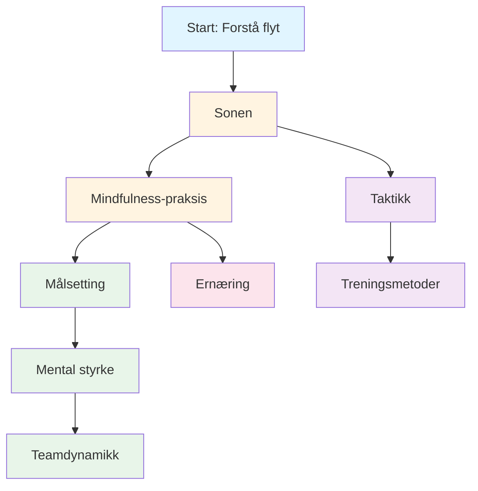

# Utdannelse

Velkommen til Pétanque Academys utdanningsprogram. Det er her elitespillere lærer å mestre det mentale spillet.

::: tip Kjerneprinsipp
På elitenivå blir **mental trening viktigere enn teknisk trening**. Forholdet snus etter hvert som man utvikler seg: nybegynnere trenger 90 % teknisk arbeid, eksperter trenger 80 % mentalt arbeid.
:::

## Hvorfor mental trening er viktig

På elitenivå er tekniske ferdigheter bare utgangspunktet. Forskning viser at mental innstilling kan være like viktig som fysisk ferdighet i presisjonsidretter som petanque. Forskjellen mellom gode spillere og store spillere ligger ofte i tankene deres.

> «Sport er 100 % mentalt. Sinnet er drivkraften bak alle fysiske evner.»

## Din læringsreise

Her er den anbefalte veien gjennom utdanningsprogrammet vårt:

**Anbefalt sekvens:**
1. **Grunnleggende:** Start med Sonen og Mindfulness
2. **Struktur:** Legg til målsetting og treningsmetoder
3. **Konkurranse:** Bygg mental styrke og taktikk
4. **Lagspill:** Mestre lagdynamikk
5. **Optimalisering:** Finjustering med ernæring

## Våre læringsstier

### 🎯 [Sonen (Flow State)](/no/utdanning/sonen/)
Lær hva «sonen» egentlig er og hvordan du får tilgang til den. Forstå vitenskapen bak flyttilstander og oppdag praktiske teknikker for å prestere best mulig når det gjelder som mest.

### 🧘 [Mindfulness](/no/utdanning/mindfulness/)
Mestre kunsten å være til stede. Lær vitenskapelig beviste teknikker for å roe ned sinnet, forbedre fokus og komme deg raskt etter feil.

### 📊 [Målsetting](/no/utdanning/mål/)
Lag en plan for utviklingen din. Lær SMART-rammeverket tilpasset petanque og bygg en treningsplan som faktisk fungerer.

### 💪 [Mental styrke](/no/utdanning/mental-styrke/)
Bygg den mentale styrke som trengs for konkurranser. Lær å håndtere press, overvinne angst og utvikle rutiner som utløser topprestasjoner.

### 🤝 [Lagdynamikk](/no/utdanning/lagspiller/)
Bli lagkameraten alle vil spille med. Lær om kommunikasjon, tillit og hvordan du kan bidra til en vinnende lagkultur.

### ♟️ [Taktikk](/no/utdanning/taktikk/)
Tenk strategisk om enhver situasjon. Lær sannsynlighetsbasert beslutningstaking og når du skal ta risikoer.

### 🏋️ [Opplæringsmetoder](/no/utdanning/opplæring/)
Tren smartere, ikke bare hardere. Lær hvordan du strukturerer treningen din for maksimal forbedring.

### 🥗 [Ernæring](/no/utdanning/ernæring/)
Gi hjernen din drivstoff for presisjonsytelser. Lær hvordan du opprettholder stabil energi og fokus gjennom hele konkurransen.

## Reisen fra teknikk til flyt

Etter hvert som du utvikler deg som spiller, inverteres treningsforholdet ditt – mental trening blir viktigere, ikke mindre:

| Nivå | Forhold (teknologi:mental) | Hovedmål |
|-------|---------------------|-------------------|
| **Nybegynner** | 90 : 10 | Bygg maskinen |
| **Mellemnivå** | 70:30 | Stabiliser ferdigheten |
| **Avansert** | 50:50 | Stol på maskinen |
| **Ekspert** | 20:80 | Frihet til å yte |

Du kan ikke trene en nybegynner som en ekspert (de mangler nevrale baner), og du kan ikke trene en ekspert som en nybegynner (høyt teknisk volum forårsaker overtenking).

## Hurtigreferanse: Viktige prinsipper fra hver seksjon

| Del | Kjerneprinsipp | Viktig konklusjon |
|---------|---------------|--------------|
| **Sonen** | Bytt fra analytisk til automatisk modus | *&quot;Det finnes ingen teknikker som alltid produserer en perfekt kule. Men det finnes en mental tilstand der perfekte kuler blir naturlige.&quot;* |
| **Mindfulness** | Velg hvor du vil rette oppmerksomheten din | *&quot;Mindfulness handler ikke om å tømme sinnet. Det handler om å velge hvor du skal rette oppmerksomheten din.&quot;* |
| **Målsetting** | Fokuser på det du kontrollerer | *&quot;Et mål uten en plan er bare et ønske.&quot;* |
| **Mental styrke** | Prestere bra til tross for nervene | *&quot;Mental styrke handler ikke om å bli kvitt nervene eller aldri gjøre feil. Det handler om å prestere bra til tross for dem.&quot;* |
| **Teamdynamikk** | Tillit og kommunikasjon vinner kamper | *&quot;De beste lagene er ikke alltid de dyktigste – det er de som spiller best sammen.&quot;* |
| **Taktikk** | Beslutningstaking slår teknikk | *&quot;På elitenivå er forskjellen sjelden teknikk – det er beslutningstaking.&quot;* |
| **Opplæring** | Kvalitet fremfor kvantitet | *&quot;Tren smartere, ikke bare hardere.&quot;* |
| **Ernæring** | Stabil energi = stabil ytelse | *&quot;Hjernen din er et presisjonsinstrument. Gi den drivstoff deretter.&quot;* |

## Alle viktige regler og konklusjoner

::: details Klikk for å utvide: Fullstendig liste over prinsipper
Dette er din hurtigreferanseguide. Bokmerk denne delen og kom tilbake til den regelmessig.

### Soneregler
1. **Bytteregelen:** Analyser før sirkelen, utfør i sirkelen, observer etterpå
2. **Inversjonsregelen:** Etter hvert som ferdighetene øker, blir mental trening viktigere enn teknisk trening
3. **Tillitsregelen:** Bevisstheten din planlegger, underbevisstheten din utfører

### Mindfulness-regler
1. **Bevissthetsregelen:** Observer uten å dømme
2. **SOAS-regelen:** Stopp, observer, aksepter, skli (slipp taket)
3. **Nåværende regel:** Du kan bare kontrollere dette øyeblikket, dette kastet

### Regler for målsetting
1. **Kontrollregelen:** Fokuser på prosessmål (hva du kontrollerer) fremfor resultatmål
2. **SMART-regelen:** Mål må være spesifikke, målbare, oppnåelige, relevante og tidsbestemte
3. **Nedbrytningsregelen:** Store mål trenger kvartalsvise, månedlige og ukentlige milepæler

### Regler for mental styrke
1. **Rutineregelen:** Konsekvente rutiner før sprøyting utløser topp ytelse
2. **Tilbakestillingsregelen:** Utvikle en 10-sekunders tilbakestillingsrutine etter feil
3. **Tillitsløkken:** Bedre forberedelse → Mer selvtillit → Bedre ytelse

### Taktiske regler
1. **Sannsynlighetsregelen:** Velg kast der sannsynligheten for suksess rettferdiggjør risikoen
2. **Knektkontrollregelen:** Laget som kontrollerer knektens posisjon har fordelen
3. **Avstandsregelen:** Kort avstand favoriserer skyting, lang avstand favoriserer peking
4. **Stilregelen:** Tving spillet inn i lagets sterkeste stil
5. **Boulehåndteringsregelen:** Noen ganger er det bedre å gi bort 1 poeng enn å risikere 3

### Regler for lagdynamikk
1. **Kommunikasjonsregelen:** Tydelig, positiv kommunikasjon bygger tillit
2. **Støtteregelen:** Hvordan du reagerer på lagkameratenes feil er viktigere enn ferdighetene dine
3. **Rolleregelen:** Kjenn din rolle og utfør den fullt ut

### Treningsregler
1. **Spesifisitetsregelen:** Tren på det du vil forbedre
2. **Variasjonsregelen:** Tilfeldig trening slår blokkert trening ved konkurranseoverføring
3. **Restitusjonsregelen:** Hvile er når tilpasning skjer

### Ernæringsregler
1. **Stabilitetsregelen:** Unngå blodsukkertopper og krasj
2. **Hydreringsregelen:** Selv 2 % dehydrering svekker ytelsen
3. **Tidsregelen:** Spis 2–3 timer før konkurranse
:::

## Start reisen din

::: tip Anbefalt utgangspunkt
Begynn med [Sonen](/no/utdanning/sonen/) for å forstå grunnlaget for eliteprestasjoner, og utforsk deretter [Mindfulness](/no/utdanning/mindfulness/) for praktiske teknikker du kan bruke umiddelbart.
:::
