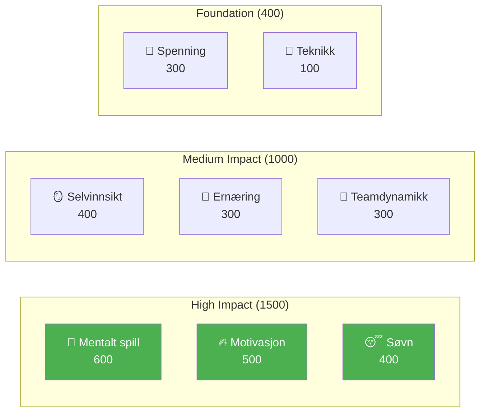

# Utvikling av elitespillere

Velkommen til Pétanque Academys utdanningsprogram – det komplette systemet for spillerutvikling basert på 8 prestasjonsfaktorer.

::: tip Kjerneprinsipp
På elitenivå blir **mental trening viktigere enn teknisk trening**. Legg merke til at teknikk har lavest vekt – ikke fordi det ikke betyr noe, men fordi alle på elitenivå har god teknikk. Det som skiller mellom dem er mentale.
:::

---

## 8-faktor ytelsesmodellen

Læreplanen vår er strukturert rundt 8 nøkkelfaktorer, vektet etter deres innvirkning på eliteprestasjoner:

| Faktor | Vekt | Beskrivelse |
|--------|--------|-------------|
| 🧠 [**Mentalt spill**](/no/utdanning/mentalt-spill/) | **600** | Tankemønstre, fokus, flyttilstander, selvsnakk |
| 🔥 [**Motivasjon**](/no/utdanning/motivasjon/) | **500** | Drivkraft, formål, målorientering, utholdenhet |
| 😴 [**Søvn og restitusjon**](/no/utdanning/søvn/) | **400** | Søvnkvalitet, restitusjon, hvile før konkurranse |
| 🪞 [**Selvinnsikt**](/no/utdanning/selvinnsikt/) | **400** | Nøyaktig selvoppfatning, blindsonegjenkjenning |
| 🥗 [**Ernæring**](/no/utdanning/ernæring/) | **300** | Blodsukkerstabilitet, hydrering, drivstoff til konkurranser |
| 🤝 [**Teamdynamikk**](/no/utdanning/teamdynamikk/) | **300** | Kommunikasjon, tillit, rolleklarhet |
| 💆 [**Spenningsmestring**](/no/utdanning/spenning/) | **300** | Fysisk spenning, avslapning, pustekontroll |
| 🎯 [**Teknikk**](/en/education/technique/) | **100** | Fysisk mekanikk, kasterepertoar |

**Totalt: 2900 poeng**

---

## Hvorfor disse vektene?

Vektene gjenspeiler **påvirkning på elitenivå**:

> «På regionmesterskapet er det teknikk som skiller de 50 beste. På nasjonalmesterskapet har alle i rommet eliteteknikk. Det som skiller dem er alt annet.»

---

## Utforsk hver faktor

### 🧠 Mentalt spill (600 poeng)

**Den mest betydningsfulle faktoren for eliteprestasjoner.**

Din evne til å håndtere tanker, opprettholde fokus og få tilgang til flyttilstander.

- [Sonen](/no/utdanning/mentalt-spill/sonen/) — Forstå og få tilgang til flyttilstander
- [Mental styrke](/no/utdanning/mentalt-spill/mental-styrke/) — Håndtering av press, rutiner før skudd
- [Mindfulness](/no/utdanning/mentalt-spill/mindfulness/) — Fokus i nåtiden, restitusjon fra feil

### 🔥 Motivasjon (500 poeng)

**Hva driver deg til å forbedre deg dag etter dag, år etter år.**

- [Målsetting](/no/utdanning/motivasjon/) — SMART-mål, prosess vs. resultatfokus
- [Motivasjonspsykologi](/no/utdanning/motivasjon/motivasjon) — Intrinsisk vs. ytre, selvbestemmelsesteori
- [Opprettholde motivasjon](/no/utdanning/motivasjon/opprettholde) — Forebygging av utbrenthet, platånavigering

### 😴 Søvn og restitusjon (400 poeng)

**Ofte oversett, men enormt innflytelsesrik.**

Søvnkvalitet påvirker direkte reaksjonstid, beslutningstaking og emosjonell regulering.

- [Søvnvitenskap for idrettsutøvere](/no/utdanning/søvn/) — Hvorfor søvn er viktig for presisjonsidrett
- [Bygge søvnvaner](/no/utdanning/søvn/vaner) — Praktisk søvnhygiene
- [Søvn og konkurranse](/no/utdanning/søvn/konkurranse) — Protokoller før arrangementet, reisehåndtering

### 🪞 Selvinnsikt (400 poeng)

**Du kan ikke forbedre det du ikke kan se.**

Nøyaktig selvoppfatning muliggjør målrettet forbedring.

- [Fordelen med selvinnsikt](/no/utdanning/selvinnsikt/) — Hvorfor selvinnsikt er viktig
- [Få tilbakemeldinger](/no/utdanning/selvinnsikt/tilbakemeldinger) — Eksterne perspektiver
- [Videoanalyse](/no/utdanning/selvbevissthet/video) — Bruk av video for selvoppdagelse

### 🥗 Ernæring (300 poeng)

**Stabil energi = stabil ytelse.**

Hjernen din er et presisjonsinstrument – gi den drivstoff deretter.

- [Drivstoffytelse](/no/utdanning/ernæring/) — Blodsukker, hydrering, konkurranseernæring

### 🤝 Teamdynamikk (300 poeng)

**De beste lagene er ikke alltid de dyktigste.**

Kommunikasjon og tillit veier ofte tyngre enn individuelt talent.

- [Å være en god lagkamerat](/no/utdanning/lagdynamikk/) — Lagkultur og støtte
- [Teamkommunikasjon](/no/utdanning/teamdynamikk/kommunikasjon) — Tydelig, positiv kommunikasjon

### 💆 Spenningshåndtering (300 poeng)

**Spenning er presisjonens fiende.**

Du kan ikke være både anspent og nøyaktig.

- [Forstå spenning](/no/utdanning/spenning/) — Fysisk vs. mental spenning
- [Utløsningsteknikker](/no/utdanning/spenning/teknikker) — PMR, pust, raske tilbakestillinger
- [Konkurransehåndtering](/no/utdanning/spenning/konkurranse) — Protokoller før og under kamp

### 🎯 Teknikk (100 poeng)

**Grunnlaget – nødvendig, men ikke tilstrekkelig.**

På elitenivå er teknikk en selvfølge. Fordelene ligger over.

- [Teknikkoversikt](/no/utdanning/teknikk/) — Fysisk mekanikk
- [Opplæringsmetoder](/no/utdanning/teknikk/opplæring/) — Bevisst praksis
- [Taktikk](/no/utdanning/teknikk/taktikk/) — Strategisk beslutningstaking

---

## Utviklingsreisen

Etter hvert som du utvikler deg som spiller, inverteres treningsforholdet ditt:

| Nivå | Forhold (teknologi:mental) | Fokus |
|-------|---------------------|-------|
| **Nybegynner** | 90 : 10 | Bygg maskinen |
| **Mellemnivå** | 70:30 | Stabiliser ferdigheten |
| **Avansert** | 50:50 | Stol på maskinen |
| **Ekspert** | 20:80 | Frihet til å yte |

Du kan ikke trene en nybegynner som en ekspert (de mangler nevrale baner), og du kan ikke trene en ekspert som en nybegynner (høyt teknisk volum forårsaker overtenking).

---

## Hurtigreferanse: Kjerneprinsipper

::: details Klikk for å utvide: Fullstendig liste over prinsipper

### Mentale spillregler
1. **Bytteregelen:** Analyser før sirkelen, utfør i sirkelen, observer etterpå
2. **Tillitsregelen:** Bevisstheten din planlegger, underbevisstheten din utfører
3. **Nåværende regel:** Du kan bare kontrollere dette øyeblikket, dette kastet

### Motivasjonsregler
1. **Kontrollregelen:** Fokuser på prosessmål fremfor resultatmål
2. **SMART-regelen:** Mål må være spesifikke, målbare, oppnåelige, relevante og tidsbestemte
3. **Den indre regelen:** Indre motivasjon varer lenger enn ytre belønninger

### Søvnregler
1. **Konsistensregelen:** Samme oppvåkningstid hver dag, selv i helgene
2. **Bufferregelen:** Ro ned rutinen 60+ minutter før leggetid
3. **Konkurranseregelen:** Ekstra søvn uken før, ikke bare kvelden før

### Regler for selvinnsikt
1. **Tilbakemeldingsregelen:** Søk aktivt eksterne perspektiver
2. **Videoregelen:** Det du føler ≠ det som er ekte – ta opp og gjennomgå det
3. **Blindsoneregelen:** Lav selvinnsikt påvirker alle andre vurderinger

### Ernæringsregler
1. **Stabilitetsregelen:** Unngå blodsukkertopper og krasj
2. **Hydreringsregelen:** Selv 2 % dehydrering svekker ytelsen
3. **Tidsregelen:** Spis 2–3 timer før konkurranse

### Regler for lagdynamikk
1. **Kommunikasjonsregelen:** Tydelig, positiv kommunikasjon bygger tillit
2. **Støtteregelen:** Hvordan du reagerer på feil er viktigere enn ferdigheter
3. **Rolleregelen:** Kjenn din rolle og utfør den fullt ut

### Spenningsregler
1. **Utløsningsregelen:** Du kan ikke være både anspent og presis
2. **Yerkes-Dodson-regelen:** Finn din optimale opphisselsessone
3. **Tilbakestillingsregelen:** 10 sekunders tilbakestilling før hvert kast

### Teknikkregler
1. **Spesifisitetsregelen:** Tren på det du vil forbedre
2. **Variasjonsregelen:** Tilfeldig øvelse slår blokkert øvelse
3. **Restitusjonsregelen:** Hvile er når tilpasning skjer
:::

---

## Start reisen din

::: tip Anbefalt utgangspunkt
Begynn med [Mental Game](/no/education/mental-game/) for å forstå grunnlaget for eliteprestasjoner. Utforsk deretter [Søvn](/no/education/sleep/) – det er ofte den forbedringen med høyest avkastning for utviklende spillere.
:::

