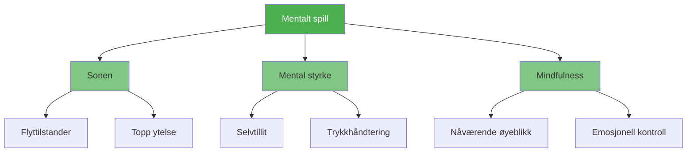

# Mentalt spill

::: tip Den viktigste faktoren
**Vekt: 600 poeng** — Det mentale spillet har størst innvirkning på prestasjonene dine. Mestre hjernen din, så følger alt annet.
:::

Det mentale spillet omfatter alt som skjer mellom ørene dine: tankene dine, fokuset ditt, selvtilliten din og selvsnakken din. Elitespillere har ikke bare bedre teknikk – de har bedre kontroll over sin mentale tilstand.

## De tre søylene

### 🎯 [Sonen](/no/utdanning/mentalt spill/sonen/)
Få tilgang til flyttilstanden der ytelsen føles uanstrengt. Lær hva som utløser flyt og hvordan du kommer inn i den konsekvent.

- [Introduksjon til Sonen](/no/utdanning/mentalt spill/sonen/)
- [Teknisk vs. flyttrening](/no/utdanning/mentalt-spill/sonen/teknisk-vs. flyt)
- [Å gå inn i sonen](/no/utdanning/mentalt spill/sonen/å gå inn i sonen)

### 💪 [Mental styrke](/no/utdanning/mentalt-spill/mental-styrke/)
Bygg den psykologiske motstandskraften til å prestere under press. Utvikle selvtillit, håndtere tilbakeslag og behold roen.

- [Bygge mental styrke](/no/utdanning/mentalt-spill/mental-styrke/)
- [Håndtering av press](/no/utdanning/mentalt-spill/mental-styrke/håndtering-av-press)
- [Rutine før skudd](/no/utdanning/mentalt-spill/mental-styrke/rutine-før-skudd)

### 🧘 [Mindfulness](/no/utdanning/mentalt-spill/mindfulness/)
Utvikle bevissthet om nåtiden for å holde fokus og komme seg raskt etter feil.

- [Introduksjon til mindfulness](/no/utdanning/mentalt spill/mindfulness/)
- [Mindfulness-teknikker](/no/utdanning/mentalt spill/mindfulness/teknikker)
- [Daglig praksis](/no/utdanning/mentalt spill/mindfulness/daglig-praksis)

## Hvorfor mentalt spill er viktigst

| Aspekt | Teknisk opplæring | Mental trening |
|--------|-------------------|-----------------|
| **I praksis** | Du kan ta skuddet | Du kan ta skuddet |
| **I konkurranse** | Teknikken kan svikte under press | Mentale ferdigheter opprettholder ytelsen |
| **Forskjellen** | Fysisk ferdighet er nødvendig | Mental ferdighet er multiplikatoren |

::: warning Den vanlige feilen
De fleste spillere bruker 90 % av tiden sin på teknikk og 10 % på mentale ferdigheter. Elitespillere snur ofte dette forholdet når de har solide grunnleggende ferdigheter.
:::

## Hvor skal man begynne?

**Nybegynner med mental trening?** Start med [The Zone](/no/education/mental-game/the-zone/) for å forstå hvordan topprestasjoner føles.

**Sliter du under press?** Gå til [Mental styrke](/no/utdanning/mental-spill/mental-styrke/) for praktiske teknikker.

**Tanker du vandrer i under kamper?** [Mindfulness](/no/education/mental-game/mindfulness/) vil hjelpe deg å holde deg til stede.

## Relaterte ressurser

- [Selvinnsikt](/no/utdanning/selvinnsikt/) — Bli kjent med deg selv for å forbedre deg raskere
- [Spenningsmestring](/no/utdanning/spenning/) — Fysisk avslapning gir mental klarhet
- [Vurderingsverktøy](/no/utdanning/) — Evaluer ditt mentale spill og få personlige anbefalinger

