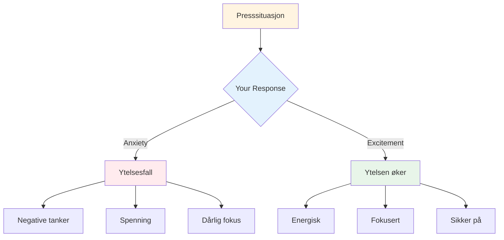

# Håndtering av trykk

Press er en del av konkurranse. Målet er ikke å eliminere det – det er umulig. Målet er å prestere bra til tross for det, og til og med bruke det til din fordel.

::: tip Den store ideen
**Press forsvinner ikke med erfaring – du blir bare bedre til å prestere med det.** De beste spillerne er ikke rolige; de er dyktige til å bruke opphisselsen sin produktivt.
:::

## Forstå press

### Hva skaper press?
- Høye innsatser (viktig kamp, avgjørende kast)
- Å bli sett på (publikum, lagkamerater)
- Forventninger (dine og andres)
- Usikkerhet (tynn stilling, ukjente motstandere)
- Tid (renner ut, venter for lenge)

### Hva press gjør med kroppen din
Når du føler press, reagerer kroppen din:
- Hjertefrekvensen øker
- Pusten blir overfladisk
- Musklene er spente
- Hendene kan skjelve
- Fokuset blir smalere (noen ganger for mye)

Dette er kroppen din som forbereder seg på handling. Det er ikke dårlig – det er energi du kan bruke.

## Omformingstrykk

### Press som spenning

De fysiske følelsene av angst og spenning er nesten identiske. Forskjellen ligger i hvordan du tolker dem.

**Angsttolkning:** «Jeg er nervøs, noe vondt kan skje»
**Spenningstolkning:** «Jeg har full energi, dette er viktig for meg»

**Prøv dette:** Når du føler deg presset, si til deg selv: «Jeg er spent» i stedet for «Jeg er nervøs».

### Press som privilegium

Bare viktige øyeblikk skaper press. Hvis du føler det, er du i en situasjon som betyr noe.

> «Press er et privilegium – det kommer bare til de som fortjener det.» – Billie Jean King

## Teknikker for høytrykksmomenter

### 1. Pustekontroll

Pusten din er den raskeste måten å endre tilstanden din på.

**4-7-8-teknikken:**
1. Pust inn i 4 tellinger
2. Hold i 7 tellinger
3. Pust ut i 8 tellinger
4. Gjenta 2–3 ganger

**Hurtig tilbakestilling (i sirkelen):**
- Ett sakte, dypt åndedrag
- Føl føttene dine på bakken
- Senk skuldrene på utpusten

### 2. Fysisk jording

Koble deg til fysiske sanseinntrykk for å komme deg ut av hodet:
- Føl vekten av kulen
- Legg merke til føttene dine på bakken
- Klem og slipp hånden du ikke kaster
- Rull skuldrene bakover

### 3. Fokusinnsnevring

I pressede øyeblikk, fokuser bare på det som betyr noe:
- Ikke poengsummen
- Ikke publikum
- Ikke hva som kan skje
- Bare dette kastet, dette målet, dette øyeblikket

**Ledeord:** «Her. Nå. Dette.»

### 4. Prosessfokus

Skift fra resultat til prosess:

**Resultatfokus (skaper press):**
- &quot;Jeg må lage dette&quot;
- &quot;Hvis jeg bommer, taper vi&quot;
- «Alle ser på»

**Prosessfokus (reduserer press):**
- &quot;Følg rutinen min&quot;
- &quot;Se målet&quot;
- &quot;Stol på treningen min&quot;

### 5. Venstrehåndsklemmen

For høyrehendte spillere, klem venstre hånd i 10–15 sekunder:
- Aktiverer høyre hjernehalvdel
- Stiller ned analytisk overtenking
- Hjelper med å få tilgang til automatisk utførelse

Bruk dette når du merker at du tenker for mye.

## Forberedelse til press

### Simuler trykk i praksis

Du takler ikke konkurransepress hvis du aldri opplever det på trening.

**Måter å skape treningspress på:**
- Sett konsekvenser (armhevinger for bommer, kjøp kaffe til partneren)
- Lag «må-gjøre»-scenarier
- Øv med et publikum
- Tidspress (skuddklokke)
- Tretthet (øv når du er sliten)

### Visualisering

Øv mentalt på situasjoner med høyt press:
1. Lukk øynene
2. Tenk deg et trykkscenario i detalj
3. Føl trykket
4. Se for deg at du håndterer det bra
5. Utfør vellykket i tankene dine

Gjør dette regelmessig, ikke bare før konkurranser.

### Bygg en trykkhistorikk

Hold oversikt over ganger du har håndtert press godt:
- Hva var situasjonen?
- Hvordan følte du deg?
- Hva gjorde du?
- Hva ble resultatet?

Gå gjennom dette før konkurranser for å minne deg selv på: «Jeg har gjort dette før.»

## Under konkurransen

### Før trykkkastet
1. Ta et skritt tilbake, ta et pust
2. Minn deg selv på rutinen din
3. Fokuser på prosess, ikke resultat
4. Bruk triggerordet eller ledetråden din

### I sirkelen
1. Fullfør rutinen din nøyaktig slik den er praktisert
2. Fokuser eksternt (målet, ikke kroppen)
3. Stol på treningen din
4. Slipp uten å nøle

### Etter kastet
- Aksepter resultatet uten å dømme
- Hvis bra: kort takknemlighet, gå videre
- Hvis dårlig: SOAS-metode, tilbakestill for neste kast

## Vanlige trykkfeil

| Feil | Bedre tilnærming |
|---------|----------------|
| Rushing | Ro ned farten, bruk full rutine |
| Overtenking | Eksternt fokus, tillitstrening |
| Endring av teknikk | Hold deg til det du vet |
| Fokus på resultat | Fokus på prosess |
| Bekjemper nervene | Aksepter og bruk energien |

## Viktig konklusjon

> Presset forsvinner ikke med erfaring. Du blir bare bedre til å prestere med det.

De beste spillerne er ikke rolige – de er dyktige til å bruke opphisselsen sin produktivt.

