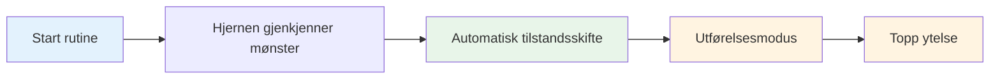

# Bygg din rutine før inntak

Rutinen din før skuddet er et av de kraftigste verktøyene i ditt mentale spill. Det er en konsekvent sekvens av handlinger som forbereder deg på hvert kast og utløser din beste prestasjonstilstand.

::: tip Den store ideen
**Rutinen din er inngangsporten til sonen.** En konsekvent rutine før treningen signaliserer til hjernen din: «Det er på tide å utføre.» Med repetisjon blir det en automatisk trigger for topp ytelse.
:::

## Hvorfor rutiner fungerer

### Konsistens skaper tillit
Når du gjør det samme hver gang, fjerner du variabler. Kroppen din vet hva som kommer. Dette skaper en følelse av kontroll og fortrolighet, selv i ukjente situasjoner.

### Rutiners utløsertilstander
Med repetisjon blir rutinen din knyttet til prestasjonstilstanden din. Når du starter rutinen, starter det mentale skiftet til utførelsesmodus automatisk.

### Rutiner blokkerer distraksjoner
En rutine gir tankene dine noe å fokusere på. Det er ikke rom for bekymring for musikken, publikum eller hva som kan skje.

### Rutiner håndterer opphisselse
En godt utformet rutine bidrar til å regulere energinivået ditt – den roer deg ned hvis du er for opptatt, og fokuserer deg hvis du er flat.

## Elementer i en effektiv rutine

### Fase 1: Vurdering (utenfor sirkelen)

Før du går inn, samle informasjon:
- Les terrenget (bakker, hindringer, underlag)
- Vurder situasjonen (score, kuleposisjoner)
- Velg mål og landingssted
- Bestem deg for kasttype (pek, skyt, lobb, rull)

**Det er her tenkningen skjer.** Ta deg god tid her.

### Fase 2: Overgang (inntreden i sirkelen)

Overgangen fra å tenke til å gjøre:
- Fysisk handling (gå inn i sirkelen på en konsekvent måte)
- Mentalt signal (et ord eller uttrykk som signaliserer &quot;utførelsesmodus&quot;)
- Pust (ett bevisst åndedrag for å sentrere deg)

**Dette er bryteren.** Analysen stopper her.

### Fase 3: Oppsett (i sirkelen)

Forbered kroppen din:
- Konsekvent holdning (samme hver gang)
- Grepstest (føl på kulen)
- Måljustering
- Fysisk trigger (en liten bevegelse som er din)

### Fase 4: Visualisering (kortfattet)

Se kastet før du gjør det:
- Se for deg ballens bane (maks. 2–3 sekunder)
- Føl det vellykkede kastet
- Få visuel kontakt med målet ditt

### Fase 5: Utførelse

Gjør kastet:
- Eksternt fokus (kun mål)
- Stol på kroppen din
- Slipp uten å nøle
- Følg opp naturlig

## Bygge din personlige rutine

### Trinn 1: Observer hva du allerede gjør

Du har sannsynligvis allerede en viss rutine. Merk:
- Hva gjør du før gode kast?
- Hva føles naturlig for deg?
- Hva hjelper deg å fokusere?

### Trinn 2: Design rutinen din

Lag en sekvens som inkluderer:
- [ ] Vurderingsfase
- [ ] Klart overgangsøyeblikk
- [ ] Konsekvent fysisk oppsett
- [ ] Kort visualisering
- [ ] Utførelsesutløser

### Trinn 3: Skriv det ned

Vær spesifikk. Eksempel:

1. **Vurder:** Les terrenget, velg landingssted
2. **Overgang:** Gå inn i sirkelen med venstre fot først, si «tillit»
3. **Oppsett:** Føtter i skulderbredde, grepssjekk, juster skuldrene
4. **Visualiser:** Se stien, føl utløsningen
5. **Utfør:** Blikket festet på målet, kast

### Trinn 4: Øv deg religiøst

Bruk rutinen din på HVERT kast på trening:
- Enkle kast
- Vanskelige kast
- Når du er sliten
- Når du er fersk

Rutinen må bli automatisk.

### Trinn 5: Avgrens over tid

Rutinen din vil utvikle seg. Legg merke til hva som fungerer og juster. Men ikke endre den under konkurranser – bare mellom øvelsene.

## Rutinemessig timing

Rutinen din bør ta en jevn mengde tid:
- For fort: Du har det forhastet, ikke ordentlig forberedt
- For treg: Du tenker for mye og mister flyten
- Akkurat passe: Nok tid til å forberede seg, ikke så mye at du tenker for mye

**Typisk tidspunkt:**
- Vurdering: 5–10 sekunder
- Overgang + Oppsett: 3–5 sekunder
- Visualisering + Utførelse: 3–5 sekunder
- **Totalt: 10–20 sekunder**

## Vanlige rutinefeil

| Feil | Problem | Løsning |
|---------|---------|----------|
| Hopping i øvelse | Rutiner er ikke automatiske | Bruk den hvert eneste kast |
| For komplisert | Vanskelig å huske under press | Forenkle til det essensielle |
| Tenkning under utførelse | Forstyrrer automatisk ytelse | Tydelig overgangspunkt |
| Inkonsekvent timing | Skaper usikkerhet | Øv med jevnt tempo |
| Endring midt i konkurransen | Introduserer tvil | Hold deg til det du vet |

## Rutinemessig feilsøking

**Hvis du har det travelt:**
- Legg til et pust i overgangen
- Senk oppsettbevegelsene dine
- Pause før visualisering

**Hvis du tenker for mye:**
- Forkort rutinen
- Bruk en sterkere overgangssignal
- Fokuser mer eksternt

**Hvis du er inkonsekvent:**
- Video deg selv for å sjekke
- Øv på rutinen uten å kaste
- Få tilbakemeldinger fra en partner

## Eksempelrutiner

### Enkel rutine
1. Velg mål
2. Gå inn, pust
3. Grip, juster
4. Se det, kast det

### Detaljert rutine
1. Les terrenget, velg landingssted
2. Gå inn venstre fot først
3. Si «glatt» internt
4. Ett åndedrag, skuldrene senkes
5. Føttene satt, grepssjekk
6. Juster skuldrene i forhold til målet
7. Se stien (2 sekunder)
8. Øynene festes på målet
9. Kaste

## Viktig konklusjon

> Rutinen din er ankeret ditt. I kaos er den din konstant.

Bygg det forsiktig. Øv alltid på det. Stol fullt og helt på det.

