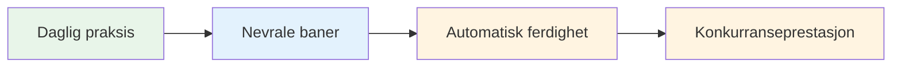
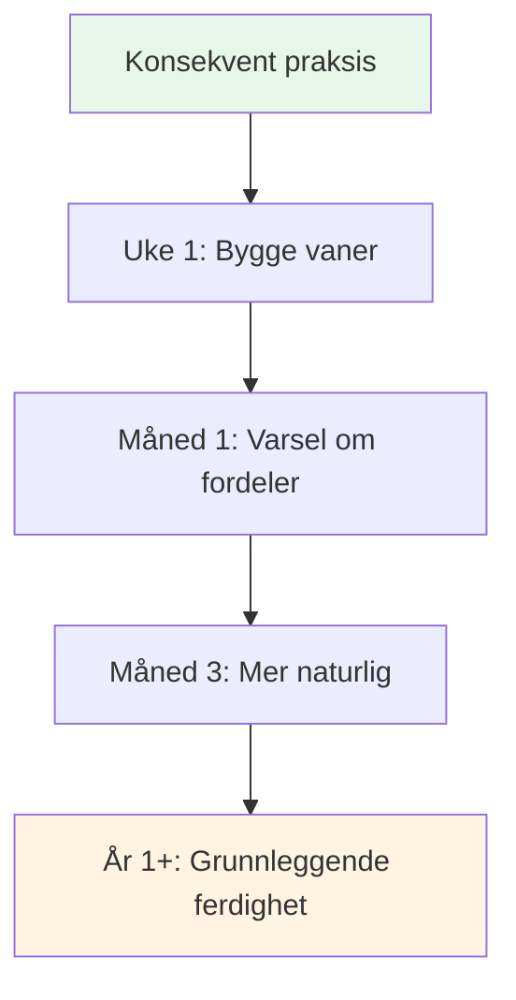

# Å bygge en daglig mindfulness-praksis

Fordelene med mindfulness kommer fra regelmessig praksis. Slik gjør du det til en del av livet ditt.

::: tip Den store ideen
**Konsistens er bedre enn intensitet.** Fem minutter hver dag er bedre enn en time én gang i uken. Start i det små, vær konsekvent, og fordelene øker over tid.
:::

## Hvorfor daglig praksis er viktig

::: info Mindfulness er som fysisk form
- ❌ Du kan ikke bli i form fra én treningsøkt
- ✅ Regelmessig trening gir varig endring
- ✅ Effektene forsterkes over tid
- ✅ Det blir enklere med konsistens
:::

::: tip Forskningsstøttet
Forskning viser at selv **3 minutter daglig** gir målbare fordeler. Men du må gjøre det regelmessig.
:::

## Lage rutinen din

### Trinn 1: Velg din tid

Velg et fast tidspunkt som passer for livet ditt:

| Tid | Fordeler | Hensyn |
|------|------------|----------------|
| **Morgen** | Setter tonen for dagen, færre avbrudd | Trenger å våkne tidligere |
| **Middag** | Bryter opp dagen, tilbakestiller fokuset | Kan glemme, planlegge konflikter |
| **Kveld** | Slapp av, reflekter over dagen | Kan være sliten, mindre våken |
| **Før trening** | Direkte tilkobling til petanque | Avhenger av treningsplanen |

**Beste tilnærming:** Koble det til en eksisterende vane (etter kaffe, før lunsj osv.)

### Trinn 2: Start i det små

Ikke sikt på 30 minutter på dag én.

**Anbefalt progresjon:**
- Uke 1–2: 3–5 minutter
- Uke 3–4: 5–10 minutter
- Måned 2: 10–15 minutter
- Måned 3+: 15–20 minutter

Det er bedre å gjøre det 5 minutter hver dag enn 30 minutter én gang i uken.

### Trinn 3: Lag ditt rom

Du trenger ikke et meditasjonsrom, men det hjelper å ha et fast sted:
- Et stille sted (eller bruk hodetelefoner)
- Komfortable sitteplasser
- Minimale distraksjoner
- Samme sted hver gang hvis mulig

### Trinn 4: Fjern barrierer

Gjør det enkelt å øve:
- Sett telefonen på lydløs
- Si til familie/huskamerater at de ikke må avbryte
- Ha alt klart (pute, timer)
- Ikke vent på «perfekte» forhold

## Eksempel på daglige timeplaner

### Minimal øvelse (5 minutter)
- Morgen: 3 minutter bevisst pusting
- Gjennom dagen: 3 mindfulness-klokkeøyeblikk
- Kveld: 2 minutter kroppsbevissthet før sengetid

### Standardøvelse (15 minutter)
- Morgen: 10 minutters sittende meditasjon
- Middag: 2 minutter bevisst pusting
- Kveld: 3 minutters kroppsskanning

### Intensiv praksis (30 minutter)
- Morgen: 15 minutters sittende meditasjon
- Middag: 5 minutters gange meditasjon
- Kveld: 10 minutters kroppsskanning
- Pluss: Mindful spising ved ett måltid

## Integrering med petanque-trening

### Før øvelse
- 5 minutters sittende meditasjon
- Sett en intensjon for økten
- Kroppsskanning for å avdekke eventuelle spenninger

### Under øvelsen
- Bruk preshot-rutinen som mindfulness-øvelse
- Bruk SOAS etter feil
- Vær til stede mellom kastene

### Etter trening
- 3 minutters refleksjon (uten dom)
- Merk eventuelle flytmomenter
- Bevisst pusting for å gå ut

## Sporing av praksisen din

Å holde oversikt bidrar til å opprettholde konsistens:

### Enkel logg
| Dato | Varighet | Type | Notater |
|------|----------|------|-------|
| man | 10 minutter | Sittende | Sinn veldig opptatt |
| tirsdag | 10 minutter | Sittende | Roligere i dag |
| Ons | 5 minutter | Kroppsskanning | Fant spenninger i skuldrene |

### Hva du skal spore
- Har du øvd? (Ja/Nei)
- Hvor lenge?
- Hvilken type?
- Kort om erfaring (valgfritt)

### Apper som hjelper
- Hoderommet
- Rolig
- Innsiktstimer
- Enkle vanesporere

## Overvinne vanlige hindringer

### &quot;Jeg har ikke tid&quot;
- Du har 3 minutter
- Det handler om prioritering, ikke tid
- Prøv å lenke til eksisterende aktiviteter

### &quot;Jeg glemmer stadig&quot;
- Still inn en daglig alarm
- Kobling til eksisterende vane
- Sett opp en visuell påminnelse et sted der du vil se den

### &quot;Jeg gjør det ikke riktig&quot;
- Det finnes ingen «riktig» måte
- Hvis du følger med, så gjør du det
- Vandrende sinn er normalt og forventet

### «Jeg ser ingen resultater»
- Fordelene er subtile i starten
- Før en journal for å legge merke til endringer over tid
- Stol på forskningen – den fungerer

### &quot;Det er kjedelig&quot;
- Kjedsomhet er bare enda en opplevelse å observere
- Prøv forskjellige teknikker
- Husk hvorfor du gjør det

## Tegn på fremgang

Du merker kanskje ikke dramatiske endringer, men se etter:
- Å fange deg selv når tankene vandrer (raskere)
- Å komme seg raskere etter frustrasjon
- Legg merke til spenning før den bygger seg opp
- Føler meg mer til stede under kamper
- Bedre søvn
- Mindre reaktiv på dårlige kast

## Det lange spillet

Mindfulness er en livslang praksis. Eliteidrettsutøvere sier ofte at det er den mest verdifulle ferdigheten de har utviklet.

**Måned 1:** Bygge vanen
**Måned 2–3:** Begynner å merke fordeler
**Måned 4–6:** Bli mer naturlig
**1. trinn+:** En grunnleggende del av hvem du er

## Viktig konklusjon

> Konsistens er bedre enn intensitet. Fem minutter hver dag er bedre enn en time én gang i uken.

Start i dag. Begynn i det små. Fortsett.

