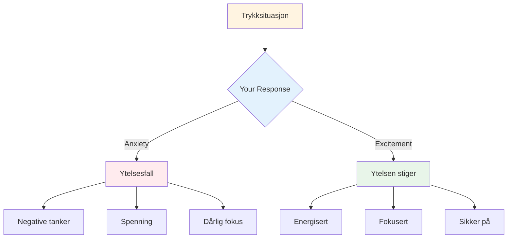

# Håndtering av trykk
<AdBanner />

Press er en del av konkurransen. Målet er ikke å eliminere det - det er umulig. Målet er å prestere bra til tross for det, og til og med bruke det til din fordel.

::: tips The Big Idea
**Press forsvinner ikke med erfaring - du blir bare bedre til å prestere med det.** De beste spillerne er ikke rolige; de er dyktige til å bruke sin opphisselse produktivt.
:::

## Forstå press

### Hva skaper press?
- Høye innsatser (viktig spill, avgjørende kast)
- Blir overvåket (publikum, lagkamerater)
- Forventninger (dine og andres)
- Usikkerhet (nær poengsum, ukjente motstandere)
- Tid (renner ut, venter for lenge)

### Hva press gjør med kroppen din
Når du føler press, reagerer kroppen din:
- Hjertefrekvensen øker
- Pusten blir grunt
- Musklene er spente
- Hendene kan riste
- Fokus blir smalere (noen ganger for mye)

Dette er kroppen din som forbereder seg på handling. Det er ikke dårlig – det er energi du kan bruke.

## Reframing Press

### Press som spenning

De fysiske følelsene av angst og spenning er nesten identiske. Forskjellen er hvordan du tolker dem.

**Angsttolkning:** "Jeg er nervøs, noe ille kan skje"
**Spenningstolkning:** "Jeg er energisk, dette er viktig for meg"

**Prøv dette:** Når du føler press, si til deg selv: "Jeg er spent" i stedet for "Jeg er nervøs."

### Press som privilegium

Kun viktige øyeblikk skaper press. Hvis du føler det, er du i en situasjon som betyr noe.

> "Press er et privilegium - det kommer bare til de som tjener det." - Billie Jean King

## Teknikker for høytrykksmomenter

### 1. Pustekontroll

Pusten din er den raskeste måten å endre tilstanden din på.

**4-7-8-teknikken:**
1. Pust inn i 4 tellinger
2. Hold i 7 tellinger
3. Pust ut i 8 tellinger
4. Gjenta 2-3 ganger

**Rask tilbakestilling (i sirkelen):**
- En sakte, dyp pust
- Kjenn føttene dine på bakken
- Slipp skuldrene på pusten

<AdInArticle />

### 2. Fysisk jording

Koble til fysiske sensasjoner for å komme ut av hodet ditt:
- Kjenn vekten av boulen
- Legg merke til føttene dine på bakken
- Klem og slipp hånden din som ikke kaster
- Rull skuldrene tilbake

### 3. Fokus Innsnevring

I pressede øyeblikk, fokuser kun på det som betyr noe:
- Ikke poengsummen
- Ikke publikum
- Ikke hva som kan skje
- Bare dette kastet, dette målet, dette øyeblikket

**Stikkord:** "Her. Nå. Dette."

### 4. Prosessfokus

Skift fra resultat til prosess:

**Resultatfokus (skaper press):**
- "Jeg må lage dette"
- "Hvis jeg bommer, taper vi"
- "Alle ser på"

**Prosessfokus (reduserer trykket):**
- "Følg rutinen min"
- "Se målet"
- "Stol på treningen min"

### 5. Venstrehåndsklem

For høyrehendte spillere, klem venstre hånd i 10-15 sekunder:
- Aktiverer høyre hjernehalvdel
- Stiller analytisk overtenking
- Hjelper med å få tilgang til automatisk utførelse

Bruk dette når du merker at du overtenker.

## Forbereder seg på press

### Simuler trykk i praksis

Du takler ikke konkurransepress hvis du aldri opplever det på trening.

**Måter å skape treningspress på:**
- Sette konsekvenser (armhevinger for glipp, kjøp kaffe til partner)
- Lag "må-make"-scenarier
- Øv med et publikum
- Tidspress (skuddklokke)
- Tretthet (trene når du er trøtt)

### Visualisering

Mentalt øve på høytrykkssituasjoner:
1. Lukk øynene
2. Se for deg et trykkscenario i detalj
3. Kjenn på trykkfølelsene
4. Se deg selv håndtere det godt
5. Utfør vellykket i tankene dine

Gjør dette regelmessig, ikke bare før konkurranser.

### Bygg en trykkhistorie

Hold styr på ganger du har taklet press godt:
- Hva var situasjonen?
- Hvordan følte du deg?
- Hva gjorde du?
- Hva ble resultatet?

Se gjennom dette før konkurranser for å minne deg selv på: "Jeg har gjort dette før."

## Under konkurranse

### Før trykkkastet
1. Gå tilbake, ta en pust
2. Minn deg selv på rutinen din
3. Fokuser på prosess, ikke resultat
4. Bruk triggerordet eller stikkordet ditt

### I sirkelen
1. Fullfør rutinen akkurat som du har øvd på
2. Fokuser eksternt (mål, ikke kropp)
3. Stol på treningen din
4. Slipp uten å nøle

### Etter kastet
- Godta resultatet uten å dømme
- Hvis det er bra: kort bekreftelse, gå videre
- Hvis dårlig: SOAS-metoden, tilbakestill for neste kast

## Vanlige trykkfeil

|  | Feil | Bedre tilnærming |  |
|--------|----------------|
|  | rushing | Senk farten, bruk full rutine |  |
|  | Overtenking | Ytre fokus, tillitstrening |  |
|  | Endre teknikk | Hold deg til det du vet |  |
|  | Fokus på resultat | Fokus på prosessen |  |
|  | Kampnerver | Aksepter og bruk energien |  |

## Key Takeaway

> Presset forsvinner ikke med erfaring. Du blir bare bedre til å prestere med det.

De beste spillerne er ikke rolige – de er dyktige til å bruke sin opphisselse produktivt.

<AdBanner />
