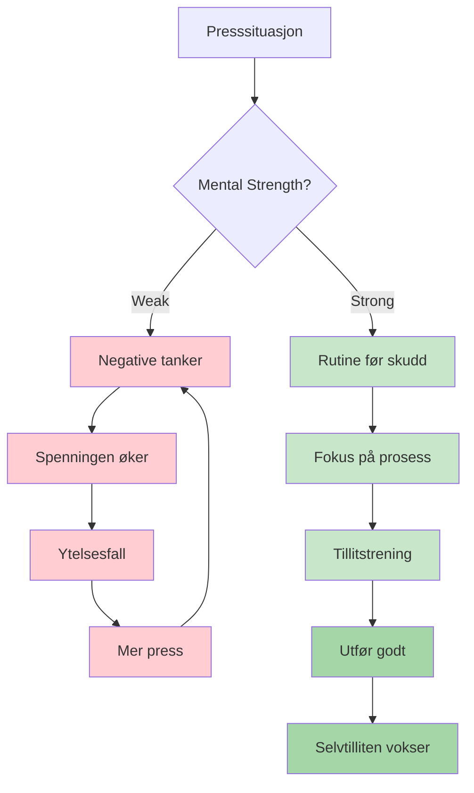
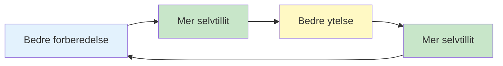

# Mental styrke

Mental styrke er det som skiller spillere som presterer bra på trening fra de som presterer bra når det gjelder. Det er evnen til å håndtere press, komme seg etter tilbakeslag og opprettholde fokus gjennom lange konkurranser.

::: tip Kjerneprinsippet
**Mental styrke handler ikke om å bli kvitt nervene eller aldri gjøre feil. Det handler om å prestere bra til tross for dem.** Du kan ikke kontrollere hva som skjer. Du kan kontrollere hvordan du reagerer.
:::

## Hva er mental styrke?

Mental styrke inkluderer:
- **Selvtillit:** Å tro på dine evner
- **Fokus:** Å holde fokus på det som betyr noe
- **Motstandskraft:** Å komme seg etter feil
- **Ro:** Å holde seg rolig under press
- **Motivasjon:** Opprettholde innsatsen over tid

Dette er ikke faste egenskaper – det er ferdigheter du kan utvikle.

## De mentale kravene til petanque

Petanque har unike mentale utfordringer:

| Utfordring | Hvorfor det er vanskelig |
|-----------|--------------|
| Tid mellom kastene | Mulighet for negative tanker |
| Synlige resultater | Alle ser feilene dine |
| Lagformat | Press for ikke å skuffe partnere |
| Lange konkurranser | Mental utmattelse over mange timer |
| Lukkede spill | Høye innsatser på enkeltkast |
| Momentum svinger | Emosjonell berg-og-dal-bane |

## Bygge mental styrke

### 1. Utvikle selvtillit

Selvtillit kommer fra:
- **Forberedelse:** Å vite at du har gjort jobben
- **Tidligere suksesser:** Huske tider du presterte bra
- **Positiv selvsnakk:** Hvordan du snakker til deg selv
- **Kroppsspråk:** Stående rak, beveger seg med et formål

**Selvtillitsbyggere:**
- Før en suksessdagbok
- Visualiser vellykkede forestillinger
- Forbered deg grundig til konkurranser
- Bruk selvsikkert kroppsspråk (det påvirker tankene dine)

### 2. Mestre din egenprat

Stemmen i hodet ditt betyr enormt mye.

**Destruktiv selvsnakk:**
- «Jeg savner alltid disse»
- &quot;Jeg kommer til å kveles&quot;
- «Lagkameratene mine stoler på meg» (press)
- &quot;Det var forferdelig&quot;

**Konstruktiv selvsnakk:**
- «Jeg har gjort dette kastet før»
- &quot;Stol på treningen min&quot;
- &quot;Ett kast om gangen&quot;
- &quot;Neste kast, ny start&quot;

**Endre selvsnakken din:**
1. Legg merke til hva du sier til deg selv
2. Utfordre negative utsagn
3. Erstatt med realistiske, nyttige alternativer
4. Øv til det blir automatisk

### 3. Bygg motstandskraft

Motstandskraft er evnen til å komme seg etter tilbakeslag.

**Den robuste tankegangen:**
- Feil er informasjon, ikke fiasko
- Ett dårlig kast definerer deg ikke
- Tilbakeslag er midlertidige
- Du kan alltid reagere godt på det som skjer

**Bygger motstandskraft:**
- Øv på å komme seg etter feil i treningen
- Bruk SOAS-metoden (Stopp, observer, aksepter, slipp)
- Fokuser på responsen, ikke hendelsen
- Utvikle kort hukommelse for dårlige kast

### 4. Administrer energien din

Mental styrke krever energihåndtering:

**Fysisk energi:**
- Sov godt før konkurranser
- Spis riktig (stabilt blodsukker)
- Hold deg hydrert
- Flytt mellom spill (ikke sitt for lenge)

**Mental energi:**
- Ta pauser når det er mulig
- Ikke overanalyser mellom kastene
- Spar intenst fokus til når du trenger det
- Ha rutiner for restitusjon

## Selvtillit-kompetanse-løkken

::: info Den positive syklusen

**Bygg det gjennom:**
1. Kvalitetspraksis (bygger kompetanse)
2. Sporing av fremgang (bygger selvtillit)
3. Vellykkede forestillinger (forsterker begge)
:::

## I denne delen

- **[Håndtering av press](/no/utdanning/mental-styrke/håndtering-av-press)** - Teknikker for situasjoner med høy innsats
- **[Rutine før sprøyte](/no/utdanning/mental-styrke/rutine-før-sprøyte)** - Bygg din prestasjonsutløser

## Sammendrag: Regler for mental styrke

::: tip Regel nr. 1: Rutineregelen
**Konsekvente rutiner før bruk av sprøytemiddel gir topp ytelse.**
Samme rutine hver gang = pålitelig trigger for flyttilstand
:::

::: tip Regel nr. 2: Tilbakestillingsregelen
**Utvikle en 10-sekunders tilbakestillingsrutine etter feil.**
Fysisk tilbakestilling (dypt pust, skulderrulling) + mental tilbakestilling (SOAS-metoden)
:::

::: tip Regel nr. 3: Regelen for selvtillitsløyfen
**Bedre forberedelse → Mer selvtillit → Bedre ytelse.**
Løkken fungerer begge veier. Bygg den opp gjennom god praksis og sporing av fremgang.
:::

::: tip Regel nr. 4: Regelen om selvsnakk
**Snakk til deg selv som du ville snakket til en lagkamerat.**
Støttende, konstruktiv, fokusert på hva man skal gjøre (ikke hva som gikk galt)
:::

::: tip Regel nr. 5: Energistyringsregelen
**Spar intenst fokus til når du trenger det.**
Ikke overanalyser mellom kastene. Spar mental energi til utførelse.
:::

## Viktig konklusjon

> Mental styrke handler ikke om å eliminere nerver eller aldri gjøre feil. Det handler om å prestere bra til tross for dem.

Du kan ikke kontrollere hva som skjer. Du kan kontrollere hvordan du reagerer.

