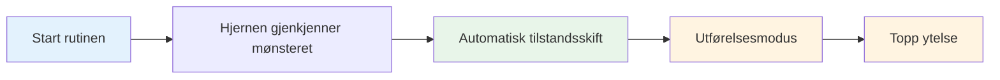

# Bygg din pre-shot-rutine

Din pre-shot rutine er et av de kraftigste verktøyene i ditt mentale spill. Det er en konsistent sekvens av handlinger som forbereder deg på hvert kast og trigger din beste ytelsestilstand.

::: tips The Big Idea
**Rutinen din er inngangsporten til sonen.** En konsekvent pre-shot rutine signaliserer hjernen din: "Det er på tide å utføre." Med repetisjon blir det en automatisk trigger for topp ytelse.
:::

## Hvorfor rutiner fungerer

### Konsistens skaper selvtillit
Når du gjør det samme hver gang, fjerner du variabler. Kroppen din vet hva som kommer. Dette skaper en følelse av kontroll og fortrolighet, selv i ukjente situasjoner.

### Rutiner utløser stater
Med repetisjon blir rutinen din knyttet til ytelsestilstanden din. Å starte rutinen starter automatisk det mentale skiftet til utførelsesmodus.

### Rutiner blokkerer distraksjoner
En rutine gir tankene dine noe å fokusere på. Det er ikke rom for bekymring for partituret, publikum eller hva som kan skje.

### Rutiner administrere opphisselse
En godt utformet rutine hjelper til med å regulere energinivået ditt - beroliger deg hvis du er for sterk, fokuserer deg hvis du er flat.

## Elementer i en effektiv rutine

### Fase 1: Vurdering (utenfor sirkelen)

Før du går inn, samle informasjon:
- Les terrenget (bakker, hindringer, overflate)
- Vurder situasjonen (score, bouleposisjoner)
- Velg mål og landingssted
- Bestem kastetype (pek, skyt, lobb, kast)

**Det er her tenkning skjer.** Ta deg god tid her.

### Fase 2: Overgang (inn i sirkelen)

Skiftet fra å tenke til å gjøre:
- Fysisk handling (gå inn i sirkelen på en konsistent måte)
- Mental signal (et ord eller en setning som signaliserer "utførelsesmodus")
- Pust (ett bevisst pust for å sentrere deg selv)

**Dette er bryteren.** Analysen stopper her.

### Fase 3: Oppsett (In the Circle)

Forbered kroppen din:
- Konsekvent holdning (samme hver gang)
- Grepssjekk (kjenn på boulen)
- Innretting til målet
- Fysisk trigger (en liten bevegelse som er din)

### Fase 4: Visualisering (kortfattet)

Se kastet før du gjør det:
- Se for deg ballens bane (maks 2-3 sekunder)
- Føl det vellykkede kastet
- Koble visuelt til målet ditt

### Fase 5: Utførelse

Gjør kastet:
- Eksternt fokus (kun mål)
- Stol på kroppen din
- Slipp uten å nøle
- Følg gjennom naturlig

## Bygg din personlige rutine

### Trinn 1: Observer hva du allerede gjør

Du har sikkert litt rutine allerede. Merk:
- Hva gjør du før gode kast?
- Hva føles naturlig for deg?
- Hva hjelper deg med å fokusere?

### Trinn 2: Design din rutine

Lag en sekvens som inkluderer:
- [ ] Vurderingsfase
- [ ] Klart overgangsmoment
- [ ] Konsekvent fysisk oppsett
- [ ] Kort visualisering
- [ ] Utførelsesutløser

### Trinn 3: Skriv det ned

Vær spesifikk. Eksempel:

1. **Vurder:** Les terreng, velg landingssted
2. **Overgang:** Gå inn i sirkelen med venstre fot først, si «stol på»
3. **Oppsett:** Føtter skulderbredde, grepskontroll, juster skuldrene
4. **Visualiser:** Se banen, kjenn frigjøringen
5. **Utfør:** Øyne på målet, kast

### Trinn 4: Øv religiøst

Bruk rutinen din på HVER kast i praksis:
- Lette kast
- Vanskelige kast
- Når du er sliten
- Når du er frisk

Rutinen må bli automatisk.

### Trinn 5: Avgrens over tid

Din rutine vil utvikle seg. Legg merke til hva som fungerer og juster. Men ikke endre det under konkurranse - kun mellom arrangementer.

## Rutinemessig timing

Rutinen din bør ta en jevn mengde tid:
- For fort: Du haster, ikke ordentlig forberedt
- For sakte: Du overtenker, mister flyt
- Akkurat riktig: Nok tid til å forberede seg, ikke så mye at du tenker for mye

**Typisk timing:**
- Vurdering: 5-10 sekunder
- Overgang + Oppsett: 3-5 sekunder
- Visualisering + utførelse: 3-5 sekunder
- **Totalt: 10-20 sekunder**

## Vanlige rutinefeil

|  | Feil | Problem | Løsning |  |
|--------|--------|--------|
|  | Hopp over i praksis | Rutine er ikke automatisk | Bruk den hvert eneste kast |  |
|  | For komplisert | Vanskelig å huske under press | Forenkle til det vesentlige |  |
|  | Tenker under utførelse | Forstyrrer automatisk ytelse | Tydelig overgangspunkt |  |
|  | Inkonsekvent timing | Skaper usikkerhet | Øv med jevnt tempo |  |
|  | Endring midt i konkurransen | Introduserer tvil | Hold deg til det du vet |  |

## Rutinemessig feilsøking

**Hvis du haster:**
- Legg til et pust ved overgangen
- Senk oppsettbevegelsene dine
- Pause før visualisering

**Hvis du overtenker:**
- Forkort rutinen
- Bruk en sterkere overgangssignal
- Fokuser mer eksternt

**Hvis du er inkonsekvent:**
- Video selv for å sjekke
- Øv rutinen uten å kaste
- Få tilbakemelding fra en partner

## Eksempel på rutiner

### Enkel rutine
1. Velg mål
2. Gå inn, pust
3. Grip, juster
4. Se det, kast det

### Detaljert rutine
1. Les terreng, velg landingssted
2. Gå først i venstre fot
3. Si "glatt" internt
4. Ett åndedrag, skuldrene faller
5. Føtter satt, grepssjekk
6. Juster skuldrene etter målet
7. Se banen (2 sekunder)
8. Øynene låser seg på målet
9. Kast

## Key Takeaway

> Din rutine er ditt anker. I kaos er det din konstante.

Bygg den nøye. Øv det alltid. Stol helt på det.

