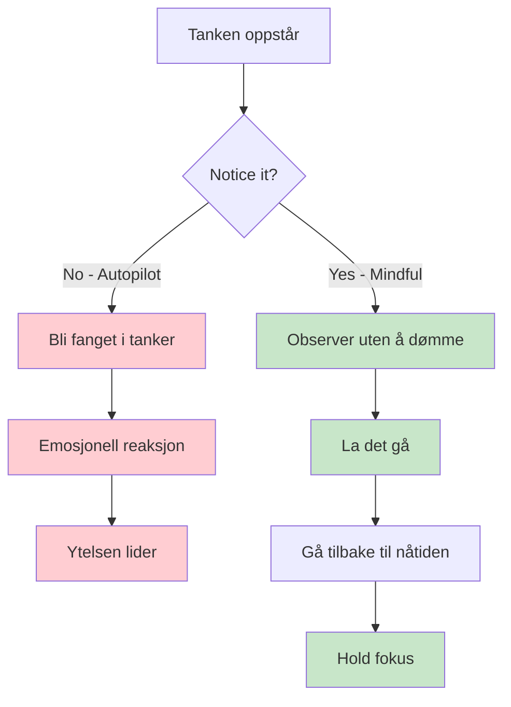
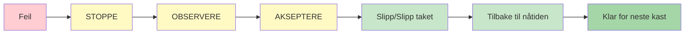

# Mindfulness for petanquespillere
<AdBanner />

Mindfulness er et av de kraftigste verktøyene som er tilgjengelige for idrettsutøvere. Det er ikke mystisk eller komplisert – det er rett og slett øvelsen i å være oppmerksom på nåtiden uten å dømme.

::: tip Kjerneprinsippet
**Mindfulness handler ikke om å tømme sinnet. Det handler om å velge hvor du skal rette oppmerksomheten din.** Du kan ikke stoppe tanker fra å oppstå, men du kan velge å ikke følge dem.
:::

## Hva er mindfulness?

Mindfulness betyr å være fullt tilstede og bevisst på:
- Hvor du er
- Hva du gjør
- Hvordan du føler deg

...uten å bli overveldet av det som skjer rundt deg eller reagere på det.

For petanque-spillere betyr dette:
- Å være fullt til stede for hvert kast
- Å legge merke til tanker uten å bli fanget opp i dem
- Raskt å komme seg etter feil
- Å holde seg rolig under press

## Vitenskapen bak det

Mindfulness er ikke bare filosofi – det er støttet av solid forskning:

### Effekter på hjernen din
- **Reduserer aktiviteten i amygdala** (hjernens alarmsystem)
- **Styrker den prefrontale cortex** (beslutningstaking og fokus) – dette hjelper deg å tenke klart under planlegging
- **Forbedrer evnen din til å roe ned sinnet** når det er nødvendig – viktig for å få tilgang til flyttilstand under utførelse
- **Forbedrer forbindelsene** mellom hjerneområder
- **Skaper varige strukturelle endringer** med regelmessig trening

### Effekter på ytelse
| Fordel | Hvordan det hjelper spillet ditt |
|---------|----------------------|
| Stressreduksjon | Lavere kortisol, stødigere hender |
| Bedre fokus | Færre distraksjoner, klarere beslutninger |
| Emosjonell kontroll | Ikke la dårlige kast utvikle seg til en spiral |
| Raskere restitusjon | Komme seg raskt tilbake fra feil |
| Forbedret søvn | Bedre hvile, bedre ytelse |

## Hvorfor petanquespillere trenger mindfulness

Petanque har unike mentale utfordringer:

1. **Tid mellom kastene** - Massevis av muligheter for negative tanker
2. **Synlige feil** - Alle ser når du bommer
3. **Lagpress** - Kastet ditt påvirker partnerne dine
4. **Lange konkurranser** - Mental utmattelse over mange timer
5. **Jevne kamper** - Høyt press i avgjørende øyeblikk

Mindfulness hjelper deg med å håndtere alt dette.

## Kjerneferdigheten: Ikke-dømmende bevissthet

Nøkkelordet er «ikke-dømmende».

<AdInArticle />

::: danger Dømmende tenkning (legger til emosjonell vekt)
❌ «Det var et forferdelig kast»
❌ «Jeg savner alltid disse»
❌ «Lagkameratene mine må være frustrerte»

**Resultat:** Spiral av negative følelser, spenning, dårligere prestasjon
:::

::: tip Ikke-dømmende bevissthet (bare observerer)
✅ &quot;Kastet gikk til venstre for målet&quot;
✅ «Jeg merker at jeg føler meg anspent»
✅ «Tankene mine vandrer til partituret»

**Resultat:** Tydelig observasjon, rask restitusjon, opprettholde fokus
:::

**Forskjellen?** Dømmekraft gir emosjonell tyngde og utløser reaksjoner. Bevissthet observerer bare og lar deg reagere dyktig.

## Komme i gang

Du trenger ikke timevis med meditasjon. Start med disse enkle øvelsene:

### 1. Bevisst pusting (2 minutter)
- Sitt komfortabelt
- Fokuser på pusten din
- Når tankene dine vandrer (det vil det), gå forsiktig tilbake til pusten
- Ingen dom over vandring – bare returner

### 2. Kroppsskanning (5 minutter)
- Legg merke til følelser i føttene dine
- Flytt oppmerksomheten sakte oppover gjennom kroppen din
- Bare observer – ikke prøv å endre noe
- Legg merke til spenningsområder uten å bekjempe dem

### 3. Mindfulness-øyeblikk
- Velg en hverdagsaktivitet (drikke kaffe, gå tur)
- Gjør det med full oppmerksomhet
- Legg merke til alle sansningene som er involvert
- Når tankene dine vandrer, gå tilbake til aktiviteten

## Mindfulness i konkurranse

### Før kampen
- Ta 2–3 minutter til bevisst pusting
- Sett en intensjon for hvordan du vil spille (ikke resultatet, men prosessen)
- Legg merke til nervøsitet uten å prøve å eliminere den

### Under spillet
- Bruk rutinen din før bruk som et mindfulness-anker
- Mellom kastene, vend oppmerksomheten tilbake til nåtiden
- Legg merke til tanker om poengsum/utfall, og slipp dem deretter

### Etter feil

::: warning SOAS-metoden (ditt tilbakestillingsverktøy)
**S**top - Pause før du reagerer
**OBSERVER - Hva skjedde? Hva føler jeg?**
**Aksepter - Det skjedde. Det er gjort.**
**Slipp taket** - Slipp det, gå tilbake til nåtiden

**Tid som trengs:** 10 sekunder
**Bruk det:** Etter hver feil, dårlig sprett eller frustrerende øyeblikk
:::

## I denne delen

- **[Teknikker](/no/utdanning/mindfulness/teknikker)** - Praktiske øvelser du kan bruke
- **[Daglig praksis](/no/utdanning/mindfulness/daglig-praksis)** - Bygg mindfulness inn i livet ditt

## Sammendrag: Mindfulness-regler

::: tip Regel nr. 1: Bevissthetsregelen
**Observer uten å dømme.**
Legg merke til tanker og følelser uten å sette stempel på dem som gode eller dårlige.
:::

::: tip Regel nr. 2: SOAS-regelen
**Stopp, observer, aksepter, skli (slipp taket).**
Din 10-sekunders tilbakestilling etter feil. Bruk den hver gang.
:::

::: tip Regel nr. 3: Nåværende regel
**Du kan bare kontrollere dette øyeblikket, dette kastet.**
Tidligere kast er unnagjort. Fremtidige kast finnes ikke ennå. Vær her nå.
:::

::: tip Regel nr. 4: Øvingsregelen
**Start i det små: 2–5 minutter daglig.**
Konsistens er bedre enn varighet. Daglig øvelse bygger opp ferdigheten.
:::

## Viktig konklusjon

> Mindfulness handler ikke om å tømme sinnet. Det handler om å velge hvor du skal rette oppmerksomheten din.

Du kan ikke stoppe tanker fra å dukke opp. Men du kan velge å ikke følge dem ned i kaninhullet.

<AdBanner />
