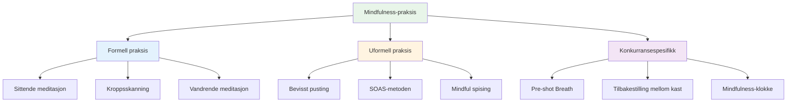

# Mindfulness-teknikker
<AdBanner />

Her er praktiske teknikker du kan bruke for å utvikle mindfulness. Start med én eller to og bygg videre derfra.

::: tip Den store ideen
**Mindfulness er en ferdighet, ikke et talent.** Som å peke eller skyte, forbedres det med øvelse. Start i det små, vær konsekvent, og fordelene øker over tid.
:::

## Formell praksis

Dette er dedikerte mindfulness-økter – tid satt av spesielt til øvelse.

### Sittende meditasjon

Grunnlaget for mindfulness-praksis.

**Slik gjør du det:**
1. Sitt komfortabelt (stol eller gulv)
2. Lukk øynene eller mykne blikket
3. Fokuser på pusten din – følelsen av luft som kommer inn og ut
4. Når tanker dukker opp, legg merke til dem uten å dømme
5. Vend forsiktig oppmerksomheten tilbake til pusten
6. Start med 5 minutter, øk til 15–20

**Tips:**
- Tanker vil komme – det er normalt
- Hver gang du merker at du har vandret og kommer tilbake, bygger du opp ferdigheten.
- Ikke døm deg selv for å vandre
- Konsistens er viktigere enn varighet

### Kroppsskanning

Utvikler bevissthet om fysiske sanseinntrykk.

**Slik gjør du det:**
1. Ligg ned eller sitt komfortabelt
2. Start ved føttene dine – legg merke til eventuelle følelser
3. Flytt oppmerksomheten sakte oppover: ankler, legger, knær ...
4. Legg merke til uten å prøve å endre noe
5. Hvis du opplever spenning, pust inn i det området
6. Fortsett til toppen av hodet ditt
7. Tar 10–20 minutter

**For petanque:** Hjelper deg å legge merke til spenning før den påvirker kastet ditt.

### Vandrende meditasjon

Mindfulness i bevegelse – god forberedelse til løypa.

**Slik gjør du det:**
1. Gå sakte og bevisst
2. Føl hver del av steget: løft, beveg deg, plasser
3. Legg merke til følelsene i føttene og bena
4. Når tankene dine vandrer, gå tilbake til de fysiske sansningene
5. 5–10 minutter er nok

## Uformell praksis

<AdInArticle />

Disse integrerer mindfulness i daglige aktiviteter.

### Bevisst pusting

Den enkleste teknikken – tilgjengelig når som helst.

**Øvelsen:**
- Ta 3 langsomme, bevisste åndedrag
- Fokuser fullstendig på følelsen
- Bruk den som en tilbakestillingsknapp gjennom dagen

**Når skal det brukes:**
- Før man går inn i sirkelen
- Når du merker at stresset bygger seg opp
- Mellom kampene
- Ethvert overgangsøyeblikk

### SOAS-metoden

Ditt verktøy for å håndtere vanskelige øyeblikk.

| Skritt | Handling | Eksempel |
|------|--------|---------|
| **Stoppe | Pause, ikke reager | Ikke kast hendene opp etter en bom |
| **Observere | Legg merke til hva som skjer | «Jeg føler meg frustrert. Kjeven min er stram.» |
| **Akseptere | Anerkjenn uten å kjempe | «Det er slik jeg føler meg akkurat nå.» |
| **S**leppe | La det gå, gå videre | Slipp spenningen, gå tilbake til nåtiden |

**Øv på dette i hverdagen** slik at det går automatisk i konkurranse.

### Mindful spising

En overraskende kraftig praksis.

**Slik gjør du det:**
- Spis ett måltid uten distraksjoner (uten telefon, TV)
- Legg merke til fargene, luktene, teksturene
- Tygg sakte, smak godt
- Legg merke til når du er fornøyd

**Hvorfor det er viktig:** Bygger opp den generelle ferdigheten til å være oppmerksom.

### Sensorisk bevissthet

Engasjerer deg fullt ut i omgivelsene dine.

**5-4-3-2-1-teknikken:**
- Legg merke til 5 ting du kan se
- Legg merke til fire ting du kan høre
- Legg merke til 3 ting du kan føle
- Legg merke til to ting du kan lukte
- Legg merke til én ting du kan smake på

**Bruk dette:** Når tankene dine raser før en stor kamp.

## Konkurransespesifikke teknikker

### Pre-shot-pusten

Integrer pusten i rutinen din:

1. Før du går inn i sirkelen, ta ett bevisst åndedrag
2. Føl føttene dine på bakken
3. La skuldrene senke seg på utpusten
4. Så begynn rutinen din

### Tilbakestilling mellom kast

Hva du skal gjøre mens du venter:

- Legg merke til hvor oppmerksomheten din går
- Hvis det går til poengsum/utfall, bekreft og gå tilbake til presentasjon
- Fokuser på noe nøytralt (pusten din, følelsen av en boule)
- Hold deg fysisk avslappet

### «Mindfulness-klokken»

Bruk triggere for å minne deg på å være til stede:

- Hver gang du plukker opp en kule
- Når du hører at knekt blir kastet
- Når du går inn i sirkelen
- Når et spill slutter

Hver trigger = ett bevisst åndedrag.

## Bygge din praksis

### Uke 1–2: Grunnleggende
- 5 minutter sittende meditasjon daglig
- 3 bevisste åndedrag før hvert måltid
- Øv på SOAS én gang når noe mindre går galt

### Uke 3–4: Utvidelse
- Øk meditasjonen til 10 minutter
- Legg til kroppsskanning to ganger per uke
- Bruk mindfulness-klokkeutløsere i praksis

### Uke 5+: Integrering
- 15–20 minutters daglig trening
- Full integrering i rutinen før bruk
- SOAS blir automatisk respons på feil

## Vanlige utfordringer

| Utfordring | Løsning |
|-----------|----------|
| &quot;Jeg klarer ikke å slutte å tenke&quot; | Det skal du ikke. Bare legg merke til det og kom tilbake. |
| &quot;Jeg har ikke tid&quot; | Start med 3 minutter. Alle har 3 minutter. |
| &quot;Jeg sovner&quot; | Prøv å sitte i stedet for å ligge, eller øv tidligere på dagen. |
| «Det føles meningsløst» | Fordeler kommer med konsistens. Stol på prosessen. |
| «Jeg glemmer å øve» | Sett en daglig påminnelse. Koble den til en eksisterende vane. |

## Viktig konklusjon

> Mindfulness er en ferdighet. Som alle andre ferdigheter forbedres den med øvelse.

Begynn i det små. Vær konsekvent. Fordelene øker over tid.

<AdBanner />
