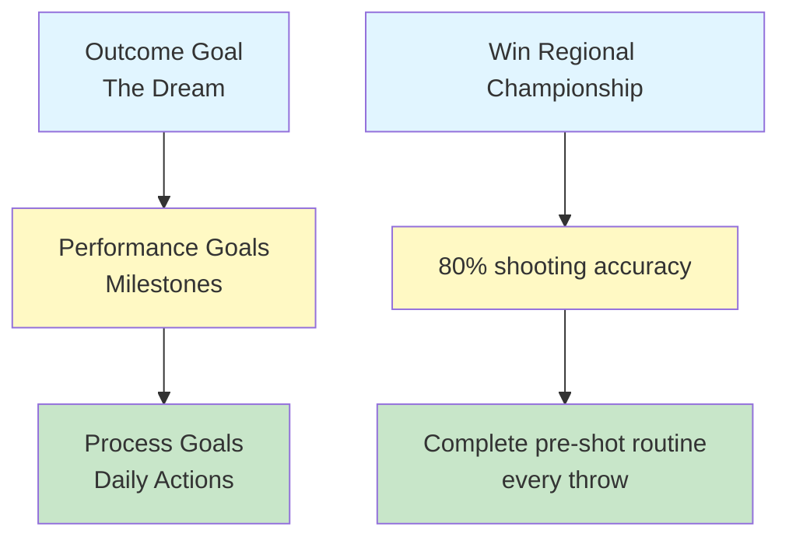

# Goal Setting for Pétanque Players

Clear goals are your compass. They give direction to your training, motivation when things get hard, and a way to measure progress. Without goals, you're just throwing boules. With goals, you're building toward something.

::: tip The Core Principle
**A goal without a plan is just a wish.** Set clear goals, break them down, focus on what you control, and track your progress.
:::

## Why Goals Matter

Goals serve multiple purposes:
- **Direction:** Know what to work on
- **Motivation:** Have something to strive for
- **Measurement:** Track your progress
- **Focus:** Prioritize your limited time

For the self-directed player, goals are especially important. Without a coach pushing you, your goals become your guide.

## The Three Types of Goals

Not all goals are equal. Understanding the different types helps you set better ones.

### 1. Outcome Goals
**What:** The end result you want
**Example:** "Win the regional championship"
**Control level:** Low - depends on opponents, conditions, luck

### 2. Performance Goals
**What:** Specific performance standards
**Example:** "Achieve 80% accuracy on shooting drills"
**Control level:** Medium - depends mostly on you

### 3. Process Goals
**What:** Actions and behaviors you control
**Example:** "Complete my pre-shot routine on every throw"
**Control level:** High - entirely up to you

### The Goal Hierarchy

::: warning Key Insight
**Focus most of your attention on process goals.** They're what you control, and they lead to the outcomes you want.

- **Outcome goals:** Low control, high motivation
- **Performance goals:** Medium control, measurable progress
- **Process goals:** High control, daily focus ← **Focus here**
:::

## The SMART Framework

::: info SMART Goals Checklist
Every goal should be:
- ✅ **S**pecific - Clear and well-defined
- ✅ **M**easurable - You can track progress
- ✅ **A**chievable - Challenging but possible
- ✅ **R**elevant - Aligned with your bigger picture
- ✅ **T**ime-bound - Has a deadline
:::

### S - Specific
❌ "Get better at shooting"
✅ "Improve my au fer (direct hit) accuracy from 8 meters"

### M - Measurable
❌ "Shoot more accurately"
✅ "Score at least 24/30 on the shooting ladder drill"

### A - Achievable
❌ "Never miss a shot" (impossible)
✅ "Improve accuracy by 10% over 8 weeks" (challenging but realistic)

### R - Relevant
❌ "Run a marathon" (not directly related)
✅ "Improve balance and stability for better throwing" (supports your game)

### T - Time-bound
❌ "Someday I'll be better"
✅ "By March 15th, I will achieve..."

## Goal Examples for Pétanque

| Type | Poor Goal | SMART Goal |
|------|-----------|------------|
| Outcome | "Win more" | "Reach the semi-finals at the Spring Tournament" |
| Performance | "Point better" | "Achieve 70% of points within 50cm at 8m distance" |
| Process | "Practice more" | "Complete 3 focused training sessions per week" |

## Breaking Down Big Goals

Large goals can feel overwhelming. Break them into smaller pieces:

### Example: "Win the Club Championship (12 months away)"

**Yearly goal:** Win club championship

**Quarterly goals:**
- Q1: Improve shooting accuracy to 75%
- Q2: Develop consistent pre-shot routine
- Q3: Master pressure situations
- Q4: Peak performance and competition prep

**Monthly goals (Q1):**
- Month 1: Establish baseline, identify weaknesses
- Month 2: Focus on shooting technique
- Month 3: Add pressure to shooting practice

**Weekly goals (Month 2):**
- Week 1: 3 shooting sessions, video analysis
- Week 2: Work on identified technique issue
- Week 3: Increase distance gradually
- Week 4: Test progress, adjust plan

## Connecting Goals to Your "Why"

Goals work better when connected to deeper motivation.

Ask yourself:
- Why do I want to achieve this?
- What will it mean to me?
- How will I feel when I succeed?
- What's driving me to improve?

Write down your answers. Return to them when motivation fades.

## In This Section

- **[Psychology of Motivation](/no/education/motivation/motivation)** — Intrinsic vs extrinsic, Self-Determination Theory
- **[SMART Goals in Detail](/no/education/motivation/smart-goals)** — Deep dive into creating effective goals
- **[Creating Your Training Plan](/no/education/motivation/planning)** — Turn goals into action
- **[Maintaining Motivation](/no/education/motivation/maintaining)** — Long-term sustainability, burnout prevention

## Summary: Goal Setting Rules

::: tip Rule #1: The Control Rule
**Focus on process goals (what you control) over outcome goals.**
Process goals lead to performance goals, which lead to outcome goals.
:::

::: tip Rule #2: The SMART Rule
**Goals must be Specific, Measurable, Achievable, Relevant, Time-bound.**
Vague goals produce vague results. SMART goals produce progress.
:::

::: tip Rule #3: The Breakdown Rule
**Large goals need quarterly, monthly, and weekly milestones.**
Break big goals into small, actionable steps you can complete this week.
:::

::: tip Rule #4: The Connection Rule
**Connect goals to your deeper "why."**
When motivation fades, your "why" keeps you going.
:::

## Key Takeaway

> A goal without a plan is just a wish.

Set clear goals. Break them down. Focus on what you control. Track your progress.

