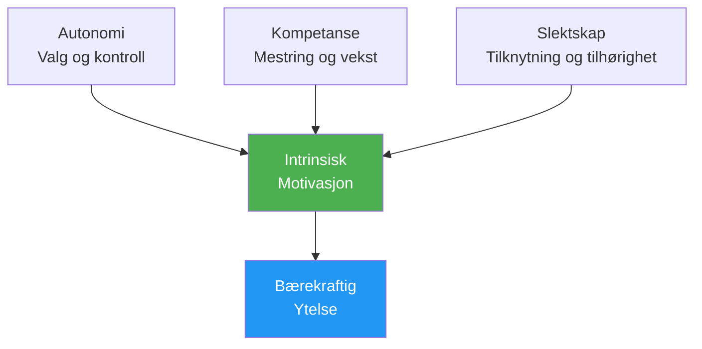

# Motivasjonspsykologi

Å forstå HVORFOR du er motivert – ikke bare at du er det – hjelper deg med å bygge en bærekraftig drivkraft som ikke er avhengig av resultater.

---

## Intrinsisk vs. ytre motivasjon

### Ekstrinsisk motivasjon

Motivasjon drevet av ytre belønninger eller press:

| Kilde | Eksempel |
|--------|---------|
| **Troféer/medaljer** | «Jeg vil vinne mesterskapet» |
| **Rangeringer** | «Jeg vil bli blant de 10 beste i regionen min» |
| **Erkjennelse** | «Jeg vil at andre skal se meg som en god spiller» |
| **Unngå kritikk** | «Jeg vil ikke skuffe laget mitt» |
| **Finansiell** | «Jeg vil vinne pengepremier» |

**Kjennetegn:**
- Kan gi sterk innledende motivasjon
- Avtar ofte over tid
- Avhengig av faktorer utenfor din kontroll
- Kan svekke gleden

### Intrinsisk motivasjon

Motivasjon fra selve aktiviteten:

| Kilde | Eksempel |
|--------|---------|
| **Mestring** | «Jeg elsker følelsen av å bli bedre» |
| **Strømme** | «Tiden forsvinner når jeg spiller» |
| **Utfordring** | «Jeg liker å teste meg selv mot problemer» |
| **Uttrykk** | «Petanque lar meg uttrykke hvem jeg er» |
| **Glede** | «Jeg elsker rett og slett å spille dette spillet» |

**Kjennetegn:**
- Mer bærekraftig over tid
- Uavhengig av resultater
- Koblet til dypere tilfredshet
- Forbedrer ytelsen naturlig

::: tip Forskningen
Studier viser konsekvent at **indre motivasjon fører til bedre ytelse, mer utholdenhet og større velvære** enn ytre motivasjon alene.
:::

---

## Selvbestemmelsesteori (SDT)

SDT, utviklet av Deci og Ryan, identifiserer tre grunnleggende psykologiske behov som driver indre motivasjon:

### 1. Autonomi

**Behovet for å føle at du har kontroll over valgene dine**

| Støtter autonomi | Undergraver autonomi |
|-------------------|---------------------|
| Velge treningsfokus | Å bli fortalt nøyaktig hva man skal gjøre |
| Sette dine egne mål | Eksternt press for å prestere |
| Å bestemme hvordan man skal øve | Tvungen deltakelse |
| Å ha innspill til teambeslutninger | Kontrollerende trenere/lagkamerater |

**For petanque:**
- Velg hvilke aspekter du skal jobbe med
- Sett din egen utviklingsvei
- Ta taktiske avgjørelser selv
- Ta ansvar for treningsplanen din

### 2. Kompetanse

**Behovet for å føle seg effektiv og dyktig**

| Støtter kompetanse | Undergraver kompetanse |
|---------------------|----------------------|
| Passende utfordringer | Oppgaver som er for enkle eller for vanskelige |
| Tydelig tilbakemelding på fremdrift | Ingen tilbakemeldinger eller bare negative |
| Synlig forbedring | Stagnasjon uten forklaring |
| Ferdighetsrelatert konkurranse | Konstant overmatching |

**For petanque:**
- Spor forbedringsmålingene dine
- Søk passende konkurransenivåer
- Feir små seire
- Få spesifikk tilbakemelding (ikke bare resultater)

### 3. Slektskap

**Behovet for kontakt med andre**

| Støtter tilknytning | Undergraver tilknytning |
|----------------------|------------------------|
| Positive teamrelasjoner | Isolering |
| Delte mål med lagkamerater | Rent individuelt fokus |
| Tilhørighet til fellesskapet | Utelukkelse eller konflikt |
| Mentorskap (gi/motta) | Kun konkurransepregede forhold |

**For petanque:**
- Bygg ekte teamforbindelser
- Finn treningspartnere
- Bli med på klubbens fellesaktiviteter
- Del kunnskap med andre

---

## SDT-formelen

```
Autonomy + Competence + Relatedness = Intrinsic Motivation
```

Når alle tre behovene er oppfylt, blomstrer indre motivasjon naturlig.



---

## Motivasjonstyper Spektrum

SDT beskriver motivasjon på et spekter fra ekstern til intern:

| Type | Beskrivelse | Eksempel | Kvalitet |
|------|-------------|---------|---------|
| **Motivasjon** | Ingen motivasjon | &quot;Hvorfor bry deg?&quot; | ❌ |
| **Utvendig** | For belønning/unngå straff | &quot;Jeg skal få et trofé&quot; | ⭐ |
| **Introvert** | Indre press, skyldfølelse | «Jeg burde øve» | ⭐⭐ |
| **Identifisert** | Verdsatt resultat | «Dette hjelper meg å bli bedre» | ⭐⭐⭐ |
| **Integrert** | I samsvar med verdier | &quot;Dette er hvem jeg er&quot; | ⭐⭐⭐⭐⭐ |
| **Iboende** | Ren nytelse | &quot;Jeg elsker dette&quot; | ⭐⭐⭐⭐⭐⭐ |

**Mål:** Flytt motivasjonen din mot den indre enden av spekteret.

---

## Selvvurdering: Din motivasjonsprofil

Vurder hver påstand (1 = Ikke i det hele tatt, 5 = Helt):

**Ytre indikatorer:**
| Uttalelse | Poengsum |
|-----------|-------|
| Jeg spiller hovedsakelig for å vinne turneringer | /5 |
| Anerkjennelse fra andre betyr mye for meg | /5 |
| Jeg ville miste interessen uten konkurransesuksess | /5 |
| **Ekstrinsisk total** | /15 |

**Intrinsiske indikatorer:**
| Uttalelse | Poengsum |
|-----------|-------|
| Jeg ville spilt selv om det ikke var noen konkurranser | /5 |
| Følelsen av forbedring begeistrer meg | /5 |
| Jeg mister tidsforståelsen når jeg spiller | /5 |
| **Intrinsisk total** | /15 |

**Tolkning:**
- Høyere intrinsisk total = mer bærekraftig motivasjon
- Balansen er fin, men sørg for at det indre ≥ det ytre
- Hvis det er ytre &gt;&gt; iboende, gjenopprett kontakten med din kjærlighet til spillet

---

## Skifting mot indre motivasjon

### Gjenopprett kontakten med glede

- **Husker du hvorfor du startet** – Hva tiltrakk deg i utgangspunktet?
- **Spill uten innsatser** — Av og til «bare for moro skyld»-økter
- **Setter pris på øyeblikk** — Legg merke til når du koser deg med spillet

### Fokus på mestring

- **Sett læringsmål** ikke bare resultatmål
- **Feir forbedring** uavhengig av resultater
- **Omfavn utfordringer** som vekstmuligheter

### Bygg autonomi

- **Ta dine egne valg** om trening
- **Ta eierskap til din egen utviklingsvei**
- **Motstå ytre press** for å trene på bestemte måter

### Dyrk forbindelse

- **Invester i relasjoner** utover konkurranse
- **Del kunnskap** med utviklende spillere
- **Finn ditt fellesskap** innenfor sporten

---

## Relatert innhold

- [Målsetting](/no/utdanning/motivasjon/) — Sette effektive mål
- [Opprettholde motivasjon](/no/utdanning/motivasjon/opprettholde) — Langsiktig bærekraft
- [Sonen](/no/utdanning/mentalt-spill/sonen/) — Indre motivasjon og flyt
- [Teamdynamikk](/no/utdanning/teamdynamikk/) — Tilknytning i teamkontekst

