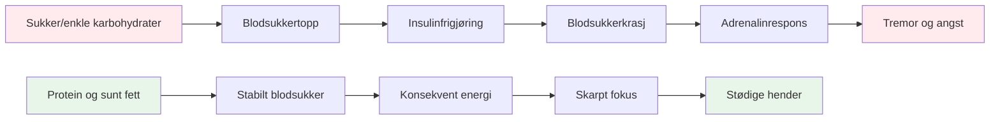

# Ernæring for presisjonsytelse

Pétanque er en presisjonssport, ikke en utholdenhetssport. Dine ernæringsbehov er annerledes enn en maratonløper eller en fotballspiller. Det som betyr mest er **hjernens drivstoffstabilitet** – å holde hjernen skarp og hendene stødige gjennom en lang konkurransedag.

::: tip Den store ideen
**Hjernen din er ditt viktigste verktøy i petanque. Gi den stabil drivstoff, ikke berg-og-dal-bane-energi.** Fokuser på protein, sunt fett og å holde deg hydrert. Unngå sukkertopper.
:::

## Presisjonsutøverens utfordring

I motsetning til høyintensitetssport krever ikke pétanque massive glykogenlagre eller rask energipåfylling. Det den krever er:

- **Stabilt blodsukker** – ingen topper eller krasj
- **Konsekvent mental klarhet** – fokus som varer hele dagen
- **Stødige hender** - ingen skjelvinger eller risting
- **Rolige nerver** – lav angst og stressrespons

Ernæringsstrategien din bør optimalisere for disse faktorene, ikke for rå energiproduksjon.

## Problemet med sukker og enkle karbohydrater

Mange idrettsutøvere går som standard til et karbohydratrikt kosthold. For petanque-spillere kan dette faktisk gå utover prestasjonene.

### Blodsukkerberg-og-dal-banen

Når du spiser sukker eller enkle karbohydrater:
1. Blodsukkeret stiger raskt
2. Insulin frigjøres for å senke det
3. Blodsukkeret faller (hypoglykemi)
4. Kroppen din frigjør adrenalin for å kompensere
5. Du opplever skjelvinger, angst og dårlig fokus

**Dette er det motsatte av hva du trenger for presisjon.**

### Symptomer på ustabilitet i blodsukkeret

| Symptom | Innvirkning på ytelse |
|---------|----------------------|
| Skjelvende hender | Inkonsekvent utgivelse |
| Vanskeligheter med å konsentrere seg | Dårlig beslutningstaking |
| Irritabilitet | Lagkonflikt, dårlig ro |
| Tretthet etter måltider | Ettermiddagsnedgang |
| Angst | Trykkfølsomhet |
| Hjernetåke | Langsom taktisk tenkning |

## En bedre tilnærming: Stabil energi

Målet er å gi hjernen din jevnlig drivstoff uten berg-og-dal-banen.

### Viktige prinsipper

1. **Prioriter protein og sunt fett** – De gir langsom, jevn energi
2. **Velg komplekse karbohydrater fremfor enkle** – Hvis du spiser karbohydrater, velg de som fordøyes sakte
3. **Unngå sukkertopper** – Spesielt før og under konkurranse
4. **Hold deg hydrert** - Dehydrering påvirker konsentrasjonen betydelig
5. **Spis regelmessig** - Ikke la deg bli for sulten

### Matvarer som hjelper

| Mattype | Eksempler | Hvorfor det fungerer |
|-----------|----------|--------------|
| Protein | Egg, nøtter, ost, kjøtt | Langsom fordøyelse, stabil energi |
| Sunne fettsyrer | Avokado, olivenolje, nøtter | Langvarig drivstoff |
| Komplekse karbohydrater | Grønnsaker, belgfrukter | Fiber forsinker absorpsjonen |
| Frukt med lavt sukkerinnhold | Bær, epler | Næringsstoffer uten pigg |

### Matvarer å begrense

| Mattype | Eksempler | Hvorfor det er problematisk |
|-----------|----------|---------------------|
| Sukker | Godteri, brus, bakverk | Rask topp og krasj |
| Hvitt brød/pasta | Smørbrød, pastaretter | Rask omdannelse til sukker |
| Fruktjuice | Appelsinjuice, smoothies | Konsentrert sukker |
| Energidrikker | De fleste kommersielle merkene | Sukker + koffein-krasj |

## Ernæring på konkurransedagen

### Før konkurransen

**2–3 timer før:**
- Balansert måltid med protein, fett og grønnsaker
- Unngå tunge karbohydrater som kan forårsake døsighet
- Eksempel: Egg med grønnsaker, eller salat med kylling

**1 time før:**
- Lett snacks om nødvendig
- Nøtter, ost eller en liten porsjon protein
- Unngå alt som er sukkerholdig

### Under konkurransen

**Mellom kampene:**
- Vann (viktigst)
- Små proteinsnacks (nøtter, ost, kjøtt)
- Unngå sukkerholdige snacks og drikker

**Tegn på at du må spise:**
- Vanskeligheter med å konsentrere seg
- Irritabilitet
- Føler seg skjelven
- Hodepine

### Etter konkurransen

- Fyll på med et balansert måltid
- Rehydrer fullstendig
- Ikke «belønn» deg selv med sukker – det vil påvirke restitusjonen din.

## Hydrering

Dehydrering påvirker kognitiv funksjon før du føler deg tørst.

### Retningslinjer

- **Start med å drikke vann** - Drikk vann i løpet av dagen før konkurransen
- **Under lek** - Drikk vann regelmessig, ikke vent til du er tørst
- **Unngå for mye koffein** – Det er vanndrivende
- **Se etter tegn** - Hodepine, mørk urin, tretthet

### Hvor mye?

En generell retningslinje: sikt mot blekgul urin. Hvis den er mørk, trenger du mer vann.

## Lavkarbo-alternativet

Noen presisjonsutøvere følger lavkarbo- eller ketogene dietter. Teorien:

**Potensielle fordeler:**
- Svært stabilt blodsukker (ingen topper mulig)
- Konsekvent mental klarhet
- Redusert angst og skjelvinger
- Ingen energikrasj ettermiddagen

**Hensyn:**
- Krever tilpasningsperiode (1–2 uker)
- Ikke egnet for alle
- Krever planlegging og engasjement
- Rådfør deg med helsepersonell først

Dette er en avansert strategi – ikke nødvendig for alle, men verdt å vurdere hvis blodsukkerstabilitet er et betydelig problem for deg.

## Praktiske tips

### Enkle konkurransesnacks
- Blandede nøtter (usaltet)
- Hardkokte egg
- Osteterninger
- Jerky av oksekjøtt eller kalkun
- Grønnsaker med hummus
- Oliven

### Hva du bør unngå
- Salgsautomat snacks
- Sukkerholdige sportsdrikker
- Bakverk og bakevarer
- Godteri og sjokoladebarer
- De fleste «energi»-barer (sjekk sukkerinnholdet)

## Viktig konklusjon

> Hjernen din er ditt viktigste verktøy i petanque. Gi den stabil drivstoff, ikke berg-og-dal-bane-energi.

Fokuser på protein, sunt fett og å holde deg hydrert. Unngå sukkertopper. Konsentrasjonen, roen og de stødige hendene dine vil takke deg.

