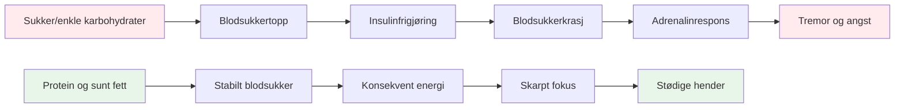
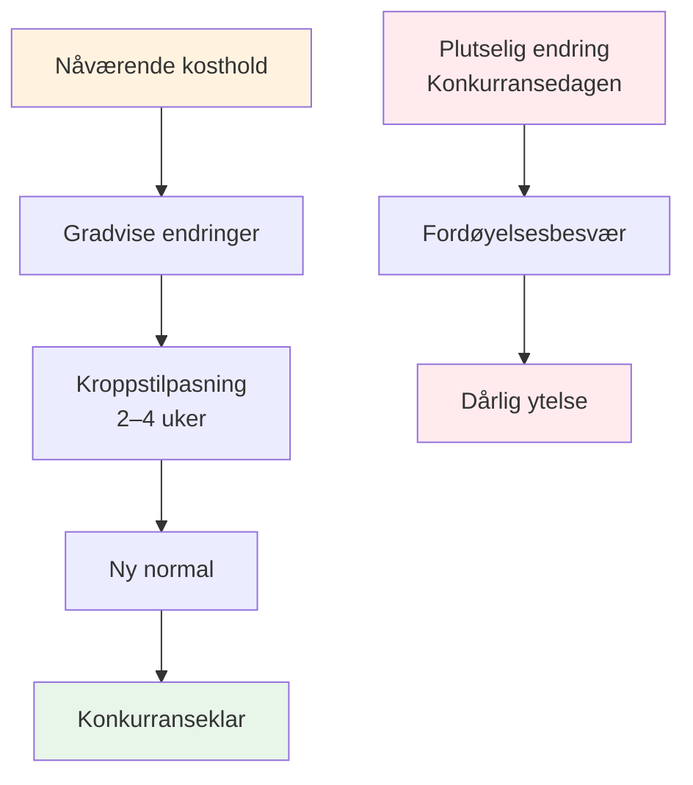

# Ernæring for presisjonsytelse


Pétanque er en presisjonssport, ikke en utholdenhetssport. Dine ernæringsbehov er annerledes enn en maratonløper eller en fotballspiller. Det som betyr mest er **hjernens drivstoffstabilitet** – å holde hjernen skarp og hendene stødige gjennom en lang konkurransedag.

::: tip Den store ideen
**Hjernen din er ditt viktigste verktøy i petanque. Gi den stabil drivstoff, ikke berg-og-dal-bane-energi.** Fokuser på protein, sunt fett og å holde deg hydrert. Unngå sukkertopper.
:::



## Presisjonsutøverens utfordring

I motsetning til høyintensitetssport krever ikke pétanque massive glykogenlagre eller rask energipåfylling. Det den krever er:

- **Stabilt blodsukker** – ingen topper eller krasj
- **Konsekvent mental klarhet** – fokus som varer hele dagen
- **Stødige hender** - ingen skjelvinger eller risting
- **Rolige nerver** – lav angst og stressrespons

Ernæringsstrategien din bør optimalisere for disse faktorene, ikke for rå energiproduksjon.

## Problemet med sukker og enkle karbohydrater

Mange idrettsutøvere går som standard til et karbohydratrikt kosthold. For petanque-spillere kan dette faktisk gå utover prestasjonene.

### Blodsukkerberg-og-dal-banen

Når du spiser sukker eller enkle karbohydrater:
1. Blodsukkeret stiger raskt
2. Insulin frigjøres for å senke det
3. Blodsukkeret faller (hypoglykemi)
4. Kroppen din frigjør adrenalin for å kompensere
5. Du opplever skjelvinger, angst og dårlig fokus

**Dette er det motsatte av hva du trenger for presisjon.**

### Symptomer på ustabilitet i blodsukkeret

| Symptom | Innvirkning på ytelse |
|---------|----------------------|
| Skjelvende hender | Inkonsekvent utgivelse |
| Vanskeligheter med å konsentrere seg | Dårlig beslutningstaking |
| Irritabilitet | Lagkonflikt, dårlig ro |
| Tretthet etter måltider | Ettermiddagsnedgang |
| Angst | Trykkfølsomhet |
| Hjernetåke | Langsom taktisk tenkning |

## En bedre tilnærming: Stabil energi

Målet er å gi hjernen din jevnlig drivstoff uten berg-og-dal-banen.

### Viktige prinsipper

1. **Prioriter protein og sunt fett** – De gir langsom, jevn energi
2. **Velg komplekse karbohydrater fremfor enkle** – Hvis du spiser karbohydrater, velg de som fordøyes sakte
3. **Unngå sukkertopper** – Spesielt før og under konkurranse
4. **Hold deg hydrert** - Dehydrering påvirker konsentrasjonen betydelig
5. **Spis regelmessig** - Ikke la deg bli for sulten

### Matvarer som hjelper

| Mattype | Eksempler | Hvorfor det fungerer |
|-----------|----------|--------------|
| Protein | Egg, nøtter, ost, kjøtt | Langsom fordøyelse, stabil energi |
| Sunne fettsyrer | Avokado, olivenolje, nøtter | Langvarig drivstoff |
| Komplekse karbohydrater | Grønnsaker, belgfrukter | Fiber forsinker absorpsjonen |
| Frukt med lavt sukkerinnhold | Bær, epler | Næringsstoffer uten pigg |

### Matvarer å begrense

| Mattype | Eksempler | Hvorfor det er problematisk |
|-----------|----------|---------------------|
| Sukker | Godteri, brus, bakverk | Rask topp og krasj |
| Hvitt brød/pasta | Smørbrød, pastaretter | Rask omdannelse til sukker |
| Fruktjuice | Appelsinjuice, smoothies | Konsentrert sukker |
| Energidrikker | De fleste kommersielle merkene | Sukker + koffein-krasj |

## Ernæring på konkurransedagen

### Før konkurransen

**2–3 timer før:**
- Balansert måltid med protein, fett og grønnsaker
- Unngå tunge karbohydrater som kan forårsake døsighet
- Eksempel: Egg med grønnsaker, eller salat med kylling

**1 time før:**
- Lett snacks om nødvendig
- Nøtter, ost eller en liten porsjon protein
- Unngå alt som er sukkerholdig

### Under konkurransen

**Mellom kampene:**
- Vann (viktigst)
- Små proteinsnacks (nøtter, ost, kjøtt)
- Unngå sukkerholdige snacks og drikker

**Tegn på at du må spise:**
- Vanskeligheter med å konsentrere seg
- Irritabilitet
- Føler seg skjelven
- Hodepine

### Etter konkurransen

- Fyll på med et balansert måltid
- Rehydrer fullstendig
- Ikke «belønn» deg selv med sukker – det vil påvirke restitusjonen din.

## Hydrering

Dehydrering påvirker kognitiv funksjon før du føler deg tørst.

### Retningslinjer

- **Start med å drikke vann** - Drikk vann i løpet av dagen før konkurransen
- **Under lek** - Drikk vann regelmessig, ikke vent til du er tørst
- **Unngå for mye koffein** – Det er vanndrivende
- **Se etter tegn** - Hodepine, mørk urin, tretthet

### Hvor mye?

En generell retningslinje: sikt mot blekgul urin. Hvis den er mørk, trenger du mer vann.

## Lavkarbo-alternativet

Noen presisjonsutøvere følger lavkarbo- eller ketogene dietter. Teorien:

**Potensielle fordeler:**
- Svært stabilt blodsukker (ingen topper mulig)
- Konsekvent mental klarhet
- Redusert angst og skjelvinger
- Ingen energikrasj ettermiddagen

**Hensyn:**
- Krever tilpasningsperiode (1–2 uker)
- Ikke egnet for alle
- Krever planlegging og engasjement
- Rådfør deg med helsepersonell først


Dette er en avansert strategi – ikke nødvendig for alle, men verdt å vurdere hvis blodsukkerstabilitet er et betydelig problem for deg.

## Mat som øvelse: Tren kroppen din

::: warning Kritisk konsept
**Mat er ikke bare drivstoff – det er noe du trener med.** Akkurat som du trener på kastet ditt, må du øve på ernæringen din for å gjøre kroppen komfortabel med å spise på konkurransedagen.
:::

### Hvorfor matpraksis er viktig

Fordøyelsessystemet ditt er trenbart. Det du spiser regelmessig blir det kroppen din forventer og håndterer best. Hvis du bare spiser protein og grønnsaker på konkurransedager, vil ikke kroppen din være tilpasset det.

**Problemet:**
- Å spise ukjent mat på konkurransedagen kan forårsake fordøyelsesbesvær
- Kroppen din trenger tid til å tilpasse seg nye spisemønstre
- Stress + ukjent mat = potensielle mageproblemer
- Prestasjonsangst er ille nok uten å legge til fordøyelsesangst

**Løsningen:**
- Øv på konkurranseernæring under trening
- Gjør konkurransedagsmaten til en del av din vanlige rutine
- Tren kroppen din til å bli komfortabel med mat med stabil energi

### Tilpasningsprosessen



Når du endrer kostholdet ditt:
1. **Uke 1–2:** Kroppen din tilpasser seg ny mat, men den kan føles annerledes
2. **Uke 3–4:** Tilpasning skjer, ny mat føles normal
3. **Uke 5+:** Kroppen din er komfortabel og effektiv med disse matvarene

**Det er derfor du ikke bare kan «spise sunt» på konkurransedagen og forvente optimale resultater.**

### Slik praktiserer du ernæringen din

#### 1. Start under trening

**Øv på konkurransedagsspising under treningsøktene:**
- Spis det samme måltidet før trening som du ville spist før konkurranse
- Ta med de samme snacksene som du ville tatt med til en turnering
- Legg merke til hvordan kroppen din reagerer
- Juster basert på hva som fungerer

**Eksempel på treningsdag:**
```
2-3 hours before: Eggs with vegetables (same as competition)
During training: Water + nuts (same as competition)
After training: Balanced meal with protein
```

#### 2. Gjør det til din normale

**Hvis du ikke har en «konkurransediett» og en «vanlig diett»** – dette skaper to problemer:
- Kroppen din tilpasser seg aldri helt til noen av delene
- Konkurransemat føles uvant og stressende

**I stedet:**
- Gjør mat med stabil energi til din daglige norm
- Kroppen din blir effektiv til å bruke protein og fett
- Konkurransedagen føles normal, ikke annerledes
- Ingen fordøyelsesoverraskelser

#### 3. Test og finjuster

**Bruk trening til å eksperimentere:**

| Test | Hva du bør legge merke til | Justere |
|------|----------------|--------|
| Måltidspunkt før trening | Energinivåer, fokus | Finn ditt optimale vindu |
| Ulike proteinkilder | Fordøyelse, komfort | Identifiser hva som fungerer best |
| Snacktyper | Vedvarende energi | Finn dine favorittsnacks |
| Hydreringsmengder | Konsentrasjon, toalettpauser | Balanseinntak |

**Før en enkel logg:**
- Hva du spiste og når
- Hvordan du følte deg under treningen
- Energinivåer og fokus
- Eventuelle fordøyelsesproblemer

#### 4. Bygg komfort og selvtillit

**Den psykologiske fordelen:**

Når du har øvd på ernæringen din hundrevis av ganger på trening:
- Du vet nøyaktig hvordan kroppen din vil reagere
- Ingen bekymring for matvalg
- Én ting mindre å bekymre seg for på konkurransedagen
- Tillit til forberedelsene dine

**Dette er samme prinsipp som å øve på kastet ditt** – repetisjon bygger komfort og pålitelighet.

### Vanlige tilpasningsutfordringer

::: details Overgang fra høykarbohydratkosthold til stabilt energikosthold

**Utfordring:** Du er vant til brød, pasta og sukkerholdige snacks

**Tilpasningsperiode:** 2–4 uker

**Hva du kan forvente:**
- Uke 1: Kan føles annerledes, lyst på gammel mat
- Uke 2: Energien stabiliserer seg, suget reduseres
- Uke 3-4: Ny normal, kroppen er effektiv med fett/protein

**Slik øver du:**
- Start med ett måltid om gangen
- Bytt ut enkle karbohydrater med komplekse karbohydrater først
- Øk gradvis protein og sunt fett
- Øv først under trening med lav innsats
:::

::: details Finne matvarer som fungerer for deg

**Utfordring:** Ikke alle fordøyer den samme maten godt

**Hva skal testes:**
- Ulike proteinkilder (egg vs. kjøtt vs. nøtter)
- Måltidspunkt (2 timer vs. 3 timer før)
- Porsjonsstørrelser (for mye = treg, for lite = sulten)
- Spesifikke matvarer som forårsaker ubehag

**Øvingsmetoden:**
- Prøv én variabel om gangen
- Gi 2–3 treningsøkter til hver test
- Legg merke til hva som får deg til å føle deg best
- Lag din personlige «konkurransemeny»
:::

::: details Håndtering av turneringsmatmiljøer

**Utfordring:** Turneringer har ofte begrensede matalternativer

**Øvingsløsning:**
- Ta alltid med egen snacks (øv på dette)
- Undersøk steder på forhånd når det er mulig
- Ha sikkerhetskopieringsalternativer du vet fungerer
- Øv på å spise i forskjellige miljøer

**Mental forberedelse:**
- Ikke stol på maten på stedet
- Behandle mat som en del av utstyret ditt
- Pakk det slik du pakker boulene dine
:::

### 30-dagers ernæringspraksisplan

**Mål:** Gjør stabil energikost til din komfortable normal

**Uke 1–2: Grunnleggende behandling**
- Erstatt ett måltid per dag med konkurranseinspirert kosthold
- Øv på ernæring før trening
- Begynn å ta med snacks på trening
- Legg merke til hvordan kroppen din reagerer

**Uke 3–4: Utvidelse**
- Gjør to måltider per dag stabilt energifokusert
- Øv på å spise hele konkurransedagen på treningsdager
- Avgrens snackvalgene dine
- Lag din egen liste over matvarer

**Uke 5+: Mestring**
- Stabil energispising er din nye normal
- Kroppen er fullt tilpasset
- Konkurransedagen føles rutinemessig
- Tillit til ernæringen din

### Ditt konkurransematsett

**Øv på å pakke dette til hver treningsøkt:**

**Før konkurransen (2–3 timer før):**
- [ ] Proteinkilde (egg, kjøtt eller nøtter)
- [ ] Grønnsaker eller salat
- [ ] Sunt fett (avokado, olivenolje, ost)

**Under konkurransen:**
- [ ] Vannflaske (påfyllbar)
- [ ] Blandede nøtter (små porsjoner)
- [ ] Hardkokte egg (hvis du kan holde deg kjølig)
- [ ] Ostebiter eller strengost
- [ ] Jerky eller tørket kjøtt
- [ ] Reservesnacks

**Jo mer du øver med dette settet, desto mer automatisk blir det.**

## Praktiske tips

### Enkle konkurransesnacks
- Blandede nøtter (usaltet)
- Hardkokte egg
- Osteterninger
- Jerky av oksekjøtt eller kalkun
- Grønnsaker med hummus
- Oliven

### Hva du bør unngå
- Salgsautomat snacks
- Sukkerholdige sportsdrikker
- Bakverk og bakevarer
- Godteri og sjokoladebarer
- De fleste «energi»-barer (sjekk sukkerinnholdet)

## Viktig konklusjon

> Hjernen din er ditt viktigste verktøy i petanque. Gi den stabil drivstoff, ikke berg-og-dal-bane-energi. Og øv på ernæringen din akkurat som du øver på kastet ditt – repetisjon bygger komfort og pålitelighet.

Fokuser på protein, sunt fett og å holde deg hydrert. Unngå sukkertopper. **Viktigst av alt: gjør konkurransedagsnæringen din til din daglige ernæring.** Kroppen din trenger trening for å yte sitt beste.

**Husk:** Du ville ikke dukke opp i en turnering med en kasteteknikk du aldri har øvd på. Ikke møt opp med en ernæringsstrategi du aldri har øvd på heller.

