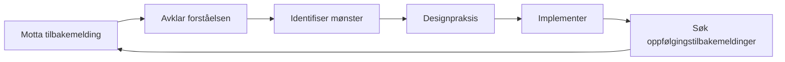

# Få og bruke tilbakemeldinger

Tilbakemeldinger er et av de kraftigste verktøyene for utvikling – og et av de mest underutnyttede. Denne siden lærer deg hvordan du aktivt søker tilbakemeldinger, mottar dem konstruktivt og gjør dem om til handlingsrettet forbedring.

---

## Hvorfor vi motsetter oss tilbakemeldinger

Før du lærer å søke tilbakemeldinger, bør du forstå hvorfor det er vanskelig:

### Egobeskyttelse

Hjernen din behandler kritikk av prestasjonene dine som en trussel mot identiteten din. Dette utløser defensive reaksjoner:
- Avviser tilbakemeldingen
- Å finne grunner til hvorfor personen tar feil
- Unngå lignende situasjoner i fremtiden

### Bekreftelsesskjevhet

Vi søker naturligvis informasjon som bekrefter det vi allerede tror. Hvis du tror du er en god peker, vil du legge merke til dine vellykkede poeng og bortforklare feilene.

### Veksttankegangskiftet

::: tip Omformuler tilbakemeldinger
**Fastlåst tankesett:** «Kritikk betyr at jeg har feil»
**Veksttankegang:** «Tilbakemeldinger er informasjon som hjelper meg å forbedre meg»

Forskjellen er ikke positivitet – det er nøyaktighet. Tilbakemelding er data, ikke vurdering.
:::

---

## Kilder til objektiv tilbakemelding

### 1. Kvantitative data

Tall lyver ikke eller myker opp sannheten:

| Metrisk | Hva det avslører |
|--------|-----------------|
| **Pekepresisjon %** | Teknisk grunnlinje og trender |
| **Nøyaktighet i første vs. sent spill** | Tretthets-/trykkeffekter |
| **Suksessrate for skyting** | Etter avstand, måltype, kampsituasjon |
| **Carreau-prosent** | Effektivitet ved risikotaking |

### 2. Lagkamerater

Lagkameratene dine ser deg i konkurranse – når selvoppfatningen din er minst nøyaktig:

**Hva du bør spørre om:**
- «Hvordan fremstår jeg for deg når vi ligger bak?»
- «Hva legger du merke til med tilnærmingen min i jevne kamper?»
- «Hva er én ting jeg kunne gjort for å bli en bedre lagkamerat?»

### 3. Motstandere

Samtaler etter kamp med pålitelige motstandere kan være avslørende:

**Hva du bør spørre om:**
- «Hva prøvde du å utnytte i spillet mitt?»
- «Var det noe som overrasket deg med måten jeg spilte på?»

### 4. Trenere/Erfarne spillere

Ekstern ekspertise gir perspektiver du ikke kan generere selv:

**Hva du bør spørre om:**
- «Hva er det største gapet mellom potensialet mitt og min nåværende prestasjon?»
- «Hvilket mønster ser du i bommene mine?»
- «Hva ville du prioritert hvis du skulle trene meg?»

### 5. Videoanalyse

Det mest objektive speilet som er tilgjengelig. Se [Videoanalyse](/no/utdanning/selvbevissthet/video) for detaljerte protokoller.

---

## Hvordan be om tilbakemelding effektivt

### SEEK-rammeverket

**S - Spesifikk**
Ikke spør: «Hvordan spilte jeg?»
Spør: «Hvordan så pekepresisjonen min ut i tredje omgang da vi lå bak?»

**E - Eksempler**
Spør: «Kan du gi meg et konkret eksempel?»
Dette tvinger frem konkrete tilbakemeldinger i stedet for generaliseringer.

**E - Utforskende**
Tilnærming med nysgjerrighet, ikke forsvar.
«Jeg prøver å forstå mine blindsoner. Hva kan jeg gå glipp av?»

**K - Snill (mot deg selv)**
Husk: Det er modig å søke tilbakemeldinger. Du jobber hardt.

### Timing er viktig

| Når | Best for | Unngå |
|------|----------|-------|
| **Rett etter** | Spesifikke tekniske observasjoner | Emosjonell bearbeiding |
| **Neste dag** | Balansert perspektiv, mønstre | Hvis detaljene har falmet |
| **Videoanmeldelse** | Objektiv analyse | Hvis det forsinker handlingen for lenge |

---

## Motta tilbakemeldinger uten forsvarsbevegelser

Når tilbakemeldinger kommer, vil hjernen din ønske å forsvare seg. Slik overstyrer du det:

### 3-sekundersregelen

Når du mottar tilbakemeldinger, **vent i 3 sekunder før du svarer**. Dette gir den rasjonelle hjernen din tid til å engasjere seg før den emosjonelle hjernen din reagerer.

### «Fortell meg mer»-teknikken

I stedet for å forsvare, si: «Fortell meg mer om det.»

Dette:
- Kjøper behandlingstid
- Viser at du verdsetter innspillet
- Avslører ofte rotinnsikten

### Separat mottakelse fra evaluering

**Trinn 1:** Motta (bare lytt)
**Trinn 2:** Avklar (sørg for at du forstår)
**Trinn 3:** Takk (anerkjenn gaven)
**Trinn 4:** Evaluer (senere, bestem deg privat for hva du skal gjøre)

Du trenger ikke å være enig i tilbakemeldinger umiddelbart. Du må bare motta dem med åpenhet.

---

## Protokollen for tilbakemeldingsrespons

Bruk dette når du mottar tilbakemeldinger:

1. **&quot;Takk for at du fortalte meg det.&quot;**
   - Ekte takknemlighet, selv om tilbakemeldingene svir

2. **&quot;Kan du gi meg et konkret eksempel?&quot;**
   - Går fra generelt til handlingsrettet

3. **&quot;Hva ville du foreslått at jeg prøver?&quot;**
   - Inviterer til partnerskap for forbedring

4. **&quot;Jeg skal tenke på det.&quot;**
   - Ærlig forpliktelse uten umiddelbar avtale

---

## Gjør tilbakemeldinger om til handling

Tilbakemeldinger uten handling er bare ubehagelig samtale.

### Tilbakemelding-til-handling-prosessen

### Handlingsmal

For hver handlingsrettet tilbakemelding:

| Element | Ditt svar |
|---------|---------------|
| **Tilbakemeldingene** | (Det som ble sagt) |
| **Mønsteret** | (Hvilket tilbakevendende problem avslører dette?) |
| **Handlingen** | (Hva spesifikt skal du øve på?) |
| **Tiltaket** | (Hvordan vet du om du har blitt bedre?) |
| **Tidslinjen** | (Når skal du vurdere på nytt?) |

---

## Å skape en tilbakemeldingskultur

### Med teamet ditt

- **Normaliser det:** Regelmessig tilbakemelding blir forventet, ikke eksepsjonell
- **Toveis gate:** Gi tilbakemeldinger for å motta dem på en komfortabel måte
- **Tidsavtaler:** «La oss debriefe etter kampene» kontra uoppfordret kritikk
- **Fokuser på detaljene:** «Jeg la merke til at X» er bedre enn «Du alltid Y»

### Med deg selv

- **Ukentlig selvevaluering:** Dedikert tid til å evaluere uken din
- **Skriftlig refleksjon:** Skriving skaper klarhet
- **Mønstersporing:** Se etter tilbakevendende temaer på tvers av flere kilder

---

## Den tilbakemeldingsresistente spilleren

Hvis du kjenner deg igjen i noe av dette, prioriter dette arbeidet:

::: warning Tegn på tilbakekoblingsmotstand
- Du kan alltid forklare hvorfor tilbakemeldingen ikke gjelder.
- Du søker bare tilbakemeldinger fra folk som er enige med deg
- Du føler deg angrepet når du mottar konstruktive innspill
- Du unngår folk som utfordrer din selvoppfatning
- Du rasjonaliserer dårlige resultater som eksterne faktorer
:::

Å bryte disse mønstrene krever bevisst innsats – men gevinsten er akselerert forbedring.

---

## Relatert innhold

- [Fordelen med selvinnsikt](/no/utdanning/selvinnsikt/) — Hvorfor selvinnsikt er viktig
- [Videoanalyse](/no/utdanning/selvinnsikt/video) — Objektiv selvobservasjon
- [Teamdynamikk](/no/utdanning/teamdynamikk/) — Kommunikasjon med lagkamerater
- [Mental styrke](/no/utdanning/mentalt-spill/mental-styrke/) — Håndtering av vanskelige sannheter

