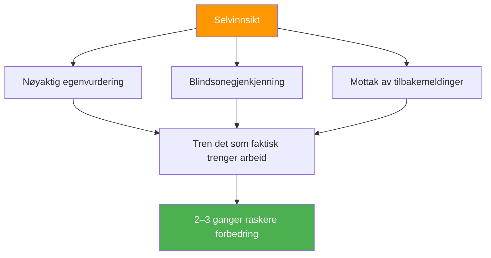

# Fordelen med selvinnsikt

::: tip Metaferdigheten som multipliserer alt
**Vekt: 400 poeng** — Spillere med nøyaktig selvoppfatning forbedrer seg 2–3 ganger raskere fordi de trener det som faktisk trenger arbeid.
:::

## Hvorfor dette er din skjulte multiplikator

> &quot;Du kan ikke forbedre det du ikke kan se.&quot;

De fleste spillere bruker timevis på å øve, men **øver de på de riktige tingene?** Selvinnsikt er metaferdigheten som sikrer at treningstiden din faktisk er effektiv.

### Forbedringsmultiplikatoreffekten



Uten selvinnsikt kan du:
- Øv på det du allerede er god på (føles bra, begrenset vekst)
- Gå glipp av tekniske feil du ikke kan se
- Feiltilskriv tap til eksterne faktorer
- Motstå tilbakemeldinger som kan hjelpe deg

Med selvinnsikt kan du:
- Identifiser faktiske svakheter nøyaktig
- Aksepter og integrer nyttig tilbakemelding
- Forstå hvordan press påvirker ditt spesifikke spill
- Kjenn dine mønstre under ulike forhold

---

## Selvinnsiktsparadokset

::: danger Den ubehagelige sannheten
Forskning viser konsekvent: De som trenger mer selvinnsikt tror vanligvis at de har utmerket selvinnsikt. De med høy selvinnsikt stiller stadig spørsmål ved seg selv og søker ekstern innspill.

**Hvilken er du?**
:::

Dette kalles **Dunning-Kruger-effekten** anvendt på selvoppfatning. Nettopp mangelen på bevissthet som holder deg tilbake, hindrer deg også i å se at du mangler bevissthet.

### Løsningen: Utvendige speil

Siden vi ikke fullt ut kan stole på vår indre oppfatning, trenger vi ytre speil:

| Speil | Hva det avslører |
|--------|-----------------|
| **Videoanalyse** | Teknisk virkelighet kontra hva du tror du gjør |
| **Ytelsesdata** | Mønstre du kanskje ikke legger merke til |
| **Tilbakemeldinger fra lagkamerater** | Hvordan du blir oppfattet under press |
| **Trenerobservasjon** | Ekspert øye på spillet ditt |

---

## Johari-vinduet for petanquespillere

Johari-vinduet er en psykologisk modell som kartlegger hva du og andre vet om spillet ditt:

```
                    Known to Self    Unknown to Self
                   ┌────────────────┬────────────────┐
 Known to Others   │     OPEN       │     BLIND      │
                   │  Arena         │  Spot          │
                   │                │                │
                   │ Your conscious │ What others    │
                   │ skills and     │ see but you    │
                   │ tendencies     │ don't          │
                   ├────────────────┼────────────────┤
 Unknown to Others │    HIDDEN      │   UNKNOWN      │
                   │    Facade      │   Potential    │
                   │                │                │
                   │ What you know  │ Undiscovered   │
                   │ but don't      │ capabilities   │
                   │ share          │                │
                   └────────────────┴────────────────┘
```

### Målet ditt: Utvid det «åpne» området

**1. Reduser blindsonene dine**
- Søk videoanalyse
- Be om spesifikk tilbakemelding
- Se etter mønstre i resultatene

**2. Del mer (Reduser skjult)**
- Si ifra til lagkameratene dine når du sliter
- Diskuter din tilnærming åpent
- Be om hjelp når det trengs

**3. Oppdag ditt ukjente potensial**
- Prøv nye tilnærminger
- Eksperiment i trening
- Press deg utenfor komfortsonen

---

## Selvinnsikt vs. selvkritikk

::: warning Kritisk skille
Selvinnsikt er **nøytral observasjon** av virkeligheten.
Selvkritikk er **negativ dom** av deg selv.

De er IKKE det samme.
:::

| Selvinnsikt | Selvkritikk |
|----------------|----------------|
| «Jeg gikk glipp av tre karuseller i dag» | «Jeg er forferdelig dårlig på karuseller» |
| «Jeg blir spent i jevne kamper» | «Jeg kveles alltid under press» |
| «Pekingen min er mindre nøyaktig når jeg er trøtt.» | «Jeg takler ikke lange turneringer» |
| «Jeg kommuniserer mindre når jeg taper» | «Jeg er en dårlig lagkamerat når jeg er stresset» |

**Forskjellen er viktig fordi:**
- Selvinnsikt fører til målrettet forbedring
- Selvkritikk fører til skam og unngåelse
- Selvinnsikt er faktabasert og spesifikk
- Selvkritikk er emosjonell og generalisert

---

## De tre nivåene av selvinnsikt

### Nivå 1: Teknisk selvinnsikt
*&quot;Hvordan presterer jeg egentlig?&quot;*

- Nøyaktighet under forskjellige forhold
- Tekniske utførelsesmønstre
- Fysisk tilstand påvirker ytelse

### Nivå 2: Psykologisk selvinnsikt
*&quot;Hvordan reagerer jeg mentalt og følelsesmessig?&quot;*

- Stressresponser og triggere
- Tillitssvingninger
- Fokusmønstre og distraherende faktorer

### Nivå 3: Sosial selvinnsikt
*&quot;Hvordan påvirker jeg andre, og hvordan ser de på meg?&quot;*

- Kommunikasjonsmønstre i teamet
- Lederøyeblikk (eller hull)
- Hvordan følelsene dine påvirker lagkameratene

---

## Selvvurdering: Din nåværende selvinnsikt

Vurder deg selv ærlig (1 = Aldri, 5 = Alltid):

| Spørsmål | Poengsum |
|----------|-------|
| Jeg kan nøyaktig forutsi prestasjonen min i ulike situasjoner | /5 |
| Jeg vet hvilke forhold som gjør at jeg underpresterer | /5 |
| Jeg forstår hvordan lagkamerater oppfatter meg under press | /5 |
| Jeg tar imot og integrerer kritisk tilbakemelding | /5 |
| Min selvvurdering samsvarer med trenerens/lagkameratenes vurdering | /5 |
| Jeg kan objektivt analysere prestasjonen min uten emosjonelle reaksjoner | /5 |
| Jeg merker at min egen mentale tilstand endrer seg under konkurranser | /5 |

**Poengsum:**
- **28–35:** Høy selvinnsikt (men vær ydmyk – fortsett å søke innspill)
- **21–27:** Moderat selvinnsikt (godt grunnlag å bygge videre på)
- **14–20:** Selvinnsiktsgap (denne modulen er kritisk for deg)
- **Under 14:** Vesentlige blindsoner (prioriter dette arbeidet)

---

## I denne modulen

### [Å få og bruke tilbakemeldinger](/no/utdanning/selvinnsikt/tilbakemeldinger)
- Kilder til objektiv tilbakemelding
- Hvordan be om tilbakemeldinger effektivt
- Motta tilbakemeldinger uten å være forsvarsfull
- Gjør tilbakemeldinger om til handling

### [Videoanalyse for selvoppdagelse](/no/utdanning/selvinnsikt/video)
- Hva som skal tas opp og når
- Hva du skal se etter i opptakene dine
- Sammenligning av selvoppfatning med videovirkelighet
- Protokoller for videoanalyse

---

## Rask seier: De tre spørsmålene

Etter neste treningsøkt eller kamp, spør deg selv:

1. **Hva syntes jeg jeg gjorde bra?** (Vær spesifikk)
2. **Hva ville en objektiv observatør si?** (Skill persepsjon fra virkelighet)
3. **Hva er én ting jeg unngår å se på?** (Finn blindsonen)

Skriv ned svarene dine. Sammenlign dem over tid. Mønstre vil dukke opp.

---

## Relaterte faktorer

- [Mentalt spill](/no/utdanning/mentalt-spill/) — Selvinnsikt støtter mental trening
- [Teamdynamikk](/no/utdanning/teamdynamikk/) — Forstå hvordan andre oppfatter deg
- [Motivasjon](/no/utdanning/motivasjon/) — Kjenn dine virkelige drivkrefter
- [Teknikk](/no/utdanning/teknikk/) — Videoanalyse avslører teknisk sannhet

