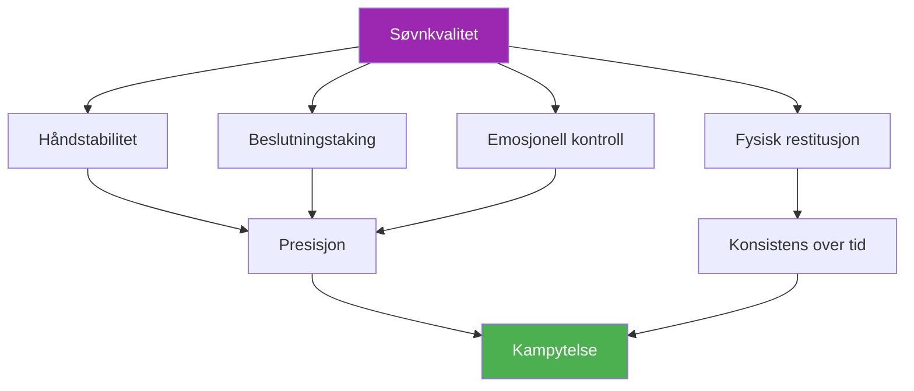

# Søvn og restitusjon

::: tip En kritisk ytelsesfaktor
**Vekt: 400 poeng** – Søvn er den mest undervurderte faktoren i presisjonssport. Hendene, avgjørelsene og følelsene dine avhenger av god hvile.
:::

## Den skjulte ytelsesfordelen

> «Spilleren som sov bedre vinner ofte.»

I motsetning til utholdenhetsidretter, hvor utøvere noen ganger kan &quot;presse gjennom&quot; tretthet, er **presisjon ikke til forhandlingspunkt**. Din evne til å plassere en kule innenfor centimeter fra cochonnetten avhenger av systemer som er utsøkt følsomme for søvnmangel:

- Finmotorisk kontroll
- Beslutningstaking under press
- Emosjonell regulering
- Minnekonsolidering

Denne modulen avslører hvorfor søvn kan være ditt største uutnyttede konkurransefortrinn.

---

## Hvordan søvn påvirker spillet ditt

### Håndstabilitet og motorisk kontroll

Forskning viser at finmotorikk reduserer **10–15 % av akkumulert søvnmangel per time**. For petanque-spillere manifesterer dette seg som:

- **Økte mikrotremorer** – Umerkelig for deg, men påvirker frigjøringskonsistensen
- **Redusert propriosepsjon** — Mindre bevissthet om greptrykk og armposisjon
- **Saktere feilretting** – Kroppen din klarer ikke å gjøre mikrojusteringene som gir nøyaktighet

::: warning Hvorfor peking lider først
Peking krever den beste motorkontrollen av alle skudd. Det er ofte den første ferdigheten som svekkes når du sover for lite – selv når du «føler deg bra».
:::

### Beslutningstaking og taktikk

Din prefrontale cortex – ansvarlig for planlegging, risikovurdering og strategisk tenkning – er svært følsom for søvnmangel:

- **Risikovurderingen blir svekket** – Du kan forsøke doser med lavere prosentandel
- **Taktisk fleksibilitet avtar** — Vanskeligere å tilpasse seg midt i spillet
- **Fenomenet «02:00-avgjørelsen» – Valg som virker fornuftige når man er sliten, ser tvilsomme ut i ettertid.**

### Emosjonell regulering

Søvnmangel forårsaker **hyperaktivitet i amygdala**, hjernens emosjonelle senter:

- Trykket føles mer intenst
- Frustrasjonen etter bommer forsterkes
- Restitusjon etter tilbakeslag tar lengre tid
- Lagdynamikken kan lide av kortvarig lunte

### Minnekonsolidering

Motorhukommelsen konsolideres under søvn – spesielt i dyp søvnfaser:

- **Øvelse uten søvn = begrenset retensjon**
- **Å «sove på det» fungerer faktisk** for teknikkendringer
- Formelen: **Kvalitetspraksis + Kvalitetssøvn = Permanent ferdighet**

---

## Forbindelsen mellom søvn og ytelse

---

## Søvngjeldens virkelighet

### Hva er søvngjeld?

Søvngjeld er **kumulativ**. Å gå glipp av én times søvn påvirker ikke bare den dagen – den akkumuleres:

| Dager | Timer korte | Total gjeld | Ytelsespåvirkning |
|------|-------------|------------|-------------------|
| 1 | -1 time | 1 time | Minimal |
| 3 | -1 time/dag | 3 timer | Merkbar |
| 7 | -1 time/dag | 7 timer | Betydelig |
| 14 | -1 time/dag | 14 timer | Alvorlig |

::: danger Helgemyten
Du kan ikke ta igjen det tapte i helgene. Ekstra søvn hjelper, men det sletter ikke oppsamlet gjeld. Konsistens er viktigere enn sporadiske lange søvnpauser.
:::

### Hvor mye trenger du?

«8 timer for alle» er en myte. Individuelle behov varierer:

- **De fleste voksne:** 7–9 timer
- **Noen fungerer bra på:** 6–7 timer
- **Noen krever:** 9+ timer

**Finne DITT optimale søvnbehov:**
1. I løpet av ferien (uten alarm), la deg selv sove naturlig i 5–7 dager
2. Etter den første «ta igjen»-fasen, legg merke til hvor lenge du sover
3. Det er sannsynligvis nært ditt biologiske behov

---

## Vitenskapen i korte trekk

### Søvnstadier som betyr noe

| Scene | Funksjon | Relevans for petanque |
|-------|----------|-------------------|
| **Dyp søvn (N3)** | Fysisk restitusjon, veksthormon | Muskelgjenoppretting, energigjenoppretting |
| **REM-søvn** | Emosjonell bearbeiding, minnekonsolidering | Bevaring av motoriske ferdigheter, emosjonell motstandskraft |
| **Lett søvn (N1–N2)** | Overgang, vedlikehold | Støtter den overordnede arkitekturen |

### Viktige forskningsfunn

1. **Stanford Basketball Study** — Spillere som forlenget søvnen til 10 timer forbedret straffekastpresisjonen med 9 % (Mah et al., 2011)
2. **Nøyaktighet i tennisserve** — Søvnrestriksjon reduserte servenøyaktigheten med 53 % (Reyner &amp; Horne, 2013)
3. **Metaanalyse av reaksjonstid** — Selv én natt med dårlig søvn reduserer reaksjonstiden med 300 % (Lim &amp; Dinges, 2010)

---

## Selvvurdering: Din søvnvirkelighet

Vurder deg selv ærlig (1-5):

| Spørsmål | Poengsum |
|----------|-------|
| Jeg får like mye søvn de fleste netter | /5 |
| Jeg sovner i løpet av 15-20 minutter | /5 |
| Jeg våkner sjelden om natten | /5 |
| Jeg våkner og føler meg uthvilt | /5 |
| Jeg opprettholder energien gjennom hele dagen | /5 |

**Poengsum:**
- **20–25:** Utmerkede søvnvaner
- **15–19:** Bra, men rom for forbedring
- **10–14:** Søvn påvirker sannsynligvis prestasjonene dine
- **Under 10:** Søvnforbedring bør prioriteres

---

## I denne modulen

### [Søvnprotokoller for konkurranser](/no/utdanning/søvn/konkurranse)
- Uken før konkurransen
- Reise- og tidssonehåndtering
- Protokoller for powernapping
- Nødstrategier for «jeg fikk ikke sove»

### [Søvnhygiene for idrettsutøvere](/no/utdanning/søvn/vaner)
- De 10 grunnprinsippene for søvn
- Maler for kveldsrutiner
- 30-dagers søvnutfordring
- Feilsøking av vanlige problemer

---

## Rask seier: I kveld

Hvis du ikke gjør noe annet, implementer disse to endringene i kveld:

1. **Angi en konsistent oppvåkningstid** – Samme tid i morgen som i dag, innen 30 minutter
2. **Ingen skjermer 30 minutter før leggetid** — Les, strekk deg eller forbered deg til morgendagen i stedet

Disse to endringene alene kan forbedre søvnkvaliteten i løpet av få dager.

---

## Relaterte faktorer

Søvn er knyttet til alt annet i fremføringen din:

- [Spenningsmestring](/no/utdanning/spenning/) — PMR og avslapningsteknikker hjelper søvnen
- [Ernæring](/no/utdanning/ernæring/) — Måltidspunkt og blodsukker påvirker søvnkvaliteten
- [Mentalt spill](/no/utdanning/mentalt-spill/) — Søvn støtter kognitiv funksjon og emosjonell kontroll
- [Selvinnsikt](/no/utdanning/selvinnsikt/) — Å gjenkjenne når tretthet påvirker spillet ditt

