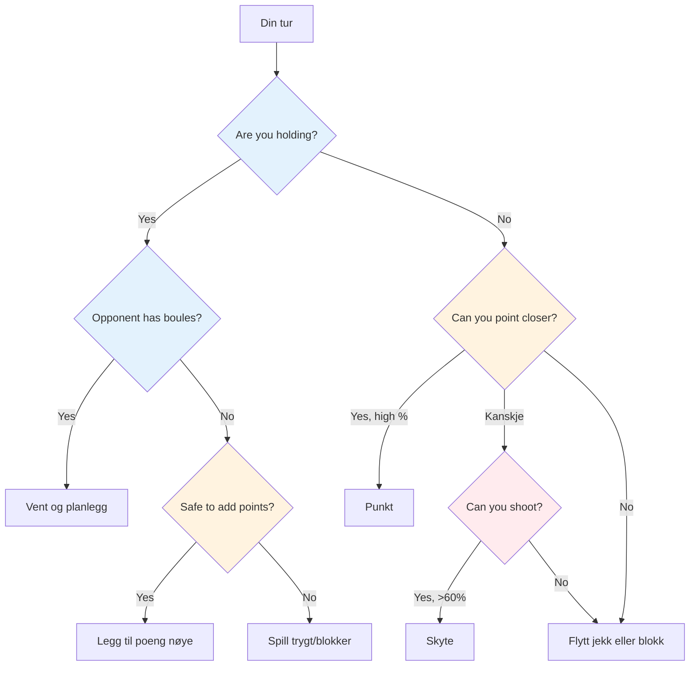

# Taktisk tenkning i petanque
<AdBanner />


På elitenivå forutsettes teknisk dyktighet. Det som skiller vinnere fra resten er taktisk intelligens – å vite hvilket kast man skal forsøke og når. De beste spillerne leser spillet flere trekk fremover og utnytter enhver fordel.

::: tip Kjerneprinsippet
**På elitenivå er forskjellen sjelden teknikk – det er beslutningstaking.** Laget som gjør færrest taktiske feil vinner.
:::

## Rammeverk for rask beslutning



## Den taktiske tankegangen

### Tenk i sannsynligheter

Hvert kast har en sannsynlighet for å lykkes. God taktikk betyr å velge kast der:
- Sannsynligheten for suksess er høy nok
- Belønningen rettferdiggjør risikoen
- Fiasko gjør ikke så vondt

**Eksempel på avgjørelse:**
- Vanskelig skudd: 40 % suksess, får 3 poeng
- Sikkerhetspoeng: 80 % suksess, gir 1 poeng

Hvilken er best? Det avhenger av poengsummen, situasjonen og selvtilliten din.

### Vurder alle alternativer

Før hvert kast, vurder følgende:
1. **Poeng:** Plasser en kule i nærheten av graten
2. **Skyt:** Fjern en motstanders kule
3. **Blokkering:** Plasser en kule for å blokkere
4. **Flytte jekken:** Slå jekken med vilje
5. **Offer:** Aksepter en dårlig posisjon for å sette opp senere

Ikke velg det åpenbare valget som standard. Tenk gjennom alternativer.

### Les situasjonen

Faktorer å vurdere:
- Nåværende resultat (hvem leder, med hvor mye)
- Gjenværende boule (dine og deres)
- Posisjon i terrenget
- Motstandertendenser
- Teamets styrker

## Kjernetaktiske prinsipper

::: tip De 6 taktiske prinsippene
1. **Kontroller jekken** – Posisjon er makt
2. **Avstands- og overflatestrategi** - Tilpass deg forholdene
3. **Dikter spillestilen** – Tving frem styrkene dine
4. **Håndter risiko kontra belønning** - Match risiko med situasjon
5. **Bruk boule klokt** - Noen ganger slipper man inn 1 for å unngå 3
6. **Tenk fremover** - Visualiser de neste 2–3 trekkene
:::

### Prinsipp 1: Kontroller jekken

Laget som kontrollerer knektposisjonen har en betydelig fordel.

**Måter å kontrollere:**
- Vinn retten til å kaste knekt
- Flytt jekken til gunstig terreng
- Beskytt jekken mot å bli flyttet

**Strategi for plassering av knekt:**
- Kort knekt: Foretrekker skyting, lettere å treffe mål på nært hold
- Lang knekt: Foretrekker å peke, skyting blir vanskeligere
- Nær hindringer: Skaper utfordringer for motstandere

**Utnytte motstanderens svakheter:**
- Observer peketeknikken deres – bruker de alltid samme bue eller stil?
- Hvis de ikke kan tilpasse seg (f.eks. bare rulle, bare lobbe), plasserer du målestokken for å tvinge frem ukomfortable kast.
- Plasser jekken på avstander eller posisjoner som avslører begrensningene
- Utnytt bare en svakhet hvis du ikke deler den – vurder ditt eget teams styrker først.

### Prinsipp 2: Avstands- og overflatestrategi

Den optimale balansen mellom å peke og skyte avhenger i stor grad av avstand og terreng:

::: info Avstandsstrategi
**Kort (6–7 m):** Foretrekker skyting – lettere å treffe på kort hold
**Middels (7–9 m):** Overflaten er viktigst
- Glatt overflate → skyt mer
- Ru overflate → pek mer

**Lang (9–11 m):** Fordel med peking – skytepresisjonen synker betydelig
:::

```mermaid
graph LR
    A[Avstand] --> B[6–7 m kort]
    A --> C[7–9 m middels]
    A --> D[9–11 meter lang]

    B --> E[Skyt mer]
    C --> F{Surface?}
    D --> G[Pek mer]

<AdInArticle />

    F -->|Smooth| H[Skyt mer]
    F -->|Rough| I[Pek mer]

    style E fill:#ffcdd2
    style H fill:#ffcdd2
    style I fill:#c8e6c9
    style G fill:#c8e6c9
```

**Din personlige skyteprosent:**
- Hvis du skyter med en suksessrate på over 75 %, skyt oftere
- Vurder å skyte for å redusere motstanderens poeng (selv om du ikke tar ledelsen)
- Å skyte for å redusere motstanderens scoringskuler (fra 3 ned til 1) er verdifull skadekontroll.

**Skyting som en langsiktig strategi:**
- Hvis du skyter med alle kulene dine, bør du vurdere den samlede suksessraten.
- Beregn: når du treffer alle slagene, får du betydelig flere poeng
- Selv å bomme på noen skudd kan redusere motstanderens poeng.
- Eksempel: Bommer på 1–2 skudd, men fjerner fortsatt trusler, og vinner deretter stort når du treffer alle
- Dette er en kalkulert risiko – aksepter noen tapte gevinster for større gevinster når det fungerer

### Prinsipp 3: Dikter spillestilen

På elitenivå kan de fleste spillere både peke og skyte bra. Nøkkelen er å tvinge spillet inn i lagets sterkeste stil.

**Hvis laget ditt har sterke skyttere:**
- Skyt så mye som mulig – bruk fordelen din
- Ikke sløs bort kreftene dine ved å peke når du kan dominere ved å skyte
- Kontroller spillet ved å fjerne trusler før de hoper seg opp
- Kort til middels jack holder skytingen effektiv

**Mot like sterke skyttere:**
- Unngå dem enkle mål ved å skyte først
- Spill på lang avstand for å redusere alles skyteprosent
- Laget som skyter først styrer ofte slutten

**Hvis motstandere skyter mer enn deg:**
- Spill lang knekt konsekvent – selv eliteskyttere mister prosentpoeng ved 10m+
- Tving frem en poengkamp der du kan konkurrere
- Få dem til å skyte fra vanskelige vinkler eller gjennom hindringer

### Prinsipp 4: Håndter risiko kontra belønning

| Situasjon | Risikotoleranse |
|-----------|---------------|
| Komfortabelt fremover | Lav – beskytt ledningen din |
| Lukk spillet | Middels - kalkulerte risikoer |
| Betraktelig bak | Høy - må ta sjanser |
| Endelig slutt | Avhenger av poengforskjellen |

### Prinsipp 5: Bruk boulespillet ditt klokt

Boule-ledelse skiller elitespillere:
- Når motstanderen går tom for kuler, bestem deg nøye: legg til poeng eller spill trygt?
- Når du ligger bak, beregn om du realistisk sett kan ta poenget tilbake
- Noen ganger er det bedre å gi bort ett poeng enn å kaste bort kuler og gi opp tre.
- Hold oversikt over gjenværende kuler – dine og deres – til enhver tid

### Prinsipp 6: Tenk flere trekk fremover

Elitenkning:
- Før du kaster, visualiser de neste 2–3 kulene fra begge lag
- Hva er motstanderens beste respons hvis du lykkes? Hvis du mislykkes?
- Hvordan legger dette kastet grunnlaget for ditt neste kast?
- Tenk på sluttspillscenarioet fra nåværende posisjon

## Vanlige taktiske situasjoner

### Du holder, og motstanderen har igjen bowls

Du må vente – det er deres tur til å kaste. Bruk denne tiden til å:
- Analyser hva de sannsynligvis vil gjøre
- Planlegg responsen din på mulige kast
- Hold deg fokusert og klar

### Du holder, og motstanderen har ikke mer boule

Nå kan du spille de resterende kulene dine. **Alternativer:**
- Legg til flere poeng hvis du kan gjøre det trygt
- Blokk for å beskytte mot jekkbevegelse
- Spill trygt – ikke risiker å snu en 2-poengsseier til et tap

**Viktig avgjørelse:** Er risikoen ved å legge til poeng verdt å potensielt åpne opp spillet?

### Du holder ikke

Du må kaste. **Alternativer:**
- Poeng nærmere enn deres beste boule
- Skyt sin beste kule
- Flytt graten til kulene dine
- Blokker for å begrense poengsummen deres (hvis du ikke kan ta poenget)

**Beslutningsfaktorer:** Din skyteprosent, antall gjenværende kuler (begge lag), nåværende resultat

### Siste boule-situasjoner

Når du har den siste kulen:
- Maksimalt trykk, men også maksimal kontroll
- Ta deg god tid – vurder alle alternativer
- Tenk: pek, skyt eller flytt jekken?
- Utfør med full forpliktelse

Når motstanderen har siste kule:
- Du har gjort det du kan – aksepter resultatet
- Hvis mulig, skap en situasjon uten enkel løsning for dem
- Flere trusler er bedre enn én

## Å lese motstanderne dine

På elitenivå er speiding viktig. Kjenn motstanderne dine før du spiller.

### Intelligens før kampen
- Hva er deres foretrukne spillestil (skyting kontra pekende lag)?
- Hvem er deres sterkeste skytter? Pointer?
- Hvilke avstander foretrekker de?
- Hvordan presterer de under press i finaler?

### Observasjon i kampen
- Spor suksessratene deres gjennom hele kampen
- Legg merke til om noen har en fridag
- Identifiser hvem som håndterer press godt og hvem som ikke gjør det
- Juster plasseringen av jekken basert på hva du observerer

### Utnytt det du finner
- Sikt på de svakere spillerne når det er mulig
- Tving den svake skytteren deres til å skyte, eller den svake pekeren deres til å peke
- Hvis noen sliter, fortsett å legge press på dem

## I denne delen

- **[Sannsynlighetsbaserte avgjørelser](/no/utdanning/taktikk/sannsynlighet)** - Bruk av matematikk for å ta bedre valg

## Sammendrag: Alle taktiske regler

::: tip Regel nr. 1: Sannsynlighetsregelen
**Velg kast der sannsynligheten for suksess rettferdiggjør risikoen.**
Vurder: suksessrate, belønning hvis vellykket, kostnad hvis mislykket
:::

::: tip Regel nr. 2: Jack Control-regelen
**Laget som kontrollerer knektposisjonen har fordelen.**
Bruk knektplassering for å utnytte motstanderens svakheter og favorisere dine egne styrker
:::

::: tip Regel nr. 3: Avstandsregelen
**Kort avstand favoriserer skyting, lang avstand favoriserer peking.**
Middels avstand: Underlagets kvalitet bestemmer balansen
:::

::: tip Regel nr. 4: Stilregelen
**Tving spillet inn i lagets sterkeste stil.**
Hvis du er en god skytter, skyt mer. Ikke kast bort fordelen din.
:::

::: tip Regel nr. 5: Boulehåndteringsregelen
**Noen ganger er det bedre å slippe inn ett poeng enn å risikere tre.**
Vit når du skal redusere tapene dine og spare kulene til neste omgang
:::

::: tip Regel nr. 6: Regelen om å tenke fremover
**Visualiser de neste 2–3 trekkene fra begge lag.**
Hva er deres beste svar? Hvordan forbereder dette ditt neste kast?
:::

::: tip Regel nr. 7: Speiderregelen
**Kjenn motstanderne dine før du spiller.**
Spor preferansene deres, suksessrater og pressresponser
:::

## Viktig konklusjon

> På elitenivå er forskjellen sjelden teknikk – det er beslutningstaking. Laget som gjør færrest taktiske feil vinner.

Les spillet. Kjenn dine styrker. Utnytt deres svakheter. Utfør med selvtillit.

<AdBanner />
