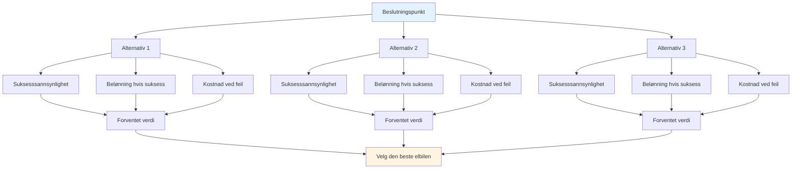

# Sannsynlighetsbasert beslutningstaking
<AdBanner />

Elite taktisk tenkning bruker sannsynlighet for å ta bedre beslutninger. I stedet for å gjette eller gå på magefølelsen, tenker du systematisk om alternativene dine.

::: tip Den store ideen
**Tenk i sannsynligheter, ikke i sikkerhet.** Den beste avgjørelsen er ikke alltid den mest aggressive eller sikreste – det er den som gir deg best forventet verdi i mange lignende situasjoner.
:::

## Det grunnleggende rammeverket

Hvert kast har tre komponenter:

| Komponent | Spørsmål | Eksempel |
|-----------|----------|---------|
| **Sannsynlighet for suksess** | Hvor sannsynlig er det at jeg gjennomfører dette? | 70 % suksessrate på denne distansen |
| **Belønning hvis du lykkes** | Hva oppnår jeg? | Vinn poenget, få posisjonen |
| **Kostnad hvis det ikke lykkes** | Hva taper jeg? | Gi motstanderen et enkelt poeng |

::: info Formelen
**Forventet verdi = (Sannsynlighet × Belønning) - ((1 - Sannsynlighet) × Kostnad)**

Gode beslutninger maksimerer forventet verdi over tid.
:::

## Tenking i sannsynligheter

Når du skal bestemme deg mellom alternativene, bør du vurdere:
- Hva er min realistiske suksessrate for hvert alternativ?
- Hva tjener jeg på hvis det fungerer?
- Hva koster det hvis det mislykkes?
- Hvordan påvirker spillsituasjonen valget mitt?

Det beste alternativet er ikke alltid det mest aggressive eller sikreste – det er det som gir deg det beste resultatet i mange lignende situasjoner.

## Kjenn tallene dine

For å bruke sannsynlighetstenkning må du vite dine faktiske suksessrater:

| Kastetype | Avstand | Din suksessrate |
|------------|----------|-------------------|
| Punkt (nært) | 6–7 måneder | ___% |
| Punkt (middels) | 8–9 måneder | ___% |
| Punkt (lang) | 10m+ | ___% |
| Skyt (nært) | 6–7 måneder | ___% |
| Skyt (middels) | 8–9 måneder | ___% |
| Skyt (langt) | 10m+ | ___% |

<AdInArticle />

Følg med på disse i trening. Vær ærlig – de fleste spillere overvurderer suksessraten sin.

## Justering for forhold

Basisprisene dine endres basert på:

| Faktor | Effekt på suksessrate |
|--------|----------------------|
| Ukjent terreng | -10 til -20 % |
| Presssituasjon | -5 til -15 % |
| Utmattelse | -5 til -10 % |
| Selvtillit (høy) | +5 til +10 % |
| Nylig suksess | +5 % |
| Nylig feil | -5 til -10 % |

Vær realistisk om disse justeringene.

## Boule-fordelprinsippet

Når du har flere kuler igjen enn motstanderen din:

**Prioritet 1: Sikre punktet**
- Først, sørg for at du holder minst ett poeng
- Ikke bli grådig før du har sikret deg det grunnleggende

**Prioritet 2: Maksimer poeng med kalkulert risiko**
- Når du holder, vurder om du kan legge til flere poeng
- Hvert ekstra kast er en risiko/belønningsbeslutning
- Ikke gjør en sikker 2-poengsseier til et tap ved å overanstrenge deg

**Færre kuler igjen:** Du må sørge for at hvert kast teller. Sikre spill er kanskje ikke nok – vurder alternativer med høyere belønning for å komme tilbake til slutt.

## &quot;Une Boule Devant&quot;-prinsippet

En kule foran målgriffen (mellom målgriffen og motstanderen) er ekstremt verdifull:
- Den blokkerer direkte pekelinjer
- Det tvinger motstanderne til å gå rundt eller over
- Den kan avlede innkommende kuler
- Det er en «pengekule» – verdt å beskytte

**Taktisk implikasjon:** Noen ganger er det bedre å plassere en blokkerende kule enn å prøve å komme nærmest.

## Risikotoleranse etter spillstat

### Med tidsbegrensning

Når man spiller med en tidsbegrensning, spiller poengforskjellen en rolle:

| Poengsituasjon | Risikotilnærming |
|-----------------|---------------|
| Leder med 4+ | Svært konservativ – beskytt bly, kjør klokken |
| Leder med 1-3 | Konservativ – ikke gi bort poeng |
| Bundet | Balansert - kalkulerte risikoer |
| Bak med 1-3 | Aggressiv – trenger å vinne terreng |
| Bak med 4+ | Veldig aggressiv - må ta sjanser, tiden renner ut |

### Uten tidsbegrensning

Når det ikke er tidspress:
- Hold deg til kampplanen din – ikke bytt strategi bare på grunn av resultatet
- Poengsummen vil svinge – stol på tilnærmingen din
- Vurder bare å endre kampplanen din hvis det tydeligvis ikke fungerer mot denne motstanderen.
- Panikkanfall når man er bakpå gjør ofte ting verre

### Justeringer ved sluttspillet

**Hvis du vinner denne enden, vinner du spillet:**
- Vær mer konservativ
- Ikke risiker å gi bort flere poeng
- Et enkelt poeng kan være nok

**Hvis du taper denne enden, taper du spillet:**
- Ta større risikoer
- Må score flere poeng
- Trygt spill vil ikke redde deg

## Vanlige sannsynlighetsfeil

### 1. Overdreven selvtillit
«Jeg klarer det skuddet» – men klarer du det 7 av 10 ganger? Vær ærlig.

### 2. Ignorering av basisrenter
Skuddprosenten din endres ikke fordi øyeblikket er viktig.

### 3. Feilslutningen med nedbrutte kostnader
«Jeg har allerede bommet to ganger, jeg burde fortsette å skyte» – hvert kast er uavhengig.

### 4. Resultatskjevhet
Et risikabelt skudd som fungerte var fortsatt risikabelt. Et sikkert spill som mislyktes var fortsatt korrekt.

### 5. Ignorer motstanderens alternativer
Tenk på hva de vil gjøre etter kastet ditt, enten det var vellykket eller ikke.

## Praktisk anvendelse

### Før hvert kast

1. **Identifiser alternativer** (pek, skyt, blokker osv.)
2. **Estimer sannsynligheten for suksess** for hver
3. **Vurder utfall** (suksess og fiasko)
4. **Faktor i kampens tilstand** (resultat, gjenværende kuler)
5. **Velg** alternativet med best forventet verdi
6. **Forplikt deg fullt ut** – ingen tvil under utførelsen

### Bygge intuisjon

Over tid blir sannsynlighetstenkning intuitiv:
- Spor resultatene dine ærlig
- Gjennomgå avgjørelser etter kampene
- Legg merke til mønstre i suksessratene dine
- Juster din mentale modell

## Viktig konklusjon

> Gode avgjørelser fører ikke alltid til gode resultater. Men gode avgjørelser over tid fører til bedre resultater.

Tenk i sannsynligheter. Kjenn tallene dine. Gjør det smarte spillet, ikke det håpefulle.

<AdBanner />
