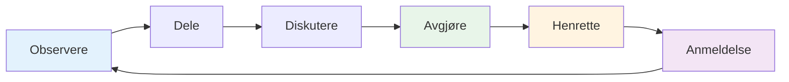

# Teamkommunikasjon
<AdBanner />

Effektiv kommunikasjon er det som forvandler en gruppe individer til et team. I petanque, hvor strategien stadig endres og presset er høyt, kan måten du kommuniserer på avgjøre resultatet.

::: tip Den store ideen
**Kommunikasjon er det som forvandler individer til et team.** Tydelig, spesifikk og støttende kommunikasjon under press skiller gode team fra fantastiske team.
:::

## Kommunikasjonssyklusen

God teamkommunikasjon følger en syklus:

| Skritt | Handling | Eksempel |
|------|--------|---------|
| **Observere** | Legg merke til hva som skjer | Terreng, posisjoner, motstandere |
| **Dele** | Fortell lagkameratene hva du ser | &quot;Jorden skråner der igjen&quot; |
| **Diskutere** | Utvekslingsperspektiver | &quot;Bør jeg blokkere eller gå for poeng?&quot; |
| **Avgjøre** | Enig om tilnærming | &quot;La oss prøve den høye lobben&quot; |
| **Henrette** | Gjør det med engasjement | Fullt fokus på kastet |
| **Anmeldelse** | Lær av resultatet | «Det fungerte bra» eller «Neste gang...» |

## Når man skal kommunisere

### Før hver ende
- Vurder terrenget sammen
- Diskuter generell tilnærming
- Avklar hvem som kaster når
- Sett tonen (rolig, fokusert)

### Under slutten
- Del observasjoner (&quot;Bakken skråner der igjen&quot;)
- Koordinasjonsstrategi («Bør jeg prøve å blokkere eller gå for poenget?»)
- Tilby støtte («Ta deg god tid, du klarer dette»)
- Juster planene etter hvert som situasjonen endrer seg

### Mellom endene
- Rask oppsummering (hva fungerte, hva fungerte ikke)
- Tilbakestill mentalt
- Gjør deg klar til neste slutt
- Hold kontakten som et team

### Etter kampen
- Fullstendig debriefing (når det er aktuelt)
- Anerkjenn bidrag
- Identifiser lærdommer
- Oppretthold forholdet

## Hvordan kommunisere

### Vær tydelig og spesifikk

**Vag:** «Prøv å komme nær»
**Fjern:** «Sikt mot venstre side av jekken, ca. 20 cm ut»

**Vag:** «Godt forsøk»
**Klar:** «God vekt, bare litt til venstre for linjen»

### Vær konstruktiv

Fokuser på løsninger, ikke problemer:

**Problemfokusert:** «Du bommer stadig til høyre»
**Løsningsfokusert:** «Kanskje prøve å sikte litt mer til venstre for å kompensere?»

### Vær støttende

Tonen din er like viktig som ordene dine:
- Hold deg rolig, selv når du er frustrert
- Bruk oppmuntrende kroppsspråk
- Anerkjenn innsatsen, ikke bare resultatene
- Bygg opp, ikke riv ned

### Lytt aktivt

Kommunikasjon er toveis:
- Gi full oppmerksomhet når lagkamerater snakker
- Still oppklarende spørsmål
- Anerkjenn det du har hørt
- Ikke avbryt eller avvis

<AdInArticle />

## Kommunikasjonsutfordringer

### Uenighet om strategi

**Dårlig tilnærming:**
- Insister på din vei
- Bli defensiv
- Gi etter bittert
- Krangle underveis i spillet

**Bedre tilnærming:**
1. Del ditt perspektiv tydelig
2. Lytt fullt ut til dem
3. Diskuter kort fordeler og ulemper
4. Bestem sammen (eller overlat til utpekt leder)
5. Forplikt deg fullt ut til avgjørelsen
6. Gjennomgang etter kampen

### Etter en lagkamerats feil

**Hva de trenger:**
- Rask bekreftelse
- Tillatelse til å gå videre
- Tillit til at du fortsatt stoler på dem
- Fokuser på neste kast

**Hva skal man si:**
- &quot;Ingen problem, neste&quot;
- &quot;Tøff pause, du har den neste&quot;
- &quot;Vi er fortsatt inne i dette&quot;
- *Noen ganger er bare et nikk eller et klapp nok*

**Hva du IKKE skal si:**
- Ingenting (stillhet føles som dom)
- «Det er greit» (kan høres avvisende ut)
- Alt om hva som gikk galt (ikke nå)
- Synlig frustrasjon (kroppsspråk teller)

### Når du gjør en feil

**Hva du skal gjøre:**
- Kort takknemlighet (&quot;Min feil&quot;)
- Ikke unnskyld for mye
- Ikke kom med unnskyldninger
- Tilbakestill og fokuser på neste kast
- Stol på at lagkameratene dine støtter deg

### Spenning i laget

Hvis spenningen bygger seg opp under en kamp:
1. Innse at det skjer
2. Ta pusten før du svarer
3. Fokuser på spillet, ikke konflikten
4. Ta det opp ordentlig etter kampen
5. Ikke la det påvirke spillet ditt

## Ikke-verbal kommunikasjon

Mye av teamkommunikasjonen er ikke-verbal:

### Positive signaler
- Øyekontakt
- Nikker
- Tommel opp
- Avslappet holdning
- Beveger seg mot lagkamerater
- Smilende (når det passer)

### Negative signaler (unngå disse)
- Øynerulling
- Vender seg bort
- Kryssede armer
- Sukking
- Rister på hodet
- Anspent kroppsspråk

**Husk:** Lagkameratene dine ser alt. Kroppsspråket ditt påvirker selvtilliten og prestasjonene deres.

## Å bygge kommunikasjonsvaner

### Praksiskommunikasjon

Ikke vent på at konkurrentene skal kommunisere:
- Øv på strategiske diskusjoner i opplæringen
- Gi hverandre tilbakemeldinger regelmessig
- Utvikle lagspråket ditt
- Bygg komfort med ærlige samtaler

### Utvikle teamsignaler

Noen lag utvikler stenografi:
- Håndsignaler for strategi
- Kodeord for situasjoner
- Raske fraser med felles betydning

### Regelmessige innsjekkinger

Utenom spill:
- Hvordan jobber vi sammen?
- Hva går bra?
- Hva kunne vært bedre?
- Noen problemer som må tas opp?

## Kapteinens rolle

Hvis teamet ditt har en utpekt leder:

**Kapteinens ansvar:**
- Endelig avgjørelse når teamet er uenig
- Setter tonen og energien
- Håndtering av teamdynamikk
- Å holde fokus under press

**Alle andre:**
- Del ditt perspektiv
- Støtt avgjørelsen når den er tatt
- Bidra til å opprettholde teamenergien
- Ta ansvar for din rolle

## Viktig konklusjon

> Gode team snakker med hverandre, ikke om hverandre. De kommuniserer med ærlighet, respekt og en felles forpliktelse til suksess.

Øv på kommunikasjon slik du øver på å kaste. Det er en ferdighet som forbedres med oppmerksomhet.

<AdBanner />
