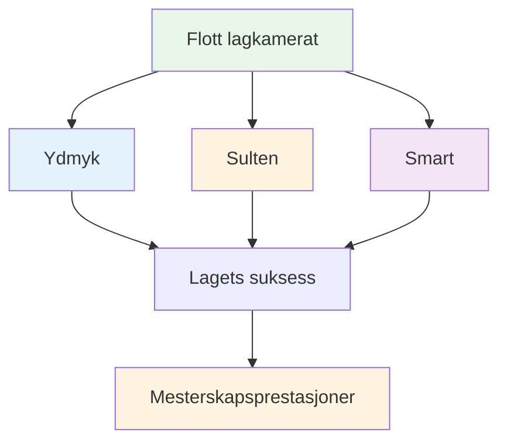

# Å være en god lagspiller

Pétanque spilles ofte i lag – double (dublettes) eller triples (triplettes). Individuelle ferdigheter teller, men lagdynamikk kan avgjøre om du får resultater eller ikke. De beste lagene er ikke alltid de dyktigste – det er de som jobber best sammen.

::: tip Den store ideen
**De beste lagene er ikke alltid de dyktigste – det er de som jobber best sammen.** Å være ydmyk, sulten og følelsesmessig smart gjør deg til en god lagkamerat.
:::

## Hva kjennetegner en god lagkamerat?

Forskning og erfaring peker på tre viktige egenskaper:

### 1. Ydmyk
- Prioriterer lagets suksess fremfor personlig ære
- Anerkjenner andres bidrag
- Innrømmer feil uten unnskyldninger
- Åpen for tilbakemeldinger og læring
- Trenger ikke å være stjernen

### 2. Sulten
- Selvmotivert og drevet
- Gjør jobben uten å bli spurt
- Alltid på jakt etter forbedring
- Gir energi til laget
- Lønner ikke på talent

### 3. Smart (følelsesmessig)
- Leser situasjoner og mennesker godt
- Vet når man skal snakke og når man skal lytte
- Håndterer sine egne følelser
- Støtter lagkamerater på riktig måte
- Håndterer konflikter konstruktivt

## Grunnlaget for teamsuksess

### Felles mål og visjon

Sterke lag har:
- Tydelige, avtalte mål
- Individuelle mål i samsvar med lagets mål
- Felles forståelse av hva suksess ser ut som
- Forpliktelse til det kollektive oppdraget

**Spørsmål å diskutere med teamet ditt:**
- Hva prøver vi å oppnå sammen?
- Hvordan ser suksess ut for oss?
- Hvordan støtter våre individuelle mål laget?

### Effektiv kommunikasjon

Kommunikasjon er livsnerven i teamets ytelse.

**God teamkommunikasjon:**
- Åpen og ærlig
- Respektfull, selv i uenighet
- Tydelig og spesifikk
- Toveis (snakking OG lytting)
- Rettidig (riktig informasjon til rett tid)

**Under kampene:**
- Diskuter strategi før hver omgang
- Del observasjoner om terreng, motstandere
- Koordinere hvem som kaster når
- Støtt hverandre etter kast (gode eller dårlige)

### Tillit og respekt

Uten tillit faller lag fra hverandre under press.

**Bygge tillit:**
- Vær pålitelig (gjør det du sier)
- Vær kompetent (gjør jobben din bra)
- Vær ærlig (selv når det er vanskelig)
- Vis sårbarhet (innrøm utfordringer)
- Støtt andre konsekvent

**Viser respekt:**
- Verdsett hver enkelt persons bidrag
- Lytt til ulike perspektiver
- Anerkjenn innsatsen, ikke bare resultatene
- Betrakt alles rolle som viktig

### Tydelige roller

Alle burde forstå:
- Deres primære ansvarsområder
- Hvordan de bidrar til teamet
- Hva andre regner med dem for
- Når man skal ta et skritt frem og når man skal ta et skritt tilbake

**I trippel:**
| Rolle | Primærfokus | Nøkkelegenskaper |
|------|--------------|---------------|
| Peker | Plasser boules i nærheten av knekt | Presisjon, konsistens |
| Midt | Tilpass deg situasjonen | Allsidighet, lesespill |
| Skytter | Fjern motstanderens kuler | Nøyaktighet under press |

Roller kan være fleksible, men klarhet hjelper.

## Lagdynamikk under konkurransen

### Før kampen
- Kom sammen, varm opp sammen
- Diskuter generell strategi
- Sett tonen (positiv, fokusert)
- Sjekk hvordan alle har det

### Under spillet
- Kommuniser mellom endene
- Vær positiv uansett poengsum
- Støtt hverandre etter feil
- Feir suksesser sammen (kort)
- Hold fokus på prosessen, ikke resultatet

### Etter feil
Hva du IKKE skal gjøre:
- Vis frustrasjon synlig
- Kritisere eller skylde på
- Trekk deg tilbake eller still deg
- Dvel ved hva som skjedde

Hva du skal gjøre:
- Rask bekreftelse (&quot;ingen problem&quot;)
- Flytt fokus til neste kast
- Oppretthold positivt kroppsspråk
- Stol på at lagkameraten din kommer seg

### Etter kampen
- Gjennomgå sammen (hva fungerte, hva fungerte ikke)
- Anerkjenn individuelle bidrag
- Diskuter forbedringer til neste gang
- Oppretthold relasjoner uavhengig av resultat

## Kommunikasjonsmønstre

### Konstruktiv tilbakemelding
**Dårlig:** «Du bommer stadig på de skuddene»
**Bedre:** «Jeg la merke til at slagene går til venstre – vil du prøve å justere holdningen din?»

### Støttende respons på feil
**Dårlig:** *Stillhet eller synlig frustrasjon*
**Bedre:** «Vanskelig. Du har den neste.»

### Strategisk diskusjon
**Stakkars:** «Bare skyt den»
**Bedre:** «Hva synes du – å peke for å blokkere eller å prøve å skyte? Jeg ser fordeler og ulemper begge veier.»

## Bygge lagkultur

Gode team utvikler seg delt:
- **Verdier:** Hva vi står for
- **Normer:** Hvordan vi oppfører oss
- **Språk:** Hvordan vi kommuniserer
- **Ritualer:** Hva vi gjør sammen

**Eksempler:**
- Håndhilse alltid før og etter
- Spesifikke oppmuntrende fraser
- Rutine sammen før kampen
- Måltid eller drikke etter kampen

## I denne delen

- **[Teamkommunikasjon](/no/utdanning/lagspiller/kommunikasjon)** - Detaljert veiledning for effektiv kommunikasjon

## Viktig konklusjon

> Laget ditt er bare så sterkt som det svakeste forholdet, ikke den svakeste spilleren.

Invester i lagkameratene dine. Bygg tillit. Kommuniser godt. Vinn sammen.

