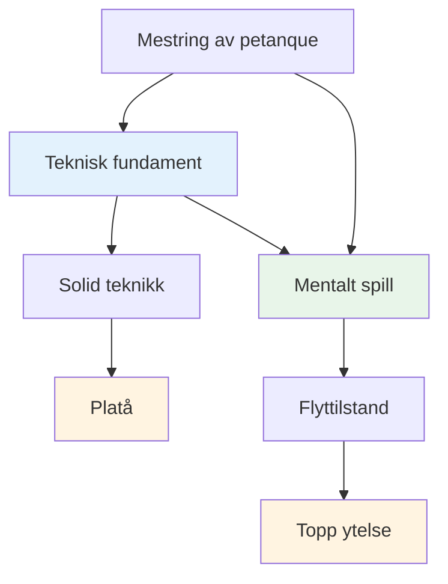
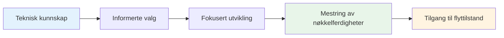

# Teknisk rådgivning

## En merknad om teknikk

Selv om vårt primære fokus er på det mentale spillet og flyttilstanden, erkjenner vi at teknikk er grunnlaget som alt annet er bygget på.

::: info Vår filosofi
**Teknikk er fundamentet, men flyt er taket.** Du trenger solid teknikk for å nå elitenivå, men mental mestring er det som tar deg videre.
:::

## Den vanligste feilen i teknisk trening

::: info Denne seksjonen er for erfarne spillere
Hvis du er nybegynner innen petanque, må du naturligvis utvikle den grunnleggende teknikken din fra bunnen av – og det er en annen reise.

**Dette rådet er for spillere som har spilt i årevis** og allerede har en etablert teknikk som føles naturlig, avslappet og pålitelig. Du har funnet din måte å kaste på. Nå er spørsmålet: hvordan utvikler du deg videre herfra?
:::

::: warning Den vanlige fellen
Når erfarne spillere ønsker å forbedre seg, går de ofte tilbake til det grunnleggende – justerer grepet, armsvingen, utløsningspunktet, kroppsposisjonen. Timer med øvelse. Endeløs finjustering.

**Men de har hoppet over det viktigste spørsmålet:** Hva er det egentlig du vil at kulen skal gjøre?
:::

Før du berører teknikken din, trenger du å være klar over **resultatet** du prøver å oppnå. Ikke «Jeg vil slå mer» eller «Jeg vil være mer konsekvent» – det er ikke resultater, det er ønsker.

Et reelt resultat ser slik ut:
- «Jeg vil ha en lob med høy bue som stopper innenfor 20 cm fra der den lander»
- «Jeg vil ha et rullende skudd som svinger til venstre i denne typen terreng.»
- «Jeg vil ha et mykt, devantslag som så vidt berører målkulen»

**Først bør du utforske [Kastpaletten](/no/education/technique/throws)** for å forstå hva som er mulig. Deretter bør du bestemme hvilket spesifikt kast du vil legge til i repertoaret ditt. Først da bør du begynne å jobbe med hvordan armen, håndleddet og kroppen din må bevege seg for å skape det resultatet.

## Den riktige måten å jobbe med teknikk på

Vi sier ikke at du aldri skal jobbe med arm, håndledd, avlastning eller kroppsstilling. **Teknisk arbeid med utførelse er absolutt gyldig** – men det må ha riktig formål.

::: info Det riktige formålet med teknisk arbeid
**Riktig formål:** "Jeg vil legge til et nytt kast i repertoaret mitt"

**Feil formål:** "Jeg vil treffe flere skudd" eller "Jeg vil være mer konsekvent"
:::

Her er prosessen:

1. **Utforsk [Kastpaletten](/no/teknisk/kast)** — Identifiser hvilket kast eller hvilken teknikk du vil legge til i repertoaret ditt
2. **Visualiser resultatet** – Hva skal kulen gjøre? Hvilken bane, landing, spinn og oppførsel trenger du?
3. **Jobb deretter med utførelse** – Nå kan du fokusere på arm, håndledd, kroppsposisjon og slipp for å oppnå det spesifikke resultatet

Denne tilnærmingen gir den tekniske treningen din **klar retning og målbar fremgang**. Du «øver» ikke bare – du utvider bevisst dine evner.

::: tip Eksempel: Legge til en Plombée
**Mål:** Legg til et drop shot (plombée) i pekerrepertoaret ditt

**Resultatvisualisering:** Kulen skal bue seg høyt, lande mykt med bakspinn og stoppe nesten umiddelbart

**Teknisk fokus:** Høyere utløserpunkt, mer håndleddsbevegelse for bakspinn, mykere grep

**Suksessmåling:** Kan du utføre dette kastet når du vil? Det er målet.
:::

## Bedre skudd vs. flere skudd: Forstå forskjellen

Det er en viktig forskjell som mange spillere overser:

::: tip Den viktigste innsikten
**Hvis du vil ta BEDRE skudd** → Jobb med teknikken din

**Hvis du vil ta FLERE shots** → Jobb med din mentale styrke
:::

### Hva betyr dette?

**Å ta bedre bilder** betyr å utvide ditt tekniske repertoar:
- Legge til nye typer kast (plombée, portée, demi-portée)
- Forbedre presisjonen på spesifikke skuddtyper
- Å utvikle nye ferdigheter du ikke har fra før
- **Dette krever teknisk øvelse og fysisk trening**

**Å ta flere bilder** betyr å utføre det du allerede kan:
- Å slå slagene du allerede kan gjøre på trening
- Konsekvent prestasjon under press
- Stol på teknikken din når det gjelder
- **Dette krever mental trening og tilgang til flyttilstand**

### Realitetssjekken

Spør deg selv ærlig:
- Kan du trene når du er avslappet? ✅ **Da har du teknikken**
- Sliter du med å klare det i konkurranser? ⚠️ **Da trenger du mentalt arbeid, ikke mer teknisk øvelse**

::: warning Vanlig feil
Mange erfarne spillere bruker år på å finpusse teknikker de allerede har, når det de egentlig trenger er å utvikle den mentale styrken til å utføre dem under press.

**Du trenger ikke en bedre armsving. Du trenger et roligere sinn.**
:::

### Veien videre

**For bedre bilder (nye funksjoner):**
- Utforsk [Paletten av kast](/no/education/technique/throws)
- Velg et spesifikt nytt kast å utvikle
- Øv på den tekniske utførelsen

**For flere skudd (konsistens under press):**
- Arbeid med [Mental styrke](/no/education/mental-game/mental-strength/)
- Lær å få tilgang til [Sonen](/no/education/mental-game/the-zone/)
- Utvikle [Rutiner før skudd](/no/education/mental-game/mental-strength/rutine-før-skudd)

## Vårt perspektiv

::: tip Du trenger ikke å mestre alt
**Du trenger ikke å mestre alle teknikkene**, men å forstå hele paletten av muligheter hjelper deg med å:

- ✅ Vit hva som er mulig
- ✅ Ta informerte valg om hva du skal utvikle
- ✅ Sette pris på spillet på et dypere nivå
- ✅ Forstå hva elitespillere kan gjøre
:::

::: info Målet
Hvis du har et teknisk fokus og ønsker å utvide repertoaret ditt, skisserer denne delen det endelige målet – den komplette paletten av kast som er tilgjengelig for en petanque-spiller.

**Husk:** Målet er ikke å mestre alt. Det handler om å ha nok teknisk grunnlag til at du kan komme inn i sonen og la kroppen velge riktig kast naturlig.
:::

## Emner

### [Palett av kast](/no/teknisk/kast)
Hva slags kast finnes det? En omfattende oversikt over de tekniske mulighetene innen petanque.

::: tip Etter teknikk, hva er det neste?
Når du har en solid teknikk, kommer den virkelige veksten fra:
- **[Sonen](/no/education/mental-game/the-zone/)** - Tilgang til flyttilstander
- **[Mental styrke](/no/education/mental-game/mental-strength/)** - Håndtering av press
- **[Opplæringsmetoder](/no/education/technique/training/)** - Hvordan øve effektivt
:::

