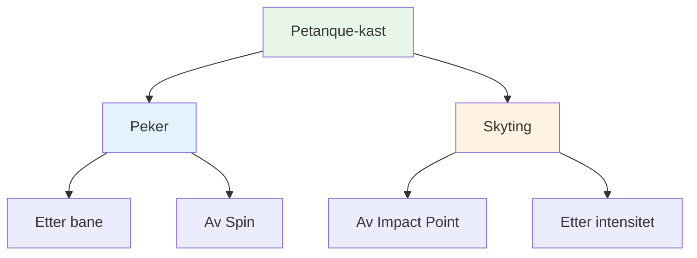
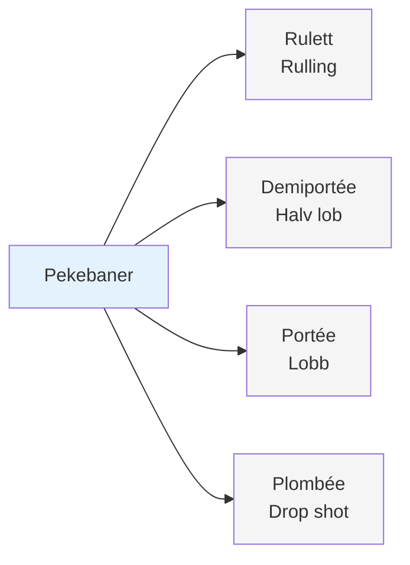
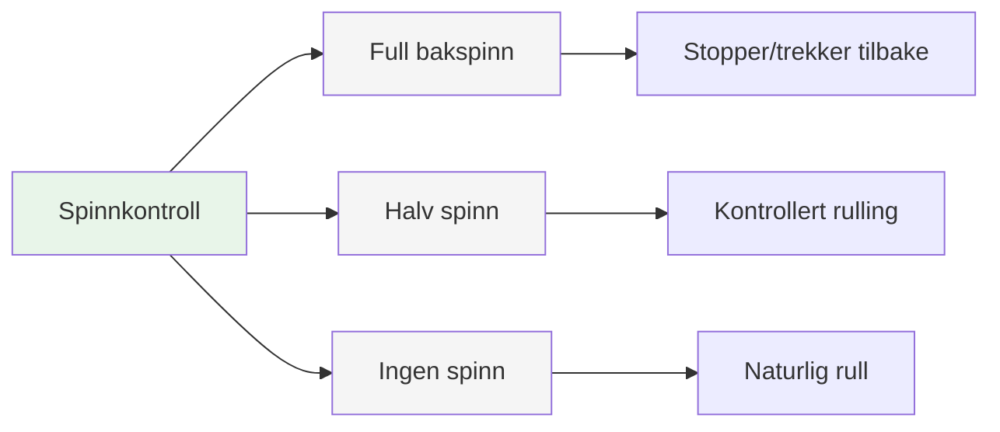
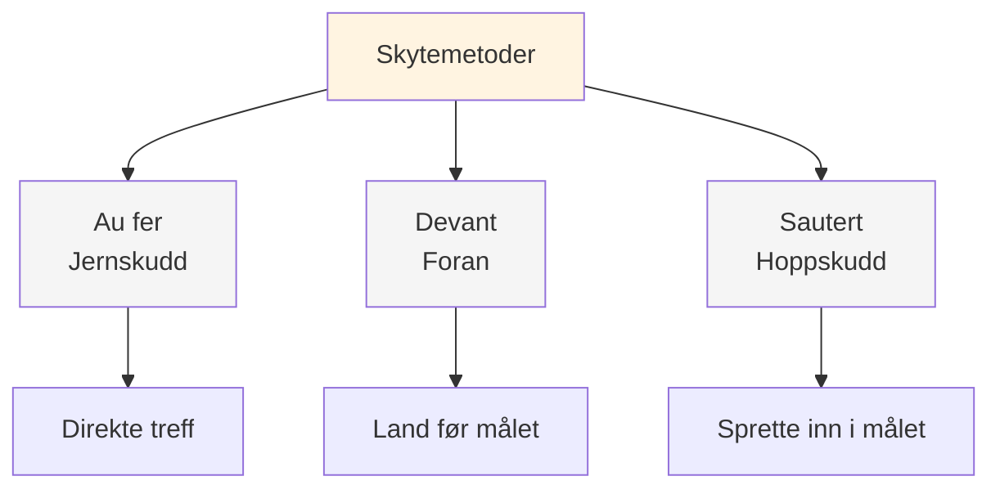
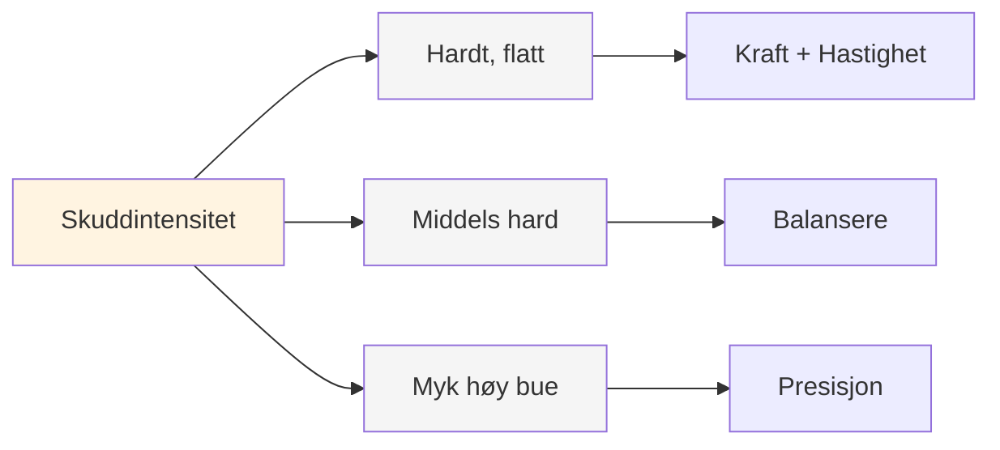
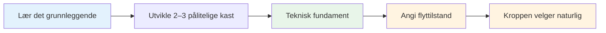

# Palett av pledd

## Det komplette tekniske repertoaret

Dette er en oversikt over kastene som er tilgjengelige i petanque. Du trenger ikke å mestre alle, men å vite hva som finnes hjelper deg å forstå hele omfanget av spillet.

::: tip Det store bildet
**Å forstå hele paletten hjelper deg med å ta informerte valg om hva du skal utvikle.** Du trenger ikke å mestre alt – fokuser på det som fungerer for spillet ditt.
:::

## Peketeknikker

### Etter bane

| Kaste | Fransk begrep | Bane | Når du skal bruke |
|-------|-------------|------------|-------------|
| **Ruller** | Rulett | Lav, ruller mesteparten av veien | Slett terreng, kort avstand |
| **Halv lob** | Demiportée | Middels, lander halvveis | Vanligst, allsidig |
| **Lob** | Portée | Høy, lander nær målet | Hindringer, ulendt terreng |
| **Slåpskudd** | Plombée | Veldig høyt, faller vertikalt | Trange rom, presisjonsplassering |

### Av Spin

| Spinntype | Effekt på landing | Når du skal bruke |
|-----------|-------------------|-------------|
| **Full spinn (bakspinn)** | Stopper eller trekker seg tilbake ved landing | Må stoppe raskt, unngå å rulle forbi |
| **Halv spinn** | Moderat bakspinn, kontrollert rulling | Mest allsidig, forutsigbar |
| **Ingen spinn** | Nøytral, naturlig rulling ved landing | La terrenget bestemme rulling |

## Skyteteknikker

### Av Impact Point

| Teknikk | Fransk begrep | Nedslagspunkt | Kjennetegn |
|-----------|-------------|--------------|-----------------|
| **Jernskudd** | Au fer | Direkte treff på kulen | Vanligste, rene kontakter |
| **Foran** | Devant | Landing rett før målet | Sikrere, mindre presisjon nødvendig |
| **Hoppskudd** | Sautert | Spretter inn i målet | Avansert, for hindringer |

### Etter intensitet

| Intensitet | Bane | Når du skal bruke |
|-----------|------------|-------------|
| **Hardt flatt skudd** | Direkte, kraftfull, flat | Klar linje, trenger avstand ved treff |
| **Middels hard** | Balansert kraft og kontroll | Mest allsidig |
| **Myk med høy bue** | Lobskudd, faller ovenfra | Hindringer, trange rom |

## Den komplette paletten

::: details Hurtigreferanse: Alle kast
**Peker:**
- Rulett (rullende)
- Demiportée (halv lob)
- Portée (lob)
- Plombée (drop shot)
- Full sentrifugering / Halv sentrifugering / Ingen sentrifugering

**Skyting:**
- Au fer (jernskudd)
- Devant (foran)
- Sautert (hoppskudd)
- Hard flat / Medium / Myk høy bue
:::

## Mestringsvei

::: tip Huske
**Målet er ikke å mestre alt.** Det handler om å ha nok teknisk grunnlag til at du kan komme inn i sonen og la kroppen velge riktig kast naturlig.

Fokuser på:
1. **2–3 peketeknikker** du kan stole på
2. **1–2 skytemetoder** som fungerer for deg
3. **Konsekvent utførelse** under press
4. **Mentalt spill** for å få tilgang til flyttilstand
:::

::: info Neste trinn
Når du har en solid teknikk, kommer den virkelige veksten fra:
- **[Sonen](/no/utdanning/mentalt-spill/sonen/)** - Konsekvent tilgang til flyttilstander
- **[Opplæringsmetoder](/no/utdanning/teknikk/opplæring/)** - Hvordan øve effektivt
- **[Mental styrke](/no/utdanning/mentalt-spill/mental-styrke/)** - Prestere under press
:::

