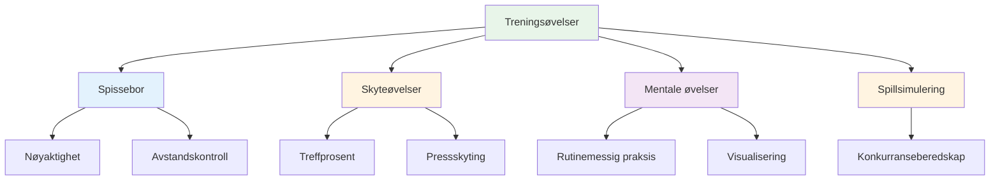

# Treningsøvelser

Her er velprøvde øvelser brukt av elitespillere. Hver øvelse har et spesifikt formål – velg basert på hva du trenger å utvikle.

::: tip Den store ideen
**Hver øvelse har et spesifikt formål.** Ikke kast bare kuler tilfeldig – velg øvelser som er rettet mot svakhetene dine og støtter målene dine. Spor fremgangen din for å se forbedring.
:::

## Spissebor

### Smuget
**Formål:** Isolere utløsningsvinkel og linjekonsistens

**Oppsett:**
- Plasser to markører 30–40 cm fra hverandre, omtrent 1 meter fra sirkelen.
- Målet er 7–9 meter unna

**Bore:**
- Kast gjennom &quot;smug&quot; (mellom markørene)
- Ethvert kast som treffer en markør er &quot;dødt&quot;
- Fokuser på et konsistent utgivelsespunkt

**Progresjon:**
- Gjør smuget smalere etter hvert som du forbedrer deg
- Varier målavstanden
- Legg til en spesifikk landingssone

### Presisjonssoner
**Formål:** Utvikle nøyaktighet innen spesifikke områder

**Oppsett:**
- Marker soner rundt et mål (f.eks. sirkler på 20 cm, 40 cm, 60 cm)
- Eller bruk naturlige markører i terrenget

**Poengsum:**
- Innenfor 20 cm: 3 poeng
- Innvendig 40 cm: 2 poeng
- Inne 60 cm: 1 poeng
- Utenfor: 0 poeng

**Bore:**
- Kast 10 kuler, og følg med på poengsummen din
- Mål: Konsekvent forbedring over øktene

### Avstandsvariasjon
**Formål:** Utvikle dybdekontroll

**Oppsett:**
- Plasser mål på 6m, 7m, 8m, 9m, 10m

**Bore:**
- Kast til hver distanse i tilfeldig rekkefølge
- Partner roper ut avstanden
- Fokuser på å justere vekten, ikke teknikken

**Variasjon:**
- Legg til «korte» og «lange» anrop etter at du har sluppet
- Må justeres midt i flyvningen (utvikler følelse)

## Skyteøvelser

### Skytestigen
**Formål:** Bygge nøyaktighet under progressivt press

**Oppsett:**
- Plasser en målkule på 6 meters avstand
- Merk avstander på 7m, 8m, 9m, 10m

**Bore:**
- Start på 6 meter
- Treffer = flytte seg tilbake én meter
- Bomme = gå én meter fremover (eller starte på nytt)
- Mål: Nå 10 meter

**Variasjoner:**
- Streng versjon: Enhver bom returnerer til 6m
- Tidsbestemt versjon: Hvor langt kan du komme på 10 minutter?
- Lagversjon: Veksle med partner

### Barrieren (Blox)
**Formål:** Tving frem skyting med høy lysbue

**Oppsett:**
- Plasser en barriere (pinne, snor eller hindring) mellom deg og målet
- Barrieren bør være høy nok til å kreve en lob

**Bore:**
- Må forsere barrieren for å treffe målet
- Ethvert kast som treffer barrieren er &quot;dødt&quot;
- Utvikler høyt frigjøringspunkt

**Hvorfor det er viktig:**
- Konkurranse krever ofte skyting over hindringer
- Bygger allsidighet i skytingen din

### Hindringsløype
**Formål:** Utvikle skyting fra forskjellige vinkler

**Oppsett:**
- Plasser målkulen i midten
- Legg til hindringer (andre kuler, markører) rundt den

**Bore:**
- Skyt fra forskjellige posisjoner rundt sirkelen
- Må finne vinkelen som fungerer
- Utvikler lesing av skytelinjer

## Mentale treningsøvelser

### Rutinemessig repetisjon
**Formål:** Gjør rutinen din før bruk automatisk

**Bore:**
- Øv på hele rutinen din uten å kaste
- Gå gjennom hvert trinn bevisst
- Gjør 10–20 repetisjoner
- Legg deretter til kastet

**Fokus:**
- Konsekvent timing
- Tydelig overgang fra tenkning til utførelse
- Samme rutine hver gang

### Trykkpunkter
**Formål:** Øv på å prestere under press

**Oppsett:**
- Lag et «må-gjøre»-scenario
- Sett konsekvenser for manglende tilgang

**Eksempler:**
- &quot;Lag 3 på rad eller start på nytt&quot;
- &quot;Bomme på og gjøre 10 armhevinger&quot;
- &quot;Kunngjør målet ditt før du kaster&quot;

**Nøkkel:**
- Presset skal føles ekte
- Øv på din mentale respons på press
- Bruk rutinen din akkurat som i konkurranse

### Restitusjonspraksis
**Formål:** Bygg opp vanen med rask mental tilbakestilling

**Bore:**
- Med vilje kaste en dårlig kule
- Øv umiddelbart på SOAS (Stopp, Observer, Aksepter, Slipp)
- Kast neste kule med full innsats

**Fokus:**
- Ikke dvel ved glippen
- Tilbakestill helt før neste kast
- Oppretthold positivt kroppsspråk

## Spillsimuleringsøvelser

### Millieus glede
**Formål:** Bryt rytmelåsen, bygg allsidighet

**Bore:**
- Veksle mellom å peke og skyte ved hvert kast
- Ingen to påfølgende kast av samme type
- Utvikler evnen til å bytte modus

### Scenariospill
**Formål:** Øve på taktisk beslutningstaking

**Oppsett:**
- Sett opp realistiske spillsituasjoner
- Tildel poengsummer og antall boules

**Eksempler:**
- «Du ligger under 10-8, motstanderen har 2 poeng, du har 2 kuler»
- «Uavgjort 6-6, dere har siste kule, de har ett poeng»

**Bore:**
- Bestem hva du skal gjøre
- Utfør med full forpliktelse
- Vurder avgjørelsen etterpå

### Matchspill med regler
**Formål:** Konkurransesimulering

**Variasjoner:**
- Spill til 13 (hele kampen)
- Spill til 7 (kortere, flere spill)
- &quot;Trykkpunkter&quot; - visse ender verdt dobbelt
- &quot;Plutselig død&quot; - den første som taper en omgang taper spillet

## Sporing av øvelsene dine

Før logg for hver øvelse:

| Dato | Bore | Poengsum/Resultat | Notater |
|------|-------|--------------|-------|
| | | | |

**Spor over tid:**
- Bedrer du deg?
- Hvilke øvelser hjelper mest?
- Hvor sliter du?

## Å bygge en øvelsesøkt

### Oppvarming (10 min)
- Enkle kast for å løsne opp
- Ikke noe press, bare føl

### Teknisk fokus (20–30 min)
- En eller to øvelser rettet mot spesifikke ferdigheter
- Blokkert øvelse for nye ferdigheter
- Tilfeldig øvelse for etablerte ferdigheter

### Press-/spillsimulering (20–30 min)
- Legg til konsekvenser
- Lag realistiske scenarier
- Øv på mentale ferdigheter

### Nedkjøling (10 min)
- Enkle kast
- Reflekter over økten
- Merk hva du skal jobbe med videre

## Viktig konklusjon

> Driller er verktøy. Velg riktig verktøy for det du trenger å bygge.

Ikke bare kast boule. Tren med et formål.

