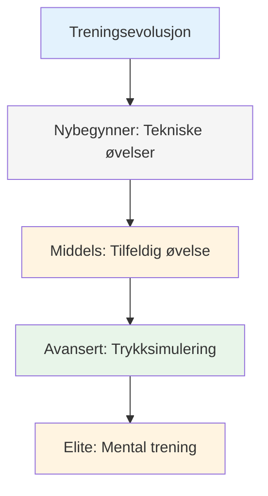
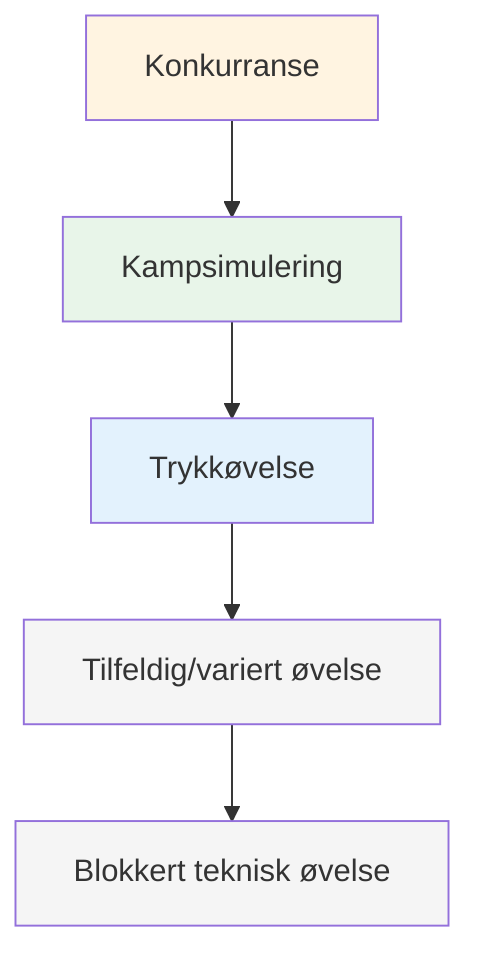

# Treningsmetoder

Når teknikken din er solid, hva øver du på? Det er her mange spillere flater ut – de fortsetter å øve på teknikken når den virkelige veksten ligger et annet sted.

::: tip Den store ideen
**De fleste spillere stagner fordi de beholder drillteknikken når den virkelige veksten ligger et annet sted.** Elitespillere trener tilpasningsevne, beslutningstaking og mental styrke – ikke bare mekanikk.
:::

## Utover teknisk repetisjon

De fleste spillere trener ved å gjenta kast. Det er viktig for nybegynnere, men avanserte spillere trenger mer:

| Treningstype | Hva den utvikler | Når du skal bruke |
|--------------|------------------|-------------|
| Tekniske øvelser | Mekanikk, form | Lære nye ferdigheter, løse problemer |
| Tilfeldig øvelse | Tilpasningsevne, beslutningstaking | Konkurranseforberedelser |
| Trykksimulering | Mental styrke | Før viktige hendelser |
| Mental trening | Fokus, gjenoppretting, selvtillit | Pågående, ofte neglisjert |

## Treningspyramiden

::: warning Vanlig feil
**De fleste spillere bruker for mye tid nederst.** Elitespillere jobber på alle nivåer i pyramiden, med vekt på de øverste nivåene etter hvert som de avanserer.
:::

## Blokkert vs. tilfeldig øvelse

### Blokkert praksis
Gjenta det samme kastet mange ganger:
- 20 poeng fra 7 meter
- 20 skudd mot samme mål
- Samme avstand, samme kast

**Bra for:** Innledende læring, bygge selvtillit, oppvarming
**Begrensning:** Overføres ikke godt til konkurranse

### Tilfeldig øvelse
Varier alt:
- Ulike avstander per kast
- Alternativ peking og skyting
- Endre mål stadig

**Bra for:** Konkurranseforberedelse, utvikling av tilpasningsevne
**Følelser:** Vanskeligere, flere feil, mindre «produktiv»
**Realitet:** Bedre langsiktig oppbevaring og overføring

### Forskningen

Studier viser konsekvent:
- Blokkert trening føles bedre (rask forbedring synlig)
- Tilfeldig trening gir bedre konkurranseprestasjon
- Det er i «kampen» med tilfeldig øvelse at læring skjer.

## Trykksimulering

Du takler ikke konkurransepress hvis du aldri opplever det på trening.

### Skaper øvingspress

**Konsekvenser:**
- Push-ups for bom
- Taperen kjøper kaffe
- Poeng teller mot noe

**Scenarioer:**
- «Må gjøres»-situasjoner
- Under 12-10, må score
- Kampens siste kuppel

**Publikum:**
- Øv med å se på folk
- Spill inn deg selv på video
- Annonser hva du prøver å gjøre

**Utmattelse:**
- Tren når du er sliten
- Slutt på lang økt
- Etter fysisk trening

### Skytestigen

En klassisk trykkboremaskin:
1. Start på 6 meter
2. Treffe målet = gå tilbake én meter
3. Bomme = gå én meter fremover (eller starte på nytt)
4. Mål: Nå 10 meter

Dette skaper et naturlig press etter hvert som du utvikler deg.

## Mentale treningsøkter

Sett spesielt av tid til mentale ferdigheter:

### Visualiseringsøkt (15–20 min)
1. Finn et stille sted
2. Lukk øynene
3. Visualiser deg selv i en konkurranse
4. Se vellykkede kast i detalj
5. Føl selvtilliten og flyten
6. Øv på å håndtere pressmomenter

### Rutinemessig øvelse før skyting
- Øv på rutinen din uten å kaste
- Fokuser på de mentale overgangene
- Bygg opp vanen med regelmessig forberedelse

### Restitusjonspraksis
- Gjør bevisst feil i praksis
- Øv på SOAS-svaret ditt
- Bygg opp vanen med rask mental tilbakestilling

## Strukturering av treningsuken din

### Eksempel: Seriøs amatør (6 timer/uke)

| Dag | Varighet | Fokus |
|-----|----------|-------|
| mandag | 1,5 time | Teknisk: Spissebor |
| onsdag | 1,5 time | Teknisk: Skyteøvelser |
| fredag | 1 time | Mental: Visualisering, rutinetrening |
| lørdag | 2 timer | Matchspill med presselementer |

### Eksempel: Konkurransespiller (10 timer/uke)

| Dag | Varighet | Fokus |
|-----|----------|-------|
| mandag | 2 timer | Teknisk: Peking (blokkert → tilfeldig) |
| tirsdag | 1 time | Mental trening + visualisering |
| onsdag | 2 timer | Teknisk: Skyting (blokkert → tilfeldig) |
| torsdag | 1 time | Videoanmeldelse + mentalt arbeid |
| fredag | 2 timer | Trykksimulering, spillscenarier |
| lørdag | 2 timer | Konkurranse eller kampspill |

## Treningsprinsipper

### 1. Kvalitet fremfor kvantitet
- 30 fokuserte minutter slår 2 timer med tankeløs repetisjon
- Stopp når fokuset faller
- Bedre å slutte tidlig enn å praktisere dårlige vaner

### 2. Bevisst praksis
- Ha et spesifikt mål for hver økt
- Jobb på grensen av din evne
- Få tilbakemeldinger (video, partner, resultater)
- Juster basert på hva du lærer

### 3. Gjenoppretting er viktig
- Hviledager er en del av treningen
- Søvn påvirker ytelsen betydelig
- Mental utmattelse er reell – respekter det

### 4. Spor alt
- Hold en treningslogg
- Legg merke til hva som fungerer og hva som ikke fungerer
- Gjennomgå regelmessig
- Juster planen din basert på data

## I denne delen

- **[Treningsøvelser](/no/education/trening/øvelser)** - Spesifikke øvelser for ulike ferdigheter

## Viktig konklusjon

> Hvordan du trener avgjør hvordan du presterer. Tren slik du vil spille.

Varier treningen din. Inkluder mentalt arbeid. Skap press. Følg fremgangen din.

