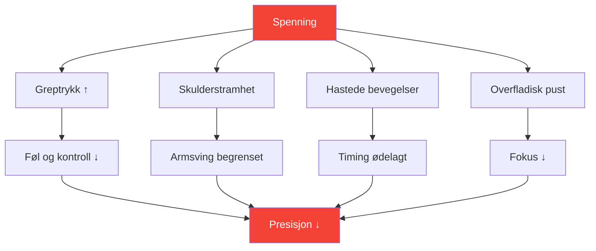

# Forstå spenning i presisjonssport

::: tip Spenning er presisjonens fiende
**Vekt: 300 poeng** — Du kan ikke være både anspent og presis. Å lære å håndtere spenning er viktig for jevn prestasjon.
:::

## Presisjonsparadokset

> &quot;Jo hardere du prøver, desto verre går det.&quot;

Dette er ikke svakhet – det er fysikk og fysiologi. Pétanque krever avslappede, flytende bevegelser. Spenning ødelegger selve egenskapene som gir nøyaktige kast.

### Hvordan spenning ødelegger presisjon



---

## Fysisk vs. mental spenning

Spenning finnes i to sammenhengende former:

### Fysisk spenning

Muskelstramhet som direkte påvirker kastet ditt:

| Område | Effekt på kast |
|------|-----------------|
| **Grep** | Tap av følelse, inkonsekvent utløsning |
| **Underarm** | Begrenset håndleddsbevegelse |
| **Skulder** | Forkortet, hakkete armsving |
| **Nakke** | Begrenset hodestilling, syn |
| **Kjeve** | Koblet til den generelle kroppsspenningen |
| **Kjerne** | Balanse- og vektoverføringsproblemer |

### Mental spenning

Psykisk stress som skaper fysiske symptomer:

- Tanker om kappløp
- Bekymring for resultatene
- Frykt for å mislykkes
- Trykkbevissthet
- Tidligere feil gjentas

::: warning Spenningsløkken
Mental spenning → Fysisk spenning → Dårlig ytelse → Mer mental spenning

Å bryte denne sløyfen er viktig for jevn spilling.
:::

---

## Yerkes-Dodson-loven

Forholdet mellom opphisselse (aktiveringsnivå) og ytelse følger en invertert U-kurve:

```
Performance
    ↑
    │         ★ Optimal Zone
    │        /\
    │       /  \
    │      /    \
    │     /      \
    │    /        \
    │   /          \
    └──┴────────────┴──→ Arousal
     Low           High

   "Flat"   "Alert"   "Tense"
   Unfocused Relaxed  Anxious
```

### For lav (underopphisset)
- Flat, ufokusert
- Uforsiktige feil
- Mangel på intensitet
- Å gå gjennom bevegelsene

### For høy (overopphisset)
- Anspent, stresset
- Overtenking
- Stramt grep, begrenset bevegelse
- Kan ikke gjenopprette seg etter feil

### Optimal sone
- Våken, men avslappet
- Fokusert, men likevel flytende
- Passende intensitet
- Rask bedring

---

## Finn DIN optimale sone

Hver spiller har et ulikt optimalt opphisselsesnivå:

### Selvvurderingsprosessen

1. **Husk dine beste prestasjoner**
   - Hvordan følte du deg fysisk?
   - Hva var energinivået ditt?
   - Hvordan ville du vurdert opphisselsen din (1-10)?

2. **Husk dine verste prestasjoner**
   - Var du for flat eller for anspent?
   - Hvilke fysiske symptomer la du merke til?
   - Hva utløste den suboptimale tilstanden?

3. **Identifiser mønsteret ditt**
   - Har du en tendens til overopphisselse eller underopphisselse?
   - Hvilke situasjoner utløser mønsteret ditt?
   - Hva hjelper deg med å komme tilbake til optimalt nivå?

### Vanlige spillerprofiler

| Profil | Tendens | Risikosituasjoner | Strategi |
|---------|----------|-----------------|----------|
| **Bekymringsmannen** | Overopphisselse | Høye innsatser, jevne kamper | Avslapningsteknikker |
| **Flatlineren** | Under-opphisselse | Lave innsatser, tidlige runder | Aktiveringsteknikker |
| **Reaktoren** | Variabel | Etter bom, endres momentumet | Emosjonell regulering |
| **Jageren** | Overopphisselse når man er bakpå | Comebacks, tidspress | Akseptteknikker |

---

## Gjenkjenne spenningssignaler

### Fysiske varseltegn

Lær å legge merke til disse før de påvirker kastet ditt:

| Signal | Sted | Handling |
|--------|----------|--------|
| **Fest grep** | Hånd | Mykne før hvert kast |
| **Hevde skuldre** | Øvre del av ryggen | Slipp og rull |
| **Kjeften er sammenbitt** | Ansikt | Åpne munnen litt |
| **Grunn pust** | Kiste | Dyp magepust |
| **Rask bevegelse** | Hele kroppen | Sakk ned farten med vilje |
| **Rastløs fikling** | General | Jord deg selv |

### Psykiske varseltegn

- Tanker om kappløp
- Negativ selvsnakk øker
- Fokuser på resultat, ikke prosess
- Bevissthet om innsats/poengsum
- Tenker på tidligere feil

---

## Selvkontroll av spenning og ytelse

Bruk denne raske vurderingen mellom kast eller i pauser:

**Fysisk skanning (5 sekunder):**
1. Grep → Mykt?
2. Skuldre → Ned?
3. Kjeve → Åpen?
4. Pusting → Sakte og dyp?

**Mental skanning (5 sekunder):**
1. Tanker → Fokusert på nåtid?
2. Energi → Optimal rekkevidde?
3. Neste handling → Fjern?

::: tip Gjør det til en vane
De beste spillerne gjør dette automatisk. Du kan trene deg selv til å gjøre det samme gjennom repetisjon.
:::

---

## I denne modulen

### [Teknikker for spenningsfrigjøring](/no/utdanning/spenning/teknikker)
- Progressiv muskelavslapning (PMR)
- Hurtigutløsningsteknikker for konkurranser
- Pusteprotokoller
- Tilbakestilling av spenning før kast

### [Håndtering av spenning i konkurranse](/no/utdanning/spenning/konkurranse)
- Forberedelser før kampen
- Protokoller under kampen
- Nødsituasjon &quot;for anspent&quot; gjenoppretting
- Gjenoppretting etter feil

---

## Rask seier: 10-sekunders tilbakestilling

Før neste kast, bruk denne raske protokollen:

1. **Skuldre** — Slipp dem bevisst
2. **Grepp** — Gjør det lettere med 20 %
3. **Kjeve** — Løsne, tungen vekk fra ganen
4. **Pust** — Ett langsomt, fullt utpust

Dette tar 10 sekunder og kan umiddelbart forbedre ditt neste kast.

---

## Relaterte faktorer

- [Mental styrke](/no/utdanning/mentalt-spill/mental-styrke/) — Håndtering av press
- [Søvn og restitusjon](/no/utdanning/søvn/) — Hvile reduserer grunnspenningen
- [Mindfulness](/no/utdanning/mentalt-spill/mindfulness/) — Bevissthet i nåtiden
- [Sonen](/no/utdanning/mentalt-spill/sonen/) — Optimal ytelsestilstand

