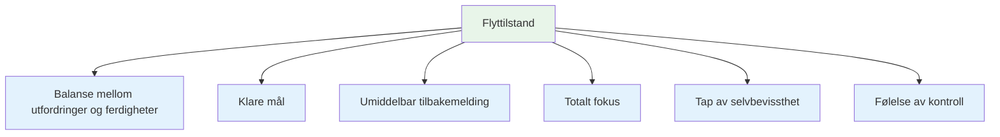
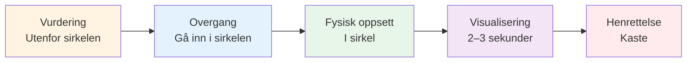
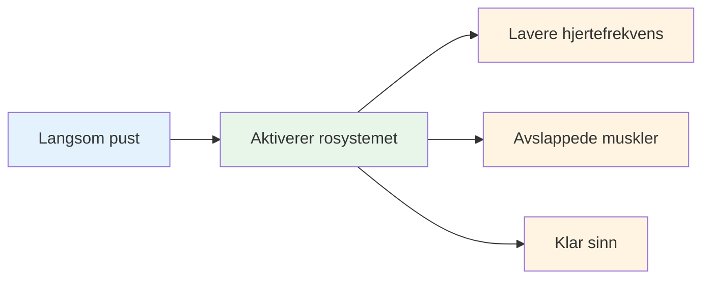
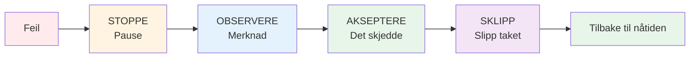

# Inn i sonen: Praktiske teknikker
<AdBanner />

Sonen er ikke noe som bare skjer med deg. Med øvelse kan du lære å bruke den mer konsekvent. Her er velprøvde teknikker brukt av eliteutøvere.

::: tip Den store ideen
**Du kan trene deg selv til å gå inn i flyttilstander mer pålitelig.** Sonen er ikke magi – det er en ferdighet du utvikler gjennom spesifikke teknikker og konsekvent øvelse.
:::

## De seks betingelsene for flyt

Forskning viser at strømningstilstander krever visse betingelser:

| Betingelse | Hva det betyr | I petanque |
|-----------|---------------|-------------|
| **Balanse mellom utfordringer/ferdigheter** | Oppgaven utfordrer deg, men er oppnåelig | Konkurrerer på ditt nivå, ikke for lett eller umulig |
| **Klare mål** | Du vet nøyaktig hva du prøver å gjøre | Spesifikt mål, klar intensjon for hvert kast |
| **Øyeblikkelig tilbakemelding** | Du ser resultater av handlingene dine | Ballen lander, du vet om den fungerte |
| **Totalt fokus** | Full oppmerksomhet på oppgaven | Ingen distraksjoner, kun nåtiden |
| **Tap av selvbevissthet** | Ikke bekymret for hvordan du ser ut | Bryr meg ikke om hvem som ser på |
| **Følelse av kontroll** | Føler meg i stand til å håndtere det | Stol på treningen og evnene dine |

::: info Viktig innsikt
Når disse seks betingelsene stemmer overens, blir flyt mulig. Din jobb er å skape disse betingelsene bevisst.
:::

## Teknikk 1: Rutinen før inntak

Din rutine før du drar i trening er inngangsporten til sonen. Det er en konsekvent sekvens som signaliserer til hjernen din: «Det er på tide å utføre.»

### Bygge rutinen din

En god rutine har disse elementene:

::: details 1. Visuell vurdering (utenfor sirkelen)
- Les terrenget
- Velg mål og landingssted
- Bestem deg for kastetypen

**Det er her tenkningen skjer.** Ta deg god tid her.
:::

::: details 2. Overgang (inn i sirkelen)
- Ta et pust
- Slipp analysen
- Bytt til utførelsesmodus

**Dette er bryteren.** Analysen stopper her.
:::

::: details 3. Fysisk utløser (i sirkelen)
- En konsekvent holdningsoppsett
- En spesifikk grepskontroll
- En liten bevegelse som føles naturlig for deg

**Gjør det konsekvent.** Samme hver gang.
:::

::: details 4. Visualisering (kort, 2–3 sekunder)
- Se ballens bane
- Føl det vellykkede kastet
- Koble deg til målet ditt

**Hold det kort.** For langt = overtenking.
:::

::: details 5. Utførelse
- Fokuser kun på målet
- Stol på kroppen din
- Slipp uten å nøle

**Kun eksternt fokus.** Mål, ikke teknikk.
:::

### Hvorfor rutiner fungerer

Rutinen din blir en «mindfulness-klokke» – et signal som endrer hjernens tilstand. Med nok repetisjon vil bare det å starte rutinen utløse det mentale skiftet til flyt.

::: tip Øvingstips
Bruk rutinen din på HVERT kast på trening – ikke bare i konkurranser. Rutinen må bli automatisk.
:::

<AdInArticle />

## Teknikk 2: Eksternt fokus

Hvor du legger oppmerksomheten din har enorm betydning.

| Fokustype | Hva du tenker om | Eksempeltanker |
|------------|---------------------|------------------|
| **Internt** ❌ | Kroppsmekanikken din | &quot;Hold albuen min rett&quot;  &quot;Følg opp ordentlig&quot;  &quot;Ikke grip for hardt&quot; |
| **Ekstern** ✅ | Mål og resultat | &quot;Land den der&quot;  &quot;Se stien&quot;  &quot;Treffe målet&quot; |

::: tip Forskningsfunn
Studier viser konsekvent at **eksternt fokus gir bedre resultater** for dyktige spillere. Kroppen din vet hva den skal gjøre – la den virke.
:::

### Øv på eksternt fokus
- Velg et bestemt sted på bakken (ikke bare «nær jekken»)
- Visualiser ballens hele bane
- Hold blikket festet på målet, ikke hånden din

::: warning Vanlig feil
Under press vender spillerne ofte tilbake til internt fokus («Ikke ødela teknikken min»). Det er akkurat da du trenger eksternt fokus mest.
:::

## Teknikk 3: Klem med venstre hånd

Denne uvanlige teknikken har vitenskapelig støtte.

::: info Vitenskapen
Klem venstre hånd (hvis høyrehendt) i 10–15 sekunder før du kaster:
- ✅ Aktiverer høyre hjernehalvdel (spatial, intuitiv)
- ✅ Roer ned venstre hjernehalvdel (verbal, analytisk)
- ✅ Reduserer overtenking
:::

**Slik bruker du det:**
1. Lag en knyttneve med hånden du ikke kaster
2. Klem godt i 10–15 sekunder
3. Slipp løs og start rutinen din
4. Kaste

::: tip Når du skal bruke
Dette fungerer best når du merker at du tenker for mye eller føler press. Det er en «tilbakestillingsknapp» for hjernen din.
:::

## Teknikk 4: Pustekontroll

Pusten din påvirker direkte din mentale tilstand.

**Før du går inn i sirkelen:**
- Ta et sakte, dypt åndedrag
- Pust helt ut
- Føl skuldrene dine senke seg

**I sirkelen:**
- Pust naturlig
- Ikke hold pusten under kastet
- La utpusten følge utløsningen din

::: details 4-7-8-teknikken (for høyt trykk)
1. Pust inn i 4 tellinger
2. Hold i 7 tellinger
3. Pust ut i 8 tellinger
4. Gjenta én eller to ganger

**Hvorfor det fungerer:** Dette aktiverer det parasympatiske nervesystemet ditt («ro ned»-systemet).
:::

## Teknikk 5: Triggerord

Et triggerord eller en frase kan umiddelbart endre din mentale tilstand.

::: tip Populære triggerord
- &quot;Glatt&quot;
- &quot;Tillit&quot;
- &quot;Se det, vær det&quot;
- &quot;Slipp taket&quot;
- &quot;Strømme&quot;
- &quot;Lett&quot;
:::

**Slik utvikler du din:**
1. Tenk på en gang du presterte perfekt
2. Hvilket ord fanger den følelsen?
3. Bruk det ordet i rutinen din
4. Si det stille mens du forbereder deg på å kaste

::: info Hvorfor det fungerer
Med repetisjon blir ordet knyttet til din beste prestasjonstilstand. Det er en mental snarvei til flyt.
:::

## Teknikk 6: Tilbakestill etter feil

Feil vil skje. Nøkkelen er å ikke la ett dårlig kast bli til to.

**SOAS-metoden:**

| Skritt | Handling | Hva det betyr |
|------|--------|---------------|
| **Stoppe | Pause, ikke reager umiddelbart | Ikke kast hendene opp, ikke bann |
| **Observere | Legg merke til hva som skjedde uten å dømme | «Ballen gikk til venstre», ikke «Jeg er forferdelig» |
| **Akseptere | Det skjedde, det er gjort | Kan ikke endre fortiden |
| **S**leppe | Slipp taket, slipp det | Gå tilbake til nåtiden |

::: warning Kritisk ferdighet
Dette krever øvelse, men det forhindrer frustrasjonsspiralen som dreper flyten. Øv på SOAS i hverdagen, slik at det blir automatisk i konkurranse.
:::

## Bygge flytverktøysettet ditt

Ikke alle teknikker fungerer for alle. Eksperimenter og finn ut hva som hjelper deg:

| Situasjon | Prøv dette |
|-----------|----------|
| Overtenking | Venstrehåndsklem, eksternt fokus |
| Nervøs/anspent | Pustekontroll, utløserord |
| Etter en feil | SOAS-metoden |
| Viktig kast | Fullstendig rutine før inntak |
| Mister fokus | Gå tilbake til det grunnleggende rutinemessig |

## Øvelse gjør varig

Disse teknikkene fungerer bare hvis du praktiserer dem:

1. **Bruk rutinen din i hvert treningskast** – ikke bare i konkurranser
2. **Simuler press** – skap konsekvenser i praksis
3. **Legg merke til når du er i flyt** – hva utløste det?
4. **Oppsummering etter øktene** - hva hjalp, hva gjorde ikke det?

## Viktig konklusjon

::: tip Huske
**Sone er ikke flaks. Det er en ferdighet du kan utvikle.**

Start med rutinen din før du sprøyter. Gjør den konsekvent. Stol på den. Sonen vil følge.
:::

<AdBanner />
