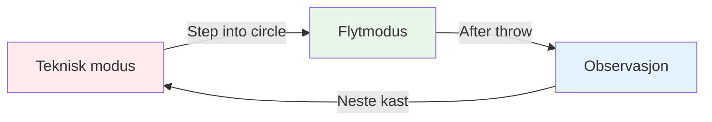
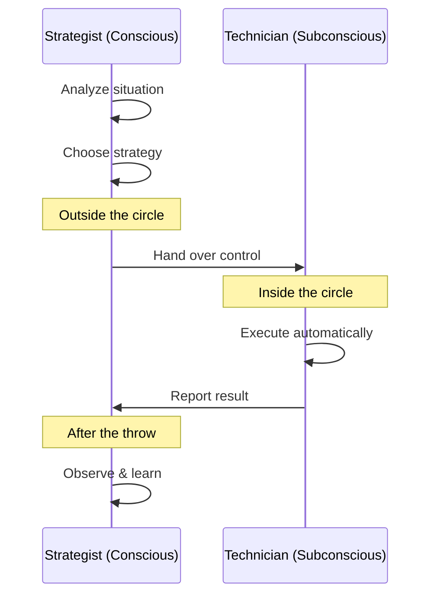

# Sonen: Forstå strømningstilstanden

Har du noen gang hatt et spill der alt bare falt på plass? Der du ikke tenkte på teknikken din, og hver kule landet akkurat der du ville? Det er «sonen» – og det å lære å bruke den konsekvent er det som skiller elitespillere fra resten.

::: tip Den store ideen
**Flyttilstanden er når den analytiske hjernen din roer seg ned og de trente instinktene dine tar over.** Du klarer ikke å tenke deg inn i sonen – du må gi slipp.
:::

## Hva er Sonen?

Sonen, også kalt «flyttilstand», er en mental tilstand der du blir fullstendig oppslukt av det du gjør. Tiden ser ut til å gå saktere. Bevegelsene dine føles uanstrengte. Du tenker ikke på teknikk – du bare *gjør*.

Forskere kaller denne tilstanden **forbigående hypofrontalitet**. Enkelt sagt roer den analytiske delen av hjernen din (prefrontal cortex) seg ned, slik at dine trente instinkter tar over.

### De to hjernemodusene

**Teknisk modus (planlegging):**
- Analyser situasjonen
- Velg din strategi
- Bestem hvilket kast du skal gjøre

**Flytmodus (utførelse):**
- Stol på treningen din
- Fokuser kun på målet
- La kroppen din jobbe automatisk

**Observasjon (læring):**
- Legg merke til resultatet uten å dømme
- Lær av det som skjedde
- Tilbakestill for neste kast

## Pétanqueens paradoks

Her er utfordringen: petanque gir deg mye tid til å tenke mellom kastene. I motsetning til raske idretter der du reagerer umiddelbart, har du tid til å gå til sirkelen, vurdere situasjonen og forberede kastet ditt.

Denne «tiden til å tenke» er både en gave og en forbannelse:
- **Gave:** Du kan planlegge strategier og ta smarte avgjørelser
- **Forbannelse:** Du kan overtenke og forstyrre dine naturlige evner

Elitespilleren lærer å bruke denne tiden klokt – tenke under planlegging, og deretter «slå av» under utførelsen.

## To spillemoduser

Hjernen din opererer i to forskjellige moduser:

| Trekk | Teknisk modus | Flytmodus |
|---------|---------------|-----------|
| **Når du skal bruke** | Trening, læring av nye ferdigheter | Konkurranse, utførelse |
| **Hjerneaktivitet** | Høy analytisk tenkning | Stillegående, automatisk |
| **Fokus** | Intern (kroppsmekanikk) | Ekstern (mål) |
| **Følelse** | Innsatssfull, bevisst | Uanstrengt, naturlig |

Den viktigste ferdigheten er å lære å **bytte** mellom disse modusene til riktig tid.

## «Bytteøyeblikket»

::: warning Bryterregelen
**Før sirkelen:** Analyser, lag strategier, bestem hvilket kast som skal gjøres
**I sirkelen:** Slipp analysen, stol på treningen din, fokuser kun på målet
**Etter kastet:** Observer resultatet uten å dømme
:::

Overgangen skjer når du går inn i sirkelen. Dette er den viktigste ferdigheten i elitepétanque.

Tenk på det slik: din bevisste hjerne er **strategen** som lager planen, og din underbevissthet er **teknikeren** som utfører den. Strategen må ta et skritt tilbake og la teknikeren jobbe.

## Hvorfor overtenking dreper ytelse

Når du bevisst overvåker bevegelsene dine under utførelse, forstyrrer du de automatiske prosessene du har trent. Dette kalles «kvelning» – og det skjer med alle.

::: danger Tegn på at du overtenker
- ❌ Tenke på armposisjon midt i kastet
- ❌ Bekymring om resultatet før du slipper
- ❌ Følelse av anspenthet eller mekanisk
- ❌ Å tvile på seg selv i sirkelen
:::

::: tip Løsningen
Løsningen er ikke å tenke *mindre* – det er å tenke på de **riktige tingene** til **riktig tid**.

✅ **Riktig tenkning:** «Jeg ser målet tydelig»
❌ **Feil tankegang:** «Hold albuen rett»
:::

## I denne delen

Lær hvordan du mestrer sonen:

- **[Teknisk vs. flyttrening](/no/utdanning/sonen/teknisk-vs. flyt)** - Forstå når man skal fokusere på teknikk og når man skal gi slipp
- **[Å gå inn i sonen](/no/utdanning/sonen/å-gå-inn-i-sonen)** - Praktiske teknikker for å få tilgang til flyttilstand

## Sammendrag: Sonereglene

::: tip Regel nr. 1: Byttregelen
**Analyser før sirkelen, utfør i sirkelen, observer etterpå.**
Ditt bevisste sinn planlegger, ditt underbevisste sinn utfører.
:::

::: tip Regel nr. 2: Inversjonsregelen
**Etter hvert som ferdighetene øker, blir mental trening viktigere enn teknisk trening.**
Nybegynnere: 90 % teknisk / 10 % mental
Eksperter: 20 % teknisk / 80 % mental
:::

::: tip Regel nr. 3: Tillitsregelen
**Du kan ikke tenke deg frem til perfekt utførelse.**
Stol på treningen din. Fokuser på målet, ikke teknikken din.
:::

## Viktig konklusjon

> Det finnes ingen teknikker som alltid produserer en perfekt boule. Men det finnes en mental tilstand der perfekte boules blir naturlige.

Teknikken din er fundamentet. Sonen er der fundamentet blir til kunst.

