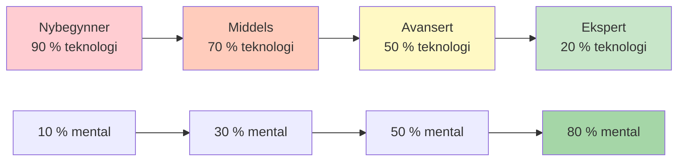

# Teknisk trening kontra flyttrening
<AdBanner />

Det er viktig å forstå forskjellen mellom teknisk trening og flyttrening for eliteutvikling. Begge er nødvendige, men de tjener forskjellige formål og krever forskjellige tilnærminger.

::: tip Kjerneprinsippet
**Du kan ikke trene en nybegynner som en ekspert** (de mangler nevrale baner), og **du kan ikke trene en ekspert som en nybegynner** (høyt teknisk volum forårsaker overtenking).
:::

## To typer trening

::: info Teknisk opplæring (eksplisitt læring)
**Fokus:** Mekanikk og form
**Oppmerksomhet:** Bevisste kroppsbevegelser
**Metode:** Nedbryting av ferdigheter, repeterende øvelse
**Best for:** Lære nye ferdigheter, korrigere dårlige vaner, bygge grunnlag

**Eksempel:** Øv på utløsningspunktet ditt 50 ganger med videoanalyse
:::

::: info Flyttrening (implisitt læring)
**Fokus:** Resultater, ikke mekanikk
**Oppmerksomhet:** Å la underbevisstheten ta over
**Metode:** Variert, spilllignende øvelse, visualisering
**Best for:** Konkurranseforberedelse, bygge selvtillit, topp ytelse

**Eksempel:** Å spille treningskamper med press, og kun fokusere på mål
:::

## Den dynamiske inversjonsmodellen

Riktig treningsforhold er omvendt korrelert med teknisk kompetanse. Etter hvert som du mestrer teknikk, blir mental trening viktigere – ikke mindre.

### 1. Nybegynner (kognitivt stadium)
- Du tenker bevisst på *hva* du skal gjøre
- Bevegelsene føles vanskelige og krever innsats
- Hjernen er fullstendig mettet med mekanikk
- **Forhold:** 90 % teknisk / 10 % mental
- **Mentalt fokus:** Nytelse, eksternt fokus (se på målet), ikke kompleks visualisering

### 2. Mellomstadiet (assosiativt stadium)
- Du foredler ferdigheten med mindre bevisst tankegang
- Bevegelsene blir jevnere, feilene reduseres
- Du begynner å oppdage dine egne feil
- **Forhold:** 70 % teknisk / 30 % mental
- **Mental fokus:** Utvikling av din pre-performance rutine (PPR)

### 3. Avansert (Terskel for autonomi)
- Ferdigheten er i stor grad automatisert
- Selvbildet ditt henger ofte etter din fysiske evne
- Treningen fokuserer på trykksimulering
- **Forhold:** 50 % teknisk / 50 % mental
- **Mental fokus:** Visualisering, selvbilde, angstkontroll

### 4. Ekspert (autonom fase)
- Tekniske ferdigheter er fullstendig underbevisste
- Bevisst oppmerksomhet på mekanikk forstyrrer ytelsen
- Vedlikeholdsvolum er alt du trenger teknisk sett
- **Forhold:** 20 % teknisk / 80 % mental
- **Mentalt fokus:** Flyttilstand, strategi, roe ned sinnet

<AdInArticle />

## Progresjonstabellen

| Nivå | Teknologi: Mental | Hovedmål |
|-------|---------------|-------------------|
| Nybegynner | 90 : 10 | Bygg maskinen |
| Middels | 70:30 | Stabiliser ferdigheten |
| Avansert | 50:50 | Stol på maskinen |
| Ekspert | 20:80 | Frihet til å yte |

## Ekspertfellen

For avanserte og ekspertspillere er det farlig å gå tilbake til høyt teknisk fokus.

**Problemet:** Når du har automatisert en ferdighet, men bevisst overvåker den under konkurranse, engasjerer du det bevisste sinnet og overstyrer det underbevisste. Dette forårsaker prestasjonsangst og «kvelningsangst».

**Vitenskapen:** Volumet som kreves for å opprettholde en ferdighet er betydelig lavere (ofte 1/3 til 1/9) enn volumet som kreves for å bygge den opp. Eksperter trenger minimalt med teknisk arbeid for å beholde touchet.

**Eliteeksempel:** Mestere som Philippe Quintais og Dylan Rocher fokuserer sterkt på taktiske scenarier og kritiske øyeblikk i stedet for mekaniske øvelser.

Tegn på at du tenker for mye på teknikk:
- Lammelse ved analyse
- Inkonsekvent prestasjon til tross for god teknikk
- Dårligere resultater i konkurranse enn i trening
- Føler seg «mekanisk» i stedet for flytende

## Sammenligning av treningsmetoder

| Aspekt | Teknisk opplæring | Flyttrening |
|--------|-------------------|---------------|
| **Øvingstype** | Blokkert (samme ferdighet gjentatte ganger) | Tilfeldig (varierte ferdigheter) |
| **Tilbakemelding** | Umiddelbar, detaljert | Forsinket, resultatfokusert |
| **Miljø** | Kontrollert, forutsigbar | Variabel, spilllignende |
| **Mental tilstand** | Analytisk, bevisst | Intuitiv, automatisk |
| **Beste tid** | Ferdighetsbygging utenom sesongen | Før konkurranse, vedlikehold |

## Blokkert vs. tilfeldig øvelse

**Blokkert øvelse:** Gjenta samme kast 20 ganger
- Føles produktiv (du ser rask forbedring)
- Bra for innledende læring
- Dårlig for langsiktig oppbevaring

**Tilfeldig øvelse:** Varier avstand, mål og kastetype
- Føles vanskeligere (flere feil)
- Bedre for konkurranseoverføring
- Bygger tilpasningsevne og beslutningstaking

## Praktiske retningslinjer

### For tekniske økter
1. Fokuser på ETT aspekt om gangen
2. Bruk videoanalyse
3. Få tilbakemeldinger fra en trener eller treningspartner
4. Aksepter at det vil føles litt rart i starten
5. Hold øktene kortere (kvalitet fremfor kvantitet)

### For flytøkter
1. Skap et spilllignende press
2. Fokuser på målet, ikke kroppen din
3. Bruk rutinen din før bruk konsekvent
4. Ikke analyser under økten
5. Stol på treningen din

## Integrasjonsutfordringen

Den virkelige ferdigheten er å vite når man skal bruke hver modus:

**Under en konkurransekamp:**
- Teknisk tenkning: ALDRI under utførelse
- Flytmodus: ALLTID når du kaster

**Under trening:**
- Tekniske økter: Planlagt, spesifikt fokus
- Flytøkter: Spillsimulering, trykkøvelse

## Eksempel på ukentlig saldo

| Dag | Økttype | Fokus |
|-----|-------------|-------|
| mandag | Teknisk | Pekepresisjon |
| tirsdag | Teknisk | Skytingsnøyaktighet |
| onsdag | Strømme | Mental trening, visualisering |
| torsdag | Blandet | Spillscenarier med flytfokus |
| fredag | Teknisk | Svakhetsområde |
| lørdag | Strømme | Kampspill, konkurransesimulering |
| søndag | Hvile | Gjenoppretting, refleksjon |

## Sammendrag: Regler for treningsbalanse

::: tip Regel nr. 1: Tilpass trening til nivå
**Nybegynnere (90/10):** Bygg maskinen – fokuser på teknikk
**Middels (70/30):** Stabiliser ferdigheten – legg til mentalt arbeid
**Avansert (50/50):** Stol på maskinen – balanser begge deler
**Ekspert (20/80):** Prestasjonsfrihet – hovedsakelig mental
:::

::: tip Regel nr. 2: Blokkert vs. tilfeldig øvelse
**Blokkert øvelse** (samme kast gjentatte ganger): Bra for innledende læring, dårlig for vedvaring
**Tilfeldig øvelse** (varierte kast): Vanskeligere på øvelse, bedre i konkurranse
:::

::: tip Regel nr. 3: Ekspertfellen
**For eksperter:** Høyt teknisk volum forårsaker overtenking og kvelning
**Løsning:** Minimalt teknisk vedlikehold, maksimal mental trening
:::

## Viktig konklusjon

> Du kan ikke trene en nybegynner som en ekspert (de mangler nevrale baner for mentalt arbeid), og du kan ikke trene en ekspert som en nybegynner (høyt teknisk volum forårsaker utbrenthet og overtenking).

Reisen fra teknikk til flyt krever strategisk inversjon. Tilpass treningen din til utviklingsstadiet ditt.

<AdBanner />
