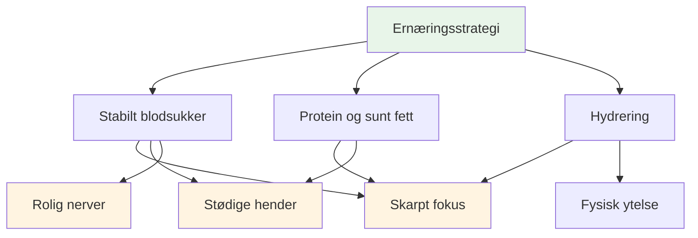
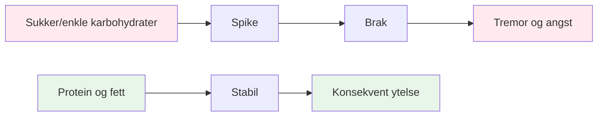
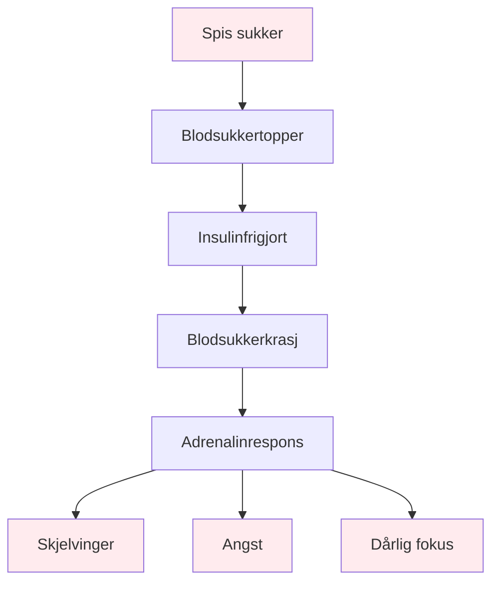

# Mat og ernæring

## Drivstoff for presisjonsytelse

Pétanque er en presisjonssport. Hjernen din er ditt viktigste verktøy – gi den stabil drivstoff, ikke berg-og-dal-bane-energi.

::: tip Kjerneprinsippet
**Stabilt blodsukker = Skarpt fokus + Stødige hender**

Unngå sukkertopper. Prioriter protein og sunt fett. Hold deg hydrert.
:::

## Viktige prinsipper

### Stabilt blodsukker er alt

::: warning Blodsukkerkrasj-påvirkning
Sukker og enkle karbohydrater forårsaker blodsukkertopper og -krasj, som direkte påvirker:
- ❌ Mental fokus og klarhet
- ❌ Stø hender (skjelv fra blodsukkerfall)
- ❌ Kvalitet i beslutningstaking
- ❌ Emosjonell stabilitet og ro
:::

### Prioriter protein og sunt fett

::: tip Beste mat for presisjon
Fett og protein gir vedvarende energi uten krasjer:
- ✅ Nøtter, avokado, olivenolje, egg, ost
- ✅ Langsom fordøyelse = jevn energi hele dagen
- ✅ Ingen ettermiddagssvikt under lange turneringer
:::

### Unngå sukkerfellen

::: danger Matvarer som bør unngås
Vær spesielt forsiktig med:
- ❌ «Energi»-barer og -drinker (ofte sukkerrike)
- ❌ Fruktjuice og smoothies (konsentrert sukker)
- ❌ Hvitt brød, bakverk, snacks fra automater
:::

## Hurtigguide for konkurransedagen

| Tidspunkt | Hva du skal spise | Hvorfor |
|--------|-------------|-----|
| **2–3 timer før** | Balansert måltid: protein, fett, grønnsaker | Stabil energi uten døsighet |
| **Under konkurransen** | Vann + små proteinsnacks (nøtter, ost, tørrfôr) | Behold fokus og stødige hender |
| **Unngå hele dagen** | Sukkerholdige snacks og drikker | Forhindre ulykker og skjelvinger |

::: tip Raske konkurransesnacks
**Ta med disse:**
- Blandede nøtter (usaltet)
- Hardkokte egg
- Osteterninger
- Jerky av oksekjøtt eller kalkun
- Grønnsaker med hummus

**Legg disse igjen hjemme:**
- Godteri og sjokolade
- Energidrikker
- Bakverk
- Fruktjuice
:::

## Vitenskapen

::: info Hvorfor dette er viktig for petanque
I motsetning til utholdenhetsidretter krever petanque:
- **Presisjon** - Stødige hender, ingen skjelvinger
- **Mental klarhet** - Skarp beslutningstaking hele dagen
- **Rolige nerver** - Lav angst under press

Sukkerbasert energi virker mot alle disse.
:::

## Lær mer

For detaljerte ernæringsstrategier, protokoller for konkurransedagen og vitenskapen bak stabil energi:

::: tip Komplett ernæringsguide
→ **[Ernæring for presisjonsytelse](./education/nutrition/)** - Komplett guide i vår utdanningsseksjon

Inkluderer:
- Detaljert måltidsplanlegging
- Protokoller for konkurransedagen
- Lavkarboalternativet for presisjonsutøvere
- Hydreringsstrategier
- Mat som hjelper kontra mat som skader
:::

