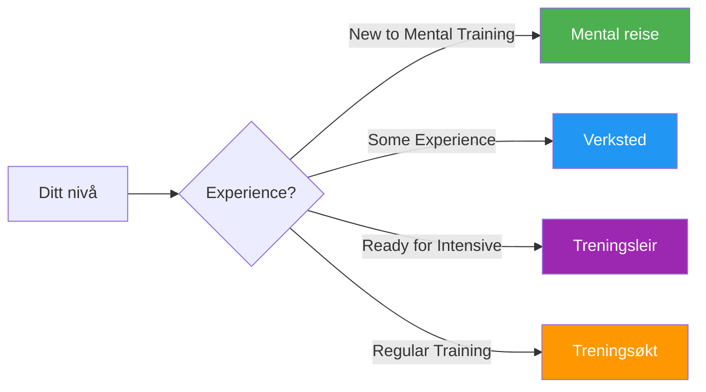

# Guider og verktøy

Praktiske ressurser for spillere, trenere og klubber for å implementere strukturerte mentale treningsprogrammer.

## Velg formatet ditt

## Guideformater

### 🌱 [Mental reise](/no/guider/mental-reise/)
**For nybegynnere** — 2–3 timers introduksjon

Perfekt for spillere som er nye innen mental trening. En skånsom introduksjon til kjernekonseptene med praktiske øvelser.

- Varighet: 2–3 timer
- Gruppestørrelse: 4–12 spillere
- Materialer: Medfølger
- [Vis guide →](/no/guider/mental-reise/)

---

### 🎯 [Verksted](/no/guider/verksted/)
**For mellomnivå** — 3–4 timers dypdykk

Strukturert workshopformat for klubber og lag som ønsker å utforske mental trening mer seriøst.

- Varighet: 3–4 timer
- Gruppestørrelse: 6–8 spillere
- Inkluderer: Koordinatorveiledning + nedlastbart materiale
- [Vis guide →](/no/guider/workshop/)

---

### 🏕️ [Treningsleir](/no/guider/treningsleir/)
**For engasjerte lag** — Helgeintensivt

Helgeprogram med en blanding av teori, praksis og konkurranse. Ideelt for lag som forbereder seg til viktige turneringer.

- Varighet: 2–3 dager
- Gruppestørrelse: 10–20 spillere
- Inkluderer: Fullt program + organiseringsmateriell
- [Vis guide →](/no/guider/treningsleir/)

---

### 🔄 [Opplæringsøkt](/no/guider/opplæringsøkt/)
**For regelmessig trening** — 2–4 timers strukturerte økter

Rammeverk for regelmessige treningsøkter som inkluderer mentale ferdigheter sammen med teknisk øvelse.

- Varighet: 2–4 timer
- Gruppestørrelse: 4 spillere (ett lag)
- Fokus: Konkurransesimulering med refleksjon
- [Vis veiledning →](/no/veiledninger/treningsøkt/)

---

## Maler og verktøy

Nedlastbare maler for å støtte utviklingen din:

### 📋 [Målmal](/no/guider/maler/målmal)
Strukturert arbeidsark for å sette og spore dine petanque-mål ved hjelp av SMART-rammeverket.

### 📓 [Mal for dagbok](/no/guider/maler/mal-for-dagbok)
Mal for trenings- og konkurransedagbok for å spore fremgang, innsikt og forbedringsområder.

---

## Hvilket format passer for deg?

| Format | Best for | Tidsforpliktelse | Dybde |
|--------|----------|-----------------|-------|
| **Mental reise** | Første introduksjon | 2–3 timer | ⭐ |
| **Verksted** | Klubbens treningsdager | 3–4 timer | ⭐⭐ |
| **Treningsleir** | Lagforberedelser | Helg | ⭐⭐⭐ |
| **Treningsøkt** | Kontinuerlig utvikling | Vanlig 2–4 timer | ⭐⭐ |

::: tip For trenere og klubbledere
Hver veiledning inneholder materiale for både deltakere OG tilretteleggere/arrangører. Se etter delene «For koordinatorer» med nedlastbare PDF-er og presentasjonsslides.
:::

## Relaterte ressurser

- [🎯 Vurdering](/no/vurdering/) — Evaluer dine 8 faktorer og finn prioriteringer
- [📚 Utdanningssenter](/no/utdanning/) — Dykk dypt inn i de 8 ytelsesfaktorene
- [📝 Artikler](/no/artikler/) — Forskning og innsikt

