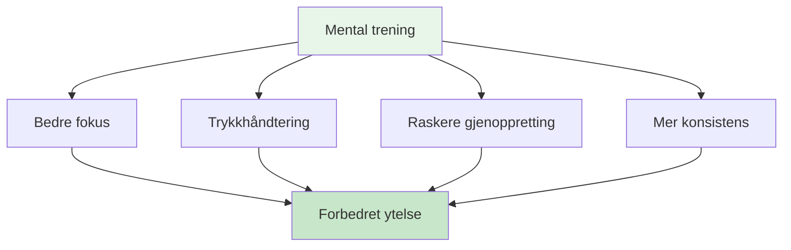

# Mental reise for nybegynnere

## Velkommen til din mentale spillreise

Enten du er en spiller som ønsker å forbedre ditt mentale spill eller en trener som ønsker å introdusere mental trening for laget ditt, vil denne guiden hjelpe deg med å ta de første skrittene inn i idrettspsykologiens verden for petanque.

::: tip Hvem er dette for?
- **Spillere** som ønsker å forstå det mentale spillet
- **Trenere** introduserer mental trening for lagene sine
- **Klubber** som organiserer mentale spillverksteder
- **Noen som er nysgjerrige på psykologien bak petanque
:::

## Hurtigtilgang

| Ressurs | Hensikt | Adgang |
|----------|---------|--------|
| **Komme i gang** | Introduksjon til mentale spillkonsepter | [Les nedenfor](#hvorfor-mental-trening-er-viktig) |
| **Øktguide** | Komplett 2–3 timers workshopguide for fasilitatorer | [Vis guide](/no/guides/mental-journey/session-guide) |
| **Materialer** | Deltakerveiledninger, lysbilder og arbeidsark | [Se materiale](/no/mental-reise/materialer) |
| **Relaterte guider** | Avanserte formater | [Workshop](/no/guides/workshop/) • [Treningsleir](/no/guides/training-camp/) |

## Hvorfor mental trening er viktig

På alle nivåer av petanque påvirker hjernen din prestasjonen din. Men de fleste spillere fokuserer 90 % på teknikk og bare 10 % på mentale ferdigheter. Denne veiledningen hjelper deg med å balansere den ligningen.

## Hva du vil lære

### For spillere

**Kjernekonsepter:**
1. **Sonen** – Forstå strømningstilstander og hvordan du får tilgang til dem
2. **Den indre kritikeren** - Å gjenkjenne og håndtere negativ selvsnakk
3. **Pressrespons** – Hvorfor du spiller annerledes i konkurranser
4. **Bryteren** - Går fra å tenke til å gjøre

**Praktiske ferdigheter:**
- Enkel rutine før inntak
- 3-pusteteknikk for tilbakestilling
- Protokoll for feilgjenoppretting
- Fokusankere for konkurranse

### For trenere/guider

**Hvordan tilrettelegge:**
1. Skape psykologisk trygghet
2. Lede gruppediskusjoner
3. Kobler teori til praksis
4. Håndtering av ulike personligheter

**Øktstruktur:**
- 2–3 timers workshopformat
- Diskusjonsoppgaver og øvelser
- Nedlastbare materialer
- Oppfølgingsaktiviteter

## Komme i gang

### Alternativ 1: Selvstudium (for spillere)

**Uke 1: Forstå det grunnleggende**
1. Les modulen [Sonen](/no/education/mental-game/the-zone/)
2. Prøv 3-pusteteknikken
3. Legg merke til når du er i «teknisk modus» kontra «flytmodus»

**Uke 2: Bevisstgjøring**
1. Les modulen [Mental styrke](/no/education/mental-game/mental-strength/)
2. Identifiser dine indre kritikermønstre
3. Øv på nøytral observasjon etter feil

**Uke 3: Skape struktur**
1. Les modulen [Mindfulness](/no/education/mental-game/mindfulness/)
2. Start med 5-minutters daglig trening
3. Utvikle en enkel rutine før inntak

**Uke 4: Integrering**
1. Bruk rutinen din i praksis
2. Spor mental ytelse i [Dagbokmal](/no/guides/templates/diary-template)
3. Sett mentale spillmål ved hjelp av [Målmal](/no/guides/templates/goal-template)

### Alternativ 2: Gruppeworkshop (for trenere)

**Gjennomfør en 2–3 timers økt:**

Bruk vår omfattende [Øktguide](/no/guides/mental-journey/øktguide) som inkluderer:
- Komplett øktstruktur
- Diskusjonsspørsmål
- Gruppeøvelser
- Nedlastbare materialer

**Det du trenger:**
- 6–12 deltakere
- Stille rom med sitteplasser i sirkel
- Tavle eller flipover
- Lerret eller projektor for deling av materiale
- 2–3 timer uavbrutt tid

## De tre søylene i mental trening

### 1. Bevissthet
**Hva det er:** Å legge merke til tankene, følelsene og mønstrene dine

**Hvorfor det er viktig:** Du kan ikke endre det du ikke legger merke til

**Hvordan utvikle:**
- Daglig mindfulness-praksis (5–10 minutter)
- Refleksjon etter kampen
- Føre en treningsdagbok

### 2. Aksept
**Hva det er:** Å tillate tanker og følelser uten å dømme

**Hvorfor det er viktig:** Å kjempe mot din indre opplevelse skaper spenning

**Hvordan utvikle:**
- Nøytral observasjonspraksis
- Indre coach vs. indre kritikerarbeid
- Å gi slipp på perfeksjonismen

### 3. Handling
**Hva det er:** Å velge nyttige svar til tross for vanskelige tanker

**Hvorfor det er viktig:** Mental trening handler om å prestere bra til tross for nerver

**Hvordan utvikle:**
- Rutiner før opptak
- Tilbakestill protokoller
- Trykksimulering i trening

## Vanlige spørsmål

### «Jeg er ikke god nok til å bekymre meg for mental trening»
Mental trening hjelper på alle nivåer. Faktisk bygger det å starte tidlig bedre vaner. Du trenger ikke å være elite for å dra nytte av å forstå sinnet ditt.

### «Er ikke dette bare å «tenke positivt»?»
Nei. Mental trening handler om å prestere bra til tross for negative tanker, ikke å eliminere dem. Det er praktiske ferdigheter, ikke positiv tenkning.

### &quot;Hvor lang tid tar det å se resultater?&quot;
Noen teknikker (som 3-puste-tilbakestillingen) virker umiddelbart. Dypere endringer (som konsistente flyttilstander) tar 2–3 måneder med øvelse.

### &quot;Trenger jeg en idrettspsykolog?&quot;
Ikke nødvendigvis. Denne veiledningen gir praktiske verktøy du kan bruke umiddelbart. Profesjonell hjelp er verdifull for dypere problemer, men de fleste spillere kan starte på egenhånd.

### &quot;Vil dette hjelpe teknikken min?&quot;
Mental trening erstatter ikke teknisk øvelse. Men det hjelper deg å bruke teknikken din konsekvent, spesielt under press.

## Tilgjengelige ressurser

### For spillere
- [Utdanningsmoduler](/no/education/) - 8 omfattende guider
- [Målmal](/no/guides/templates/goal-template) - Strukturer utviklingen din
- [Dagbokmal](/no/guides/templates/diary-template) - Spor fremgangen din
- [Casestudier](/no/articles/) - Ekte eksempler

### For trenere/guider
- [Øktguide](/no/guides/mental-journey/session-guide) - Komplett 2-3 timers workshop
- [Materialer for tilretteleggere](/no/mental-reise/materialer) - Digitale guider og lysbilder
- [Workshopguide](/no/guides/workshop/) - Avansert 3-4-timers format
- [Guide til treningsleir](/no/guides/training-camp/) - Helgeprogram

## Neste trinn

### For individuelle spillere
1. **Start med bevissthet** - Les [Sonen](/no/education/mental-game/the-zone/)
2. **Prøv én teknikk** - Bruk 3-pustetilbakestillingen denne uken
3. **Spor opplevelsen din** – Legg merke til hvilke endringer
4. **Bygg gradvis** - Legg til én ny ferdighet per uke

### For trenere/grupper
1. **Gjennomgå øktguiden** - Forstå strukturen
2. **Last ned materialer** - Få utdelingsark og lysbilder
3. **Bestill time** - Blokk 2–3 timer
4. **Forbered deg** - Les notatene til veilederen
5. **Kjør workshopen** - Følg veiledningen

## Støtte

**Spørsmål om å komme i gang?**
- E-post: [patrik.wiik@gmail.com](mailto:patrik.wiik@gmail.com)
- Se [Case-studier](/no/articles/case-studies) for eksempler
- Bli med i diskusjonene i klubben din

---

::: tip Klar til å begynne?
**Spillere:** Start med modulen [Sonen](/no/education/mental-game/the-zone/)

**Trenere:** Gå til [Øktguide](/no/guides/mental-journey/øktguide)

**Last ned materialer:** Gå til [Materialer for tilretteleggere](/no/guides/mental-journey/materials)
:::

