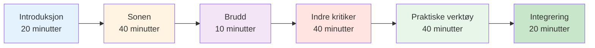

# Øktguide: Introduksjon til mentalt spill (2–3 timer)


## Oversikt

Denne veiledningen hjelper deg med å gjennomføre en 2–3 timers introduksjonsøkt i mental spilltrening for petanquespillere. Perfekt for trenere, klubbledere eller erfarne spillere som ønsker å introdusere mental trening for laget sitt.

::: tip To deler i denne veiledningen
- **[For deltakere](#for-deltakere)** – Hva spillerne vil lære
- **[For tilretteleggere](#for-tilretteleggere)** - Slik gjennomfører du økten
:::

## Hurtigtilgang

| Del | Hensikt | Adgang |
|---------|---------|--------|
| **For deltakere** | Hva du kan forvente av økten | [Vis seksjon](#for-deltakere) |
| **For fasilitatorer** | Fullstendig øktplan og tidspunkt | [Vis seksjon](#for-tilretteleggere) |
| **Materialer for økten** | Guider, lysbilder og arbeidsark | [Se materiale](/no/mental-reise/materialer) |
| **Sjekkliste for forberedelser** | Hva du bør forberede før økten | [Se sjekkliste](#forberedelse-1-uke-før) |

---

## For deltakere

### Hva du kan forvente

Denne økten introduserer det mentale spillet petanque gjennom diskusjoner, øvelser og praktiske teknikker du kan bruke umiddelbart.

**Du vil lære:**
- Hvorfor mental trening er viktig for prestasjoner
- Forskjellen mellom &quot;teknisk modus&quot; og &quot;flytmodus&quot;
- Hvordan gjenkjenne og håndtere din indre kritiker
- Enkle teknikker for trykkhåndtering
- En grunnleggende rutine før inntak

**Det du trenger:**
- Åpent sinn og vilje til å dele
- Notisbok og penn
- Dine egne erfaringer å diskutere
- 2–3 timer med fokusert tid

### Øktstruktur



### Nøkkelbegreper du vil utforske

#### 1. Sonen (flyttilstand)
- Hvordan det føles når alt klikker
- Hvorfor det å tenke på teknikk forstyrrer ytelsen
- «Bryteren» fra planlegging til utførelse

#### 2. Den indre kritikeren
- Hvordan negativ selvsnakk påvirker prestasjonen
- Forskjellen mellom indre kritiker og indre coach
- Nøytral observasjon kontra hard vurdering

#### 3. Trykkrespons
- Hvorfor du spiller annerledes i konkurranser
- Fysiske tegn på press
- Teknikker for rask tilbakestilling

#### 4. Praktiske verktøy
- 3-pustetilbakestilling
- Enkel rutine før inntak
- Protokoll for feilgjenoppretting

### Hva du skal ta med

**Påkrevd:**
- Deg selv og dine erfaringer
- Villighet til å delta

**Valgfri:**
- Eksempler på mentale utfordringer du står overfor
- Spørsmål om spesifikke situasjoner
- Notatbok for personlige notater

### Etter sesjonen

Du vil motta:
- Sammendrag av nøkkelbegreper
- Øvelser for uken
- Lenker til detaljerte utdanningsmoduler
- Målmal for mental spillutvikling


---

## For fasilitatorer

### Forberedelsessjekkliste

**1 uke før:**
- [ ] Bestill rom i 2–3 timer
- [ ] Inviter 6–12 deltakere
- [ ] Bokmerk materialsider (se [Materialer](/no/guides/mental-journey/materials))
- [ ] Les denne veiledningen grundig
- [ ] Forbered flippover eller tavle

**1 dag før:**
- [ ] Bekreft oppmøte
- [ ] Sett opp rommet (sirkel sitteplasser)
- [ ] Test all teknologi (lysbilder osv.)
- [ ] Forbered materialer

**1 time før:**
- [ ] Kom tidlig
- [ ] Sett opp sitteplasser i sirkel
- [ ] Sett opp materialer
- [ ] Sentrer deg selv

### Din rolle som tilrettelegger

::: warning Viktig
Du er **ikke** en terapeut eller teknisk coach. Du er en **fasilitator** som:
- Guider-diskusjon
- Skaper trygg plass
- Kobler konsepter til erfaring
- Styrer gruppedynamikk
:::

**Nøkkelferdigheter:**
- Aktiv lytting
- Nøytral tilstedeværelse
- Håndtering av ulike personligheter
- Å vite når man skal gå videre

### Detaljert øktplan

---

#### Del 1: Introduksjon (20 minutter)

**Mål:**
- Skape psykologisk trygghet
- Sett forventninger
- Bygg gruppeforbindelse

**Manus:**

&quot;Velkommen alle sammen. Denne økten handler om det mentale spillet petanque – tankene, følelsene og mønstrene som påvirker prestasjonen din.&quot;

**Grunnregler:**
1. Det som deles her forblir her
2. Ingen dom over andres erfaringer
3. Deltakelse er frivillig
4. Det finnes ingen gale svar

**Kursrunde:** Navn, hvor lenge du har spilt, én mental utfordring du står overfor.

**Merknader til veileder:**
- Gå først til modellering av sårbarhet
- Hold introduksjonene korte (1 minutt hver)
- Legg merke til vanlige temaer
- Valider alle svar

---

#### Del 2: Sone-/flyttilstanden (40 minutter)

**Mål:**
- Forstå flyttilstander
- Gjenkjenne teknisk kontra flytmodus
- Lær deg «bytte»-konseptet

**Åpningsspørsmål:**
«Tenk på en gang du spilte din beste petanque. Hvordan føltes det? Hva var annerledes?»

**Diskusjonsspørsmål:**
1. «Hvor mange av dere har hatt spill der alt bare klikket?»
2. &quot;Hva tenkte du på i disse øyeblikkene?&quot;
3. «Hvordan er det annerledes enn når du sliter?»

**Viktige læringspunkter:**

Bruk tavlen til å tegne:
```
PLANNING MODE          →    EXECUTION MODE
(Outside circle)            (Inside circle)
- Analyze situation         - Eyes on target
- Choose strategy           - Trust training
- Decide throw type         - Automatic movement
```

**Øvelse: Bryteren (10 minutter)**

&quot;La oss øve på bytteøyeblikket:&quot;
1. Stå opp
2. Tenk deg at du er utenfor sirkelen – tenk på et skudd
3. Ta et pust
4. Gå fremover (inn i en imaginær sirkel)
5. Slipp analysen når du går fremover
6. Fokuser kun på et imaginært mål&quot;

**Oppsummering:**
- &quot;Hva la du merke til?&quot;
- «Var det lett eller vanskelig å gi slipp på tanken?»
- &quot;Hvordan kan dette gjelde i ekte spill?&quot;

---

#### Del 3: Pause (10 minutter)

**Tilretteleggerens handlinger:**
- Oppmuntre til uformell diskusjon
- Legg merke til gruppeenergi
- Forbered deg til neste avsnitt

---

#### Del 4: Den indre kritikeren (40 minutter)

**Mål:**
- Gjenkjenn negative selvsnakkmønstre
- Skille mellom indre kritiker og indre coach
- Øv deg på nøytral observasjon

**Åpning:**
«Vi har alle en indre stemme som kommenterer prestasjonene våre. Noen ganger er det nyttig, noen ganger er det hardt. La oss utforske det.»

**Øvelse: Indre kritiker-inventar (15 minutter)**

&quot;Skriv ned på papiret ditt:&quot;
1. Hva din indre stemme sier etter et dårlig kast
2. Hva det sier når du er under press
3. Hva det sier om dine evner&quot;

*Gi 5 minutter til skriving*

«Hvem er villig til å dele ett eksempel nå?»

**Merknader til veileder:**
- Normaliser hard selvsnakk
- Ikke prøv å «fikse» noen
- Se etter vanlige mønstre

**Undervisning: Indre kritiker vs. indre coach (15 minutter)**

Tegn to kolonner på tavlen:

| Indre kritiker | Indre trener |
|--------------|-------------|
| &quot;Hvordan kunne du gå glipp av det?!&quot; | &quot;Det gikk til venstre&quot; |
| &quot;Du kveles alltid&quot; | &quot;La oss prøve igjen&quot; |
| &quot;Du er forferdelig&quot; | &quot;Hva kan jeg lære?&quot; |

**Diskusjon:**
- &quot;Merker du forskjellen?&quot;
- &quot;Hvilken stemme hjelper fremføringen?&quot;
- &quot;Kan du endre stemmen?&quot;

**Øvelse: Omformulering (10 minutter)**

«Ta en av dine indre kritiker-utsagn. Hvordan ville en indre coach sagt den?»

Del eksempler.

---

#### Del 5: Praktiske verktøy (40 minutter)

**Mål:**
- Lær 3-pustet tilbakestilling
- Lag en enkel rutine før inntak
- Forstå feilgjenoppretting

**Verktøy 1: 3-pustetilbakestilling (10 minutter)**

«Dette er tilbakestillingsknappen din i nødstilfeller. Bruk den når du føler at trykket øker.»

**Demonstrere:**
1. Pust inn i 4 tellinger
2. Hold i 2 tellinger
3. Pust ut i 6 tellinger
4. Gjenta 3 ganger

«La oss øve sammen nå.»

*Lede gruppen gjennom 3 sykluser*

**Oppsummering:**
- &quot;Hva la du merke til i kroppen din?&quot;
- &quot;Når kan du bruke dette?&quot;

**Verktøy 2: Enkel rutine før fotografering (15 minutter)**

«En rutine hjelper deg med å gå fra planlegging til utførelse konsekvent.»

**Grunnleggende struktur:**
```
Outside Circle (Planning):
- Look at situation
- Decide on throw
- See the result in your mind

Walking to Circle (Transition):
- One deep breath
- Let go of analysis

Inside Circle (Execution):
- Eyes on target only
- Trust your training
- Execute
```

**Øvelse:**
&quot;Lag din egen 3-trinnsrutine. Skriv den ned.&quot;

Del eksempler.

**Verktøy 3: Protokoll for feilgjenoppretting (15 minutter)**

«Elitespillere gjør ikke færre feil. De kommer seg raskere.»

**3-trinns protokoll:**
1. **Observer** - Angi faktum nøytralt (&quot;Det gikk til venstre&quot;)
2. **Lær** - Hent ut informasjon («Vinden er sterkere enn jeg trodde»)
3. **Tilbakestill** - Gå fremover (3-pustetilbakestilling, øynene fremover)

**Øvelse:**
&quot;Tenk på en nylig feil. Gå gjennom de tre trinnene.&quot;

---

#### Del 6: Integrering og avslutning (20 minutter)

**Mål:**
- Konsolider læring
- Lag handlingsplaner
- Tilby ressurser

**Refleksjonsspørsmål:**
1. «Hvilken innsikt tar du med deg?»
2. &quot;Hva er én ting du skal prøve denne uken?&quot;
3. &quot;Hvilke spørsmål gjenstår?&quot;

**Handlingsplanlegging (10 minutter)**

&quot;På utdelingsarket ditt, skriv:
1. En teknikk du skal øve på denne uken
2. Når/hvor du skal øve på det
3. Hvordan du vil spore fremgangen din&quot;

**Ressurser:**
- Del ut sammendragsark
- Del nettsiden: carreau.app
- Anbefalt startmodul: [Sonen](/no/education/mental-game/the-zone/)

**Sirkelen avsluttes:**
«Ett ord som beskriver hvordan du føler deg akkurat nå.»

**Sluttord:**
«Mental trening er en ferdighet som alle andre – det krever øvelse. Begynn i det små, vær tålmodig med deg selv, og legg merke til hva som forandrer seg. Takk for åpenheten din i dag.»

---

### Tips for tilretteleggeren

#### Håndtering av vanskelige situasjoner

**Hvis noen dominerer:**
- «Takk [navn]. La oss høre fra andre.»
- Bruk strukturert turtaking

**Hvis noen er motstandsdyktig:**
- Ikke krangle
- «Det er et gyldig perspektiv. Hva synes andre?»
- Samsvare seg med bekymringen deres

**Hvis noen blir følelsesladet:**
- Normaliser det
- «Dette berører noe ekte. Takk for at du deler.»
- Ikke prøv å fikse

**Hvis diskusjonen stopper opp:**
- Bruk spesifikke instruksjoner
- Del ditt eget eksempel
- Gå til en øvelse

#### Energistyring

**Høy energi:** Bruk trening og bevegelse
**Lav energi:** Still provoserende spørsmål
**Spredt:** Bring tilbake til strukturen
**Spenst:** Bruk humor eller pause

### Etter økten

**Oppfølging:**
- Send sammendrags-e-post innen 24 timer
- Inkluder lenker til ressurser
- Tilby å svare på spørsmål
- Planlegg valgfri oppfølgingstime

**Selvrefleksjon:**
- Hva fungerte bra?
- Hva ville du endret?
- Hva overrasket deg?
- Hva lærte du?


---

## Materialer

- [Deltakerguide](/no/mental-reise/materialer#deltakerguide)
- [Slides for veileder](/no/mental-reise/materialer#slides-for-veileder)
- [Sammendragsark](/no/mental-reise/materialer#sammendragsark)
- [Øvelsesark](/no/mental-reise/materialer#øvingsark)

---

::: tip Klar til å tilrettelegge?
1. Les denne veiledningen grundig
2. Last ned materialer
3. Øv på øvelsene selv
4. Planlegg økten din
5. Stol på prosessen
:::

