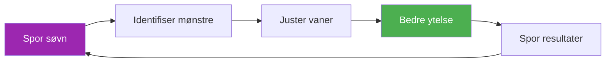

# Mal for søvnsporing

> «Spilleren som sov bedre vinner ofte.»

Spor søvnmønstrene dine og korreler dem med ytelse for å optimalisere restitusjonen.

::: tip Hvorfor spore søvn?
**Søvn er det viktigste restitusjonsverktøyet.** Eliteidrettsutøvere som regelmessig måler søvn rapporterer bedre energi, raskere reaksjonstider og forbedret beslutningstaking under press.
:::

---

## Rask daglig inngang

### Kopier dette for hver dag

---

**Dato:** ________

| **Sengetid:** ________ | **Oppvåkningstidspunkt:** ________ |
**Total søvn:** ________ timer

**Søvnkvalitet (1–10):** _____

**Faktorer som påvirker søvn:**
- [ ] Koffein etter kl. 14.00
- [ ] Alkohol
- [ ] Skjermtid før leggetid
- [ ] Stress/bekymring
- [ ] Støy/lysforstyrrelser
- [ ] Temperaturproblemer
- [ ] Sent måltid
- [ ] Annet: ________

**Morgenenergi (1–10):** _____

**Merknader:**

---

## Ukentlig søvnoppsummering

### Kopier dette hver uke

---

**Uke med:** ________

| Dag | Sengetid | Våkne | Timer | Kvalitet | Energi | Notater |
|-----|---------|------|-------|---------|--------|-------|
| man | /10 | /10 |
| tirsdag | /10 | /10 |
| Ons | /10 | /10 |
| Torsdag | /10 | /10 |
| Fre | /10 | /10 |
| Lør | /10 | /10 |
| Sol | /10 | /10 |

| **Ukentlig gjennomsnitt:** _____ timer | Kvalitet: _____/10 | Energi: _____/10 |

**Beste kveld:** ________ Hvorfor? ________

**Verste natt:** ________ Hvorfor? ________

**Mønster observert:**

---

## Søvnprotokoll før konkurranse

### 3 dager før konkurransen

| Natt | Mål for leggetid | Faktisk | Timer | Kvalitet | Notater |
|-------|----------------|--------|-------|---------|-------|
| -3 dager |
| -2 dager |
| -1 dag |

**Energi på konkurransedagen (1–10):** _____

**Ytelseskorrelasjon:**
- Påvirket søvn spillet mitt? Ja / Nei / Kanskje
- Hvordan?

---

## Sjekkliste for søvnmiljø

Vurder søvnmiljøet ditt:

| Faktor | Poengsum (1–10) | Trenger du forbedring? |
|--------|--------------|---------------------|
| **Mørke** |
| **Temperatur** (16–19 °C ideelt) |
| **Støynivå** |
| **Madrasskomfort** |
| **Putestøtte** |
| **Luftkvalitet** |
| **Telefon ut av rommet** |

---

## Søvnhygienevaner

Spor hvilke vaner du følger:

### Kveldsrutine (2 timer før leggetid)

- [ ] Ingen koffein etter kl. 14.00
- [ ] Ingen alkohol (eller begrenset til 1 drink, 3+ timer før leggetid)
- [ ] Lett middag, ikke for sent
- [ ] Dempede lys i hjemmet
- [ ] Ingen intens trening
- [ ] Skjermportforbud (1 time før leggetid)
- [ ] Avslapningsaktivitet (lesing, tøying, pusting)

### Regler for soverommet

- [ ] Romtemperatur 16–19 °C
- [ ] Fullstendig mørke (eller sovemaske)
- [ ] Telefon på lydløs, med forsiden ned (eller utenfor rommet)
- [ ] Konsekvent leggetid (±30 min)
- [ ] Kun seng for søvn (ikke arbeid/skrolling)

**Vaner fulgt denne uken:** _____/12

---

## Korrelasjon mellom søvn og ytelse

Spor over 4 uker for å se mønstre:

| Uke | Gjennomsnittlig søvn | Gjennomsnittlig kvalitet | Treningsytelse | Konkurranseresultat |
|------|-----------|-------------|---------------------|-------------------|
| 1 | timer | /10 | /10 |
| 2 | timer | /10 | /10 |
| 3 | timer | /10 | /10 |
| 4 | timer | /10 | /10 |

**Korrelasjon oppdaget:**

---

## Reise søvnprotokoll

For bortekamper:

**Før reisen:**
- [ ] Juster leggetid 30 minutter tidligere/senere for tidssone
- [ ] Pakk det viktigste for søvn (maske, ørepropper, pute)
- [ ] Bestill stille rom (vekk fra heis/gate)

**Ved destinasjonen:**
- [ ] Still inn romtemperaturen umiddelbart
- [ ] Blokker lyskilder
- [ ] Oppretthold leggetidsrutinen hjemme
- [ ] Unngå lurer &gt;20 minutter etter reise

**Merknader for neste tur:**

---

---

## Rask seier: Start i kveld

::: info 3-dagers utfordringen
Spor søvnen din i bare tre dager. Du vil sannsynligvis oppdage et mønster du ikke visste eksisterte.
:::

1. **I kveld** — Noter deg leggetid og eventuelle faktorer
2. **I morgen tidlig** — Vurder kvalitet og energi umiddelbart
3. **Gjenta i 3 dager** — Se etter mønstre

---

## Relaterte ressurser

- [Søvn- og restitusjonsopplæring](/no/opplæring/søvn/) — Vitenskapen bak søvn
- [Konkurransesjekkliste](/no/guider/maler/sjekkliste-for-konkurranse) — Fullstendig forberedelsesguide
- [Treningsdagbok](/no/guider/maler/dagbokmal) — Spor alle aspekter av treningen

