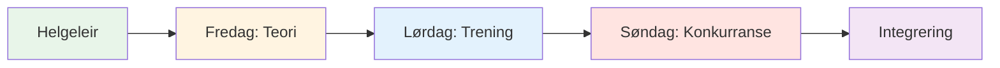
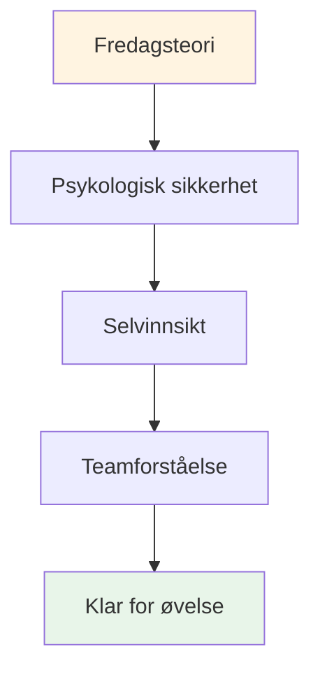

# Treningsleir: Helgebasert mental spillintensiv

## Oversikt

En omfattende helgekurs (fredag–søndag) for 10–20 spillere som kombinerer mental spillteori, trening i løypa og konkurransepreget bruk. Dette intensive formatet skaper transformerende læring gjennom integrering av alle tre elementene.

::: tip To deler i denne veiledningen
- **[For deltakere](#for-deltakere)** – Hva spillerne vil oppleve i løpet av helgen
- **[For arrangører](#for-arrangører)** - Hvordan planlegge og gjennomføre treningsleiren
:::

::: tip Treningsleirens filosofi
**Teori uten praksis er bare informasjon. Praksis uten teori er bare repetisjon. Konkurranse uten refleksjon er bare lek.** Denne helgen integrerer alle tre for transformerende læring.
:::

## Hurtigtilgang

| Del | Hensikt | Adgang |
|---------|---------|--------|
| **For deltakere** | Helgeplan og hva du bør ta med | [Vis seksjon](#for-deltakere) |
| **For arrangører** | Komplett planleggings- og tilretteleggingsguide | [Vis seksjon](#for-arrangører) |
| **Daglige timeplaner** | Detaljert tidsplan og aktiviteter | [Fredag](#fredag-kveld-mentalt-spill-grunnleggende-3-4-timer) • [Lørdag](#lørdag-trening-søknad-heldag) • [Søndag](#søndag-konkurranse-integrering-heldag) |
| **Relaterte guider** | Andre treningsformater | [Mental reise](/no/guider/mental-reise/) • [Workshop](/no/guider/workshop/) |

---

## For deltakere

### Hva du kan forvente

Dette er en intensiv helg som vil utfordre deg mentalt, fysisk og følelsesmessig. Du lærer mentale spillkonsepter, øver på dem i løypa og bruker dem i konkurranser – samtidig som du bygger dype bånd med medspillere.

**Helgestruktur:**

### Daglig oversikt

#### Fredag kveld: Grunnleggende mental lek (3–4 timer)
**Hva:** Teoriøkt om mentale spillkonsepter
**Hvor:** Innendørs møterom
**Format:** Sirkeldiskusjon og øvelser

**Du vil lære:**
- Sone- og strømningstilstandene
- Indre kritiker vs. indre coach
- Trykkresponsmønstre
- Grunnleggende rutiner før sprøyting

**Aktiviteter:**
- Innsjekking og grunnregler
- Isfjellet i petanque
- Oppretting av brukerhåndbok
- Frykt i en hatt-øvelse

#### Lørdag: Øvelse og søknad (heldag)
**Morgen (3 timer):** Strukturert trening med mentalt fokus
**Ettermiddag (3 timer):** Trykksimuleringsøvelser
**Kveld (2 timer):** Refleksjon og integrering

**Du skal øve:**
- Rutiner før skudd i ekte kast
- Tilbakestill teknikker etter feil
- Fokusankere under press
- Protokoller for teamkommunikasjon

**Format:**
- Øvelser i små grupper (3–4 spillere)
- Videoanalyse av mentale mønstre
- Trykkscenarier
- Kveldsdebriefing

#### Søndag: Konkurranse og integrering (heldag)
**Morgen (3 timer):** Turneringsspill
**Ettermiddag (2 timer):** Finalerunder
**Kveld (1 time):** Avsluttende refleksjon

**Du søker:**
- Alle mentale verktøy i konkurranse
- Teamprotokoller under press
- Feilgjenoppretting i sanntid
- Refleksjonsprosess etter kampen

### Hva du skal ta med

**Påkrevd:**
- Dine bouler og utstyr
- Komfortable klær for all slags vær
- Notisbok og penn
- Åpent sinn og vilje til å dele
- Vannflaske

**Valgfri:**
- Treningsdagbok
- Spørsmål om spesifikke mentale utfordringer
- Eksempler på pressede situasjoner du står overfor

**Ikke nødvendig:**
- Forespørsler om teknisk coaching (dette er mentalt spillfokusert)
- Ego eller behov for å bevise deg selv
- Andres dom

### Grunnregler for helgen

::: tip Beholderen
Alle deltakerne samtykker i:
1. **Konfidensialitet** – Det som deles forblir her
2. **Respekt** - Vis respekt for andres sårbarhet
3. **Deltakelse** - Engasjer deg fullt ut i alle aktiviteter
4. **Veksttankegang** - Omfavn ubehag som læring
5. **Støtte** – Hjelp lagkamerater med å anvende konsepter
:::

### Det du sitter igjen med

**Kunnskap:**
- Dyp forståelse av dine mentale mønstre
- Praktiske verktøy for trykkhåndtering
- Lagprotokoller for konkurranser
- Personlig rutine før bruk

**Ferdigheter:**
- Mulighet for å få tilgang til flyttilstander
- Teknikker for feilgjenoppretting
- Indre coach-omformulering
- Fokusankere

**Forbindelse:**
- Dypere bånd med lagkamerater
- Felles språk for mentalt spill
- Støttenettverk for fortsatt vekst

**Materialer:**
- Fullførte arbeidsark og øvelser
- Videoanalyse av dine mentale mønstre
- Handlingsplan for de neste 30 dagene
- Tilgang til alle utdanningsmoduler

### Typisk timeplan

**Fredag:**
- 18:00 - Ankomst og innsjekking
- 19:00 - Middag
- 20:00 - Åpningsøkt (teori)
- 23:00 - Fritid / hvile

**Lørdag:**
- 08:00 - Frokost
- 09:00 - Morgentrening
- 12:00 - Lunsj
- 13:30 - Ettermiddagstrening
- 17:00 - Pause
- 18:00 - Middag
- 19:30 - Refleksjonssesjon på kvelden
- 21:00 - Fritid / hvile

**Søndag:**
- 08:00 - Frokost
- 09:00 - Turneringen starter
- 12:00 - Lunsj
- 13:00 - Finalerunder
- 15:00 - Priser og anerkjennelse
- 16:00 - Sirkelslutt
- 17:00 - Avreise

---

## For arrangører

### Planleggingsoversikt

Denne delen inneholder alt du trenger for å organisere og gjennomføre en vellykket helgetreningsleir for 10–20 spillere.

### Planlegging før leir (6–8 uker før)

### Gruppestørrelse og -struktur

**Optimal:** 10–20 spillere
- **Liten leir (10–12):** Mer intimt, dypere deling
- **Stor leir (16–20):** Mer mangfoldige perspektiver, krever undergrupper

**Lagstruktur:**
- Del inn i lag på 3-4 for trening og konkurranse
- Bland ferdighetsnivåer og spillestiler
- Roter lagene gjennom helgen

### Bemanningskrav

| Rolle | Ansvar | Mengde |
|------|------------------|----------|
| **Koordinator for mental ytelse** | Tilrettelegge teoriøkter, gruppedynamikk | 1 |
| **Teknisk trener** | Overvåke praksis, gi tilbakemeldinger | 1-2 |
| **Konkurransedirektør** | Gjennomfør turnering, administrer logistikk | 1 |
| **Støttepersonell** | Måltider, oppsett, administrasjon | 1-2 |

### Krav til plassering

::: info Fasilitetsbehov
**Løype:**
- Flere terreng (minimum 3-4 løyper)
- Ulike underlag hvis mulig (grus, sand, hardt)
- Belysning for kveldslek

**Innendørsrom:**
- Plass til 20 personer i sirkel (teoriøkter)
- Separat fra løypa
- Tavle/projektor
- Komfortable sitteplasser

**Overnatting:**
- På stedet eller i nærheten (gangavstand)
- Delte rom oppmuntrer til tilknytning
- Stille rom for refleksjon

**Catering:**
- Næringsfokuserte måltider (se [Matguide](./food))
- Unngå sukkerkrasj
- Drikkestasjoner
:::

### Sjekkliste for materialer

::: details Komplett materialliste
**Teoriøkter:**
- [ ] Stoler til sirkel (ingen bord)
- [ ] Boule og cochonett for senter
- [ ] Flipover og tusjer
- [ ] Klistrelapper
- [ ] Arbeidsark (brukermanual, indre kritiker, osv.)
- [ ] Papir og penner
- [ ] Projektor (for nettstedsinnhold)

**Øvingsøkter:**
- [ ] Målebånd
- [ ] Kjegler/markører for øvelser
- [ ] Videokamera/stativ
- [ ] Utklippstavle og papir (sporing)
- [ ] Plystre

**Konkurranse:**
- [ ] Poenglister
- [ ] Turneringsbrakett
- [ ] Premier/anerkjennelse
- [ ] Førstehjelpsskrin

**Logistikk:**
- [ ] Navneskilt
- [ ] Deltakerliste med kontakter
- [ ] Kontaktinformasjon i nødstilfeller
- [ ] Vannflasker
- [ ] Solkrem
- [ ] Vev (for emosjonelt arbeid!)
:::

## Helgeplan

### Fredag kveld (3 timer)

**18:00–18:30 – Ankomst og velkomst**
- Innsjekking
- Romtildelinger
- Oversikt over helgen

**18:30–19:30 – Middag**
- Ernæringsfokusert måltid
- Uformelle introduksjoner

**19:30–22:30 – Teoriøkt: Grunnleggende**

Bruk [Workshop-guiden](./workshop) for detaljert veiledning:

1. **Grunnregler (15 min)** - Etabler psykologisk trygghet
2. **Innsjekkingsmatrise (20 min)** - Vurder gruppens energi
3. **Isfjellet (30 min)** - Utforsk indre tanker
4. **Brukermanual (45 min)** – Bygg teamforståelse
5. **Frykt i en hatt (45 min)** - Bryt isolasjonen
6. **Utsjekking (15 min)** - Slutt på sirkelen

**22:30 - Fritid**
- Uformell sosialisering
- Hvile og refleksjon

### Lørdag (heldag - teori + praksis)

**08:00–09:00 – Frokost og mindfulness**
- Rolig frokost
- Valgfri 15-minutters guidet meditasjon
- Sett intensjoner for dagen

**09:00–10:30 – Teoriøkt: Koble innhold til opplevelse**

Velg 3–4 emner fra akademiets nettside og utforsk det indre spillet:

**Eksempler på emner:**

1. **[Ernæring](./utdanning/ernæring/)** (20 min)
   - «Hvordan endrer matvalget ditt seg under press?»
   - &quot;Spiser du det kroppen din trenger, eller det angsten din vil ha?&quot;
   - Øvelse: Planlegg ernæring på konkurransedagen

2. **[Mental styrke](./utdanning/mentalt-spill/mental-styrke/)** (25 min)
   - &quot;Hva er ditt forhold til fiasko?&quot;
   - «Hvordan snakker du til deg selv etter en bom?»
   - Aktivitet: Omformuler indre kritiker til indre coach

3. **[Mindfulness](./utdanning/mentalt-spill/mindfulness/)** (25 min)
   - «Hvor går tankene dine i pausen før du kaster?»
   - «Hva trekker deg ut av nåtiden?»
   - Øvelse: 5-minutters kroppsskanning

4. **[Taktikk](./utdanning/teknikk/taktikk/)** (20 min)
   - «Er skuddvalget ditt basert på strategi eller frykt?»
   - &quot;Når spiller du det trygt kontra å ta risikoer?&quot;
   - Diskuter: Risikoprofiler i gruppen

**10:30–10:45 – Pause**

**10:45–12:30 – Integrering i løypa: Øvelser med mentalt fokus**

**Øvelse 1: Ta din sjanse (30 min)**

Fra [Workshop-guiden](./workshop) – øv på å eie intensjon og tvil:

1. Kunngjør målet: «Jeg skyter med jernet»
2. Statens tillit: «Jeg får 7 av 10»
3. Navngi den indre tanken: «Min indre stemme bekymrer seg for bakspinn»
4. Utfør skuddet
5. Reflekter: «Hva skjedde? Hva lærte du?»

**Øvelse 2: Kognitiv interferens (30 min)**

Test om teknikken har blitt automatisk:
- Koordinator stiller komplekse spørsmål mens spilleren skyter
- «Nevn 5 hovedsteder» eller «Tell baklengs fra 100 med 7-tallet»
- Suksess = teknikk er implisitt, ikke bevisst bearbeidet

**Øvelse 3: Brukermanualøvelse (30 min)**

Bruk brukerhåndbøkene fra fredag:
- Spill i lag på 3
- Etter hvert skudd svarer lagkameratene i henhold til brukerhåndboken
- «Marc trenger stillhet etter en bom» – laget ærer det
- Oppsummering: «Hvordan føltes det å bli forstått?»

**12:30–14:00 – Lunsj og hvile**
- Ernæringsfokusert måltid
- Stille tid for refleksjon
- Valgfritt: Individuelle innsjekkinger med koordinator

**14:00–17:00 – Øving: Terrengtilpasning**

**Mål:** Bygge tilpasningsevne og mental fleksibilitet

**Oppsett:**
- Roter gjennom 3-4 forskjellige terreng/løyper
- 45 minutter per terreng
- Fokus på mental tilpasning, ikke bare teknisk

**Rotasjonsstruktur:**

| Terreng | Mentalt fokus | Øvelse |
|---------|--------------|----------|
| **Terreng 1: Mykt/sand** | Aksept av usikkerhet | &quot;Den uskyldige - aksepter det som er&quot; |
| **Terreng 2: Hardt/Gruset** | Presisjon under press | &quot;Stol på teknikken din&quot; |
| **Terreng 3: Ujevnt** | Emosjonell regulering | &quot;Hold deg rolig når det er urettferdig&quot; |
| **Terreng 4: Konkurranse** | Tilgang til flyttilstand | &quot;Finn sonen&quot; |

**Tilrettelegging:**
- Teknisk trener gir tilbakemelding på teknikk
- MPC spør: «Hva skjer i tankene dine akkurat nå?»
- Spillerjournal mellom rotasjoner

**17:00–18:00 – Pause og refleksjon**
- Individuell journalføring
- &quot;Hva lærte du om deg selv i dag?&quot;
- «Hva er én ting du vil gjøre annerledes i morgen?»

**18:00–19:00 – Middag**

**19:00–21:00 – Kveldsteori: Dyp sårbarhet**

**Aktivitet 1: Å omformulere den indre kritikeren (45 min)**

Se [Verkstedsveiledning](./workshop) for fullstendig protokoll:
1. Identifiser den nøyaktige kritikerfrasen
2. Omformuler som indre coach
3. Partnerpraksis

**Aktivitet 2: Konkurranseforberedelse (45 min)**

I morgen er det konkurransedag. Forbered deg mentalt:

1. **Visualisering (15 min)**
   - Lukk øynene
   - Tenk deg et perfekt skudd
   - Føl selvtilliten
   - Legg merke til roen

2. **Teamprotokoller (20 min)**
   - Lag signaler for støtte
   - «Jeg trenger en tilbakestilling» = berør boules
   - «Jeg trenger oppmuntring» = knyttnevestøt
   - «Jeg trenger plass» = et skritt tilbake

3. **Sett intensjoner (10 min)**
   - &quot;I morgen skal jeg fokusere på...&quot;
   - «Målet mitt er ikke å vinne, men å ...»
   - &quot;Jeg skal øve...&quot;

**Utsjekking (30 min)**
- Del én frykt om morgendagen
- Del én intensjon
- Gruppestøtte

**21:00 - Fritid**
- Tidlig i seng (konkurranse i morgen!)
- Stille refleksjon

### Søndag (konkurransedag)

**08:00–09:00 – Frokost og mental forberedelse**
- Lett frokost (se [Ernæringsveiledning](./education/nutrition/))
- 15-minutters mindfulness-øvelse
- Teammøter

**09:00–09:30 – Konkurransebriefing**

**Format:** Round-robin-turnering
- Lag på 3
- Spill til 13 poeng
- Alle spiller alle
- Fokuser på PROSESS, ikke resultat

**Twist: Mental ytelsespoengsum**

::: tip Dobbelt poengsystem
**Tradisjonell:** Poeng vunnet
**Mental ytelse:** Poengbedømmelse fra MPC

Mentale prestasjonspoeng (0–5 per kamp):
- Brukte brukerhåndbokverktøy
- Støttet lagkamerater effektivt
- Håndtert indre kritiker
- Forble til stede (ikke dvelende ved tidligere bilder)
- Demonstrert psykologisk trygghet

**Vinner:** Beste kombinerte poengsum (tradisjonell + mental)
:::

**09:30–13:00 – Morgenkonkurranse**
- Round-robin-spill
- MPC observerer og scorer
- Teknisk trener gir kort tilbakemelding mellom kampene
- Hydrering og mellommåltidpauser

**13:00–14:00 – Lunsj**
- Ernæringsfokusert
- Uformell refleksjon
- Hvile

**14:00–17:00 – Ettermiddagskonkurranse**
- Fortsett runde-robin
- Semifinaler og finaler
- Økende press
- Bruk morgenlærdommene

**17:00–17:30 – Priser og anerkjennelse**

**Kategorier:**
- Tradisjonell vinner
- Vinner av mental ytelse
- Mest forbedret
- Beste lagkamerat
- Motpris (mest sårbare)

**17:30–19:00 – Avsluttende refleksjonsøkt**

**Kritisk:** Det er her læring sementeres.

**Struktur:**

**1. Individuell refleksjon (15 min)**
Skriv i journalen:
- Hva lærte du om deg selv i helgen?
- Hva overrasket deg?
- Hva vil du gjøre annerledes?
- Hva tar du med deg hjem?

**2. Gruppedeling i liten gruppe (30 min)**
Grupper på 4-5:
- Del viktig innsikt
- Hva resonnerte mest?
- Hva var vanskeligst?
- Hva var mest verdifullt?

**3. Full gruppeintegrasjon (30 min)**
Ring opp:
- Hver person deler ÉN viktig lærdom
- MPC validerer og kobler sammen temaer
- Diskuter: «Hvordan vil dere anvende dette?»

**4. Forpliktelser (15 min)**
- Hver person forplikter seg til én ting
- &quot;I min neste konkurranse skal jeg...&quot;
- Gruppevitner og støttespillere

**5. Avslutning (15 min)**
- Takk deltakerne for motet
- Minn om taushetsplikt
- Utveksle kontakter
- Planlegg oppfølging (valgfri nettbasert økt)

**19:00 - Middag og avreise**

## Tips for tilrettelegging

### Balansering av teori og praksis

::: warning Ikke overbelast teorien
**Feilen:** For mye snakk, ikke nok handling

**Saldoen:**
- Teori skaper bevissthet
- Øvelse bygger ferdigheter
- Integrering av konkurransetester
- Refleksjon sementerer læring

**Tommelfingerregel:** 30 % teori, 40 % praksis, 20 % konkurranse, 10 % refleksjon
:::

### Håndtering av gruppedynamikk

**Den konkurransedyktige alfaen:**
- Vil vinne for enhver pris
- Motstår sårbarhet
- **Strategi:** Kanaliser konkurranseevne inn i mental prestasjonsscoring

**Den stille observatøren:**
- Tar alt inn, deler ikke
- **Strategi:** Lag inngangspunkter med lav innsats, valider observasjon som deltakelse

**Skeptikeren:**
- &quot;Denne følsomme greia fungerer ikke&quot;
- **Strategi:** Verbal Aikido – innrett og drei (se [Workshop-guide](./workshop))

**Overdeleren:**
- Dominerer diskusjonen
- **Strategi:** «Takk, la oss høre fra andre»

### Håndtering av emosjonelle øyeblikk

**Noen gråter under Frykt i hatten:**
- ✅ Normaliser: «Tårer er mot, ikke svakhet»
- ✅ Tilby papirservietter, ikke forhast deg
- ✅ Spør: «Hva trenger du akkurat nå?»
- ❌ Ikke gjør: «Det er greit, ikke gråt»

**Konflikt mellom spillere:**
- ✅ Pause og adressere
- ✅ &quot;Hva skjer akkurat nå?&quot;
- ✅ Bruk som læringsøyeblikk
- ❌ Ikke: Ignorer eller minimer

**Noen slår av:**
- ✅ Sjekk inn privat i pausen
- ✅ «Jeg la merke til at du ble stille. Hva skjer?»
- ✅ Tilbudsalternativer: delta annerledes, ta en pause
- ❌ Ikke: Ring ut offentlig

## Oppfølging etter leiren

### Umiddelbar (24–48 timer)

**Send til alle deltakere:**
- Takkemelding
- Sammendrag av viktige poenger
- Bilder fra helgen
- Kontaktliste (med tillatelse)
- Lenke til ressurser på nettsiden

**Individuelle innsjekkinger:**
- Send melding til alle som delte mye
- &quot;Hvordan føler du deg om helgen?&quot;
- Ta tak i eventuelle sårbarhetsbakgrunner

### Kortsiktig (2 uker)

**Valgfri nettbasert økt (60–90 min):**
- Hvordan har du anvendt lærdommene?
- Hva fungerer? Hva er utfordrende?
- Likemannsstøtte og problemløsning
- Forsterk forpliktelsene

### Langsiktig (1–3 måneder)

**Deltakere i undersøkelsen:**
- Hva er annerledes i spillet ditt?
- Hvilke verktøy bruker du fortsatt?
- Hva ville gjort den neste leiren bedre?
- Ville du anbefalt til andre?

**Påvirkning av banen:**
- Konkurranseresultater
- Selvrapportert selvtillit
- Teamdynamikk
- Fortsatt engasjement

## Tilpasning for ulike gruppestørrelser

### Liten leir (10–12 spillere)

**Fordeler:**
- Dypere deling
- Mer individuell oppmerksomhet
- Sterkere bånd

**Justeringer:**
- Enkelt gruppe for all teori
- Mer tid per person til aktiviteter
- Intimt konkurranseformat

### Stor leir (16–20 spillere)

**Fordeler:**
- Ulike perspektiver
- Mer variasjon i konkurranser
- Stordriftsfordeler

**Justeringer:**
- Del inn i to grupper for noen teoriøkter
- Trenger 2 MPC/tilretteleggere
- Større turneringsramme
- Mer strukturerte rotasjoner

## Budsjetthensyn

### Inntekter

| Punkt | Pris per person | 20 personer | 10 personer |
|------|------------------|-----------|-----------|
| **Registrering** | €150–250 | €3 000–5 000 | 1500–2500 euro |

### Utgifter

| Kategori | Koste | Notater |
|----------|------|-------|
| **Utleie av lokaler** | €500–1000 | Helgepris |
| **Overnatting** | €40–60/person/natt | Delte rom |
| **Måltider** | €30–40/person/dag | 6 måltider |
| **Personale** | €500–1000 | MPC + trenere |
| **Materialer** | €100–200 | Arbeidsark, rekvisita |
| **Premier** | €100–200 | Anerkjennelseselementer |

**Totalt per person:** €120–180
**Margin:** €30–70/person (eller nullpunkt for fellesskapsbygging)

## Suksessmålinger

### Umiddelbare indikatorer

- [ ] Psykologisk sikkerhetspoengsum (gjennomsnitt 1–10 &gt;7)
- [ ] Deltakelsesrate (&gt;80 % som deler aktivt)
- [ ] Fullføringsgrad (&gt;90 % holder seg hele helgen)
- [ ] Tilfredshetspoengsum (gjennomsnitt 1–10 &gt;8)

### Langsiktige indikatorer

- [ ] Atferdsendring (ved bruk av verktøy i konkurranse)
- [ ] Ytelsesforbedring (selvrapportert)
- [ ] Fellesskapsbygging (holde kontakten)
- [ ] Anbefalinger (anbefalinger til andre)

## Vanlige feil å unngå

::: danger Fallgruver
**1. For mye innhold**
- Prøver å dekke alt
- **Rettelse:** Fokuser på dybde, ikke bredde

**2. Hoppe over refleksjon**
- Skynder seg til neste aktivitet
- **Rettelse:** Innebygd behandlingstid

**3. Ignorerer motstand**
- Å presse seg gjennom skepsis
- **Løsning:** Ta det opp direkte med verbal aikido

**4. Teknisk veiledning under teorien**
- Blanding av roller
- **Rettelse:** Tydelige grenser mellom MPC og teknisk trener

**5. Ingen oppfølging**
- Helgen er over, læringen stopper
- **Rettelse:** Planlegg kontaktpunkter etter leiren
:::

## Ressurser

### Fra dette nettstedet

- [Workshopguide](./workshop) - Detaljerte tilretteleggingsprotokoller
- [Veiledning for treningsøkt](./training-session) – For kontinuerlig trening
- [Ernæring](./utdanning/ernæring/) - Protokoller for konkurransedagen
- [Mental styrke](./utdanning/mental-spill/mental-styrke/) - Indre spillkonsepter
- [Mindfulness](./utdanning/mentalt-spill/mindfulness/) - Nærværsteknikker
- [Taktikk](./utdanning/teknikk/taktikk/) - Strategisk tenkning

### Anbefalt lesning

- *Tennisens indre spill* av Timothy Gallwey
- *Tankegang* av Carol Dweck
- *Den fryktløse organisasjonen* av Amy Edmondson

