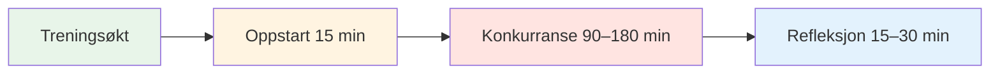

# Treningsøkt: Veiledning for konkurransetrening


## Hvordan fire spillere kan trene sammen regelmessig

Denne veiledningen viser hvordan du kan sette sammen en regelmessig treningsgruppe på 4 spillere som konkurrerer mot hverandre på forskjellige underlag og i forskjellige miljøer i 2–4 timer. Etterlign ekte konkurranse samtidig som du bygger opp psykologisk trygghet og mentale prestasjonsevner.

::: tip Filosofien bak treningsøkten
**Konkurranse uten refleksjon er bare lek. Trening uten konkurranse er bare øvelse.** Dette formatet kombinerer begge deler: konkurrer hardt, og reflekter deretter dypt.
:::

## Hurtigtilgang

| Del | Hensikt | Adgang |
|---------|---------|--------|
| **Finne gruppen din** | Hvordan rekruttere de fire riktige spillerne | [Vis seksjon](#finne-gruppen-din) |
| **Øktstruktur** | 2-timers og 4-timers formater | [Vis seksjon](#øktstruktur) |
| **Oppstartsprotokoll** | Hvordan starte hver økt | [Vis seksjon](#oppstartsprotokoll-15-min) |
| **Refleksjonsguide** | Prosess for oppsummering etter økten | [Vis seksjon](#refleksjonsprotokoll-15–30-min) |
| **Relaterte guider** | Andre treningsformater | [Mental reise](/no/guider/mental-reise/) • [Workshop](/no/guider/workshop/) • [Treningsleir](/no/guider/treningsleir/) |



## Hvorfor 4 spillere?

**Det perfekte tallet:**
- **2v2-format** – Speiler ekte konkurranse
- **Rotasjonsalternativer** - Bytt partnere, spill single
- **Læring fra likemenn** - Ulike spillestiler
- **Ansvarlighet** - Vanskelig å avbestille på 3 personer
- **Intimitet** – Liten nok til dyp deling

::: info Gruppedynamikken
4 spillere skaper den ideelle balansen mellom konkurranseintensitet og psykologisk trygghet. Dere konkurrerer hardt, men dere støtter også hverandres vekst.
:::

## Finne gruppen din

### Ideell gruppesammensetning

**Ferdighetsnivå:**
- Lignende nivå (innenfor 1–2 nivåer)
- Alle er forpliktet til forbedring
- Blanding av pekere og skyttere
- Ulike spillestiler

**Tankegang:**
- Åpen for sårbarhet
- Villig til å reflektere
- Konkurransedyktig, men støttende
- Vekstorientert

**Logistikk:**
- Bor innenfor 30 minutter av hverandre
- Kan forplikte seg til vanlig timeplan
- Lignende tilgjengelighet

### Rekruttering av gruppen din

**Hvor finner man spillere:**
- Klubbens elitespillere
- Regelmessige deltakere i regionale turneringer
- Pétanque-fellesskap på nett
- Spør treneren din om anbefalinger

**Invitasjonen:**
> «Jeg danner en liten treningsgruppe på fire spillere som ønsker å konkurrere regelmessig og jobbe med det mentale spillet. Vi møtes ukentlig i 2–3 timer, spiller hardt og reflekterer deretter over hva vi lærer. Interessert?»

## Øktstruktur

### 2-timers økt

| Tid | Aktivitet | Varighet |
|------|----------|----------|
| **Oppstart** | Innsjekking og oppsett | 15 minutter |
| **Konkurranse** | 2 mot 2-kamper | 90 minutter |
| **Speilbilde** | Debriefing og læring | 15 minutter |

### 3-timers økt

| Tid | Aktivitet | Varighet |
|------|----------|----------|
| **Oppstart** | Innsjekking og oppsett | 15 minutter |
| **Konkurranserunde 1** | 2 mot 2-kamper | 60 minutter |
| **Brudd** | Hvile og uformell prat | 15 minutter |
| **Konkurranserunde 2** | Roter partnere | 60 minutter |
| **Speilbilde** | Dyp debriefing | 30 minutter |

### 4-timers økt

| Tid | Aktivitet | Varighet |
|------|----------|----------|
| **Oppstart** | Innsjekking og oppsett | 20 minutter |
| **Konkurranserunde 1** | 2 mot 2-kamper | 75 minutter |
| **Brudd** | Hvile og mellommåltid | 15 minutter |
| **Konkurranserunde 2** | Roter partnere | 75 minutter |
| **Brudd** | Hvile | 10 minutter |
| **Konkurranserunde 3** | Singler eller utfordring | 45 minutter |
| **Speilbilde** | Dyp debriefing og planlegging | 30 minutter |


## Oppstartsprotokoll (15–20 minutter)

### 1. Fysisk oppsett (5 min)

**Velg terreng:**
- Roter gjennom forskjellige overflater hver uke
- Varierer vanskelighetsgrad og forhold
- Noen ganger velger man ubehagelig terreng med vilje

**Oppsett plassen:**
- Merk grensene tydelig
- Klargjør måleverktøy
- Vannstasjon
- Skygge om nødvendig

### 2. Mental innsjekking (10 min)

**Innsjekkingssirkelen:**

Stå i en sirkel (ingen boule ennå) og gå rundt:

**Hver person deler:**
1. **Energinivå** (1–10): «Jeg er på 7 i dag»
2. **Mental tilstand**: «Jeg føler meg fokusert» eller «Jeg blir distrahert av arbeidsstress»
3. **Intensjon**: «I dag vil jeg jobbe med å holde meg rolig etter bom.»

**Hvorfor dette er viktig:**
- Bygger bevissthet om mental tilstand
- Skaper empati i gruppen
- Setter individuelt fokus for økten
- Normaliserer å være &quot;av&quot; noen dager

**Tips til veileder:** Roter på hvem som går først hver uke

### 3. Påminnelse om grunnregler (5 min)

**Minn kort på følgende hver økt:**

::: tip Grunnregler for økten
1. **Konkurrer hardt** - Spill for å vinne, uten å holde tilbake
2. **Støtt vekst** - Hjelp hverandre å lære
3. **Respekter brukermanualer** - Vær respektfull for hvordan hver person ønsker å bli behandlet
4. **Vær til stede** - Ingen telefoner under lek
5. **Reflekter ærlig** - Del hva som egentlig skjer inni deg
6. **Konfidensialitet** – Det som deles her, forblir her
:::

**Saldoen:**
> «Vi konkurrerer som om det var en turnering, men vi støtter som om vi var lagkamerater. Hardt mot spillet, mykt mot personen.»

## Regler for konkurranseoppførsel

### Kampformat

**Standard 2v2:**
- Spill til 13 poeng
- Standard petanqueregler
- Hold poengsummen ærlig
- Mål når det er nødvendig (ikke gjett)

**Rotasjonsalternativer:**

**Uke 1:** A+B vs. C+D
**Uke 2:** A+C vs B+D
**Uke 3:** A+D vs. B+C
**Uke 4:** Single round-robin

### Skape konkurransemiljø

::: warning Kritisk: Gjør det virkelig
**Dette er ikke tilfeldig trening.** Behandle det som en turnering:

✅ **Gjør:**
- Behold offisiell poengsum
- Mål nøyaktig
- Ring fotfeil
- Ta det på alvor
- Feir gode bilder
- Vis skuffelse over bommerter

❌ **Ikke:**
- Gi «omarbeidelser»
- Vær altfor avslappet
- La dårlige samtaler passere
- Spøk gjennom hele spillet
- Lag unnskyldninger
:::

### Den mentale ytelsesvrien

**Spor to poengsummer:**

1. **Tradisjonell poengsum** - Poeng vunnet
2. **Mental ytelsespoeng** – Hvor godt du håndterte ditt indre spill

**Kriterier for mental ytelse (selvskåring 1–5 etter hver kamp):**

| Kriterium | 1 (Dårlig) | 3 (Bra) | 5 (Utmerket) |
|-----------|----------|----------|---------------|
| **Forble til stede** | Dvelte ved tidligere bilder | For det meste til stede | Helt i nuet |
| **Behandlet indre kritiker** | Hard selvsnakk | Fanget og omformulert | Brukt indre trener |
| **Emosjonell regulering** | Synlig frustrasjon | Holdt seg stort sett rolig | Rolig gjennomgående |
| **Støttet partner** | Ignorert eller klandret | Grunnleggende støtte | Brukt brukermanual |
| **Fokus** | Distrahert, ufokusert | Mest fokusert | Laserfokusert |

**Totalt:** /25 per kamp

**Hvorfor dette er viktig:**
- Flytter fokus fra resultat til prosess
- Bygger bevissthet om det mentale spillet
- Skaper ansvarlighet for indre arbeid
- Feirer mental prestasjon, ikke bare seire

### Variere miljøet

**Rotér gjennom ulike utfordringer:**

**Uke 1: Hjemmeterreng**
- Din vanlige løype
- Komfortable forhold
- Fokus: Bygge selvtillit

**Uke 2: Vanskelig terreng**
- Ujevn, utfordrende overflate
- Fokus: Emosjonell regulering, aksept

**Uke 3: Annen lokasjon**
- En annen klubbs løype
- Fokus: Tilpasningsevne

**Uke 4: Trykkforhold**
- Tilskuere (inviter andre til å se på)
- Fokus: Håndtering av eksternt press

**Uke 5: Værutfordring**
- Vind, varme eller kulde
- Fokus: Mental styrke

**Uke 6: Tidspress**
- Skuddklokke (30 sekunder per kast)
- Fokus: Beslutningstaking under press

```mermaid
graph TD
    A[Varier miljø] --> B[Ulike overflater]
    A --> C[Ulike steder]
    A --> D[Ulike forhold]
    A --> E[Ulike trykk]

    B --> F[Bygg tilpasningsevne]
    C --> F
    D --> F
    E --> F

    style A fill:#e8f5e9
    style F fill:#fff4e1


## Reflection Protocol (15-30 minutes)

**Critical:** This is where the learning happens. Don't skip it!

### Short Reflection (15 min)

**After each game, quick debrief:**

**Go around the circle, each person shares:**

1. **Mental Performance Score** (1-5): "I give myself a 4 today"
2. **One thing that went well mentally**: "I stayed calm after my miss in the 3rd end"
3. **One thing to work on**: "I need to catch my inner critic faster"

**Group discussion:**
- "What did you notice about your inner game today?"
- "When did you feel most in the zone?"
- "When did you lose focus?"

### Deep Reflection (30 min)

**After final game, deeper debrief:**

**Structure:**

**1. Individual Journaling (5 min)**

Write privately:
- What happened in my mind during pressure moments?
- When did I use my Inner Coach vs. Inner Critic?
- How did I support my partner?
- What pattern am I noticing about myself?

**2. Pair Sharing (10 min)**

Partner up, share:
- One insight from journaling
- One question you're sitting with
- One commitment for next session

**3. Group Integration (15 min)**

Full circle:
- Each person shares ONE key learning
- Group identifies themes
- Discuss: "What are we learning as a group?"
- Set focus for next session

**Closing:**
- Thank each other for showing up
- Confirm next session date/time
- One-word check-out: "How are you leaving?"


## User Manual Integration

### Creating Your User Manuals

**In your first session together, each person completes:**

| Section | Prompt | Example |
|---------|--------|---------|
| **My Stress Signature** | "When I'm anxious, I..." | "...go completely quiet" |
| **How to Support Me** | "After a miss, I need..." | "...silence, not encouragement" |
| **My Trigger** | "I get defensive when..." | "...someone questions my shot choice" |
| **My Reset Signal** | "When I need a mental reset, I..." | "...touch my boules and take 3 breaths" |

**Share with the group and keep copies.**

### Using User Manuals During Play

**During competition:**
- Partner knows how to support you
- Teammates respect your needs
- No guessing about what helps

**Example:**
- Marc's User Manual says: "After a miss, I need 30 seconds of silence"
- His partner knows: Don't immediately encourage, give space
- Result: Marc feels understood, recovers faster

**This is psychological safety in action.**

## Advanced Variations

### The Mental Challenge Week

**Once a month, add a mental challenge:**

**Week 1: Silent Game**
- No talking during play
- Only non-verbal communication
- Focus: Internal awareness

**Week 2: Positive Self-Talk Only**
- Catch and reframe every negative thought
- Say Inner Coach phrase out loud
- Focus: Cognitive restructuring

**Week 3: Pressure Simulation**
- Play with spectators
- Announce score loudly
- Focus: External pressure management

**Week 4: Gratitude Game**
- After each end, state one thing you're grateful for
- Focus: Positive mindset

### The Vulnerability Round

**Every 4-6 weeks, dedicate a session to deeper sharing:**

**Format:**
- 30 min: Play one game
- 60 min: Deep reflection using [Workshop](./workshop) activities
- 30 min: Play final game applying insights

**Activities to use:**
- Fear in a Hat
- Reframing Inner Critic
- The Iceberg
- User Manual updates

**Why this matters:**
- Prevents the group from becoming just "playing buddies"
- Maintains psychological safety
- Deepens learning
- Builds authentic connection

## Tracking Progress

### Individual Tracking

**Keep a training journal:**

After each session, record:
- Date, location, conditions
- Partners and opponents
- Traditional score
- Mental performance score (1-5)
- Key insights
- Patterns noticed
- Commitments for next time

**Monthly review:**
- What's improving?
- What patterns keep showing up?
- What's my mental performance trend?
- What do I need to focus on?

### Group Tracking

**Shared document (Google Sheet):**

| Date | Location | Teams | Score | Mental Perf | Key Learning |
|------|----------|-------|-------|-------------|--------------|
| Jan 7 | Club A | A+B vs C+D | 13-11 | 4.2 avg | Staying calm in wind |
| Jan 14 | Club B | A+C vs B+D | 13-8 | 3.8 avg | Managing inner critic |

**Benefits:**
- See progress over time
- Notice group patterns
- Celebrate improvements
- Identify focus areas

## Sustaining the Group

### Commitment Agreement

**At the start, agree on:**

**Frequency:**
- Weekly? Bi-weekly? Monthly?
- Same day/time each week?
- How many sessions committed to? (suggest minimum 8-12)

**Cancellation Policy:**
- 24-hour notice required
- Maximum 2 cancellations per person per quarter
- If someone cancels repeatedly, have a conversation

**Rotation:**
- Who chooses location each week?
- Who facilitates reflection?
- How do we keep it fresh?

### Handling Conflicts

**When tension arises:**

::: warning Address It, Don't Avoid It
**The mistake:** Letting resentment build

**The solution:** Use it as a learning moment

**Script:**
> "I notice some tension. Can we pause and talk about what's happening? This is exactly the kind of moment we can learn from."
:::

**Common conflicts:**
- Disagreement on calls
- Perceived unfairness
- Personality clashes
- Competitive intensity

**Resolution process:**
1. Pause the game
2. Each person shares their perspective
3. Group validates both sides
4. Agree on how to move forward
5. Return to play

**This builds psychological safety.**

### Keeping It Fresh

**Avoid stagnation:**

**Every 8-12 weeks, change something:**
- Invite a 5th player for variety
- Play at a tournament together
- Do a mini training camp (full day)
- Bring in a guest coach
- Try a new format (singles, different scoring)
- Do a deep vulnerability session

**The goal:** Keep learning, keep growing, keep it interesting

## Integration with Tournaments

### Pre-Tournament Prep

**2 weeks before a major tournament:**

**Session focus:**
- Play on similar terrain
- Simulate tournament pressure
- Practice competition-day nutrition
- Rehearse pre-shot routines
- Visualize success

**Mental preparation:**
- What's your intention for the tournament?
- What's your Inner Coach phrase?
- What's your reset signal?
- How will you handle pressure?

### Post-Tournament Debrief

**After a tournament:**

**Dedicate a session to reflection:**

**Structure:**
- 30 min: Share tournament experience
- 30 min: What worked? What didn't?
- 30 min: What did you learn about yourself?
- 30 min: Play a game applying learnings

**Questions:**
- When did you feel most in the zone?
- When did you lose it?
- How did you handle pressure?
- What would you do differently?
- What are you proud of?

**This cements learning and builds resilience.**

## Resources & Tools

### From This Site

- [Workshop Guide](./workshop) - Deep facilitation protocols
- [Training Camp Guide](./training-camp) - Weekend intensive format
- [Nutrition](./education/nutrition/) - Competition-day protocols
- [Mental Strength](./education/mental-game/mental-strength/) - Inner game concepts
- [Mindfulness](./education/mental-game/mindfulness/) - Presence techniques
- [Tactics](./education/technique/tactics/) - Strategic thinking

### Recommended Tools

**Journaling:**
- Physical notebook or digital app
- Prompt: "What happened in my mind today?"

**Video Analysis:**
- Phone camera on tripod
- Review technique and body language
- Notice patterns

**Meditation Apps:**
- Headspace, Calm, Insight Timer
- 5-10 minutes before sessions

**Tracking:**
- Google Sheets for group data
- Personal spreadsheet for trends

## Success Stories

### Example: The Stockholm Four

**Group:** 4 elite players, ages 28-45
**Frequency:** Weekly, 3 hours
**Duration:** 18 months

**Results:**
- All 4 improved tournament rankings
- 2 made national team
- Mental performance scores increased from 3.2 to 4.5 average
- Group still meets 3 years later

**Key factors:**
- Consistent commitment
- Deep vulnerability work
- Honest reflection
- Mutual support

### Example: The Barcelona Crew

**Group:** 4 club players wanting to compete regionally
**Frequency:** Bi-weekly, 2 hours
**Duration:** 6 months

**Results:**
- Confidence increased dramatically
- All 4 entered first regional tournament
- 1 placed in top 8
- Group expanded to 8 players

**Key factors:**
- Started small and built trust
- Focused on mental game
- Celebrated small wins
- Kept it fun

## Common Challenges

### "We just end up playing, not reflecting"

**Solution:**
- Set a timer
- Designate a "reflection keeper"
- Make reflection non-negotiable
- Start with just 10 minutes

### "One person dominates"

**Solution:**
- Use structured sharing (everyone gets 2 minutes)
- Rotate who speaks first
- Gently redirect: "Let's hear from others"

### "It's getting stale"

**Solution:**
- Change locations
- Try new formats
- Do a vulnerability session
- Invite a guest
- Take a break and come back fresh

### "Someone's not committed"

**Solution:**
- Have an honest conversation
- Revisit commitment agreement
- Consider finding a replacement
- It's okay if someone leaves

## Getting Started Checklist

::: details Your First Session Checklist

**Before Session 1:**
- [ ] Find your 4 players
- [ ] Agree on frequency and duration
- [ ] Choose first location
- [ ] Share this guide with everyone
- [ ] Create group chat

**Session 1 Agenda:**
- [ ] Introductions and intentions
- [ ] Agree on ground rules
- [ ] Complete User Manuals
- [ ] Play first game
- [ ] Short reflection
- [ ] Schedule next 4 sessions

**Ongoing:**
- [ ] Rotate locations
- [ ] Track progress
- [ ] Deep reflection every 4-6 weeks
- [ ] Adjust format as needed
- [ ] Celebrate improvements
:::

## Final Thoughts

::: tip The Power of Regular Practice
**Consistency beats intensity.** Four players meeting regularly, competing hard, and reflecting deeply will improve faster than sporadic tournament play alone.

**Why?**
- Regular feedback loop
- Psychological safety to experiment
- Accountability and support
- Deliberate practice on mental game
- Community and connection

**The result:** You don't just get better at pétanque. You become a more complete competitor.
:::


